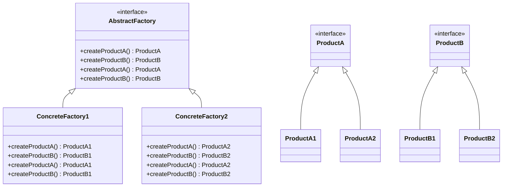

# Abstract Factory

## Introducción

El patrón Abstract Factory es uno de los patrones de diseño creacionales que proporciona una interfaz para crear familias de objetos relacionados o dependientes sin especificar sus clases concretas. Este patrón permite a una clase delegar la responsabilidad de instanciar objetos a subclases que implementan una interfaz común.

## Explicación del Problema que Resuelve

El patrón Abstract Factory resuelve el problema de la creación de familias de productos sin acoplarse a sus clases concretas. Esto es útil en escenarios donde el sistema necesita ser independiente de cómo se crean y representan los productos. Por ejemplo, en una aplicación que soporta múltiples temas de interfaz de usuario (UI), se puede usar el patrón Abstract Factory para crear elementos de UI (botones, ventanas, etc.) específicos de cada tema sin que la lógica de la aplicación necesite conocer los detalles de implementación de cada tema.

## Diagrama

## Casos Prácticos

### Caso 1: Aplicación de gestión de UI con temas

#### Listado de Lenguajes

- [Erlang](../../src/Functional/Erlang/Example1)
- [Elixir](../../src/Functional/Elixir/Example1)
- [Clojure](../../src/Functional/Clojure/Example1)
- [Scala](../../src/Functional/Scala/Example1)
- [F#](../../src/Functional/FSharp/Example1)
- [Lisp](../../src/Functional/Lisp/Example1)
- [OCaml](../../src/Functional/OCaml/Example1)
- [Haskell](../../src/Functional/Haskell/Example1)
- [Perl](../../src/Scripting/Perl/Example1)
- [Python (PY)](../../src/Scripting/PythonPY/Example1)
- [Ruby (RB)](../../src/Scripting/RubyRB/Example1)
- [Lua](../../src/Scripting/Lua/Example1)
- [PHP](../../src/Scripting/PHP/Example1)
- [Groovy](../../src/Scripting/Groovy/Example1)
- [C](../../src/Systems/C/Example1)
- [C++](../../src/Systems/C++/Example1)
- [Rust](../../src/Systems/Rust/Example1)
- [Zig](../../src/Systems/Zig/Example1)
- [Go](../../src/Systems/Go/Example1)
- [Swift](../../src/Systems/Swift/Example1)
- [Objective-C](../../src/Systems/Objective-C/Example1)
- [Java](../../src/Enterprise/Java/Example1)
- [C#](../../src/Enterprise/CSharp/Example1)
- [Kotlin](../../src/Enterprise/Kotlin/Example1)
- [Delphi](../../src/Enterprise/Delphi/Example1)
- [Visual Basic](../../src/Enterprise/VisualBasic/Example1)
- [R](../../src/DataScience/R/Example1)
- [Julia](../../src/DataScience/Julia/Example1)
- [MATLAB](../../src/DataScience/MATLAB/Example1)
- [HTML/CSS](../../src/Web/HTMLCSS/Example1)
- [JavaScript (JS)](../../src/Web/JavaScriptJS/Example1)
- [TypeScript (TS)](../../src/Web/TypeScriptTS/Example1)
- [Dart](../../src/Web/Dart/Example1)
- [SQL](../../src/Databases/SQL/Example1)
- [Bash/Shell](../../src/Shell/BashShell/Example1)
- [PowerShell](../../src/Shell/PowerShell/Example1)
- [VBA](../../src/Shell/VBA/Example1)
- [Fortran](../../src/Historical/Fortran/Example1)
- [Cobol](../../src/Historical/Cobol/Example1)
- [Ada](../../src/Historical/Ada/Example1)
- [Solidity](../../src/Niche/Solidity/Example1)
- [Prolog](../../src/Niche/Prolog/Example1)
- [Nim](../../src/Niche/Nim/Example1)
- [Crystal](../../src/Niche/Crystal/Example1)
- [GDScript](../../src/Niche/GDScript/Example1)
- [Assembly](../../src/LowLevel/Assembly/Example1)
- [MicroPython](../../src/Other/MicroPython/Example1)

### Caso 2: Sistema de bases de datos para múltiples plataformas

#### Listado de Lenguajes

- [Erlang](../../src/Functional/Erlang/Example2)
- [Elixir](../../src/Functional/Elixir/Example2)
- [Clojure](../../src/Functional/Clojure/Example2)
- [Scala](../../src/Functional/Scala/Example2)
- [F#](../../src/Functional/FSharp/Example2)
- [Lisp](../../src/Functional/Lisp/Example2)
- [OCaml](../../src/Functional/OCaml/Example2)
- [Haskell](../../src/Functional/Haskell/Example2)
- [Perl](../../src/Scripting/Perl/Example2)
- [Python (PY)](../../src/Scripting/PythonPY/Example2)
- [Ruby (RB)](../../src/Scripting/RubyRB/Example2)
- [Lua](../../src/Scripting/Lua/Example2)
- [PHP](../../src/Scripting/PHP/Example2)
- [Groovy](../../src/Scripting/Groovy/Example2)
- [C](../../src/Systems/C/Example2)
- [C++](../../src/Systems/C++/Example2)
- [Rust](../../src/Systems/Rust/Example2)
- [Zig](../../src/Systems/Zig/Example2)
- [Go](../../src/Systems/Go/Example2)
- [Swift](../../src/Systems/Swift/Example2)
- [Objective-C](../../src/Systems/Objective-C/Example2)
- [Java](../../src/Enterprise/Java/Example2)
- [C#](../../src/Enterprise/CSharp/Example2)
- [Kotlin](../../src/Enterprise/Kotlin/Example2)
- [Delphi](../../src/Enterprise/Delphi/Example2)
- [Visual Basic](../../src/Enterprise/VisualBasic/Example2)
- [R](../../src/DataScience/R/Example2)
- [Julia](../../src/DataScience/Julia/Example2)
- [MATLAB](../../src/DataScience/MATLAB/Example2)
- [HTML/CSS](../../src/Web/HTMLCSS/Example2)
- [JavaScript (JS)](../../src/Web/JavaScriptJS/Example2)
- [TypeScript (TS)](../../src/Web/TypeScriptTS/Example2)
- [Dart](../../src/Web/Dart/Example2)
- [SQL](../../src/Databases/SQL/Example2)
- [Bash/Shell](../../src/Shell/BashShell/Example2)
- [PowerShell](../../src/Shell/PowerShell/Example2)
- [VBA](../../src/Shell/VBA/Example2)
- [Fortran](../../src/Historical/Fortran/Example2)
- [Cobol](../../src/Historical/Cobol/Example2)
- [Ada](../../src/Historical/Ada/Example2)
- [Solidity](../../src/Niche/Solidity/Example2)
- [Prolog](../../src/Niche/Prolog/Example2)
- [Nim](../../src/Niche/Nim/Example2)
- [Crystal](../../src/Niche/Crystal/Example2)
- [GDScript](../../src/Niche/GDScript/Example2)
- [Assembly](../../src/LowLevel/Assembly/Example2)
- [MicroPython](../../src/Other/MicroPython/Example2)

### Caso 3: Generador de informes con diferentes formatos

#### Listado de Lenguajes

- [Erlang](../../src/Functional/Erlang/Example3)
- [Elixir](../../src/Functional/Elixir/Example3)
- [Clojure](../../src/Functional/Clojure/Example3)
- [Scala](../../src/Functional/Scala/Example3)
- [F#](../../src/Functional/FSharp/Example3)
- [Lisp](../../src/Functional/Lisp/Example3)
- [OCaml](../../src/Functional/OCaml/Example3)
- [Haskell](../../src/Functional/Haskell/Example3)
- [Perl](../../src/Scripting/Perl/Example3)
- [Python (PY)](../../src/Scripting/PythonPY/Example3)
- [Ruby (RB)](../../src/Scripting/RubyRB/Example3)
- [Lua](../../src/Scripting/Lua/Example3)
- [PHP](../../src/Scripting/PHP/Example3)
- [Groovy](../../src/Scripting/Groovy/Example3)
- [C](../../src/Systems/C/Example3)
- [C++](../../src/Systems/C++/Example3)
- [Rust](../../src/Systems/Rust/Example3)
- [Zig](../../src/Systems/Zig/Example3)
- [Go](../../src/Systems/Go/Example3)
- [Swift](../../src/Systems/Swift/Example3)
- [Objective-C](../../src/Systems/Objective-C/Example3)
- [Java](../../src/Enterprise/Java/Example3)
- [C#](../../src/Enterprise/CSharp/Example3)
- [Kotlin](../../src/Enterprise/Kotlin/Example3)
- [Delphi](../../src/Enterprise/Delphi/Example3)
- [Visual Basic](../../src/Enterprise/VisualBasic/Example3)
- [R](../../src/DataScience/R/Example3)
- [Julia](../../src/DataScience/Julia/Example3)
- [MATLAB](../../src/DataScience/MATLAB/Example3)
- [HTML/CSS](../../src/Web/HTMLCSS/Example3)
- [JavaScript (JS)](../../src/Web/JavaScriptJS/Example3)
- [TypeScript (TS)](../../src/Web/TypeScriptTS/Example3)
- [Dart](../../src/Web/Dart/Example3)
- [SQL](../../src/Databases/SQL/Example3)
- [Bash/Shell](../../src/Shell/BashShell/Example3)
- [PowerShell](../../src/Shell/PowerShell/Example3)
- [VBA](../../src/Shell/VBA/Example3)
- [Fortran](../../src/Historical/Fortran/Example3)
- [Cobol](../../src/Historical/Cobol/Example3)
- [Ada](../../src/Historical/Ada/Example3)
- [Solidity](../../src/Niche/Solidity/Example3)
- [Prolog](../../src/Niche/Prolog/Example3)
- [Nim](../../src/Niche/Nim/Example3)
- [Crystal](../../src/Niche/Crystal/Example3)
- [GDScript](../../src/Niche/GDScript/Example3)
- [Assembly](../../src/LowLevel/Assembly/Example3)
- [MicroPython](../../src/Other/MicroPython/Example3)
