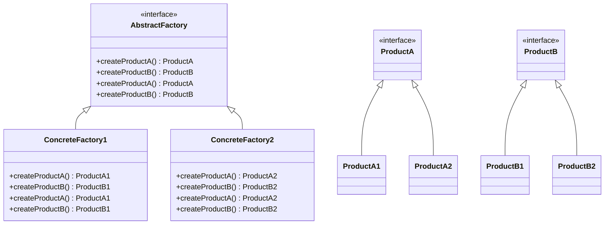

# Abstract Factory

## Introducción

El patrón Abstract Factory es uno de los patrones de diseño creacionales que proporciona una interfaz para crear familias de objetos relacionados o dependientes sin especificar sus clases concretas. Este patrón permite a una clase delegar la responsabilidad de instanciar objetos a subclases que implementan una interfaz común.

## Explicación del Problema que Resuelve

El patrón Abstract Factory resuelve el problema de la creación de familias de productos sin acoplarse a sus clases concretas. Esto es útil en escenarios donde el sistema necesita ser independiente de cómo se crean y representan los productos. Por ejemplo, en una aplicación que soporta múltiples temas de interfaz de usuario (UI), se puede usar el patrón Abstract Factory para crear elementos de UI (botones, ventanas, etc.) específicos de cada tema sin que la lógica de la aplicación necesite conocer los detalles de implementación de cada tema.

## Diagrama

## Casos Prácticos

### Caso 1: Aplicación de gestión de UI con temas

#### Explicación

En una aplicación de interfaz de usuario (UI), es común tener diferentes temas (por ejemplo, tema oscuro y tema claro) que cambian la apariencia de los componentes de la UI. Utilizando el patrón Abstract Factory, podemos crear familias de componentes de UI específicos de cada tema sin acoplar la lógica de la aplicación a las clases concretas de los componentes.

Por ejemplo, podemos tener una fábrica abstracta `UIFactory` con métodos para crear botones y ventanas. Las fábricas concretas `DarkThemeFactory` y `LightThemeFactory` implementan estos métodos para crear componentes con el estilo correspondiente al tema oscuro y al tema claro, respectivamente.

#### Listado de Lenguajes
- [Erlang](/src/Functional/Erlang/example1.erl)
- [Elixir](/src/Functional/Elixir/example1.exs)
- [Clojure](/src/Functional/Clojure/example1.clj)
- [Scala](/src/Functional/Scala/example1.scala)
- [F#](/src/Functional/FSharp/example1.fsx)
- [Lisp](/src/Functional/Lisp/example1.lisp)
- [OCaml](/src/Functional/OCaml/example1.ml)
- [Haskell](/src/Functional/Haskell/example1.hs)
- [Perl](/src/Scripting/Perl/example1.pl)
- [Python (PY)](/src/Scripting/PythonPY/example1.py)
- [Ruby (RB)](/src/Scripting/RubyRB/example1.rb)
- [Lua](/src/Scripting/Lua/example1.lua)
- [PHP](/src/Scripting/PHP/example1.php)
- [Groovy](/src/Scripting/Groovy/example1.groovy)
- [C](/src/Systems/C/example1.c)
- [C++](/src/Systems/C++/example1.cpp)
- [Rust](/src/Systems/Rust/example1.rs)
- [Zig](/src/Systems/Zig/example1.zig)
- [Go](/src/Systems/Go/example1.go)
- [Swift](/src/Systems/Swift/example1.swift)
- [Objective-C](/src/Systems/Objective-C/example1.m)
- [Java](/src/Enterprise/Java/example1.java)
- [C#](/src/Enterprise/CSharp/example1.cs)
- [Kotlin](/src/Enterprise/Kotlin/example1.kt)
- [Delphi](/src/Enterprise/Delphi/example1.pas)
- [Visual Basic](/src/Enterprise/VisualBasic/example1.vb)
- [R](/src/DataScience/R/example1.R)
- [Julia](/src/DataScience/Julia/example1.jl)
- [MATLAB](/src/DataScience/MATLAB/example1.m)
- [HTML/CSS](/src/Web/HTMLCSS/example1.html)
- [JavaScript (JS)](/src/Web/JavaScriptJS/example1.js)
- [TypeScript (TS)](/src/Web/TypeScriptTS/example1.ts)
- [Dart](/src/Web/Dart/example1.dart)
- [SQL](#) *(No disponible)*
- [Bash/Shell](/src/Shell/BashShell/example1.sh)
- [PowerShell](/src/Shell/PowerShell/example1.ps1)
- [VBA](/src/Shell/VBA/example1.bas)
- [Fortran](/src/Historical/Fortran/example1.f90)
- [Cobol](/src/Historical/Cobol/example1.cbl)
- [Ada](/src/Historical/Ada/example1.adb)
- [Solidity](/src/Niche/Solidity/example1.sol)
- [Prolog](/src/Niche/Prolog/example1.pl)
- [Nim](/src/Niche/Nim/example1.nim)
- [Crystal](/src/Niche/Crystal/example1.cr)
- [GDScript](/src/Niche/GDScript/example1.gd)
- [Assembly](/src/LowLevel/Assembly/example1.asm)
- [MicroPython](/src/Other/MicroPython/example1.py)
- [Rockstar](/src/Other/Rockstar/example1.rock)

### Caso 2: Sistema de bases de datos para múltiples plataformas

#### Explicación

En un sistema que necesita interactuar con diferentes bases de datos (por ejemplo, MySQL, PostgreSQL, SQLite), es útil utilizar el patrón Abstract Factory para crear conexiones y consultas específicas de cada plataforma sin acoplar la lógica de la aplicación a las clases concretas de las bases de datos.

Por ejemplo, podemos tener una fábrica abstracta `DatabaseFactory` con métodos para crear conexiones y consultas. Las fábricas concretas `MySQLFactory`, `PostgreSQLFactory` y `SQLiteFactory` implementan estos métodos para crear componentes específicos de cada base de datos.

#### Listado de Lenguajes

- [Erlang](../../src/Functional/Erlang/Example2)
- [Elixir](../../src/Functional/Elixir/Example2)
- [Clojure](../../src/Functional/Clojure/Example2)
- [Scala](../../src/Functional/Scala/Example2)
- [F#](../../src/Functional/FSharp/Example2)
- [Lisp](../../src/Functional/Lisp/Example2)
- [OCaml](../../src/Functional/OCaml/Example2)
- [Haskell](../../src/Functional/Haskell/Example2)
- [Perl](../../src/Scripting/Perl/Example2)
- [Python (PY)](../../src/Scripting/PythonPY/Example2)
- [Ruby (RB)](../../src/Scripting/RubyRB/Example2)
- [Lua](../../src/Scripting/Lua/Example2)
- [PHP](../../src/Scripting/PHP/Example2)
- [Groovy](../../src/Scripting/Groovy/Example2)
- [C](../../src/Systems/C/Example2)
- [C++](../../src/Systems/C++/Example2)
- [Rust](../../src/Systems/Rust/Example2)
- [Zig](../../src/Systems/Zig/Example2)
- [Go](../../src/Systems/Go/Example2)
- [Swift](../../src/Systems/Swift/Example2)
- [Objective-C](../../src/Systems/Objective-C/Example2)
- [Java](../../src/Enterprise/Java/Example2)
- [C#](../../src/Enterprise/CSharp/Example2)
- [Kotlin](../../src/Enterprise/Kotlin/Example2)
- [Delphi](../../src/Enterprise/Delphi/Example2)
- [Visual Basic](../../src/Enterprise/VisualBasic/Example2)
- [R](../../src/DataScience/R/Example2)
- [Julia](../../src/DataScience/Julia/Example2)
- [MATLAB](../../src/DataScience/MATLAB/Example2)
- [HTML/CSS](../../src/Web/HTMLCSS/Example2)
- [JavaScript (JS)](../../src/Web/JavaScriptJS/Example2)
- [TypeScript (TS)](../../src/Web/TypeScriptTS/Example2)
- [Dart](../../src/Web/Dart/Example2)
- [SQL](../../src/Databases/SQL/Example2)
- [Bash/Shell](../../src/Shell/BashShell/Example2)
- [PowerShell](../../src/Shell/PowerShell/Example2)
- [VBA](../../src/Shell/VBA/Example2)
- [Fortran](../../src/Historical/Fortran/Example2)
- [Cobol](../../src/Historical/Cobol/Example2)
- [Ada](../../src/Historical/Ada/Example2)
- [Solidity](../../src/Niche/Solidity/Example2)
- [Prolog](../../src/Niche/Prolog/Example2)
- [Nim](../../src/Niche/Nim/Example2)
- [Crystal](../../src/Niche/Crystal/Example2)
- [GDScript](../../src/Niche/GDScript/Example2)
- [Assembly](../../src/LowLevel/Assembly/Example2)
- [MicroPython](../../src/Other/MicroPython/Example2)

### Caso 3: Generador de informes con diferentes formatos

#### Explicación

En una aplicación que necesita generar informes en múltiples formatos (por ejemplo, PDF, Word, Excel), se puede usar el patrón Abstract Factory para crear generadores de informes específicos de cada formato sin acoplar la lógica de la aplicación a las clases concretas de los generadores.

Por ejemplo, podemos tener una fábrica abstracta `ReportFactory` con métodos para crear informes en diferentes formatos. Las fábricas concretas `PDFReportFactory`, `WordReportFactory` y `ExcelReportFactory` implementan estos métodos para crear informes en los formatos correspondientes.

#### Listado de Lenguajes

- [Erlang](../../src/Functional/Erlang/Example3)
- [Elixir](../../src/Functional/Elixir/Example3)
- [Clojure](../../src/Functional/Clojure/Example3)
- [Scala](../../src/Functional/Scala/Example3)
- [F#](../../src/Functional/FSharp/Example3)
- [Lisp](../../src/Functional/Lisp/Example3)
- [OCaml](../../src/Functional/OCaml/Example3)
- [Haskell](../../src/Functional/Haskell/Example3)
- [Perl](../../src/Scripting/Perl/Example3)
- [Python (PY)](../../src/Scripting/PythonPY/Example3)
- [Ruby (RB)](../../src/Scripting/RubyRB/Example3)
- [Lua](../../src/Scripting/Lua/Example3)
- [PHP](../../src/Scripting/PHP/Example3)
- [Groovy](../../src/Scripting/Groovy/Example3)
- [C](../../src/Systems/C/Example3)
- [C++](../../src/Systems/C++/Example3)
- [Rust](../../src/Systems/Rust/Example3)
- [Zig](../../src/Systems/Zig/Example3)
- [Go](../../src/Systems/Go/Example3)
- [Swift](../../src/Systems/Swift/Example3)
- [Objective-C](../../src/Systems/Objective-C/Example3)
- [Java](../../src/Enterprise/Java/Example3)
- [C#](../../src/Enterprise/CSharp/Example3)
- [Kotlin](../../src/Enterprise/Kotlin/Example3)
- [Delphi](../../src/Enterprise/Delphi/Example3)
- [Visual Basic](../../src/Enterprise/VisualBasic/Example3)
- [R](../../src/DataScience/R/Example3)
- [Julia](../../src/DataScience/Julia/Example3)
- [MATLAB](../../src/DataScience/MATLAB/Example3)
- [HTML/CSS](../../src/Web/HTMLCSS/Example3)
- [JavaScript (JS)](../../src/Web/JavaScriptJS/Example3)
- [TypeScript (TS)](../../src/Web/TypeScriptTS/Example3)
- [Dart](../../src/Web/Dart/Example3)
- [SQL](../../src/Databases/SQL/Example3)
- [Bash/Shell](../../src/Shell/BashShell/Example3)
- [PowerShell](../../src/Shell/PowerShell/Example3)
- [VBA](../../src/Shell/VBA/Example3)
- [Fortran](../../src/Historical/Fortran/Example3)
- [Cobol](../../src/Historical/Cobol/Example3)
- [Ada](../../src/Historical/Ada/Example3)
- [Solidity](../../src/Niche/Solidity/Example3)
- [Prolog](../../src/Niche/Prolog/Example3)
- [Nim](../../src/Niche/Nim/Example3)
- [Crystal](../../src/Niche/Crystal/Example3)
- [GDScript](../../src/Niche/GDScript/Example3)
- [Assembly](../../src/LowLevel/Assembly/Example3)
- [MicroPython](../../src/Other/MicroPython/Example3)
