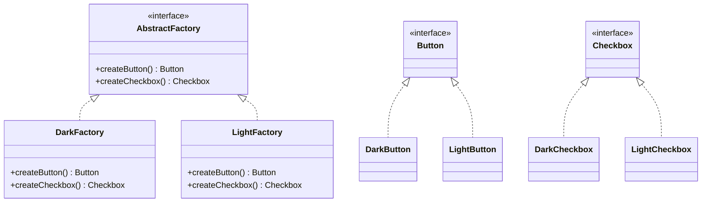

# Abstract Factory

> **Familia:** Creational  
> **Intención:** Proporcionar una abstracción para crear familias de productos relacionados o dependientes sin acoplar al cliente a sus tipos concretos.  
> **Estado:** `in-progress`  
> **Implementaciones de lenguaje:** `44/48`  
> **Cobertura de pruebas:** `N/A` — este catálogo valida ejemplos por compilación/ejecución cuando es práctico; no existe una métrica homogénea de line coverage entre 48 ecosistemas.  
> **Mapa:** [Volver al catálogo y mapa de relaciones](README.md)

## En una frase

Abstract Factory permite elegir una **familia coherente** de productos —por ejemplo, botón y checkbox de un mismo tema— y crear sus miembros a través de una sola abstracción sin que el consumidor conozca los tipos concretos.

## El problema

Un sistema necesita crear varios tipos de objetos que deben ser compatibles entre sí. Si el consumidor instancia directamente cada implementación concreta, termina con conocimiento de demasiados tipos, lógica de selección duplicada y la posibilidad de mezclar productos incompatibles.

La presión aparece cuando existen **varias familias completas** y el sistema debe poder cambiar de familia sin reescribir al consumidor ni permitir combinaciones incoherentes.

## Fuerzas que compiten

- El consumidor debe permanecer independiente de los tipos concretos.
- Los productos de una misma familia deben seleccionarse de forma coherente.
- Debe ser sencillo agregar una nueva familia completa.
- Agregar un nuevo **tipo de producto** suele exigir cambiar la abstracción y todas las familias.
- Una solución ceremonial puede ser peor que una selección directa cuando la variación es pequeña.

## La solución

Definir una fábrica abstracta que exponga una operación por **tipo de producto**. Cada fábrica concreta representa una familia y devuelve variantes compatibles. El cliente recibe una sola fábrica y solicita desde ella todos los productos relacionados.

La esencia es la **familia**, no la herencia. En lenguajes funcionales, dinámicos o de bajo nivel puede expresarse mediante records de funciones, objetos, closures, tablas de function pointers, módulos, mensajes u otros mecanismos nativos que conserven la misma garantía.

Factory Method puede colaborar con Abstract Factory, pero no tiene la misma intención: Factory Method decide cómo crear un producto; Abstract Factory coordina la creación de **familias de productos relacionados**.

## Participantes y responsabilidades

| Participante | Responsabilidad |
|---|---|
| `AbstractFactory` | Declara las operaciones necesarias para obtener cada tipo de producto. |
| `ConcreteFactory` | Representa una familia concreta y crea productos compatibles. |
| `AbstractProductA/B/...` | Define el contrato de cada tipo de producto. |
| `ConcreteProduct` | Implementa una variante perteneciente a una familia. |
| `Client` | Usa la fábrica y los productos abstractos sin elegir tipos concretos. |

## Cómo funciona

1. La composición selecciona una fábrica concreta.
2. El cliente recibe esa única representación de la familia.
3. El cliente solicita distintos productos a la misma fábrica.
4. La fábrica devuelve variantes compatibles entre sí.
5. Cambiar de familia sustituye la fábrica, no la lógica del cliente.

## Diagrama


```mermaid
classDiagram
    AbstractFactory <|.. DarkFactory
    AbstractFactory <|.. LightFactory
    Button <|.. DarkButton
    Button <|.. LightButton
    Checkbox <|.. DarkCheckbox
    Checkbox <|.. LightCheckbox

    class AbstractFactory {
      <<interface>>
      +createButton() Button
      +createCheckbox() Checkbox
    }
    class DarkFactory {
      +createButton() Button
      +createCheckbox() Checkbox
    }
    class LightFactory {
      +createButton() Button
      +createCheckbox() Checkbox
    }
    class Button {
      <<interface>>
    }
    class Checkbox {
      <<interface>>
    }
```

Lo importante no es la sintaxis de clases: ambas operaciones salen de **la misma fábrica seleccionada**.

## Ejemplo mínimo

```csharp
public interface UIFactory
{
    Button CreateButton();
    Checkbox CreateCheckbox();
}

public static void CreateUIComponents(UIFactory factory)
{
    var button = factory.CreateButton();
    var checkbox = factory.CreateCheckbox();
    button.Render();
    checkbox.Render();
}
```

La implementación completa está en [`src/Enterprise/C#/Example1.cs`](../src/Enterprise/C%23/Example1.cs).

## Aplicación real

### Familias de componentes para temas visuales

Una aplicación puede ofrecer componentes para tema oscuro y tema claro. El consumidor necesita botón, checkbox y otros controles sin conocer clases concretas y necesita que todos pertenezcan al mismo tema.

Abstract Factory encaja cuando la **coherencia transversal de la familia** es una regla real. Si sólo hay que escoger un componente aislado, una función, constructor inyectado o Factory Method suele ser más simple.

## En Genkidama

No se ha verificado un uso deliberado de Abstract Factory en la arquitectura productiva de Genkidama. El repositorio sí contiene ejemplos educativos históricos; esta ficha sólo los acepta como evidencia después de revisar intención, ruta y la validación más fuerte razonablemente disponible.

La arquitectura productiva no debe modificarse para aumentar artificialmente el número de patrones «usados».

## Cuándo usarlo

- Existen dos o más **familias** de productos relacionados.
- El consumidor debe cambiar de familia sin conocer tipos concretos.
- Mezclar productos de familias distintas sería incorrecto o indeseable.
- La familia seleccionada forma parte de la composición/configuración del sistema.

## Cuándo no usarlo

- Sólo existe un producto o una familia estable.
- Una función, constructor o dependencia directa expresa la variación con menos ceremonia.
- Se agregan tipos de producto con mucha más frecuencia que familias.
- No existe una regla real de compatibilidad entre productos.

## Consecuencias y trade-offs

| A favor | Costo / riesgo |
|---|---|
| Aísla al consumidor de tipos concretos. | Introduce una abstracción adicional. |
| Mantiene juntas variantes compatibles. | Agregar un nuevo tipo de producto afecta a todas las familias. |
| Facilita sustituir una familia completa. | Puede ser sobreingeniería con poca variación. |
| Permite probar consumidores con familias sustitutas. | Una fábrica nominal no garantiza coherencia si el resto del diseño permite mezclar variantes. |

## Patrones relacionados

[Consulta también el mapa global de relaciones](README.md#relationship-map).

| Patrón | Relación | Por qué importa |
|---|---|---|
| [Factory Method](FactoryMethod.md) | often implemented with | Una operación de la fábrica puede delegar creación individual mediante Factory Method; las intenciones siguen siendo distintas. |
| [Builder](Builder.md) | alternative to | Builder enfatiza construir progresivamente un objeto complejo; Abstract Factory selecciona familias. |
| [Prototype](Prototype.md) | often implemented with | Una fábrica concreta puede producir variantes clonando prototipos preconfigurados. |
| [Singleton](Singleton.md) | collaborates with | Una fábrica puede tener ciclo de vida único, aunque eso no forma parte de Abstract Factory. |

## Errores comunes y confusiones

### Confundirlo con Factory Method

Una operación `createX()` no convierte automáticamente una solución en Abstract Factory. Debe existir una frontera que represente una **familia** y permita obtener varios productos relacionados.

### Separar los selectores hasta perder la familia

Dos funciones independientes `createButton(theme)` y `createCheckbox(theme)` permiten elegir temas distintos y rompen la garantía central. Ese defecto histórico ya fue corregido en JavaScript, Perl, Shell, Erlang, PowerShell, R, Fortran, Common Lisp, GDScript, MATLAB y VBA dentro de este PR. VBA todavía requiere evidencia de ejecución proporcional antes de promoverse como verificado.

### Traducir mecánicamente una jerarquía OO

En lenguajes funcionales o dinámicos, simular interfaces y clases de otro ecosistema puede enseñar ceremonia en vez del patrón. Debe preservarse intención y coherencia con mecanismos nativos.

## Cómo comprobar una implementación

- El cliente puede cambiar de familia completa sin editar su lógica.
- Todos los productos obtenidos desde una fábrica concreta pertenecen a la misma familia.
- El cliente no necesita nombrar tipos concretos para crear productos.
- Sustituir la fábrica cambia coherentemente más de un tipo de producto.
- Las pruebas protegen comportamiento y compatibilidad, no nombres de clases.

## Validación automatizada

La evidencia ejecutable se obtiene de CI general y gates específicos condicionados a ramas `patterns/*`:

- el lote inicial certificó C#, Java, Go, PHP, Python, Rust, JavaScript y TypeScript;
- el CI general ejecuta C, C++, Visual Basic .NET, F#, Ruby, Perl, Bash, PowerShell, Erlang, Pascal, GNU Octave, R, Lua, Haskell, Kotlin, Swift, Julia, Scala, Fortran, OCaml, Common Lisp, Clojure, Elixir, Prolog, Ada, Solidity, COBOL, Assembly, Zig, Nim, Dart, Crystal y Groovy;
- Objective-C se compila y ejecuta en macOS con Clang, ARC, Foundation y warnings como errores;
- GDScript se ejecuta con Godot 4.6.3 headless y comprueba las cuatro variantes Dark/Light;
- MATLAB se ejecuta con las acciones oficiales de MathWorks y comprueba las cuatro variantes Dark/Light;
- MicroPython permanece pendiente hasta que el gate con el Unix port oficial termine verde.

Esto es evidencia de ejecución, no line coverage. La política >=44% se aplica cuando un ecosistema tenga medición de coverage significativa; no se inventa un porcentaje transversal para ejemplos heterogéneos.

## Implementaciones por lenguaje

La fuente de targets es [`learn/_meta/catalog.yml`](../learn/_meta/catalog.yml): 45 lenguajes v1 y 6 adicionales planeados. `Applicable` significa que el patrón puede expresarse de forma razonablemente idiomática. `N/A` exige una razón técnica.

| Lenguaje | Aplicabilidad | Ejemplo verificado | Validación | Nota |
|---|---|---|---|---|
| C# | Applicable | [`Example1.cs`](../src/Enterprise/C%23/Example1.cs) | .NET 10 compile/run ✅ | Interfaces + dos familias completas. |
| TypeScript | Applicable | [`example1.ts`](../src/Web/TypeScriptTS/example1.ts) | TS 6.0.3 strict compile + Node 24 run ✅ | Interfaz de fábrica explícita. |
| Ada | Applicable | [`example1.adb`](../src/Historical/Ada/example1.adb) | GNAT Ada 2022 `-gnatwa -gnatwe` compile/run ✅ | Record de access-to-function selecciona una familia una sola vez. |
| Solidity | Applicable | [`Example1.sol`](../src/Niche/Solidity/Example1.sol) | Solidity 0.8.30 compile + bytecode artifact ✅ | `UIFactory` y factories Dark/Light conservan la familia. |
| Fortran | Applicable | [`example1.f90`](../src/Historical/Fortran/example1.f90) | Fortran 2018 `-Werror` compile/run ✅ | `ui_factory` selecciona una familia una sola vez. |
| Pascal | Applicable | [`example1.pas`](../src/Historical/Pascal/example1.pas) | Free Pascal compile/run ✅ | Record de function pointers selecciona la familia. |
| Python | Applicable | [`example1.py`](../src/Scripting/PythonPY/example1.py) | Python 3.14 run ✅ | Fábricas dinámicas Dark/Light. |
| Visual Basic .NET | Applicable | [`Example1.vb`](../src/Enterprise/VisualBasic/Example1.vb) | .NET 10 compile/run ✅ | Dos familias concretas. |
| C++ | Applicable | [`example1.cpp`](../src/Systems/C%2B%2B/example1.cpp) | C++20 `-Werror` compile/run ✅ | RAII y ownership explícito. |
| Objective-C | Applicable | [`example1.m`](../src/Systems/Objective-C/example1.m) | macOS + Clang/ARC/Foundation compile/run ✅ | Protocols + factories concretas. |
| Java | Applicable | [`Example1.java`](../src/Enterprise/Java/Example1.java) | Java 25 compile/run ✅ | `UIFactory` conserva ambos productos. |
| Rust | Applicable | [`example1.rs`](../src/Systems/Rust/example1.rs) | `rustc` compile/run ✅ | Traits + factories concretas. |
| Zig | Applicable | [`example1.zig`](../src/Systems/Zig/example1.zig) | Zig fmt/run + exact output ✅ | Struct de function pointers. |
| Go | Applicable | [`example1.go`](../src/Systems/Go/example1.go) | Go 1.26.5 run ✅ | Interfaz + factories concretas. |
| PHP | Applicable | [`example1.php`](../src/Scripting/PHP/example1.php) | PHP 8.5 lint/run ✅ | Interfaces + familias coherentes. |
| Nim | Applicable | [`example1.nim`](../src/Niche/Nim/example1.nim) | Nim compile/run ✅ | Objeto factory agrupa constructores. |
| Dart | Applicable | [`example1.dart`](../src/Web/Dart/example1.dart) | format/analyze/run ✅ | Interfaz + factories concretas. |
| Kotlin | Applicable | [`Example1.kt`](../src/Enterprise/Kotlin/Example1.kt) | `kotlinc` + JVM run ✅ | `UIFactory` conserva la familia. |
| Swift | Applicable | [`example1.swift`](../src/Systems/Swift/example1.swift) | `swiftc` compile/run ✅ | Protocols + factories concretas. |
| F# | Applicable | [`example1.fsx`](../src/Functional/F%23/example1.fsx) | `dotnet fsi` run ✅ | Record de constructores. |
| Crystal | Applicable | [`example1.cr`](../src/Niche/Crystal/example1.cr) | format/build/run ✅ | NamedTuple de closures. |
| Lua | Applicable | [`example1.lua`](../src/Scripting/Lua/example1.lua) | Lua 5.4 run ✅ | Table de closures. |
| Haskell | Applicable | [`Example1.hs`](../src/Functional/Haskell/Example1.hs) | `runghc -Wall -Werror` ✅ | Record de operaciones. |
| COBOL | Applicable | [`example1.cbl`](../src/Historical/Cobol/example1.cbl) | GnuCOBOL compile/run ✅ | Una familia seleccionada produce ambos productos. |
| Scala | Applicable | [`Example1.scala`](../src/Functional/Scala/Example1.scala) | `scalac` + `scala` ✅ | `UIFactory` conserva la familia. |
| Groovy | Applicable | [`example1.groovy`](../src/Scripting/Groovy/example1.groovy) | `groovyc` + run ✅ | Factory concreta coherente. |
| Ruby | Applicable | [`example1.rb`](../src/Scripting/RubyRB/example1.rb) | syntax check + run ✅ | Factory concreta preserva la familia. |
| C | Applicable | [`example1.c`](../src/Systems/C/example1.c) | C17 `-Werror` compile/run ✅ | Struct de function pointers. |
| OCaml | Applicable | [`example1.ml`](../src/Functional/OCaml/example1.ml) | strict compile/run ✅ | First-class module factory. |
| Julia | Applicable | [`example1.jl`](../src/DataScience/Julia/example1.jl) | Julia run ✅ | Multiple dispatch + factories. |
| VBA | Applicable | — | Pendiente | [`example1.bas`](../src/Shell/VBA/example1.bas) ya conserva una familia mediante `UIFactory`; falta validación VBA auténtica/proporcional. |
| GDScript | Applicable | [`example1.gd`](../src/Niche/GDScript/example1.gd) | Godot 4.6.3 headless run ✅ | `Dictionary` + `Callable` representa una familia completa. |
| JavaScript | Applicable | [`example1.js`](../src/Web/JavaScriptJS/example1.js) | Node 24 run ✅ | Selecciona una sola factory por familia. |
| MATLAB | Applicable | [`example1.m`](../src/DataScience/MATLAB/example1.m) | MATLAB real via MathWorks Actions run ✅ | Struct de function handles selecciona la familia una vez. |
| Perl | Applicable | [`example1.pl`](../src/Scripting/Perl/example1.pl) | syntax check + run ✅ | Una factory agrupa ambos constructores. |
| R | Applicable | [`example1.R`](../src/DataScience/R/example1.R) | Rscript run ✅ | List de closures. |
| PowerShell | Applicable | [`example1.ps1`](../src/Shell/PowerShell/example1.ps1) | strict run ✅ | Hashtable de scriptblocks. |
| HTML | N/A | — | — | HTML describe estructura; JavaScript embebido sigue siendo JavaScript. |
| Assembly | Applicable | [`example1.asm`](../src/LowLevel/Assembly/example1.asm) | NASM + `ld` + exact output ✅ | Tabla/rutinas conservan la familia. |
| Elixir | Applicable | [`example1.exs`](../src/Functional/Elixir/example1.exs) | `elixirc --warnings-as-errors` ✅ | Map de closures. |
| Shell | Applicable | [`example1.sh`](../src/Shell/Bash/example1.sh) | `bash -n` + run ✅ | Associative array + nameref. |
| Erlang | Applicable | [`example1.erl`](../src/Functional/Erlang/example1.erl) | OTP compile/run ✅ | Map de funciones encapsula la familia. |
| Clojure | Applicable | [`example1.clj`](../src/Functional/Clojure/example1.clj) | Clojure run ✅ | Protocol + records concretos. |
| Common Lisp | Applicable | [`example1.lisp`](../src/Functional/Lisp/example1.lisp) | SBCL run ✅ | Closures agrupadas bajo una familia. |
| Prolog | Applicable | [`example1.pl`](../src/Niche/Prolog/example1.pl) | SWI-Prolog run ✅ | Término `factory(Button, Checkbox)`. |
| Delphi | Applicable | — | Pendiente | [`Example1.pas`](../src/Enterprise/Delphi/Example1.pas) tiene semántica compatible; falta gate con compilador Delphi auténtico. |
| GNU Octave | Applicable | [`example1.m`](../src/DataScience/Octave/example1.m) | GNU Octave run ✅ | Struct de function handles. |
| SQL | N/A | — | — | SQL declarativo modela/consulta datos, no crea familias runtime. |
| CSS | N/A | — | — | CSS selecciona estilos; no crea familias de objetos runtime. |
| MicroPython | Applicable | — | Pendiente | [`example1.py`](../src/Other/MicroPython/example1.py) conserva una familia completa; gate con MicroPython Unix port en curso. |
| Rockstar | Applicable | — | Pendiente | [`example1.rock`](../src/Other/Rockstar/example1.rock) requiere actualización/validación con Rockstar v2 real. |

**Cobertura actual verificada: 44 / 48 lenguajes Applicable (91.7%).**

La cobertura no se infiere por la existencia de `example1.*`: cada ejemplo debe conservar la intención, resolver su enlace y tener evidencia proporcional.

## Comprueba que lo entendiste

1. Una aplicación elige `dark` o `light` por separado al crear cada control. ¿Qué garantía falta para expresar bien Abstract Factory?
2. ¿Cuándo elegirías Factory Method en lugar de Abstract Factory?
3. Si cada semana aparece un nuevo **tipo de producto** que todas las familias deben implementar, ¿qué costo domina y qué alternativa investigarías?

## Resumen

- La presión central es crear **familias coherentes**, no sólo ocultar `new`.
- El movimiento de diseño es seleccionar una fábrica/familia una vez y pedirle productos relacionados.
- El principal trade-off es facilitar nuevas familias a costa de encarecer nuevos tipos de producto.
- Factory Method puede colaborar con Abstract Factory, pero no define su intención.
- La evidencia asciende a 44/48; la página permanece `in-progress` hasta `48/48`.

## Referencias

- Gamma, Helm, Johnson, Vlissides. *Design Patterns: Elements of Reusable Object-Oriented Software* — Abstract Factory.
- [`docs/philosophy/001-patterns-as-living-examples.md`](../docs/philosophy/001-patterns-as-living-examples.md)
- [`docs/kb/catalog/pattern-authoring-standard.md`](../docs/kb/catalog/pattern-authoring-standard.md)
