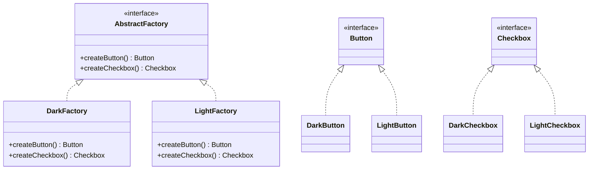

# Abstract Factory

> **Familia:** Creational  
> **Intención:** Proporcionar una abstracción para crear familias de productos relacionados o dependientes sin acoplar al cliente a sus tipos concretos.  
> **Estado:** `in-progress`  
> **Mapa:** [Volver al catálogo y mapa de relaciones](README.md)

## En una frase

Abstract Factory permite elegir una **familia coherente** de productos —por ejemplo, botón y checkbox de un mismo tema— y crear sus miembros a través de una sola abstracción sin que el consumidor conozca los tipos concretos.

## El problema

Un sistema necesita crear varios tipos de objetos que deben ser compatibles entre sí. Si el consumidor instancia directamente cada implementación concreta, termina con conocimiento de demasiados tipos, lógica de selección duplicada y la posibilidad de mezclar productos incompatibles.

El problema no es únicamente «cómo crear un objeto». La presión aparece cuando existen **varias familias completas** y el sistema debe poder cambiar de familia sin reescribir al consumidor ni permitir combinaciones incoherentes.

## Fuerzas que compiten

- El consumidor debe permanecer independiente de los tipos concretos que instancia.
- Los productos de una misma familia deben seleccionarse de forma coherente.
- Debe ser relativamente sencillo agregar una nueva familia completa.
- Agregar un nuevo **tipo de producto** a todas las familias suele requerir modificar la abstracción y cada fábrica existente.
- Una solución demasiado ceremonial puede ser peor que una selección directa cuando sólo existe un producto o una familia.

## La solución

Definir una fábrica abstracta que exponga una operación por **tipo de producto** de la familia. Cada fábrica concreta representa una familia y devuelve sus variantes compatibles. El consumidor recibe la fábrica abstracta y solicita productos sin decidir cuáles implementaciones concretas construir.

La esencia del patrón es la **familia**, no la herencia ni el uso obligatorio de clases. En lenguajes funcionales, dinámicos o de bajo nivel puede expresarse con records de funciones, módulos, closures, tablas de funciones, mensajes u otros mecanismos idiomáticos que conserven la misma garantía: seleccionar una familia una vez y obtener de ella productos relacionados.

Factory Method puede ser una técnica utilizada dentro de una Abstract Factory, pero no son la misma intención: Factory Method decide cómo crear un producto mediante una operación sobrescribible; Abstract Factory coordina la creación de **familias de productos relacionados**.

## Participantes y responsabilidades

| Participante | Responsabilidad |
|---|---|
| `AbstractFactory` | Declara las operaciones necesarias para obtener cada tipo de producto de una familia. |
| `ConcreteFactory` | Representa una familia concreta y crea productos compatibles entre sí. |
| `AbstractProductA/B/...` | Define el contrato que cada variante de un tipo de producto debe respetar. |
| `ConcreteProduct` | Implementa un producto perteneciente a una familia concreta. |
| `Client` | Trabaja únicamente contra la fábrica y los contratos de producto; no elige tipos concretos. |

## Cómo funciona

1. La composición de la aplicación selecciona una fábrica concreta según el contexto requerido.
2. El cliente recibe esa fábrica a través de la abstracción común.
3. El cliente solicita los distintos productos a la misma fábrica.
4. La fábrica devuelve variantes pertenecientes a una familia coherente.
5. Cambiar de familia implica sustituir la fábrica, no reescribir la lógica del cliente.

## Diagrama


```mermaid
classDiagram
    AbstractFactory <|.. DarkFactory
    AbstractFactory <|.. LightFactory
    Button <|.. DarkButton
    Button <|.. LightButton
    Checkbox <|.. DarkCheckbox
    Checkbox <|.. LightCheckbox

    class AbstractFactory {
      <<interface>>
      +createButton() Button
      +createCheckbox() Checkbox
    }
    class DarkFactory {
      +createButton() Button
      +createCheckbox() Checkbox
    }
    class LightFactory {
      +createButton() Button
      +createCheckbox() Checkbox
    }
    class Button {
      <<interface>>
    }
    class Checkbox {
      <<interface>>
    }
```

Lo importante del diagrama no es la sintaxis de clases: ambas operaciones salen de **la misma fábrica seleccionada**, por lo que el cliente no combina accidentalmente un `DarkButton` con un `LightCheckbox`.

## Ejemplo mínimo

El ejemplo C# existente representa correctamente la intención: `UIFactory` crea `Button` y `Checkbox`; `DarkFactory` y `LightFactory` crean familias coherentes; `CreateUIComponents` sólo conoce la abstracción.

```csharp
public interface UIFactory
{
    Button CreateButton();
    Checkbox CreateCheckbox();
}

public static void CreateUIComponents(UIFactory factory)
{
    var button = factory.CreateButton();
    var checkbox = factory.CreateCheckbox();
    button.Render();
    checkbox.Render();
}
```

La implementación completa y verificada está en [`src/Enterprise/C#/Example1.cs`](../src/Enterprise/C%23/Example1.cs).

## Aplicación real

### Familias de componentes para temas visuales

Una aplicación puede ofrecer un conjunto de componentes para tema oscuro y otro para tema claro. El consumidor necesita botón, checkbox y otros componentes sin conocer sus clases concretas y, sobre todo, necesita que todos pertenezcan al mismo tema.

Abstract Factory encaja cuando la **coherencia transversal de la familia** es una regla real. Si sólo hay que escoger un componente aislado, una función, constructor inyectado o Factory Method suele ser más simple.

## En Genkidama

No se ha verificado un uso deliberado de Abstract Factory en la arquitectura productiva de Genkidama que justifique afirmarlo aquí. El repositorio sí contiene ejemplos educativos históricos del patrón. Esta ficha los trata como evidencia sólo después de revisar que preserven la intención y que sus rutas existan.

La arquitectura productiva no debe modificarse para aumentar artificialmente el número de patrones «usados».

## Cuándo usarlo

- Existen dos o más **familias** de productos relacionados.
- El consumidor debe poder cambiar de familia sin conocer tipos concretos.
- Mezclar productos de familias distintas sería incorrecto o indeseable.
- La familia seleccionada forma parte de la configuración o composición del sistema.

## Cuándo no usarlo

- Sólo existe un producto o una sola familia estable.
- Una función, constructor o dependencia directa expresa la variación con menos ceremonia.
- Se espera agregar tipos de producto con mucha más frecuencia que familias; Abstract Factory hace costosa esa dimensión de cambio.
- No existe una regla real de compatibilidad entre los productos creados.

## Consecuencias y trade-offs

| A favor | Costo / riesgo |
|---|---|
| Aísla al consumidor de tipos concretos. | Introduce una abstracción adicional y varias implementaciones de fábrica. |
| Mantiene juntas variantes compatibles. | Agregar un nuevo tipo de producto exige modificar todas las familias. |
| Facilita sustituir una familia completa. | Puede ser sobreingeniería si la variación es pequeña. |
| Permite probar consumidores con una familia sustituta. | Una implementación puramente nominal puede ocultar que los productos aún pueden mezclarse fuera de la fábrica. |

## Patrones relacionados

[Consulta también el mapa global de relaciones](README.md#relationship-map).

| Patrón | Relación | Por qué importa |
|---|---|---|
| [Factory Method](FactoryMethod.md) | often implemented with | Una operación de una fábrica abstracta puede delegar la creación individual mediante Factory Method; sus intenciones siguen siendo distintas. |
| [Builder](Builder.md) | alternative to | Builder enfatiza la construcción progresiva de un objeto complejo; Abstract Factory selecciona familias de productos. |
| [Prototype](Prototype.md) | often implemented with | Una fábrica concreta puede producir variantes clonando prototipos preconfigurados. |
| [Singleton](Singleton.md) | collaborates with | Algunas implementaciones hacen única una fábrica, aunque esa política de ciclo de vida no forma parte de Abstract Factory. |

## Errores comunes y confusiones

### Confundirlo con Factory Method

Una operación `createX()` no convierte automáticamente una solución en Abstract Factory. Debe existir una abstracción que represente una **familia** y permita obtener varios productos relacionados desde esa selección.

### Separar los selectores hasta perder la familia

Dos funciones independientes `createButton(theme)` y `createCheckbox(theme)` pueden recrear las variantes, pero permiten elegir `dark` para una y `light` para otra. Si no existe una frontera que represente la selección común de familia, se pierde una de las garantías principales del patrón.

### Traducir mecánicamente una jerarquía OO

En un lenguaje funcional o dinámico, forzar interfaces y clases simuladas puede enseñar la sintaxis de otro lenguaje en vez del patrón. El ejemplo debe usar el mecanismo idiomático que mejor preserve selección de familia, compatibilidad y sustitución.

## Cómo comprobar una implementación

- El cliente puede cambiar de una familia completa a otra sin editar su lógica de negocio.
- Todos los productos obtenidos desde una fábrica concreta pertenecen a la misma familia.
- El cliente no necesita nombrar tipos concretos para crear los productos.
- Una prueba sustituye la fábrica y observa cambios coherentes en más de un tipo de producto.
- Las pruebas deben proteger comportamiento y compatibilidad, no únicamente comprobar nombres de clases o relaciones de herencia.

## Cobertura por lenguaje

La fuente de targets es [`learn/_meta/catalog.yml`](../learn/_meta/catalog.yml): 45 lenguajes v1 y 6 adicionales planeados. `Applicable` significa que el patrón puede expresarse de forma razonablemente idiomática en ese lenguaje. `N/A` exige una razón técnica, no la mera ausencia de clases.

Mientras esta página permanezca `in-progress`, `Pendiente` significa que la aplicabilidad ya fue clasificada pero el ejemplo histórico todavía no ha sido aceptado como evidencia bajo KB-006.

| Lenguaje | Aplicabilidad | Estado de ejemplo | Evidencia / razón |
|---|---|---|---|
| C# | Applicable | Verified | [`src/Enterprise/C#/Example1.cs`](../src/Enterprise/C%23/Example1.cs) preserva una familia Button + Checkbox. |
| TypeScript | Applicable | Pendiente | Revisar implementación histórica y adaptar idiomáticamente si hace falta. |
| Ada | Applicable | Pendiente | Revisar implementación histórica. |
| Solidity | Applicable | Pendiente | Puede expresar la familia mediante contratos/interfaces/factories; revisar ejemplo histórico. |
| Fortran | Applicable | Pendiente | Puede expresarse con módulos/procedimientos/tipos derivados; revisar ejemplo histórico. |
| Pascal | Applicable | Missing | No hay todavía evidencia verificada enlazada. |
| Python | Applicable | Verified | [`src/Scripting/PythonPY/example1.py`](../src/Scripting/PythonPY/example1.py) selecciona familias Dark/Light completas. |
| Visual Basic .NET | Applicable | Pendiente | Revisar implementación histórica y ruta real. |
| C++ | Applicable | Pendiente | Revisar implementación histórica. |
| Objective-C | Applicable | Pendiente | Revisar implementación histórica. |
| Java | Applicable | Pendiente | Revisar implementación histórica. |
| Rust | Applicable | Verified | [`src/Systems/Rust/example1.rs`](../src/Systems/Rust/example1.rs) usa traits y factories concretas. |
| Zig | Applicable | Pendiente | Revisar implementación histórica. |
| Go | Applicable | Pendiente | Revisar implementación histórica. |
| PHP | Applicable | Pendiente | Revisar implementación histórica. |
| Nim | Applicable | Pendiente | Revisar implementación histórica. |
| Dart | Applicable | Pendiente | Revisar implementación histórica. |
| Kotlin | Applicable | Pendiente | Revisar implementación histórica. |
| Swift | Applicable | Pendiente | Revisar implementación histórica. |
| F# | Applicable | Pendiente | Revisar implementación histórica y ruta real. |
| Crystal | Applicable | Pendiente | Revisar implementación histórica. |
| Lua | Applicable | Pendiente | Revisar implementación histórica. |
| Haskell | Applicable | Verified | [`src/Functional/Haskell/Example1.hs`](../src/Functional/Haskell/Example1.hs) usa un record `UIFactory` de operaciones de familia. |
| COBOL | Applicable | Pendiente | Puede expresarse mediante programas/subprogramas y tablas de selección; revisar ejemplo histórico. |
| Scala | Applicable | Pendiente | Revisar implementación histórica. |
| Groovy | Applicable | Pendiente | Revisar implementación histórica. |
| Ruby | Applicable | Pendiente | Revisar implementación histórica. |
| C | Applicable | Pendiente | Puede expresarse con structs/tablas de function pointers; revisar ejemplo histórico. |
| OCaml | Applicable | Pendiente | Revisar implementación histórica. |
| Julia | Applicable | Pendiente | Revisar implementación histórica. |
| VBA | Applicable | Pendiente | Revisar implementación histórica y ruta real. |
| GDScript | Applicable | Pendiente | Revisar implementación histórica. |
| JavaScript | Applicable | Pendiente | Puede expresarse con objetos/functions/closures sin simular clases; revisar ejemplo histórico. |
| MATLAB | Applicable | Pendiente | Revisar implementación histórica. |
| Perl | Applicable | Pendiente | Revisar implementación histórica. |
| R | Applicable | Pendiente | Revisar implementación histórica. |
| PowerShell | Applicable | Pendiente | Revisar implementación histórica. |
| HTML | N/A | N/A | HTML describe estructura de documentos; por sí solo no implementa una frontera de creación de familias en runtime. JavaScript embebido cuenta como JavaScript, no como HTML. |
| Assembly | Applicable | Pendiente | Puede expresarse con tablas de direcciones/rutinas aunque el costo sea alto; revisar ejemplo histórico. |
| Elixir | Applicable | Pendiente | Puede expresarse con módulos, funciones y datos que representen la familia; revisar ejemplo histórico. |
| Shell | Applicable | Pendiente | Puede expresarse con funciones/dispatch y una selección común de familia; revisar ejemplo histórico. |
| Erlang | Applicable | Needs rework | [`src/Functional/Erlang/example1.erl`](../src/Functional/Erlang/example1.erl) tiene selectores independientes y permite mezclar familias; no cuenta aún como implementación verificada. |
| Clojure | Applicable | Pendiente | Revisar implementación histórica. |
| Common Lisp | Applicable | Pendiente | Revisar implementación histórica y ruta real. |
| Prolog | Applicable | Pendiente | Puede representar familias mediante hechos/reglas y un identificador común; revisar ejemplo histórico. |
| Delphi | Applicable | Pendiente | Revisar implementación histórica y ruta real. |
| GNU Octave | Applicable | Missing | Puede expresarse mediante funciones/structs; requiere un ejemplo verificado. |
| SQL | N/A | N/A | El target canónico es SQL declarativo, no un dialecto procedural; modela y consulta datos pero no ofrece por sí solo una frontera idiomática de creación de familias de objetos en runtime. |
| CSS | N/A | N/A | CSS selecciona y declara estilos; no crea familias de objetos en runtime. Una factory implementada en JavaScript y estilizada con CSS sigue siendo una implementación JavaScript. |
| MicroPython | Applicable | Pendiente | Revisar implementación histórica. |
| Rockstar | Applicable | Pendiente | Dispone de variables, funciones y control de flujo suficientes para expresar selección de familia; requiere revisión idiomática. |

**Cobertura actual verificada: 4 / 48 lenguajes Applicable (8.3%).**

La cobertura no se infiere por la mera existencia de archivos `example1.*`; cada ejemplo debe conservar la intención y su enlace debe resolverse antes de marcarse `Verified`.

## Implementaciones disponibles

Sólo se listan aquí ejemplos ya inspeccionados y con ruta real verificada.

| Lenguaje | Ejemplo | Qué demuestra |
|---|---|---|
| C# | [`Example1.cs`](../src/Enterprise/C%23/Example1.cs) | Interfaz de fábrica y dos familias completas de productos. |
| Python | [`example1.py`](../src/Scripting/PythonPY/example1.py) | Fábricas dinámicas que seleccionan Button + Checkbox coherentes. |
| Rust | [`example1.rs`](../src/Systems/Rust/example1.rs) | Traits de producto y factory con `Box<dyn Trait>`. |
| Haskell | [`Example1.hs`](../src/Functional/Haskell/Example1.hs) | Record de operaciones como representación funcional de la familia. |

## Comprueba que lo entendiste

1. Una aplicación permite elegir `dark` o `light` por separado al crear cada control. ¿Qué garantía falta para considerar que la solución expresa bien Abstract Factory?
2. ¿Cuándo elegirías Factory Method en lugar de Abstract Factory para la creación de componentes?
3. Si cada semana aparece un nuevo **tipo de producto** que todas las familias deben implementar, ¿qué costo del patrón se vuelve dominante y qué alternativa investigarías?

## Resumen

- La presión central es crear **familias coherentes**, no simplemente ocultar `new`.
- El movimiento de diseño es seleccionar una fábrica/familia y pedirle todos los productos relacionados.
- El principal trade-off es facilitar nuevas familias a costa de encarecer nuevos tipos de producto.
- Factory Method puede colaborar con Abstract Factory, pero no define su intención.
- La página permanece `in-progress` hasta verificar o reparar todos los ejemplos de los 48 lenguajes Applicable.

## Referencias

- Gamma, Helm, Johnson, Vlissides. *Design Patterns: Elements of Reusable Object-Oriented Software* — Abstract Factory.
- [`docs/philosophy/001-patterns-as-living-examples.md`](../docs/philosophy/001-patterns-as-living-examples.md)
- [`docs/kb/catalog/pattern-authoring-standard.md`](../docs/kb/catalog/pattern-authoring-standard.md)
