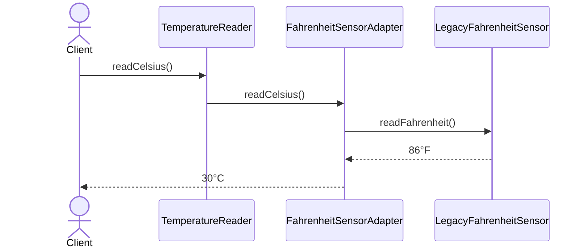

# Adapter

> **Familia:** Structural  
> **Intención:** convertir la interfaz de una dependencia existente en el contrato que un cliente necesita, sin modificar ni al cliente ni a la dependencia adaptada.  
> **Estado:** `in-progress`  
> **Implementaciones de lenguaje:** `0/48`  
> **Cobertura de pruebas:** N/A — el catálogo usa evidencia proporcional por ecosistema; no existe una métrica homogénea entre ejemplos standalone.  
> **Mapa:** [Volver al catálogo y mapa de relaciones](README.md)

## En una frase

Adapter permite que dos piezas con contratos incompatibles colaboren mediante una capa que traduce interfaz, datos o convenciones sin contaminar a ninguna de las dos.

## El problema

Una aplicación ya habla un contrato útil para su dominio, pero una biblioteca, servicio externo, API heredada o proveedor ofrece otra interfaz: nombres distintos, unidades diferentes, estructuras incompatibles o convenciones que no queremos propagar al resto del sistema. Reescribir la dependencia puede ser imposible y cambiar todos los clientes trasladaría el acoplamiento externo hacia dentro.

## Fuerzas que compiten

- El cliente necesita un contrato estable y expresivo para su dominio.
- La dependencia existente no puede o no conviene modificarse.
- La traducción debe quedar localizada para que cambios del proveedor no se filtren por toda la aplicación.
- Una capa adicional cuesta código y puede ocultar capacidades específicas de la dependencia.

## La solución

Introducir un **Adapter** que implemente el contrato esperado por el cliente, mantenga o reciba una referencia al **Adaptee** y traduzca cada operación hacia su interfaz real. La traducción puede incluir nombres, tipos, estructuras, unidades, códigos de error o protocolos, pero debe preservar la semántica que el cliente necesita.

## Participantes y responsabilidades

| Participante | Responsabilidad |
|---|---|
| `Client` | Trabaja únicamente con el contrato objetivo. |
| `Target` | Define la interfaz que el cliente entiende y necesita. |
| `Adapter` | Implementa `Target` y traduce llamadas/datos al contrato del adaptee. |
| `Adaptee` | Dependencia existente con una interfaz incompatible pero funcionalidad aprovechable. |

## Cómo funciona

1. El cliente invoca una operación del contrato `Target`.
2. El Adapter traduce esa operación al protocolo del Adaptee.
3. El Adaptee ejecuta su comportamiento normal.
4. El Adapter convierte el resultado o error al contrato esperado por el cliente.

## Diagrama



El cliente nunca aprende el método `readFahrenheit()` ni la unidad heredada; esas decisiones quedan detrás del Adapter.

## Ejemplo mínimo

```text
legacy = LegacyFahrenheitSensor()      // sólo sabe devolver Fahrenheit
reader = FahrenheitSensorAdapter(legacy)
print(reader.readCelsius())            // 30
```

El Adapter cambia tanto la **interfaz** (`readFahrenheit` → `readCelsius`) como la representación de datos (°F → °C), mientras el sensor heredado permanece intacto.

## Aplicación real

### Integrar un proveedor con contrato ajeno

Una aplicación puede esperar `PaymentGateway.charge(cents)` mientras un proveedor heredado expone otro método, otras unidades monetarias y códigos de resultado propios. Un Adapter mantiene el modelo interno estable y concentra esa traducción en una frontera explícita.

Si la dependencia ya satisface el contrato útil del dominio, una capa Adapter no aporta valor y sólo añade indirección.

## En Genkidama

La filosofía del repositorio identifica **integraciones externas y clientes específicos de proveedor** como un lugar natural para Adapter. Sin embargo, esta auditoría no ha confirmado todavía un uso productivo deliberado que deba presentarse como ejemplo canónico. Por ello no se modificará arquitectura de producción para fabricar uno.

## Cuándo usarlo

- Debes reutilizar una biblioteca, API o componente cuya interfaz no coincide con la que necesita tu cliente.
- Quieres aislar convenciones externas —tipos, unidades, códigos o protocolos— detrás de un contrato propio.
- Varias implementaciones externas deben verse iguales desde el núcleo de la aplicación.

## Cuándo no usarlo

- El proveedor ya implementa directamente el contrato que necesitas.
- Sólo estás renombrando una función sin reducir acoplamiento ni traducir semántica.
- Necesitas simplificar una fachada completa de subsistemas: considera Facade.
- Necesitas variar el comportamiento intercambiable bajo el mismo contrato, no convertir contratos incompatibles: considera Strategy.

## Consecuencias y trade-offs

| A favor | Costo / riesgo |
|---|---|
| Aísla dependencias y convenciones externas. | Añade una capa y más código de integración. |
| Mantiene estable al cliente frente a cambios del proveedor. | Puede esconder capacidades específicas que algunos clientes sí necesitan. |
| Facilita sustituir o probar proveedores mediante el contrato objetivo. | Una traducción incorrecta puede alterar semántica, unidades o errores. |
| Evita contaminar el dominio con modelos ajenos. | Demasiados adapters triviales pueden fragmentar innecesariamente el diseño. |

## Patrones relacionados

[Consulta también el mapa global de relaciones](README.md#relationship-map).

| Patrón | Relación | Por qué importa |
|---|---|---|
| [Facade](Facade.md) | often confused with | Facade simplifica el acceso a un subsistema; Adapter hace compatible un contrato con otro. |
| [Bridge](Bridge.md) | often confused with | Bridge separa abstracción e implementación deliberadamente desde el diseño; Adapter reconcilia interfaces ya incompatibles. |
| [Proxy](Proxy.md) | often confused with | Proxy conserva esencialmente el mismo contrato para controlar acceso; Adapter cambia el contrato visto por el cliente. |
| [Strategy](Strategy.md) | collaborates with | Varios adapters pueden quedar detrás de una Strategy o contrato común cuando además hay selección de comportamiento. |

## Errores comunes y confusiones

### Llamar Adapter a cualquier wrapper

Un wrapper no es Adapter sólo porque delega. Debe existir una incompatibilidad concreta que se traduce para permitir colaboración bajo el contrato objetivo.

### Filtrar el modelo del proveedor hacia el cliente

Si el cliente sigue manejando tipos, unidades o códigos del Adaptee, el acoplamiento no quedó realmente aislado. La traducción debe ocurrir en la frontera.

### Convertir Adapter en lógica de negocio

El Adapter traduce contratos. Reglas de negocio independientes del proveedor pertenecen al dominio o a servicios apropiados, no a la capa de adaptación.

## Cómo comprobar una implementación

- El cliente sólo depende del contrato `Target`; no invoca directamente la interfaz incompatible.
- El Adaptee puede conservar su API original sin cambios.
- La misma lectura heredada de `86°F` se observa como `30°C` a través del Adapter.
- Una traducción equivocada de interfaz o unidades hace fallar la prueba observable.

## Implementaciones por lenguaje

La fuente canónica mantiene **51 targets**. Adapter es provisionalmente `Applicable` en 48 y `N/A` en HTML, CSS y SQL declarativo. Hay **22/48 ejemplos materializados**; las filas sólo se promueven a verificadas después de evidencia ejecutable o proporcional sobre el archivo enlazado.

| Lenguaje | Aplicabilidad | Ejemplo verificado | Validación | Nota |
|---|---|---|---|---|
| C# | Applicable | [`AdapterExample.cs`](../src/Enterprise/C%23/AdapterExample.cs) | pendiente | Interfaz objetivo + composición del adaptee. |
| TypeScript | Applicable | [`adapter.ts`](../src/Web/TypeScriptTS/adapter.ts) | pendiente | Interface estructural + clase adapter. |
| Ada | Applicable | — | pendiente | Records tagged, access values o funciones pueden traducir contratos. |
| Solidity | Applicable | — | pendiente | Contrato wrapper puede adaptar otra interfaz de contrato. |
| Fortran | Applicable | — | pendiente | Derived types/procedure bindings permiten traducción de operaciones. |
| Pascal | Applicable | [`adapter.pas`](../src/Historical/Pascal/adapter.pas) | pendiente | Clase Target abstracta + composición. |
| Python | Applicable | [`adapter.py`](../src/Scripting/PythonPY/adapter.py) | pendiente | Duck typing mantiene el Target liviano. |
| Visual Basic .NET | Applicable | [`AdapterExample.vb`](../src/Enterprise/VisualBasic/AdapterExample.vb) | pendiente | Interface y composición. |
| C++ | Applicable | [`adapter.cpp`](../src/Systems/C%2B%2B/adapter.cpp) | pendiente | Interfaz abstracta + composición. |
| Objective-C | Applicable | — | pendiente | Protocol + wrapper sobre objeto heredado. |
| Java | Applicable | [`AdapterExample.java`](../src/Enterprise/Java/AdapterExample.java) | pendiente | Interface Target + composición. |
| Rust | Applicable | [`adapter.rs`](../src/Systems/Rust/adapter.rs) | pendiente | Trait Target + struct adapter. |
| Zig | Applicable | — | pendiente | Struct + function pointers/funciones de traducción. |
| Go | Applicable | [`adapter.go`](../src/Systems/Go/adapter.go) | pendiente | Interface implícita + composición. |
| PHP | Applicable | [`adapter.php`](../src/Scripting/PHP/adapter.php) | pendiente | Interface + wrapper. |
| Nim | Applicable | — | pendiente | Objects/procs pueden traducir contratos. |
| Dart | Applicable | — | pendiente | Interface implícita/clase adapter. |
| Kotlin | Applicable | [`AdapterExample.kt`](../src/Enterprise/Kotlin/AdapterExample.kt) | pendiente | Interface + composición. |
| Swift | Applicable | [`adapter.swift`](../src/Systems/Swift/adapter.swift) | pendiente | Protocol + wrapper. |
| F# | Applicable | [`adapter.fsx`](../src/Functional/F%23/adapter.fsx) | pendiente | Interface o funciones adaptadoras idiomáticas. |
| Crystal | Applicable | — | pendiente | Clases/módulos con composición. |
| Lua | Applicable | [`adapter.lua`](../src/Scripting/Lua/adapter.lua) | pendiente | Table + closure traducen operación/unidad. |
| Haskell | Applicable | [`Adapter.hs`](../src/Functional/Haskell/Adapter.hs) | pendiente | Función adaptadora devuelve contrato objetivo. |
| COBOL | Applicable | — | pendiente | Program wrappers y records pueden traducir contratos. |
| Scala | Applicable | [`Adapter.scala`](../src/Functional/Scala/Adapter.scala) | pendiente | Trait + wrapper. |
| Groovy | Applicable | — | pendiente | Dynamic dispatch + wrapper. |
| Ruby | Applicable | [`adapter.rb`](../src/Scripting/RubyRB/adapter.rb) | pendiente | Duck typing + wrapper. |
| C | Applicable | [`adapter.c`](../src/Systems/C/adapter.c) | pendiente | Structs + function pointers traducen el contrato. |
| OCaml | Applicable | — | pendiente | Modules/records/functions traducen contratos. |
| Julia | Applicable | — | pendiente | Multiple dispatch/functions pueden adaptar representaciones. |
| VBA | Applicable | — | pendiente | Class module/interface-by-convention + wrapper. |
| GDScript | Applicable | — | pendiente | Script wrapper traduce métodos/datos. |
| JavaScript | Applicable | [`adapter.js`](../src/Web/JavaScriptJS/adapter.js) | pendiente | Duck typing + class adapter. |
| MATLAB | Applicable | — | pendiente | Handle/value classes o funciones wrapper. |
| Perl | Applicable | [`adapter.pl`](../src/Scripting/Perl/adapter.pl) | pendiente | Packages traducen el contrato. |
| R | Applicable | — | pendiente | Closures/environments/S3 functions adaptan contratos. |
| PowerShell | Applicable | [`adapter.ps1`](../src/Shell/PowerShell/adapter.ps1) | pendiente | Script object + closure mantienen al adaptee detrás de Target. |
| HTML | N/A | — | — | Markup declarativo; la adaptación ejecutable pertenece al runtime que lo procesa. |
| Assembly | Applicable | — | pendiente | Wrapper routines pueden traducir ABI/representación. |
| Elixir | Applicable | — | pendiente | Modules/functions traducen mensajes y resultados. |
| Shell | Applicable | [`adapter.sh`](../src/Shell/Bash/adapter.sh) | pendiente | Functions normalizan operación y unidad. |
| Erlang | Applicable | — | pendiente | Modules/process messages pueden traducir protocolos. |
| Clojure | Applicable | — | pendiente | Protocols/maps/functions pueden adaptar contratos. |
| Common Lisp | Applicable | — | pendiente | Generic functions/closures pueden traducir contratos. |
| Prolog | Applicable | — | pendiente | Predicados wrapper pueden traducir términos/relaciones. |
| Delphi | Applicable | — | pendiente | Interfaces/classes y composición sobre DCC real. |
| GNU Octave | Applicable | — | pendiente | Functions/structs/classes wrapper. |
| SQL | N/A | — | — | SQL declarativo transforma datos, pero no expresa por sí mismo una frontera de objeto/componente con contrato Target/Adaptee. |
| CSS | N/A | — | — | Reglas declarativas de presentación sin llamadas de componente a adaptar. |
| MicroPython | Applicable | — | pendiente | Duck typing/clases livianas igual que Python, dentro del runtime MicroPython. |
| Rockstar | Applicable | — | pendiente | Keyed arrays y funciones/mensajes del runtime pueden traducir una representación a otra. |

## Comprueba que lo entendiste

1. Si una API externa ya devuelve exactamente el contrato que tu dominio necesita, ¿qué presión justificaría todavía un Adapter?
2. ¿Por qué Facade y Adapter pueden envolver el mismo proveedor pero resolver problemas distintos?
3. ¿Qué evidencia demostraría que un Adapter realmente aisló unidades y no sólo renombró un método?

## Resumen

- **Presión:** cliente y dependencia útil hablan contratos incompatibles.
- **Movimiento:** una frontera traduce del Target hacia el Adaptee y vuelve al lenguaje del cliente.
- **Trade-off:** aislamiento y sustituibilidad a cambio de otra capa de integración.
- **Relaciones:** se confunde con Facade, Bridge y Proxy, pero cambia el contrato por una razón distinta.
- **Portabilidad:** no requiere clases; cualquier mecanismo que traduzca interfaz y semántica puede expresar Adapter.

## Referencias

- Gamma, Helm, Johnson y Vlissides, *Design Patterns: Elements of Reusable Object-Oriented Software* — Adapter.
- [Patterns as Living Examples](../docs/philosophy/001-patterns-as-living-examples.md).
- [Canonical Design Pattern Authoring Standard](../docs/kb/catalog/pattern-authoring-standard.md).