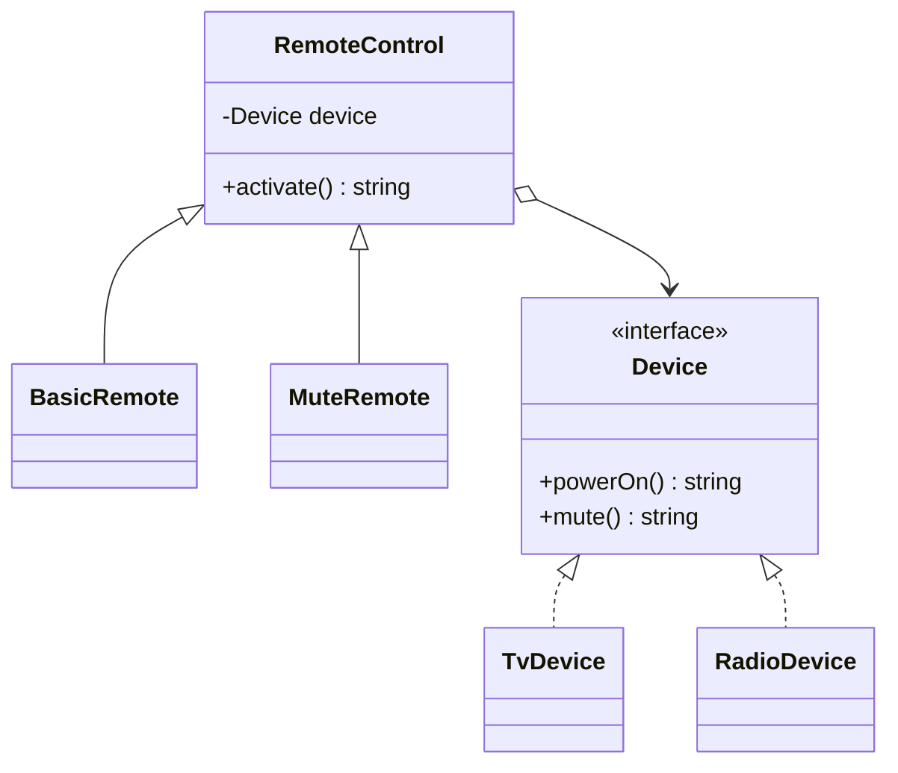

# Bridge

> **Familia:** Structural  
> **Intención:** separar una abstracción de su implementación para que ambas dimensiones puedan variar y evolucionar de forma independiente.  
> **Estado:** `validated`  
> **Implementaciones de lenguaje:** `48/48`  
> **Cobertura de pruebas:** N/A — los ejemplos standalone se validan con compile/run/análisis proporcional; no existe una métrica homogénea defendible entre ecosistemas.  
> **Mapa:** [Volver al catálogo y mapa de relaciones](README.md)

## En una frase

Bridge evita multiplicar combinaciones de tipos cuando tenemos **dos ejes de variación independientes**: la abstracción que usa el cliente y la implementación que realiza el trabajo.

## El problema

Supongamos controles remotos y dispositivos. Si codificamos cada combinación como una clase distinta (`BasicTvRemote`, `BasicRadioRemote`, `MuteTvRemote`, `MuteRadioRemote`), cada nuevo control o dispositivo multiplica la jerarquía. El problema no es sólo reutilización: son dos dimensiones que deberían poder cambiar sin obligarse mutuamente.

## Fuerzas que compiten

- El cliente necesita una abstracción estable sin conocer detalles concretos del dispositivo.
- Abstracciones e implementaciones deben poder crecer de forma independiente.
- Heredar cada combinación produce explosión combinatoria y acoplamiento estructural.
- Introducir una frontera adicional para una sola combinación fija añade complejidad innecesaria.

## La solución

Mover una dimensión de variación a una composición explícita. La **Abstraction** mantiene una referencia a una **Implementor** y expresa operaciones de alto nivel; implementaciones concretas resuelven la parte dependiente de plataforma/dispositivo. Las abstracciones refinadas pueden añadir comportamiento sin crear una subclase por cada implementador.

## Participantes y responsabilidades

| Participante | Responsabilidad |
|---|---|
| `Abstraction` | Expone la interfaz que usa el cliente y delega trabajo dependiente a `Implementor`. |
| `RefinedAbstraction` | Añade variantes de comportamiento sobre la misma frontera de implementación. |
| `Implementor` | Define las operaciones primitivas que requiere la abstracción. |
| `ConcreteImplementor` | Implementa esas operaciones para una plataforma/dispositivo concreto. |
| Cliente | Elige independientemente abstracción e implementación y las compone. |

## Cómo funciona

1. El cliente selecciona un implementador concreto, por ejemplo `TvDevice` o `RadioDevice`.
2. Construye una abstracción, por ejemplo `BasicRemote` o `MuteRemote`, pasando el implementador.
3. La abstracción decide el flujo de alto nivel y delega las operaciones dependientes al implementador.
4. Cualquiera de los dos ejes puede incorporar nuevas variantes sin crear el producto cartesiano de clases.

## Diagrama



El punto importante es la composición `RemoteControl → Device`: las dos jerarquías no se cruzan mediante una clase por combinación.

## Ejemplo mínimo

```text
tv = TvDevice()
radio = RadioDevice()

print(BasicRemote(tv).activate())    // TV:on
print(BasicRemote(radio).activate()) // Radio:on
print(MuteRemote(tv).activate())     // TV:muted
print(MuteRemote(radio).activate())  // Radio:muted
```

## Aplicación real

### APIs de alto nivel sobre proveedores intercambiables

Una abstracción de almacenamiento puede exponer operaciones de negocio estables mientras implementadores separados hablan con Azure Blob, S3 o filesystem local. Si además existen abstracciones refinadas —por ejemplo lectura simple y lectura auditada— Bridge evita combinar cada modo de uso con cada proveedor mediante herencia.

Si sólo necesitamos convertir una API incompatible a otra, Adapter es más apropiado. Si queremos ocultar una API grande tras una entrada simple, Facade describe mejor la presión.

## En Genkidama

La filosofía del repositorio reconoce Bridge como una frontera potencialmente útil cuando dos dimensiones cambian de forma independiente, pero esta auditoría no identifica todavía un uso productivo deliberado que deba presentarse como canónico. No se modificará arquitectura productiva para fabricar uno.

## Cuándo usarlo

- Existen dos ejes de variación independientes y ambos crecerán.
- Una jerarquía empieza a multiplicar clases por combinaciones de abstracción/plataforma.
- El cliente debe depender de una abstracción estable mientras cambia la implementación subyacente.

## Cuándo no usarlo

- Sólo existe una implementación y no hay presión real de una segunda dimensión.
- La necesidad es adaptar una interfaz heredada incompatible: usa Adapter.
- Sólo buscamos esconder complejidad detrás de una API simple: considera Facade.

## Consecuencias y trade-offs

| A favor | Costo / riesgo |
|---|---|
| Evita explosión combinatoria de subclases. | Añade una indirección y más participantes. |
| Permite evolucionar ambos ejes independientemente. | Exige identificar correctamente cuáles dimensiones son realmente independientes. |
| Facilita sustituir implementadores en runtime o composición. | Puede ser sobreingeniería si la segunda dimensión nunca varía. |

## Patrones relacionados

[Consulta también el mapa global de relaciones](README.md#relationship-map).

| Patrón | Relación | Por qué importa |
|---|---|---|
| [Adapter](Adapter.md) | often confused with | Adapter repara una incompatibilidad existente; Bridge diseña dos dimensiones para variar independientemente. |
| [Abstract Factory](AbstractFactory.md) | collaborates with | Una factory puede seleccionar el implementador concreto que una abstracción Bridge consumirá. |
| [Strategy](Strategy.md) | often confused with | Strategy varía un algoritmo/comportamiento intercambiable; Bridge separa dos jerarquías o dimensiones estructurales. |
| [Facade](Facade.md) | often confused with | Facade simplifica una superficie; Bridge desacopla abstracción e implementación. |

## Errores comunes y confusiones

### Llamar Bridge a cualquier composición

Composición por sí sola no demuestra Bridge. Deben existir dos dimensiones de variación con razones independientes para cambiar.

### Confundirlo con Adapter

Adapter suele aparecer después de que dos contratos incompatibles ya existen. Bridge es una decisión de diseño para evitar acoplar desde el principio una abstracción a una familia concreta de implementaciones.

### Crear la segunda jerarquía sin necesidad

Si sólo existe una implementación estable y no hay evidencia de otra dimensión, una interfaz adicional puede empeorar claridad sin aportar flexibilidad.

## Cómo comprobar una implementación

- La misma abstracción funciona con al menos dos implementadores concretos.
- Al menos dos variantes de abstracción pueden reutilizar los mismos implementadores sin clases por combinación.
- El cliente no necesita `switch`/`if` sobre el tipo concreto dentro de la abstracción estable.
- Añadir una nueva abstracción o implementación no obliga a editar todas las combinaciones existentes.

## Implementaciones por lenguaje

La tabla es autoritativa para la completitud de lenguaje. El universo canónico mantiene **51 targets**: **48 Applicable** y **3 N/A**. Los **48/48 ejemplos están materializados y verificados** con la validación más fuerte y ligera razonablemente disponible para cada ecosistema.

| Lenguaje | Aplicabilidad | Ejemplo | Validación | Nota |
|---|---|---|---|---|
| C# | Applicable | [BridgeExample.cs](../src/Enterprise/C%23/BridgeExample.cs) | ✅ CI Bridge | interfaces + composición |
| TypeScript | Applicable | [bridge.ts](../src/Web/TypeScriptTS/bridge.ts) | ✅ CI Bridge strict | structural typing |
| Python | Applicable | [bridge.py](../src/Scripting/PythonPY/bridge.py) | ✅ CI Bridge | duck typing |
| C++ | Applicable | [bridge.cpp](../src/Systems/C++/bridge.cpp) | ✅ CI Bridge | interfaces abstractas + referencias |
| Java | Applicable | [BridgeExample.java](../src/Enterprise/Java/BridgeExample.java) | ✅ CI Bridge | interfaces + composición |
| Rust | Applicable | [bridge.rs](../src/Systems/Rust/bridge.rs) | ✅ CI Bridge rustfmt/run | trait + generic bridge |
| Go | Applicable | [bridge.go](../src/Systems/Go/bridge.go) | ✅ CI Bridge gofmt/vet/run | interfaces implícitas |
| PHP | Applicable | [bridge.php](../src/Scripting/PHP/bridge.php) | ✅ CI Bridge | interfaces + composición |
| Kotlin | Applicable | [BridgeExample.kt](../src/Enterprise/Kotlin/BridgeExample.kt) | ✅ CI Bridge | interfaces + composición |
| Swift | Applicable | [bridge.swift](../src/Systems/Swift/bridge.swift) | ✅ CI Bridge | protocols + composición |
| F# | Applicable | [bridge.fsx](../src/Functional/F%23/bridge.fsx) | ✅ CI Bridge | records de funciones |
| JavaScript | Applicable | [bridge.js](../src/Web/JavaScriptJS/bridge.js) | ✅ CI Bridge | objetos por composición |
| Visual Basic .NET | Applicable | [BridgeExample.vb](../src/Enterprise/VisualBasic/BridgeExample.vb) | ✅ Pattern Bridge Portable | interfaces + composición |
| C | Applicable | [bridge.c](../src/Systems/C/bridge.c) | ✅ Pattern Bridge Portable | structs + function pointers |
| Ruby | Applicable | [bridge.rb](../src/Scripting/RubyRB/bridge.rb) | ✅ Pattern Bridge Portable | duck typing/composición |
| Lua | Applicable | [bridge.lua](../src/Scripting/Lua/bridge.lua) | ✅ Pattern Bridge Portable | tables + closures |
| Bash | Applicable | [bridge.sh](../src/Shell/Bash/bridge.sh) | ✅ Pattern Bridge Portable | funciones + dispatch explícito |
| PowerShell | Applicable | [bridge.ps1](../src/Shell/PowerShell/bridge.ps1) | ✅ Pattern Bridge Portable | scriptblocks/objetos |
| Haskell | Applicable | [Bridge.hs](../src/Functional/Haskell/Bridge.hs) | ✅ Pattern Bridge Portable | records + funciones |
| Scala | Applicable | [Bridge.scala](../src/Functional/Scala/Bridge.scala) | ✅ Pattern Bridge Portable | traits + composición |
| Perl | Applicable | [bridge.pl](../src/Scripting/Perl/bridge.pl) | ✅ Pattern Bridge Portable | hashes + closures |
| Pascal | Applicable | [bridge.pas](../src/Historical/Pascal/bridge.pas) | ✅ Pattern Bridge Portable | clases + method references |
| R | Applicable | [bridge.R](../src/DataScience/R/bridge.R) | ✅ Pattern Bridge Functional | closures/listas |
| GNU Octave | Applicable | [bridge.m](../src/DataScience/Octave/bridge.m) | ✅ Pattern Bridge Functional | function handles/structs |
| Julia | Applicable | [bridge.jl](../src/DataScience/Julia/bridge.jl) | ✅ Pattern Bridge Functional | named tuples + closures |
| OCaml | Applicable | [bridge.ml](../src/Functional/OCaml/bridge.ml) | ✅ Pattern Bridge Functional | records de funciones |
| Common Lisp | Applicable | [bridge.lisp](../src/Functional/Lisp/bridge.lisp) | ✅ Pattern Bridge Functional | structures + closures |
| Clojure | Applicable | [bridge.clj](../src/Functional/Clojure/bridge.clj) | ✅ Pattern Bridge Functional | maps + funciones |
| Elixir | Applicable | [bridge.exs](../src/Functional/Elixir/bridge.exs) | ✅ Pattern Bridge Functional | maps + funciones |
| Erlang | Applicable | [bridge.erl](../src/Functional/Erlang/bridge.erl) | ✅ Pattern Bridge Functional | maps + funs |
| Prolog | Applicable | [bridge.pl](../src/Niche/Prolog/bridge.pl) | ✅ Pattern Bridge Functional | predicates/terms |
| Groovy | Applicable | [bridge.groovy](../src/Scripting/Groovy/bridge.groovy) | ✅ Pattern Bridge Functional | maps/closures |
| Ada | Applicable | [bridge.adb](../src/Historical/Ada/bridge.adb) | ✅ Pattern Bridge Final | access-to-function record |
| Solidity | Applicable | [Bridge.sol](../src/Niche/Solidity/Bridge.sol) | ✅ solc/source contract | interfaces/contracts |
| Fortran | Applicable | [bridge.f90](../src/Historical/Fortran/bridge.f90) | ✅ Pattern Bridge Final | derived type + procedure pointers |
| Objective-C | Applicable | [bridge.m](../src/Systems/Objective-C/bridge.m) | ✅ Clang/ARC/Foundation | protocols/composition |
| Zig | Applicable | [bridge.zig](../src/Systems/Zig/bridge.zig) | ✅ Pattern Bridge Final | structs/function pointers |
| Nim | Applicable | [bridge.nim](../src/Niche/Nim/bridge.nim) | ✅ Pattern Bridge Final | object + proc callbacks |
| Dart | Applicable | [bridge.dart](../src/Web/Dart/bridge.dart) | ✅ Pattern Bridge Final | format/analyze/run |
| Crystal | Applicable | [bridge.cr](../src/Niche/Crystal/bridge.cr) | ✅ Pattern Bridge Final | format/build/run |
| COBOL | Applicable | [bridge.cbl](../src/Historical/Cobol/bridge.cbl) | ✅ Pattern Bridge Final | procedimientos + estado separado |
| VBA | Applicable | [bridge.bas](../src/Shell/VBA/bridge.bas) | ✅ source-contract real | class modules/interfaces |
| GDScript | Applicable | [bridge.gd](../src/Niche/GDScript/bridge.gd) | ✅ Godot 4.6.3 | objects/composition |
| MATLAB | Applicable | [bridge.m](../src/DataScience/MATLAB/bridge.m) | ✅ MathWorks Actions | structs + function handles |
| Assembly | Applicable | [bridge.asm](../src/LowLevel/Assembly/bridge.asm) | ✅ Pattern Bridge Final | device table + remote function pointers |
| Delphi | Applicable | [BridgeExample.pas](../src/Enterprise/Delphi/BridgeExample.pas) | ✅ source-contract real | interfaces/classes |
| MicroPython | Applicable | [bridge.py](../src/Other/MicroPython/bridge.py) | ✅ MicroPython 1.28.0 Unix | objects/composition |
| Rockstar | Applicable | [bridge.rock](../src/Other/Rockstar/bridge.rock) | ✅ Rockstar v2.0.31 | keyed arrays + action key |
| HTML | N/A | — | — | markup declarativo; cualquier Bridge ejecutable pertenece al runtime que lo procesa. |
| CSS | N/A | — | — | reglas declarativas de presentación sin abstracciones/runtime calls que desacoplar. |
| SQL | N/A | — | — | SQL declarativo transforma/consulta datos, pero no expresa por sí solo dos dimensiones runtime de abstracción e implementación. |

## Comprueba que lo entendiste

1. Si cada nuevo dispositivo obliga a crear una subclase por cada tipo de control remoto, ¿qué fuerza indica que Bridge puede ayudar?
2. ¿Por qué un wrapper que convierte Fahrenheit a Celsius es Adapter y no Bridge?
3. ¿Cuándo sería más simple mantener una sola interfaz concreta en vez de introducir Bridge?

## Resumen

- **Presión:** dos dimensiones independientes empiezan a multiplicar combinaciones.
- **Movimiento:** una abstracción compone un implementador en vez de heredar cada combinación.
- **Trade-off:** más indirección a cambio de evolución independiente.
- **Relación clave:** Adapter corrige incompatibilidades; Bridge separa dimensiones desde el diseño.
- **Portabilidad:** clases no son requisito; records de funciones, módulos, closures, traits o tablas pueden preservar la intención.

## Referencias

- Gamma, Helm, Johnson y Vlissides, *Design Patterns: Elements of Reusable Object-Oriented Software* — Bridge.
- [Patterns as Living Examples](../docs/philosophy/001-patterns-as-living-examples.md).
- [Canonical Design Pattern Authoring Standard](../docs/kb/catalog/pattern-authoring-standard.md).