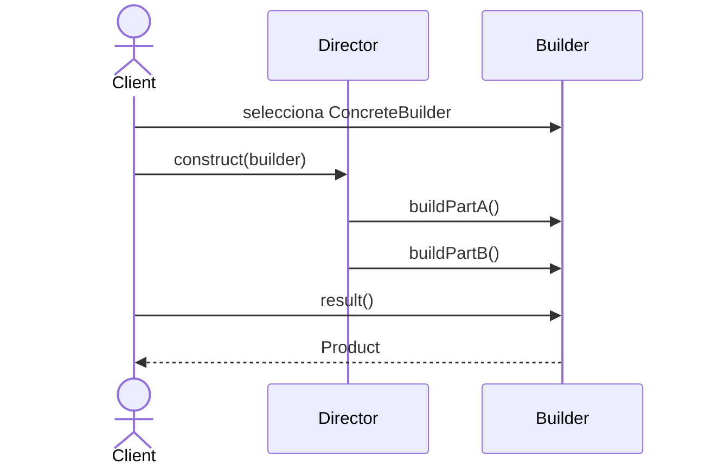

# Builder

> **Familia:** Creational  
> **Intención:** construir un objeto complejo paso a paso, permitiendo reutilizar el mismo proceso para obtener representaciones diferentes.  
> **Estado:** `in-progress`  
> **Implementaciones de lenguaje:** `7/48` verificadas; `48/48` ejemplos publicados  
> **Cobertura de pruebas:** N/A — los ejemplos heterogéneos se validan por compilación/ejecución o evidencia proporcional; no existe un porcentaje homogéneo de line coverage.  
> **Mapa:** [Volver al catálogo y mapa de relaciones](README.md)

## En una frase

Builder separa **cómo se ensambla** un objeto complejo de **qué representación concreta resulta** de ese ensamblado.

## El problema

Un objeto puede requerir varias decisiones y pasos: partes opcionales, orden de ensamblado, validación intermedia o representaciones finales distintas. Si el cliente conoce todos esos detalles, la creación se mezcla con el uso y cada nueva representación duplica el proceso.

## Fuerzas que compiten

- El cliente necesita un producto completo sin conocer todos sus detalles internos.
- Varias representaciones pueden compartir una secuencia de construcción.
- Los pasos deben poder variar sin constructores telescópicos.
- Introducir builders para objetos triviales añade ceremonia.

## La solución

Representar la construcción como una secuencia explícita de operaciones. Un **Builder** recibe los pasos; builders concretos deciden cómo afectan su representación; opcionalmente un **Director** conserva una receta reutilizable. El Director es útil, pero **no define el patrón**.

La esencia es separar la receta de ensamblado de la representación resultante. Una implementación funcional puede usar records de funciones o closures; una procedural puede usar records/structs y procedimientos; una dinámica puede usar objetos o tablas. No es necesario reproducir una jerarquía OO.

## Participantes y responsabilidades

| Participante | Responsabilidad |
|---|---|
| `Builder` | Define pasos significativos de construcción. |
| `ConcreteBuilder` | Implementa los pasos y mantiene el producto en construcción. |
| `Product` | Resultado construido; distintas builders pueden producir representaciones diferentes. |
| `Director` | Opcionalmente encapsula una receta reutilizable. |
| Cliente | Elige el builder y consume el resultado. |

## Cómo funciona

1. El cliente selecciona un builder concreto.
2. El cliente o un Director ejecuta los pasos requeridos.
3. El builder acumula el estado sin exponer los detalles de representación.
4. El cliente obtiene un producto coherente al finalizar.

## Diagrama



La receta no depende de la representación concreta que el builder ensambla. El Director es opcional: cuando una receta no necesita identidad ni reutilización propia, el cliente puede dirigir los pasos directamente.

## Ejemplo mínimo

```csharp
public static string BuildAvailabilityReport(IReportBuilder builder)
{
    builder.Reset();
    builder.AddTitle("Service status");
    builder.AddSection("Availability", "99.95%");
    return builder.Build();
}
```

La implementación C# completa está en [`src/Enterprise/C#/BuilderExample.cs`](../src/Enterprise/C%23/BuilderExample.cs). La misma receta produce texto y HTML sin que la receta conozca cómo se representa cada parte.

## Aplicación real

### Reportes con varias representaciones

Un sistema produce el mismo reporte como HTML y texto. Contenido y orden son equivalentes, pero escaping, etiquetas y formato final cambian. Builder permite expresar una receta y delegar la representación.

Si construir el producto equivale a asignar dos campos o sólo existe una representación estable, un constructor o una función simple es mejor.

## En Genkidama

[`docs/philosophy/001-patterns-as-living-examples.md`](../docs/philosophy/001-patterns-as-living-examples.md) identifica **project generation configuration** como un lugar potencialmente natural para Builder, pero esta ficha no ha verificado todavía un uso productivo deliberado que satisfaga el estándar canónico. Por eso no se presenta la arquitectura productiva como ejemplo del patrón.

La auditoría no modificará código productivo para fabricar una demostración.

## Cuándo usarlo

- El producto requiere varios pasos significativos de construcción.
- La misma receta debe producir representaciones diferentes.
- Un constructor empieza a acumular demasiadas combinaciones opcionales.
- Es útil impedir que el cliente manipule detalles internos de un producto incompleto.

## Cuándo no usarlo

- Un constructor o factory simple expresa mejor la intención.
- Sólo se busca sintaxis fluida; una fluent API no es automáticamente Builder.
- La presión real es seleccionar una familia de productos relacionados: usa Abstract Factory.
- La variación consiste sólo en decidir qué implementación concreta instanciar: considera Factory Method.

## Consecuencias y trade-offs

| A favor | Costo / riesgo |
|---|---|
| Separa construcción y representación. | Añade tipos, estado y protocolo de construcción. |
| Permite reutilizar recetas. | Un Director rígido puede convertirse en ceremonia. |
| Hace explícitos pasos y opciones. | Builders mutables requieren un ciclo de vida claro. |
| Puede proteger productos incompletos. | Para productos simples es sobreingeniería. |

## Patrones relacionados

[Consulta también el mapa global de relaciones](README.md#relationship-map).

| Patrón | Relación | Por qué importa |
|---|---|---|
| [Abstract Factory](AbstractFactory.md) | often confused with | Abstract Factory selecciona una familia coherente; Builder ensambla un producto paso a paso. |
| [Factory Method](FactoryMethod.md) | collaborates with | Un builder puede delegar la creación de una parte concreta. |
| [Composite](Composite.md) | collaborates with | Builders suelen ensamblar estructuras compuestas sin exponer el proceso al cliente. |
| [Prototype](Prototype.md) | alternative to | Clonar una plantilla puede ser más simple que reconstruirla paso a paso cuando ya existe un prototipo adecuado. |

## Errores comunes y confusiones

### Confundir cualquier API fluida con Builder

Encadenar llamadas no demuestra el patrón. Debe existir una presión real de construcción incremental y un resultado coherente cuyo ensamblado queda separado del consumidor.

### Convertir el Director en requisito ceremonial

El Director sólo merece existir cuando una receta tiene identidad o reutilización propia. Si cada cliente necesita una secuencia distinta, puede dirigir el builder directamente.

### Usar Builder para esconder un modelo inválido

Builder no sustituye invariantes de dominio. Si el producto admite demasiadas combinaciones inválidas, el problema puede estar en el modelo y no en la sintaxis del constructor.

## Cómo comprobar una implementación

- El cliente puede construir un producto sin conocer sus detalles internos de representación.
- Los pasos producen un resultado coherente y observable.
- Cuando existen varias representaciones, una misma receta puede ejercitarlas sin duplicar la orquestación.
- La prueba observa el producto resultante, no nombres como `Builder` o `Director`.
- Reutilizar un builder mutable no debe filtrar estado previo después de `reset` o su equivalente.

## Implementaciones por lenguaje

La fuente de targets es [`learn/_meta/catalog.yml`](../learn/_meta/catalog.yml): **51 targets actuales**, de los cuales Builder clasifica **48 Applicable** y **3 N/A**. `Verified` significa que un gate observado ejecutó, compiló o aplicó la evidencia proporcional correspondiente; `Candidate` significa que el archivo real existe y conserva la intención, pero su evidencia final aún no está verde.

| Lenguaje | Aplicabilidad | Ejemplo | Validación actual | Nota |
|---|---|---|---|---|
| C# | Applicable | [`BuilderExample.cs`](../src/Enterprise/C%23/BuilderExample.cs) | compile/run ✅ | Interface + dos builders + receta compartida. |
| TypeScript | Applicable | [`builder.ts`](../src/Web/TypeScriptTS/builder.ts) | Candidate | Gate expandido. |
| Ada | Applicable | [`builder.adb`](../src/Historical/Ada/builder.adb) | Candidate | Record + procedimientos; warning-clean fix publicado tras primer rojo. |
| Solidity | Applicable | [`Builder.sol`](../src/Niche/Solidity/Builder.sol) | Candidate | Interface + builders concretos; compile/bytecode gate. |
| Fortran | Applicable | [`builder.f90`](../src/Historical/Fortran/builder.f90) | Candidate | Derived type + type-bound procedures. |
| Pascal | Applicable | [`builder.pas`](../src/Historical/Pascal/builder.pas) | Candidate | Record/procedimientos; gate funcional. |
| Python | Applicable | [`builder.py`](../src/Scripting/PythonPY/builder.py) | run ✅ | Objetos dinámicos + receta compartida. |
| Visual Basic .NET | Applicable | [`BuilderExample.vb`](../src/Enterprise/VisualBasic/BuilderExample.vb) | compile/run ✅ | Gate portable observado verde. |
| C++ | Applicable | [`builder.cpp`](../src/Systems/C%2B%2B/builder.cpp) | Candidate | Gate expandido. |
| Objective-C | Applicable | [`builder.m`](../src/Systems/Objective-C/builder.m) | macOS compile/run ✅ | Protocol + concrete builders con Foundation. |
| Java | Applicable | [`BuilderExample.java`](../src/Enterprise/Java/BuilderExample.java) | Candidate | Gate expandido. |
| Rust | Applicable | [`builder.rs`](../src/Systems/Rust/builder.rs) | Candidate | Gate expandido. |
| Zig | Applicable | [`builder.zig`](../src/Systems/Zig/builder.zig) | Candidate | API de salida alineada al runtime actual tras primer rojo. |
| Go | Applicable | [`builder.go`](../src/Systems/Go/builder.go) | run ✅ | Interface + dos representaciones. |
| PHP | Applicable | [`builder.php`](../src/Scripting/PHP/builder.php) | Candidate | Gate expandido. |
| Nim | Applicable | [`builder.nim`](../src/Niche/Nim/builder.nim) | Candidate | Gate portable 2. |
| Dart | Applicable | [`builder.dart`](../src/Web/Dart/builder.dart) | Candidate | Gate portable 2. |
| Kotlin | Applicable | [`BuilderExample.kt`](../src/Enterprise/Kotlin/BuilderExample.kt) | Candidate | Gate expandido. |
| Swift | Applicable | [`builder.swift`](../src/Systems/Swift/builder.swift) | Candidate | Gate expandido. |
| F# | Applicable | [`builder.fsx`](../src/Functional/F%23/builder.fsx) | Candidate | Record de funciones; fix de inferencia publicado. |
| Crystal | Applicable | [`builder.cr`](../src/Niche/Crystal/builder.cr) | Candidate | Gate portable 2. |
| Lua | Applicable | [`builder.lua`](../src/Scripting/Lua/builder.lua) | Candidate | Gate expandido. |
| Haskell | Applicable | [`Builder.hs`](../src/Functional/Haskell/Builder.hs) | Candidate | Record de operaciones; gate funcional. |
| COBOL | Applicable | [`builder.cbl`](../src/Historical/Cobol/builder.cbl) | Candidate | Secciones/procedimientos + receta compartida. |
| Scala | Applicable | [`Builder.scala`](../src/Functional/Scala/Builder.scala) | Candidate | Gate funcional. |
| Groovy | Applicable | [`builder.groovy`](../src/Scripting/Groovy/builder.groovy) | Candidate | Gate portable 2. |
| Ruby | Applicable | [`builder.rb`](../src/Scripting/RubyRB/builder.rb) | Candidate | Gate expandido. |
| C | Applicable | [`builder.c`](../src/Systems/C/builder.c) | Candidate | Gate expandido. |
| OCaml | Applicable | [`builder.ml`](../src/Functional/OCaml/builder.ml) | Candidate | Closures/record; gate portable 2. |
| Julia | Applicable | [`builder.jl`](../src/DataScience/Julia/builder.jl) | Candidate | Mutable struct idiomático; gate portable 2. |
| VBA | Applicable | [`builder.bas`](../src/Shell/VBA/builder.bas) | Candidate | Source contract proporcional; no se sustituye por VB.NET. |
| GDScript | Applicable | [`builder.gd`](../src/Niche/GDScript/builder.gd) | Candidate | Godot 4.6.3 headless. |
| JavaScript | Applicable | [`builder.js`](../src/Web/JavaScriptJS/builder.js) | run ✅ | Prototipos/objetos dinámicos. |
| MATLAB | Applicable | [`builder.m`](../src/DataScience/MATLAB/builder.m) | Candidate | Gate oficial MathWorks; no se sustituye por Octave. |
| Perl | Applicable | [`builder.pl`](../src/Scripting/Perl/builder.pl) | Candidate | Gate funcional. |
| R | Applicable | [`builder.R`](../src/DataScience/R/builder.R) | Candidate | Gate funcional. |
| PowerShell | Applicable | [`builder.ps1`](../src/Shell/PowerShell/builder.ps1) | Candidate | Gate funcional. |
| HTML | N/A | — | — | Markup declarativo; el proceso de construcción runtime pertenecería a otro lenguaje, p. ej. JavaScript. |
| Assembly | Applicable | [`builder.asm`](../src/LowLevel/Assembly/builder.asm) | Candidate | Tabla de function pointers + NASM/LD. |
| Elixir | Applicable | [`builder.exs`](../src/Functional/Elixir/builder.exs) | Candidate | Funciones/módulos; gate funcional. |
| Shell | Applicable | [`builder.sh`](../src/Shell/Bash/builder.sh) | Candidate | Funciones + estado explícito; gate expandido. |
| Erlang | Applicable | [`builder.erl`](../src/Functional/Erlang/builder.erl) | Candidate | Módulo/estado explícito; gate funcional. |
| Clojure | Applicable | [`builder.clj`](../src/Functional/Clojure/builder.clj) | Candidate | Maps/funciones; gate funcional. |
| Common Lisp | Applicable | [`builder.lisp`](../src/Functional/Lisp/builder.lisp) | Candidate | Struct + funciones; gate portable 2. |
| Prolog | Applicable | [`builder.pl`](../src/Niche/Prolog/builder.pl) | Candidate | Predicados/estado explícito; gate funcional. |
| Delphi | Applicable | [`Builder.pas`](../src/Enterprise/Delphi/Builder.pas) | Candidate | Source contract proporcional; dispatch virtual explícito. |
| GNU Octave | Applicable | [`builder.m`](../src/DataScience/Octave/builder.m) | Candidate | Gate funcional. |
| SQL | N/A | — | — | El target es SQL declarativo; no se usará un dialecto procedural distinto para forzar construcción runtime. |
| CSS | N/A | — | — | Lenguaje declarativo de presentación sin proceso runtime general de construcción de productos. |
| MicroPython | Applicable | [`builder.py`](../src/Other/MicroPython/builder.py) | Candidate | Unix port oficial 1.28.0. |
| Rockstar | Applicable | [`builder.rock`](../src/Other/Rockstar/builder.rock) | runtime oficial v2.0.31 ✅ | Binario oficial con SHA-256 fijado; salida observable. |

### Evidencia automatizada actual

- `Pattern Builder` verificó C#, Python, JavaScript y Go con salida observable de las dos representaciones.
- `Pattern Builder Portable 2` ya produjo evidencia verde observada para Visual Basic .NET y Objective-C; Zig recibió una corrección acotada de compatibilidad y el lote vuelve a ejecutarse.
- `Pattern Builder Functional` cubre F#, Haskell, Scala, Perl, PowerShell, R, GNU Octave, Pascal, Erlang, Elixir, Clojure y Prolog con pasos nombrados por lenguaje.
- `Pattern Builder Final` cubre Ada, Solidity, Fortran, COBOL, Assembly, GDScript, MATLAB, MicroPython, Rockstar y los source contracts proporcionales de VBA/Delphi. Rockstar ya produjo un run verde; Ada produjo el primer rojo del lote portable y recibió un fix warning-clean.
- No se inventa line coverage transversal. La política >=44% aplica cuando un ecosistema tenga medición de coverage significativa.

## Comprueba que lo entendiste

1. Si dos representaciones usan la misma receta de pasos pero cada una almacena y renderiza el producto de forma distinta, ¿qué fuerza de diseño justifica Builder frente a dos funciones independientes?
2. ¿Por qué un Director puede mejorar una implementación y aun así no ser parte obligatoria de la definición del patrón?
3. Si una API encadena `WithName().WithTimeout().Build()` para crear un objeto simple, ¿qué evidencia adicional necesitarías antes de clasificarla como Builder en vez de una fluent API?

## Resumen

- Builder aparece cuando el **proceso de ensamblado** debe quedar separado de la **representación resultante**.
- La receta puede vivir en un Director, pero el Director es opcional.
- El patrón gana flexibilidad a cambio de protocolo, estado y tipos/funciones adicionales.
- Abstract Factory selecciona familias; Factory Method decide creación individual; Builder enfatiza construcción progresiva.
- La intención se puede expresar idiomáticamente sin clases mediante records, closures, módulos, predicados, structs o mensajes.
- Cardinalidad actual: **51 targets = 48 Applicable + 3 N/A; 48/48 ejemplos materializados; 7/48 con evidencia verde observada hasta este incremento**.

## Referencias

- [Canonical Design Pattern Authoring Standard](../docs/kb/catalog/pattern-authoring-standard.md)
- [Patterns as Living Examples](../docs/philosophy/001-patterns-as-living-examples.md)
- [Catálogo y mapa de relaciones](README.md)
- Gamma, Helm, Johnson y Vlissides, *Design Patterns: Elements of Reusable Object-Oriented Software* — referencia conceptual del patrón Builder; esta ficha usa redacción original.