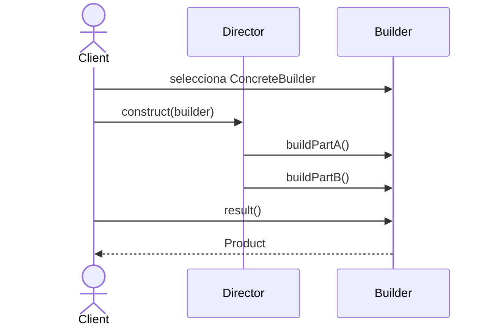

# Builder

> **Familia:** Creational  
> **Intención:** construir un objeto complejo paso a paso, permitiendo reutilizar el mismo proceso para obtener representaciones diferentes.  
> **Estado:** `in-progress`  
> **Implementaciones de lenguaje:** `0/48`  
> **Cobertura de pruebas:** N/A — la primera entrega establece semántica y matriz; cada Applicable se promoverá sólo con evidencia proporcional.  
> **Mapa:** [Volver al catálogo y mapa de relaciones](README.md)

## En una frase

Builder separa **cómo se ensambla** un objeto complejo de **qué representación concreta resulta** de ese ensamblado.

## El problema

Un objeto puede requerir varias decisiones y pasos: partes opcionales, orden de ensamblado, validación intermedia o representaciones finales distintas. Si el cliente conoce todos esos detalles, la creación se mezcla con el uso y cada nueva representación duplica el proceso.

## Fuerzas que compiten

- El cliente necesita un producto completo sin conocer todos sus detalles internos.
- Varias representaciones pueden compartir una secuencia de construcción.
- Los pasos deben poder variar sin constructores telescópicos.
- Introducir builders para objetos triviales añade ceremonia.

## La solución

Representar la construcción como una secuencia explícita de operaciones. Un **Builder** recibe los pasos; builders concretos deciden cómo afectan su representación; opcionalmente un **Director** conserva una receta reutilizable. El Director es útil, pero **no define el patrón**.

## Participantes y responsabilidades

| Participante | Responsabilidad |
|---|---|
| `Builder` | Define pasos significativos de construcción. |
| `ConcreteBuilder` | Implementa pasos y mantiene el producto en construcción. |
| `Product` | Resultado construido. |
| `Director` | Opcionalmente encapsula una receta reutilizable. |
| Cliente | Elige builder y consume el resultado. |

## Cómo funciona

1. El cliente selecciona un builder concreto.
2. El cliente o Director ejecuta los pasos requeridos.
3. El builder acumula estado sin exponer detalles internos.
4. El cliente obtiene un producto coherente al finalizar.

## Diagrama



La receta no depende de la representación concreta que el builder ensambla.

## Ejemplo mínimo

```text
builder = new HtmlReportBuilder()
builder.title("Estado del servicio")
builder.section("Disponibilidad", "99.95%")
report = builder.build()
```

Un `TextReportBuilder` puede aceptar los mismos pasos y producir texto plano.

## Aplicación real

### Reportes con varias representaciones

Un sistema produce el mismo reporte como HTML y texto. Contenido y orden son equivalentes, pero escaping y formato final cambian. Builder permite expresar una receta y delegar la representación. Si construir el producto equivale a asignar dos campos, una función simple es mejor.

## En Genkidama

Genkidama no declara todavía un uso deliberado de Builder que necesite presentarse como ejemplo canónico. Esta auditoría no modificará arquitectura productiva para fabricar uno.

## Cuándo usarlo

- El producto requiere varios pasos significativos.
- La misma receta debe producir representaciones diferentes.
- Un constructor acumula demasiadas combinaciones opcionales.

## Cuándo no usarlo

- Un constructor/factory simple expresa mejor la intención.
- Sólo se busca sintaxis fluida; una fluent API no es automáticamente Builder.
- La presión real es seleccionar una familia de productos: usa Abstract Factory.

## Consecuencias y trade-offs

| A favor | Costo / riesgo |
|---|---|
| Separa construcción y representación. | Añade tipos, estado y protocolo. |
| Permite reutilizar recetas. | Un Director rígido puede ser ceremonia. |
| Hace explícitos pasos y opciones. | Builders mutables requieren ciclo de vida claro. |

## Patrones relacionados

[Consulta también el mapa global de relaciones](README.md#relationship-map).

| Patrón | Relación | Por qué importa |
|---|---|---|
| [Abstract Factory](AbstractFactory.md) | often confused with | Abstract Factory selecciona una familia; Builder ensambla paso a paso. |
| [Factory Method](FactoryMethod.md) | collaborates with | Un builder puede delegar la creación de una parte. |
| [Composite](Composite.md) | collaborates with | Builders suelen ensamblar estructuras compuestas. |
| [Prototype](Prototype.md) | alternative to | Clonar una plantilla puede ser más simple que reconstruirla. |

## Errores comunes y confusiones

### Confundir cualquier API fluida con Builder

Encadenar llamadas no demuestra el patrón. Debe existir construcción incremental y un resultado coherente cuyo ensamblado queda separado del cliente.

### Convertir el Director en requisito ceremonial

Sólo merece existir cuando una receta tiene identidad o reutilización propia.

## Cómo comprobar una implementación

- El cliente construye un producto sin conocer su representación interna.
- Los pasos producen un resultado coherente y observable.
- Varias representaciones pueden compartir la receta cuando esa variación existe.
- La validación observa el producto, no sólo nombres como `Builder` o `Director`.

## Preguntas de comprensión

1. ¿Qué cambia y qué permanece estable cuando Builder está bien aplicado?
2. ¿Por qué un Director es opcional?
3. ¿Cuándo un constructor con parámetros nombrados es más simple?
4. ¿Qué diferencia de intención separa Builder de Abstract Factory?
5. ¿Qué evidencia conductual verificaría dos representaciones distintas?

## Matriz de implementaciones

El universo canónico mantiene **51 targets**. Esta primera entrega clasifica **48 como Applicable** y conserva **HTML, CSS y SQL como N/A provisionales sujetos a revisión técnica**. Ningún target se excluye por carecer de clases.

| Estado | Cantidad | Criterio |
|---|---:|---|
| Applicable | 48 | Puede expresar construcción incremental y separar proceso de representación significativamente. |
| N/A | 3 | HTML, CSS y SQL declarativo no son por sí mismos runtimes generales de construcción de objetos. |
| Verified | 0 | Ningún ejemplo histórico se promueve sin inspección semántica, ruta real y evidencia proporcional. |

### N/A provisionales

- **HTML:** markup declarativo; una implementación JavaScript sería JavaScript.
- **CSS:** presentación declarativa, no construcción incremental runtime.
- **SQL:** SQL declarativo; no se usará un dialecto procedural para forzar el patrón.

La auditoría continuará lenguaje por lenguaje. Un ejemplo faltante o incorrecto mantiene esta página `in-progress`; nunca se sustituye por un enlace inventado.
