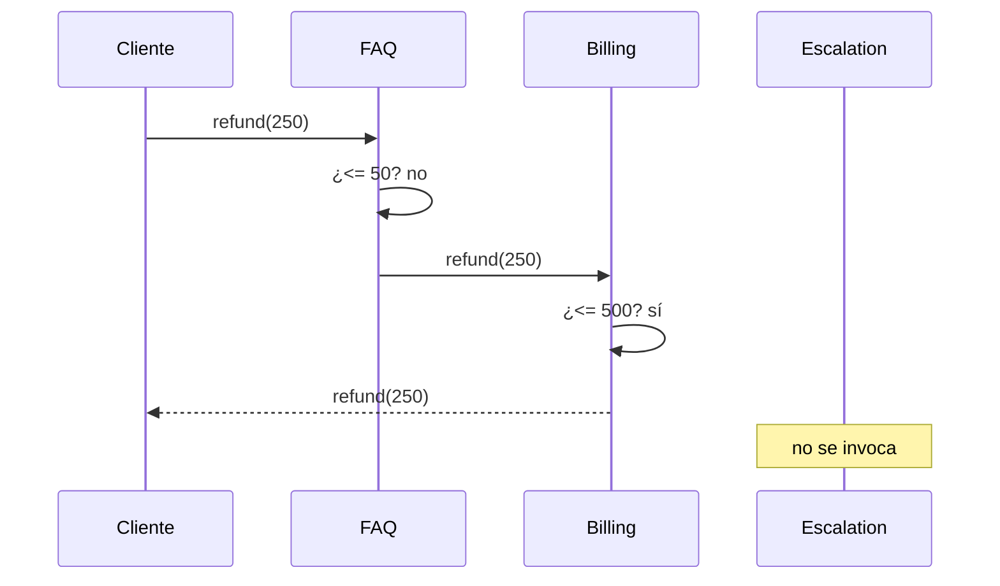

# Chain of Responsibility

> **Familia:** Behavioral  
> **Intención:** permitir que una solicitud recorra una secuencia de posibles manejadores hasta que uno asuma la responsabilidad, sin acoplar al emisor con un receptor concreto.  
> **Estado:** `in-progress`  
> **Implementaciones de lenguaje:** `45/49 verified; 49/49 materialized`  
> **Cobertura de pruebas:** N/A — ejemplos standalone multi-ecosistema; se usa compilación, runtime, análisis o contrato por lenguaje en lugar de inventar un porcentaje agregado.  
> **Mapa:** [Volver al catálogo y mapa de relaciones](README.md)

## En una frase

Chain of Responsibility deja que el emisor entregue una solicitud al inicio de una cadena y que cada manejador decida entre resolverla o pasarla al siguiente.

## El problema

Un sistema de soporte recibe solicitudes de reembolso con distintos montos. Una FAQ automática puede resolver importes pequeños, facturación puede asumir importes moderados y un especialista humano debe recibir los casos restantes. Si el emisor conoce y selecciona directamente cada receptor, la política de enrutamiento queda duplicada y cada nuevo nivel obliga a cambiar al cliente.

## Fuerzas que compiten

- El emisor debe permanecer desacoplado del manejador concreto que finalmente resuelve la solicitud.
- Los manejadores deben poder ordenarse, añadirse o retirarse sin reescribir al emisor.
- Una solicitud debe detenerse cuando un manejador asume responsabilidad; continuar innecesariamente puede duplicar efectos.
- El orden de la cadena es comportamiento de negocio y puede cambiar el resultado.
- Una cadena sin manejador final o política de rechazo puede dejar solicitudes sin respuesta.

## La solución

Construir una secuencia de **Handlers** que comparten el mismo contrato de manejo. Cada handler inspecciona la solicitud: si puede atenderla, produce el resultado y termina el recorrido; si no, la delega al siguiente. El cliente conoce únicamente el punto de entrada de la cadena.

La intención no depende de clases. Listas de funciones, closures, módulos, procesos, predicados, tablas de reglas o CTEs pueden representar una cadena siempre que exista un orden de posibles receptores y el recorrido termine al asumir uno la responsabilidad.

## Participantes y responsabilidades

| Participante | Responsabilidad |
|---|---|
| `Request` | Contiene la información necesaria para decidir quién puede atenderla. |
| `Handler` | Define cómo inspeccionar la solicitud y cómo continuar al siguiente receptor. |
| `ConcreteHandler` | Decide si asume la responsabilidad o delega. |
| Cliente / emisor | Entrega la solicitud al inicio de la cadena sin seleccionar al receptor final. |

## Cómo funciona

1. El cliente envía `refund(250)` al primer handler, `faq`.
2. `faq` registra que recibió la solicitud, determina que 250 excede su límite y delega.
3. `billing` recibe la misma solicitud y determina que puede resolverla.
4. La cadena se detiene: `escalation` no recibe la solicitud.
5. El cliente obtiene el resultado sin conocer qué handler concreto terminó atendiendo.

## Diagrama



La evidencia importante es doble: la solicitud puede avanzar sin que el cliente elija receptor y el recorrido se corta en el primer handler que acepta responsabilidad.

## Ejemplo mínimo

```text
faq -> billing -> escalation

refund(250)
visited=faq>billing;handled=billing;result=refund(250)
```

`escalation` existe como fallback, pero no aparece en `visited`: eso demuestra el short-circuit de la cadena.

## Aplicación real

### Validación y soporte escalonado

Una cadena puede aplicar reglas de menor a mayor costo: resolver automáticamente casos simples, delegar casos moderados a un subsistema especializado y escalar sólo excepciones. El emisor no necesita un `if/else` que conozca cada receptor.

Si todas las etapas deben ejecutarse siempre, un pipeline explícito suele comunicar mejor la intención. Si sólo debe elegirse una implementación entre varias antes de ejecutar, [Strategy](Strategy.md) suele ser más directo.

### Middleware HTTP

Los pipelines de middleware son una expresión natural de Chain of Responsibility cuando cada componente decide si responde o continúa con el siguiente. En Genkidama, [`GenkidamaTraceMiddleware`](../src/Genkidama.Http/GenkidamaTraceMiddleware.cs) recibe un `RequestDelegate next` y lo invoca después de agregar el trace identifier; [`UseGenkidamaTraceIdentifier`](../src/Genkidama.Http/GenkidamaHttpApplicationBuilderExtensions.cs) lo registra en el pipeline ASP.NET Core. La arquitectura usa deliberadamente middleware; esta página reconoce esa estructura sin introducir componentes artificiales sólo para exhibir el patrón.

## En Genkidama

La capa HTTP ya contiene una cadena de middleware real. `GenkidamaTraceMiddleware` mantiene la referencia al siguiente delegate y pasa la solicitud después de realizar su responsabilidad. No se modifica esa arquitectura como parte del catálogo; los ejemplos standalone enseñan la intención de selección/short-circuit de forma más aislada.

## Cuándo usarlo

- Hay varios posibles receptores y el emisor no debería elegir directamente cuál atiende.
- El orden de evaluación es configurable o evoluciona con frecuencia.
- Sólo uno —o un subconjunto condicionado— debe asumir la responsabilidad.
- Middleware, autorización, validación, soporte o reglas escalonadas forman una secuencia natural.

## Cuándo no usarlo

- Existe un único receptor conocido y una llamada directa es más clara.
- Todas las etapas deben ejecutarse siempre; usa un pipeline explícito en lugar de fingir short-circuit.
- El orden es accidental o difícil de auditar y puede ocultar reglas de negocio críticas.
- Necesitas seleccionar una única política estable antes de ejecutar; considera Strategy.
- La solicitud no puede quedar sin atender y no existe fallback ni error explícito.

## Consecuencias y trade-offs

| A favor | Costo / riesgo |
|---|---|
| Desacopla emisor y receptor concreto. | El resultado depende del orden de handlers. |
| Permite añadir, quitar o reordenar receptores. | Una cadena larga puede ocultar dónde se tomó la decisión. |
| Centraliza la política de escalamiento. | Un handler puede olvidar delegar o cortar cuando no corresponde. |
| Evita grandes bloques condicionales en el emisor. | Debe definirse qué ocurre si nadie acepta la solicitud. |

## Patrones relacionados

[Consulta también el mapa global de relaciones](README.md#relationship-map).

| Patrón | Relación | Por qué importa |
|---|---|---|
| [Command](Command.md) | collaborates with | La solicitud puede encapsularse como Command y recorrer una cadena de handlers. |
| [Decorator](Decorator.md) | often confused with | Ambos pueden enlazar wrappers, pero Decorator añade responsabilidades y normalmente delega; Chain decide quién asume la solicitud y puede detener el recorrido. |
| [Strategy](Strategy.md) | often confused with | Strategy elige una política; Chain deja que varios candidatos se consulten secuencialmente hasta encontrar responsable. |
| [Mediator](Mediator.md) | alternative to | Mediator centraliza coordinación entre colegas; Chain distribuye la decisión a lo largo de receptores ordenados. |

## Errores comunes y confusiones

### Confundir cadena con pipeline obligatorio

Si todas las etapas siempre deben ejecutarse, no hay transferencia de responsabilidad: hay una secuencia de procesamiento. Chain of Responsibility resulta significativo cuando un handler puede terminar el recorrido o decidir explícitamente continuar.

### Orden invisible

Reordenar handlers puede cambiar quién acepta una solicitud. El orden debe ser legible, probado y tratado como parte del comportamiento, no como un detalle de ensamblado irrelevante.

### Solicitudes que desaparecen

Una cadena sin fallback o error explícito puede terminar sin respuesta. El ejemplo incluye `escalation` como último receptor para hacer total la política de manejo.

## Cómo comprobar una implementación

- El cliente entrega la solicitud al inicio de la cadena y no selecciona al receptor final.
- Un handler incapaz de atender delega la misma solicitud al siguiente.
- El primer handler que acepta corta el recorrido; los posteriores no se ejecutan.
- Cambiar el orden de handlers puede cambiar de forma observable quién atiende.
- Existe fallback o manejo explícito para el caso en que nadie acepte.

## Implementaciones por lenguaje

Universo actual: **51 targets**. Chain of Responsibility clasifica **49 Applicable** y **2 N/A**. SQL declarativo permanece Applicable porque una secuencia ordenada de reglas/CTEs puede representar receptores que se evalúan hasta que uno acepta; no requiere clases para preservar la intención.

Actualmente hay **49 ejemplos materializados y 45 verificados** en este PR. VBA, Delphi, Rockstar y MATLAB permanecen pendientes únicamente de la evidencia de `Chain Edge #1`.

| Lenguaje / target | Aplicabilidad | Ejemplo | Validación | Nota |
|---|---|---|---|---|
| C# | Applicable | [`ChainOfResponsibilityExample.cs`](../src/Enterprise/C%23/ChainOfResponsibilityExample.cs) | Chain Mainstream ✅ | interfaz + handlers enlazados |
| TypeScript | Applicable | [`chain-of-responsibility.ts`](../src/Web/TypeScriptTS/chain-of-responsibility.ts) | Chain Mainstream ✅ | clases + enlace explícito |
| Python | Applicable | [`chain_of_responsibility.py`](../src/Scripting/PythonPY/chain_of_responsibility.py) | Chain Mainstream ✅ | objetos + delegación |
| C++ | Applicable | [`chain_of_responsibility.cpp`](../src/Systems/C%2B%2B/chain_of_responsibility.cpp) | Chain Mainstream ✅ | handlers + puntero al siguiente |
| Java | Applicable | [`ChainOfResponsibilityExample.java`](../src/Enterprise/Java/ChainOfResponsibilityExample.java) | Chain Mainstream ✅ | handlers enlazados |
| Rust | Applicable | [`chain_of_responsibility.rs`](../src/Systems/Rust/chain_of_responsibility.rs) | Chain Mainstream ✅ | nodos enlazados con `Box` |
| Go | Applicable | [`chain_of_responsibility.go`](../src/Systems/Go/chain_of_responsibility.go) | Chain Mainstream ✅ | structs + puntero al siguiente |
| PHP | Applicable | [`chain_of_responsibility.php`](../src/Scripting/PHP/chain_of_responsibility.php) | Chain Mainstream ✅ | handlers abstractos |
| F# | Applicable | [`chain_of_responsibility.fsx`](../src/Functional/F%23/chain_of_responsibility.fsx) | Chain Mainstream ✅ | records + recursión |
| JavaScript | Applicable | [`chain-of-responsibility.js`](../src/Web/JavaScriptJS/chain-of-responsibility.js) | Chain Mainstream ✅ | objetos enlazados |
| SQL declarativo | Applicable | [`chain_of_responsibility.sql`](../src/Data/SQL/chain_of_responsibility.sql) | Chain Mainstream ✅ | CTE recursivo + reglas ordenadas |
| Kotlin | Applicable | [`ChainOfResponsibilityExample.kt`](../src/Enterprise/Kotlin/ChainOfResponsibilityExample.kt) | Chain Mainstream #4 ✅ | sealed handler chain |
| Swift | Applicable | [`chain_of_responsibility.swift`](../src/Systems/Swift/chain_of_responsibility.swift) | Chain Mainstream #4 ✅ | protocol + linked handlers |
| Visual Basic .NET | Applicable | [`ChainOfResponsibilityExample.vb`](../src/Enterprise/VB.NET/ChainOfResponsibilityExample.vb) | Chain Mainstream #4 ✅ | interface + handlers enlazados |
| C | Applicable | [`chain_of_responsibility.c`](../src/Systems/C/chain_of_responsibility.c) | Chain Mainstream #4 ✅ | structs + function pointers |
| Ruby | Applicable | [`chain_of_responsibility.rb`](../src/Scripting/Ruby/chain_of_responsibility.rb) | Chain Mainstream #4 ✅ | duck typing/objetos enlazados |
| Lua | Applicable | [`chain_of_responsibility.lua`](../src/Scripting/Lua/chain_of_responsibility.lua) | Chain Mainstream #11 ✅ | tablas + funciones |
| Bash | Applicable | [`chain_of_responsibility.sh`](../src/Shell/Bash/chain_of_responsibility.sh) | Chain Mainstream #11 ✅ | funciones + cadena declarada |
| PowerShell | Applicable | [`chain_of_responsibility.ps1`](../src/Shell/PowerShell/chain_of_responsibility.ps1) | Chain Mainstream #11 ✅ | objetos + función de recorrido |
| Haskell | Applicable | [`ChainOfResponsibility.hs`](../src/Functional/Haskell/ChainOfResponsibility.hs) | Chain Mainstream #11 ✅ | ADT + recursión explícita |
| Perl | Applicable | [`chain_of_responsibility.pl`](../src/Scripting/Perl/chain_of_responsibility.pl) | Chain Mainstream #11 ✅ | hashes + recorrido ordenado |
| Pascal | Applicable | [`chain_of_responsibility.pas`](../src/Systems/Pascal/chain_of_responsibility.pas) | Chain Compiled #1 ✅ | handlers enlazados + fallback explícito |
| R | Applicable | [`chain_of_responsibility.R`](../src/DataScience/R/chain_of_responsibility.R) | Chain Functional #1 ✅ | closures + recursión sobre lista |
| GNU Octave | Applicable | [`chain_of_responsibility.m`](../src/DataScience/Octave/chain_of_responsibility.m) | Chain Functional #1 ✅ | structs ordenados + short-circuit |
| OCaml | Applicable | [`chain_of_responsibility.ml`](../src/Functional/OCaml/chain_of_responsibility.ml) | Chain Functional #1 ✅ | records + recursión |
| Common Lisp | Applicable | [`chain_of_responsibility.lisp`](../src/Functional/CommonLisp/chain_of_responsibility.lisp) | Chain Functional #1 ✅ | structs + closures + recursión |
| Scala | Applicable | [`ChainOfResponsibility.scala`](../src/Functional/Scala/ChainOfResponsibility.scala) | Chain Functional #4 ✅ | case class + recursión enlazada |
| Julia | Applicable | [`chain_of_responsibility.jl`](../src/DataScience/Julia/chain_of_responsibility.jl) | Chain Modern #2 ✅ | struct + recorrido ordenado |
| Clojure | Applicable | [`chain_of_responsibility.clj`](../src/Functional/Clojure/chain_of_responsibility.clj) | Chain Functional #4 ✅ | mapas + predicados + `loop/recur` |
| Elixir | Applicable | [`chain_of_responsibility.exs`](../src/Functional/Elixir/chain_of_responsibility.exs) | Chain Functional #4 ✅ | `Enum.reduce_while` + short-circuit |
| Erlang | Applicable | [`chain_of_responsibility.erl`](../src/Functional/Erlang/chain_of_responsibility.erl) | Chain Functional #4 ✅ | tuplas ordenadas + recursión |
| Prolog | Applicable | [`chain_of_responsibility.pl`](../src/Functional/Prolog/chain_of_responsibility.pl) | Chain Functional #6 ✅ | predicados ordenados + corte |
| Groovy | Applicable | [`chain_of_responsibility.groovy`](../src/Functional/Groovy/chain_of_responsibility.groovy) | Chain Functional #6 ✅ | objetos enlazados + short-circuit |
| Ada | Applicable | [`chain_of_responsibility.adb`](../src/Systems/Ada/chain_of_responsibility.adb) | Chain Compiled #6 ✅ | records + selección ordenada |
| Solidity | Applicable | [`ChainOfResponsibility.sol`](../src/Niche/Solidity/ChainOfResponsibility.sol) | Chain Final #1 ✅ | contrato + selección secuencial compilada |
| Fortran | Applicable | [`chain_of_responsibility.f90`](../src/Systems/Fortran/chain_of_responsibility.f90) | Chain Compiled #6 ✅ | derived type array + short-circuit |
| Objective-C | Applicable | [`chain_of_responsibility.m`](../src/Systems/Objective-C/chain_of_responsibility.m) | Chain Portable #10 ✅ | protocol + linked handlers; GNUstep compile/link/run |
| Zig | Applicable | [`chain_of_responsibility.zig`](../src/Systems/Zig/chain_of_responsibility.zig) | Chain Portable #10 ✅ | structs + ordered handlers; stable Zig compile/run |
| Nim | Applicable | [`chain_of_responsibility.nim`](../src/Niche/Nim/chain_of_responsibility.nim) | Chain Portable #15 ✅ | ref object + proc recursivo |
| Dart | Applicable | [`chain_of_responsibility.dart`](../src/Web/Dart/chain_of_responsibility.dart) | Chain Portable #15 ✅ | clase + sucesor nullable; format/analyze/run |
| Crystal | Applicable | [`chain_of_responsibility.cr`](../src/Niche/Crystal/chain_of_responsibility.cr) | Chain Portable #15 ✅ | handlers tipados + short-circuit; format/build/run |
| COBOL | Applicable | [`chain_of_responsibility.cbl`](../src/Historical/Cobol/chain_of_responsibility.cbl) | Chain Compiled #32 ✅ | paragraphs ordenados + PERFORM al siguiente |
| VBA | Applicable | [`chain_of_responsibility.bas`](../src/Shell/VBA/chain_of_responsibility.bas) | Chain Edge #1 pendiente | funciones encadenadas; source contract por toolchain propietario |
| GDScript | Applicable | [`chain_of_responsibility.gd`](../src/Niche/GDScript/chain_of_responsibility.gd) | Chain Portable #10 ✅ — validación estructural; Godot 4 no está instalado en el runner genérico | objetos/scripts enlazados + short-circuit explícito |
| Assembly | Applicable | [`chain_of_responsibility.asm`](../src/LowLevel/Assembly/chain_of_responsibility.asm) | Chain Compiled #32 ✅ | branches explícitos FAQ → Billing → Escalation; NASM link/run |
| Delphi | Applicable | [`ChainOfResponsibility.pas`](../src/Enterprise/Delphi/ChainOfResponsibility.pas) | Chain Edge #1 pendiente | interface + handler enlazado; source contract por toolchain propietario |
| MicroPython | Applicable | [`chain_of_responsibility.py`](../src/Other/MicroPython/chain_of_responsibility.py) | Chain Portable #10 ✅ — sintaxis + ejecución en subconjunto compartido CPython | objetos/closures compatibles con MicroPython |
| Rockstar | Applicable | [`chain_of_responsibility.rock`](../src/Other/Rockstar/chain_of_responsibility.rock) | Chain Edge #1 pendiente | funciones con delegación; runtime Rockstar v2.0.31 |
| MATLAB | Applicable | [`chain_of_responsibility.m`](../src/DataScience/MATLAB/chain_of_responsibility.m) | Chain Edge #1 pendiente | structs ordenados + short-circuit; MATLAB Actions runtime |
| HTML | N/A | — | — | markup declarativo sin ejecución ni transferencia de una solicitud entre receptores |
| CSS | N/A | — | — | reglas declarativas de estilo sin flujo ejecutable de responsabilidad entre handlers |

## Comprueba que lo entendiste

1. Si todas las etapas de una secuencia deben ejecutarse siempre, ¿por qué un pipeline puede ser una descripción más precisa que Chain of Responsibility?
2. ¿Qué diferencia de intención separa a Chain of Responsibility de Strategy cuando hay varios candidatos capaces de procesar una solicitud?
3. Si cambiar el orden de dos handlers cambia quién resuelve la solicitud, ¿qué debería probar el sistema para evitar regresiones silenciosas?

## Resumen

- Chain of Responsibility desacopla al emisor del receptor concreto.
- Cada handler decide entre asumir la solicitud o delegarla al siguiente.
- El orden y el short-circuit son comportamiento, no detalles incidentales.
- Command puede encapsular la solicitud; Decorator y Strategy se parecen superficialmente pero responden a fuerzas distintas.
- La intención puede expresarse sin OOP, incluso mediante funciones, mensajes, predicados o SQL declarativo ordenado.

## Referencias

- Gamma, Helm, Johnson y Vlissides, *Design Patterns: Elements of Reusable Object-Oriented Software*.
- [Patterns as Living Examples](../docs/philosophy/001-patterns-as-living-examples.md).
- [KB-006 — Canonical Design Pattern Authoring Standard](../docs/kb/catalog/pattern-authoring-standard.md).
