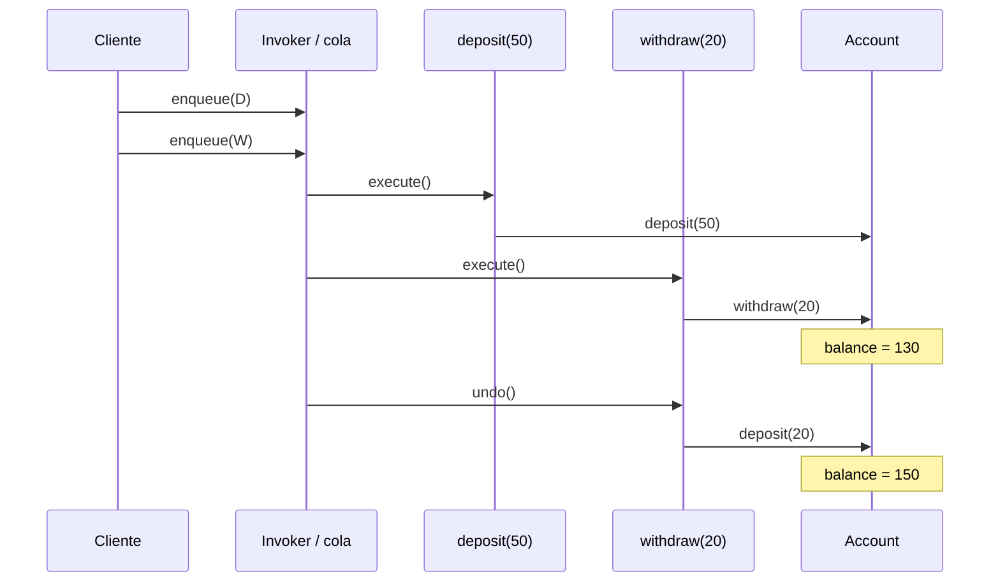

# Command

> **Familia:** Behavioral  
> **Intención:** encapsular una solicitud o acción como un valor autónomo para desacoplar quién la solicita de quién la ejecuta y permitir tratarla como dato cuando se necesita encolar, registrar, parametrizar o deshacer.  
> **Estado:** `validated`  
> **Implementaciones de lenguaje:** `49/49`  
> **Cobertura de pruebas:** N/A — los ejemplos son artefactos standalone políglotas; compile/analyze/runtime por ecosistema aporta una señal más fuerte que un porcentaje agregado sintético.  
> **Mapa:** [Volver al catálogo y mapa de relaciones](README.md)

## En una frase

Command convierte una operación en algo que puede guardarse, pasarse, ordenarse y ejecutarse después sin que el invocador conozca cómo se realiza.

## El problema

Un sistema administrativo permite depositar y retirar saldo. La interfaz que recibe la intención del usuario no debería contener la lógica de cada operación ni necesitar una rama nueva cada vez que aparece otra acción. Además, algunas operaciones deben poder ponerse en cola, auditarse, repetirse o revertirse.

Una llamada directa como `account.withdraw(20)` es suficiente cuando no existe esa presión. El problema aparece cuando la **operación misma necesita identidad y ciclo de vida**: debe viajar por una cola, conservar parámetros, registrarse antes de ejecutarse, dispararse desde distintos invocadores o formar parte de un historial.

## Fuerzas que compiten

- El invocador no debería conocer la implementación concreta que modifica al receptor.
- La solicitud necesita conservar sus parámetros hasta el momento de ejecución.
- Distintos tipos de operación deben poder recorrer la misma cola, historial o mecanismo de despacho.
- El orden de ejecución puede ser comportamiento observable y debe permanecer explícito.
- Algunas operaciones admiten `undo`, pero otras son irreversibles o requieren compensación en vez de una inversión exacta.
- Encapsular cada llamada trivial como Command agrega objetos, datos o funciones que no se justifican si la operación nunca necesita tratarse como valor.

## La solución

Representar cada solicitud como un **Command** que contiene la información necesaria para ejecutar una intención. Un **Invoker** decide cuándo ejecutarla, pero no implementa la operación. El **Receiver** o handler conoce el trabajo real. Una cola o historial puede conservar comandos porque la solicitud ya no es sólo una llamada efímera: tiene una representación propia.

La intención no depende de clases. Un Command puede ser un objeto, record, closure, mensaje, estructura con function handles, discriminated union, tabla de datos o cualquier representación que conserve la operación y sus parámetros para que un invocador común pueda ejecutarla después.

## Participantes y responsabilidades

| Participante | Responsabilidad |
|---|---|
| `Command` | Representa una solicitud ejecutable y conserva sus parámetros. |
| `ConcreteCommand` | Vincula una intención concreta con la operación necesaria para cumplirla. |
| `Invoker` | Decide cuándo ejecutar, encolar, registrar o repetir un Command sin implementar su lógica de negocio. |
| `Receiver` / handler | Conoce cómo producir el cambio real solicitado por el Command. |
| Cola / historial | Opcionalmente conserva Commands para ejecución diferida, auditoría, retry o undo. |

## Cómo funciona

1. El cliente crea dos operaciones: `deposit(50)` y `withdraw(20)`.
2. El invocador las conserva en una cola sin ejecutar todavía ninguna lógica del receptor.
3. Al recorrer la cola, cada Command usa su operación asociada contra la misma cuenta.
4. El saldo pasa de `100` a `150` y después a `130`; el orden forma parte del resultado.
5. El historial conserva el último Command y su semántica de reversión.
6. Al deshacer `withdraw(20)`, se aplica su operación inversa y el saldo vuelve a `150`.

## Diagrama



Lo importante no es la forma de clase, sino que el invocador manipula solicitudes como valores y la cuenta recibe el trabajo sólo cuando el Command se ejecuta.

## Ejemplo mínimo

```text
queue = [deposit(50), withdraw(20)]

execute(queue)
=> balance=130

undo(last(queue))
=> balance=150
```

El invocador conserva y recorre ambas operaciones mediante el mismo mecanismo. No necesita conocer cómo depositar o retirar.

## Aplicación real

### Operaciones administrativas encoladas y auditables

Un backoffice puede recibir operaciones heterogéneas —crear una entidad, recalcular un documento, enviar una notificación o ejecutar una corrección— y representarlas como Commands antes de despacharlas. Esto separa captura de intención y ejecución, permite registrar qué se pidió y habilita políticas comunes de retry, autorización o telemetría.

Si la llamada se ejecuta inmediatamente, nunca se almacena ni se trata de forma uniforme y el emisor conoce naturalmente al receptor, una llamada directa suele ser más clara. Command gana valor cuando la operación necesita viajar o adquirir ciclo de vida propio.

## En Genkidama

Genkidama usa Command deliberadamente en su capa de aplicación. [`IGenkidamaCommand<TResponse>`](../src/Genkidama.Application/IGenkidamaCommand.cs) marca una solicitud que cambia estado; [`IGenkidamaCommandHandler<TCommand, TResponse>`](../src/Genkidama.Application/IGenkidamaCommandHandler.cs) separa la ejecución concreta; y [`GenkidamaCommandDispatcher`](../src/Genkidama.Application/GenkidamaCommandDispatcher.cs) envía el Command al handler a través del pipeline sin implementar la operación de negocio.

[`GenkidamaCommandDispatcherTests`](../tests/Genkidama.Application.Tests/GenkidamaCommandDispatcherTests.cs) verifica ese contrato con `CreateThing`: el dispatcher recibe el Command y el handler produce `created:demo`. Esta es arquitectura existente; el catálogo no introduce infraestructura artificial para exhibir el patrón.

## Cuándo usarlo

- Una solicitud debe encolarse, diferirse, registrarse o transportarse antes de ejecutar.
- Varios tipos de operación deben pasar por un invocador, dispatcher o historial uniforme.
- El emisor debe desacoplarse de la implementación concreta que realiza el cambio.
- Se necesita retry, macro-commands, auditoría o una semántica explícita de undo/compensación.
- Los parámetros de la operación deben sobrevivir como parte de una solicitud identificable.

## Cuándo no usarlo

- Una llamada directa expresa completamente la intención y no existe necesidad de tratarla como dato.
- Crear un Command por cada método sólo añade ceremonia sin cola, despacho, historial u otra presión real.
- La operación es irreversible y el diseño pretende vender un `undo` ficticio en lugar de una compensación explícita.
- Lo que varía es únicamente el algoritmo seleccionado para una tarea estable; [Strategy](Strategy.md) suele comunicar mejor esa fuerza.
- Sólo se necesita encadenar posibles receptores hasta que uno atienda; considera [Chain of Responsibility](ChainOfResponsibility.md).

## Consecuencias y trade-offs

| A favor | Costo / riesgo |
|---|---|
| Desacopla invocador y ejecución concreta. | Introduce una representación adicional para cada tipo de solicitud. |
| Permite colas, historial, logging y ejecución diferida. | Versionar Commands persistidos puede convertirse en un contrato de datos de larga vida. |
| Hace explícitos los parámetros y el orden de operaciones. | Un Command mal diseñado puede terminar cargando demasiada lógica de dominio. |
| Puede habilitar undo, retry y macro-commands. | Undo no siempre es posible; los efectos externos suelen requerir compensación e idempotencia. |
| Permite aplicar políticas comunes alrededor del despacho. | El flujo real puede volverse menos obvio si hay demasiadas capas de dispatcher/pipeline. |

## Patrones relacionados

[Consulta también el mapa global de relaciones](README.md#relationship-map).

| Patrón | Relación | Por qué importa |
|---|---|---|
| [Chain of Responsibility](ChainOfResponsibility.md) | collaborates with | Un Command puede recorrer una cadena de handlers sin que el emisor seleccione el receptor final. |
| [Memento](Memento.md) | often implemented with | Un Command puede usar un Memento cuando undo requiere restaurar estado y una operación inversa no es suficiente. |
| [Strategy](Strategy.md) | often confused with | Strategy encapsula un algoritmo intercambiable; Command encapsula una solicitud/acción que puede adquirir ciclo de vida propio. |
| [Composite](Composite.md) | often implemented with | Un macro-command puede componer varios Commands y tratarlos como una sola operación. |

## Errores comunes y confusiones

### Llamar `Command` a un DTO sin comportamiento de despacho

Tener un objeto llamado `CreateOrderCommand` no demuestra el patrón por sí solo. Debe existir una razón para reificar la solicitud y un mecanismo que desacople su invocación de la ejecución concreta.

### Meter todo el dominio dentro del Command

El Command conserva intención y parámetros; no obliga a duplicar las reglas del receptor. En arquitecturas con handlers, éste puede coordinar el caso de uso mientras entidades y servicios de dominio siguen siendo responsables de sus invariantes.

### Confundir Command con Strategy

Ambos pueden usar una interfaz común, pero responden a preguntas distintas. Strategy decide **cómo** realizar una tarea; Command representa **qué solicitud debe ejecutarse** y permite conservarla o despacharla después.

### Prometer undo donde sólo existe compensación

Un retiro en memoria puede revertirse exactamente. Un correo enviado o un pago externo no puede “des-enviarse”. En esos casos el Command debe exponer idempotencia, compensación o una política de error realista en lugar de fingir reversibilidad.

## Cómo comprobar una implementación

- La solicitud puede crearse y conservarse antes de ejecutar el cambio real.
- El mismo invocador puede ejecutar al menos dos Commands concretos sin conocer la implementación de sus receptores.
- Los parámetros capturados por el Command llegan sin alterarse a la ejecución.
- Cambiar el orden de Commands en una cola produce el orden de efectos esperado y verificable.
- Si se ofrece undo, retry o compensación, su semántica es explícita y se comprueba como comportamiento; no se infiere sólo por nombres de métodos.

## Implementaciones por lenguaje

Universo actual: **51 targets**. Command clasifica **49 Applicable** y **2 N/A**. HTML y CSS no poseen por sí mismos un modelo de ejecución capaz de encapsular una solicitud como valor y despacharla hacia un receptor. SQL declarativo permanece Applicable porque una solicitud puede reificarse como datos relacionales y ser interpretada por un mecanismo de despacho sin depender de clases.

Los 49 targets Applicable tienen un artefacto canónico individual y evidencia ejecutada proporcional al ecosistema. Los workflows/ledgers de sweep sólo orquestan o documentan esas fuentes; no las sustituyen.

| Lenguaje / target | Aplicabilidad | Ejemplo verificado | Validación | Nota |
|---|---|---|---|---|
| C# | Applicable | [`Command.cs`](../src/Enterprise/C%23/patterns/Command.cs) | medium-high cohort .NET gate ✅ | objeto/record + handler/dispatcher |
| TypeScript | Applicable | [`command.ts`](../src/Web/TypeScriptTS/patterns/command.ts) | medium-high cohort Node gate ✅ | objeto o closure ejecutable |
| Python | Applicable | [`command.py`](../src/Scripting/PythonPY/patterns/command.py) | Python target gate ✅ | callable/objeto + invoker |
| C++ | Applicable | [`command.cpp`](../src/Systems/C%2B%2B/patterns/command.cpp) | portable-functional native gate ✅ | value/function + execute |
| Java | Applicable | [`command.java`](../src/Enterprise/Java/patterns/command.java) | portable-functional JVM gate ✅ | command value + receiver |
| Rust | Applicable | [`command.rs`](../src/Systems/Rust/patterns/command.rs) | portable-functional native gate ✅ | funciones/enum/trait + dispatcher |
| Go | Applicable | [`command.go`](../src/Systems/Go/patterns/command.go) | high-overhead native gate ✅ | funciones + dispatcher |
| PHP | Applicable | [`command.php`](../src/Scripting/PHP/patterns/command.php) | PHP target gate ✅ | objeto/callable + invoker |
| F# | Applicable | [`Command.fsx`](../src/Functional/F%23/patterns/Command.fsx) | medium-high cohort .NET gate ✅ | discriminated union/función |
| JavaScript | Applicable | [`command.js`](../src/Web/JavaScriptJS/patterns/command.js) | JavaScript target gate ✅ | objeto/closure + cola |
| SQL declarativo | Applicable | [`command.sql`](../src/Data/SQL/command.sql) | Command final SQLite runtime ✅ | solicitud reificada como fila + despacho |
| Kotlin | Applicable | [`Command.kt`](../src/Enterprise/Kotlin/patterns/Command.kt) | medium-high cohort JVM gate ✅ | sealed command + handler |
| Swift | Applicable | [`Command.swift`](../src/Systems/Swift/patterns/Command.swift) | medium-high cohort Swift gate ✅ | enum/protocol + executor |
| Visual Basic .NET | Applicable | [`Command.vb`](../src/Enterprise/VB.NET/patterns/Command.vb) | medium-high cohort .NET gate ✅ | interface + handler |
| C | Applicable | [`command.c`](../src/Systems/C/patterns/command.c) | portable-functional native gate ✅ | struct/function pointer |
| Ruby | Applicable | [`command.rb`](../src/Scripting/Ruby/patterns/command.rb) | Ruby target gate ✅ | objeto/Proc + invoker |
| Lua | Applicable | [`command.lua`](../src/Scripting/Lua/patterns/command.lua) | Lua target gate ✅ | tabla + función |
| Bash | Applicable | [`command.sh`](../src/Scripting/Bash/patterns/command.sh) | Bash target gate ✅ | datos + función de despacho |
| PowerShell | Applicable | [`command.ps1`](../src/Scripting/PowerShell/patterns/command.ps1) | portable-functional PowerShell gate ✅ | objeto/scriptblock + dispatcher |
| Haskell | Applicable | [`Command.hs`](../src/Functional/Haskell/patterns/Command.hs) | high-overhead GHC gate ✅ | ADT + interpreter |
| Perl | Applicable | [`command.pl`](../src/Scripting/Perl/command.pl) | Command final `perl -c` + runtime ✅ | hash/coderef + invoker |
| Pascal | Applicable | [`command_pattern.pas`](../src/Systems/Pascal/command_pattern.pas) | medium-high GNU cohort gate ✅ | record/object + execute |
| R | Applicable | [`command.R`](../src/DataScience/R/patterns/command.R) | portable-functional R gate ✅ | lista/closure + executor |
| GNU Octave | Applicable | [`command.m`](../src/DataScience/Octave/patterns/command.m) | portable-functional Octave gate ✅ | struct + function handle |
| OCaml | Applicable | [`command.ml`](../src/Functional/OCaml/patterns/command.ml) | portable-functional OCaml gate ✅ | variant + evaluator |
| Common Lisp | Applicable | [`command.lisp`](../src/Functional/CommonLisp/patterns/command.lisp) | portable-functional SBCL gate ✅ | struct/list + function |
| Scala | Applicable | [`Command.scala`](../src/Functional/Scala/patterns/Command.scala) | medium-high cohort JVM gate ✅ | case class/ADT + handler |
| Julia | Applicable | [`command.jl`](../src/DataScience/Julia/patterns/command.jl) | high-overhead Julia gate ✅ | struct + callable/dispatch |
| Clojure | Applicable | [`command.clj`](../src/Functional/Clojure/patterns/command.clj) | medium-high cohort JVM gate ✅ | map + function/dispatch |
| Elixir | Applicable | [`command.exs`](../src/Functional/Elixir/patterns/command.exs) | portable-functional Elixir gate ✅ | struct/tuple + dispatcher |
| Erlang | Applicable | [`command.erl`](../src/Functional/Erlang/patterns/command.erl) | portable-functional Erlang gate ✅ | tuple/message + executor |
| Prolog | Applicable | [`command.pl`](../src/Functional/Prolog/patterns/command.pl) | portable-functional SWI-Prolog gate ✅ | term + dispatch predicate |
| Groovy | Applicable | [`command.groovy`](../src/Functional/Groovy/patterns/command.groovy) | portable-functional Groovy gate ✅ | closure + invoker |
| Ada | Applicable | [`command_pattern.adb`](../src/Systems/Ada/command_pattern.adb) | medium-high GNU cohort gate ✅ | tagged/record command + procedure |
| Solidity | Applicable | [`Command.sol`](../src/Niche/Solidity/patterns/Command.sol) | medium-high Node/Solidity gate ✅ | encoded operation + dispatcher contract |
| Fortran | Applicable | [`command.f90`](../src/Systems/Fortran/patterns/command.f90) | medium-high GNU cohort gate ✅ | derived type + procedure dispatch |
| Objective-C | Applicable | [`command.m`](../src/Systems/Objective-C/patterns/command.m) | high-overhead Clang/GNUstep gate ✅ | object/protocol + receiver |
| Zig | Applicable | [`command.zig`](../src/Systems/Zig/patterns/command.zig) | high-overhead Zig gate ✅ | tagged union/struct + function |
| Nim | Applicable | [`command_example.nim`](../src/Niche/Nim/patterns/command_example.nim) | medium-high Nim gate ✅ | object/ref + proc |
| Dart | Applicable | [`command.dart`](../src/Web/Dart/patterns/command.dart) | high-overhead Dart gate ✅ | class/closure + invoker |
| Crystal | Applicable | [`command.cr`](../src/Niche/Crystal/patterns/command.cr) | high-overhead Crystal gate ✅ | object/proc + dispatcher |
| COBOL | Applicable | [`command_pattern.cpy`](../src/Historical/Cobol/patterns/command_pattern.cpy) | medium-high GNU/COBOL gate ✅ | command record + paragraph dispatch |
| VBA | Applicable | [`CommandExample.bas`](../src/Shell/VBA/CommandExample.bas) | Command final source contract ✅ | datos + procedure dispatcher; Office/VBA no disponible en hosted Linux |
| GDScript | Applicable | [`command.gd`](../src/Niche/GDScript/command.gd) | Command final Godot 4.6.3 runtime ✅ | object/Callable + queue |
| Assembly | Applicable | [`command.asm`](../src/LowLevel/Assembly/command.asm) | Command final NASM + ld + runtime ✅ | opcode/data record + dispatcher explícito |
| Delphi | Applicable | [`CommandExample.pas`](../src/Enterprise/Delphi/CommandExample.pas) | Command final source contract ✅ | interface/object + execute; DCC no disponible en hosted Linux |
| MicroPython | Applicable | [`command.py`](../src/Other/MicroPython/command.py) | Command final MicroPython 1.28.0 runtime ✅ | callable/object + queue |
| Rockstar | Applicable | [`command.rock`](../src/Other/Rockstar/command.rock) | Command final Rockstar v2.0.31 runtime ✅ | datos de operación + función de despacho |
| MATLAB | Applicable | [`command.m`](../src/DataScience/MATLAB/command.m) | native MATLAB Actions gate ✅ | structs + function handles + cola + undo |
| HTML | N/A | — | — | markup declarativo sin modelo de ejecución para encapsular o despachar acciones |
| CSS | N/A | — | — | reglas declarativas de estilo sin solicitudes ejecutables ni invocador/receiver |

## Comprueba que lo entendiste

1. Si una interfaz llama directamente a `account.withdraw(20)` y nunca necesita encolar, registrar ni diferir esa acción, ¿qué presión faltaría para justificar Command?
2. ¿Por qué Strategy y Command pueden verse estructuralmente similares aunque Strategy encapsule un algoritmo y Command encapsule una solicitud?
3. Si un Command dispara un pago externo irreversible, ¿por qué una operación `undo()` local puede ser una promesa incorrecta y qué alternativa de diseño esperarías?

## Resumen

- Command reifica una solicitud para que pueda manipularse independientemente de su ejecución.
- Invoker y receiver quedan desacoplados, pero se paga con una representación y un flujo adicionales.
- Colas, historial, auditoría, retry y undo/compensación son presiones típicas; no requisitos que deban fingirse en todos los casos.
- Chain of Responsibility puede enrutar Commands; Memento puede ayudar a restaurar estado; Strategy se distingue por encapsular el algoritmo y no la solicitud.
- La intención es portable a paradigmas sin clases mediante records, mensajes, closures, function handles, ADTs o datos interpretables.

## Referencias

- Gamma, Helm, Johnson y Vlissides, *Design Patterns: Elements of Reusable Object-Oriented Software*.
- [Patterns as Living Examples](../docs/philosophy/001-patterns-as-living-examples.md).
- [KB-006 — Canonical Design Pattern Authoring Standard](../docs/kb/catalog/pattern-authoring-standard.md).
