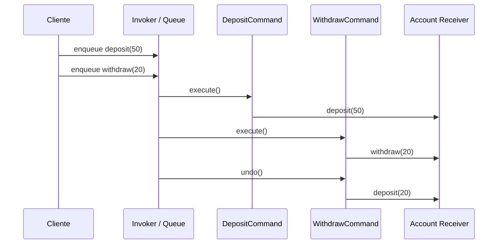

# Command

> **Familia:** Behavioral  
> **Intención:** encapsular una solicitud como un valor ejecutable para desacoplar quién pide una acción de quién la realiza y permitir almacenarla, ordenarla, diferirla, registrarla o revertirla.  
> **Estado:** `in-progress`  
> **Implementaciones de lenguaje:** `1/49`  
> **Cobertura de pruebas:** N/A — ejemplo standalone multi-ecosistema; la evidencia de este incremento es ejecución conductual nativa de MATLAB, no un porcentaje agregado inventado.  
> **Mapa:** [Volver al catálogo y mapa de relaciones](README.md)

## En una frase

Command convierte una acción y sus datos en una unidad explícita que puede viajar, esperar y ejecutarse sin que el invocador conozca al receptor concreto.

## El problema

Una aplicación necesita aceptar operaciones sobre una cuenta, encolarlas y ejecutarlas después. Si la interfaz llama directamente a `deposit` o `withdraw`, la intención queda pegada al momento y al lugar de la llamada: no hay un objeto o valor que represente «depositar 50» para poder guardarlo, auditarlo, reordenarlo o revertirlo.

## Fuerzas que compiten

- El invocador debe solicitar una acción sin depender de la implementación concreta que la ejecuta.
- La solicitud necesita convertirse en datos manipulables para poder encolarse, diferirse o registrarse.
- El receptor debe conservar la lógica de negocio; el comando no debería duplicarla.
- Algunas operaciones necesitan historial, retry o undo, pero no todas justifican esa complejidad.
- Encapsular cada operación añade tipos, valores o funciones adicionales que serían ruido cuando una llamada directa basta.

## La solución

Representar cada solicitud mediante un **Command** que conserva los parámetros necesarios y una forma de ejecutarse contra su **Receiver**. Un **Invoker** trabaja con comandos en lugar de conocer las operaciones concretas. Cuando se requiere undo, el comando conserva o conoce la operación inversa o el estado necesario para restaurar el resultado.

La intención no depende de clases. Records con closures, ADTs, mensajes, tablas de funciones, structs con function pointers o filas que describen operaciones pueden ser Command si la solicitud se vuelve una unidad explícita desacoplada del emisor.

## Participantes y responsabilidades

| Participante | Responsabilidad |
|---|---|
| `Command` | Encapsula la solicitud y los datos necesarios para ejecutarla. |
| `ConcreteCommand` | Define una operación concreta y cómo delega en el receptor. |
| `Receiver` | Contiene la lógica que realmente realiza el trabajo. |
| `Invoker` | Recibe, almacena, ordena o dispara comandos sin conocer su implementación concreta. |
| Cliente | Crea/configura el comando y conecta invocador con receptor. |

## Cómo funciona

1. El cliente crea `deposit(50)` y `withdraw(20)` como valores Command.
2. El invocador los agrega a una cola sin ejecutar todavía la lógica de cuenta.
3. Al procesar la cola, cada comando delega en la operación correspondiente del receptor.
4. La cuenta termina en 130 después de ejecutar ambos comandos desde un saldo inicial de 100.
5. El último comando se revierte y el saldo regresa a 150, demostrando que la solicitud puede conservar comportamiento adicional además de su ejecución inicial.

## Diagrama



La propiedad importante no es la forma de clase: el invocador manipula solicitudes explícitas y puede decidir cuándo ejecutarlas o revertirlas sin conocer los detalles internos del receptor.

## Ejemplo mínimo

```text
queue = [deposit(50), withdraw(20)]
execute(queue)
=> balance=130
undo(withdraw(20))
=> balance=150
```

La cola contiene solicitudes, no llamadas ya consumadas. Esa separación temporal y estructural es la evidencia central de Command.

## Aplicación real

### Colas, historial y operaciones de UI

Editores, herramientas de automatización y sistemas de trabajo pueden encapsular acciones como comandos para encolarlas, auditarlas, reintentarlas o revertirlas. Esto permite que botones, menús, schedulers o brokers trabajen con una interfaz uniforme sin acoplarse a cada receptor.

Si la acción sólo se ejecuta una vez, inmediatamente, y no necesita tratarse como dato, una llamada directa suele ser más clara. Si lo que varía es el algoritmo elegido para resolver una operación estable, [Strategy](Strategy.md) describe mejor la fuerza.

## En Genkidama

Genkidama sí usa deliberadamente esta idea en su capa de aplicación. [`IGenkidamaCommand<TResponse>`](../src/Genkidama.Application/IGenkidamaCommand.cs) marca solicitudes que cambian estado; [`IGenkidamaCommandHandler<TCommand, TResponse>`](../src/Genkidama.Application/IGenkidamaCommandHandler.cs) define el receptor/manejador; y [`GenkidamaCommandDispatcher`](../src/Genkidama.Application/GenkidamaCommandDispatcher.cs) despacha la solicitud a través del pipeline. [`GenkidamaCommandDispatcherTests`](../tests/Genkidama.Application.Tests/GenkidamaCommandDispatcherTests.cs) verifica que un comando concreto llegue a su handler y produzca el resultado esperado.

La implementación productiva no se altera para exhibir el patrón; esta página documenta una separación que ya existe.

## Cuándo usarlo

- La solicitud debe almacenarse, encolarse, diferirse, auditarse o transportarse.
- El emisor no debería conocer al receptor concreto ni los detalles de ejecución.
- Se necesita historial, retry, macro-comandos o undo/redo.
- Varias fuentes de entrada deben disparar operaciones mediante un contrato uniforme.

## Cuándo no usarlo

- Una llamada directa expresa toda la intención y no existe necesidad de tratar la solicitud como dato.
- Se crean decenas de tipos sin ganar desacoplamiento, historial, scheduling o composición reales.
- Lo único que cambia es el algoritmo interno de una misma operación; considera Strategy.
- Se necesita encadenar posibles receptores hasta que uno acepte una solicitud; considera [Chain of Responsibility](ChainOfResponsibility.md).

## Consecuencias y trade-offs

| A favor | Costo / riesgo |
|---|---|
| Desacopla invocador y receptor. | Introduce una capa adicional de abstracción. |
| Permite cola, scheduling, logging y replay. | Persistir comandos exige pensar en versión y compatibilidad de datos. |
| Facilita macro-comandos y composición. | Orden y duplicación pueden convertirse en semántica de negocio difícil de auditar. |
| Puede habilitar undo/redo. | Undo correcto puede requerir capturar estado o compensaciones complejas. |

## Patrones relacionados

[Consulta también el mapa global de relaciones](README.md#relationship-map).

| Patrón | Relación | Por qué importa |
|---|---|---|
| [Memento](Memento.md) | collaborates with | Puede conservar estado para implementar undo cuando una operación inversa no basta. |
| [Chain of Responsibility](ChainOfResponsibility.md) | collaborates with | Una solicitud encapsulada como Command puede recorrer una cadena de handlers. |
| [Composite](Composite.md) | often implemented with | Un macro-command puede agrupar comandos individuales y tratarlos como una unidad. |
| [Strategy](Strategy.md) | often confused with | Strategy representa una política/algoritmo seleccionable; Command representa una solicitud ejecutable como dato. |

## Errores comunes y confusiones

### Confundir cualquier método `Execute` con Command

Un nombre no crea el patrón. Debe existir una solicitud explícita que el invocador pueda manipular independientemente del receptor; envolver una única llamada sin obtener desacoplamiento o semántica de cola sólo añade ceremonia.

### Undo ficticio

No toda operación es reversible. Un Command no debe prometer undo cuando los efectos externos requieren compensación, idempotencia o aceptación explícita de pérdida.

## Cómo comprobar una implementación

- El invocador puede recibir o almacenar la solicitud sin conocer la operación concreta del receptor.
- Dos comandos diferentes pueden ejecutarse mediante el mismo mecanismo de invocación.
- Los parámetros de la solicitud sobreviven hasta el momento real de ejecución.
- Si se declara undo, revertir un comando produce un cambio observable correcto y no sólo modifica metadata.
- Reordenar una cola cambia el orden de efectos de forma explícita y comprobable.

## Implementaciones por lenguaje

Universo actual: **51 targets**. Command clasifica **49 Applicable** y **2 N/A**. La clasificación es conservadora: cuando una solicitud puede convertirse en un valor, mensaje, closure, record, tabla de funciones, estructura o instrucción explícita, el patrón sigue siendo significativo aunque el lenguaje no tenga clases.

Este primer pase del experimento MATLAB-first materializa y verifica **1 de 49** targets Applicable. Las demás filas Applicable permanecen deliberadamente sin enlace hasta que exista un ejemplo real y verificado; por ello el patrón sigue `in-progress`.

| Lenguaje / target | Aplicabilidad | Ejemplo verificado | Validación | Nota |
|---|---|---|---|---|
| C# | Applicable | — | pendiente | records/interfaces/handlers |
| TypeScript | Applicable | — | pendiente | objetos o closures ejecutables |
| Python | Applicable | — | pendiente | objetos/closures como solicitudes |
| C++ | Applicable | — | pendiente | structs/classes + callable receiver |
| Java | Applicable | — | pendiente | interface + command objects |
| Rust | Applicable | — | pendiente | enums/traits/closures |
| Go | Applicable | — | pendiente | structs + funcs/interfaces |
| PHP | Applicable | — | pendiente | objetos/closures |
| F# | Applicable | — | pendiente | DU/records/functions |
| JavaScript | Applicable | — | pendiente | objetos/closures |
| SQL declarativo | Applicable | — | pendiente | filas/operaciones explícitas ejecutadas por un dispatcher transaccional |
| Kotlin | Applicable | — | pendiente | sealed types/functions |
| Swift | Applicable | — | pendiente | enums/protocols/closures |
| Visual Basic .NET | Applicable | — | pendiente | interfaces/classes/delegates |
| C | Applicable | — | pendiente | structs + function pointers |
| Ruby | Applicable | — | pendiente | objetos/procs |
| Lua | Applicable | — | pendiente | tables + functions |
| Bash | Applicable | — | pendiente | arrays/functions describiendo solicitudes |
| PowerShell | Applicable | — | pendiente | objects/scriptblocks |
| Haskell | Applicable | — | pendiente | ADT + interpreter |
| Perl | Applicable | — | pendiente | hashes/coderefs |
| Pascal | Applicable | — | pendiente | records/procedural variables/classes |
| R | Applicable | — | pendiente | lists/closures |
| GNU Octave | Applicable | — | pendiente | structs + function handles |
| OCaml | Applicable | — | pendiente | variants/records/functions |
| Common Lisp | Applicable | — | pendiente | lists/structs/functions |
| Scala | Applicable | — | pendiente | case classes/traits/functions |
| Julia | Applicable | — | pendiente | structs/functions/multiple dispatch |
| Clojure | Applicable | — | pendiente | maps/functions/protocols |
| Elixir | Applicable | — | pendiente | structs/messages/functions |
| Erlang | Applicable | — | pendiente | tuples/messages/functions |
| Prolog | Applicable | — | pendiente | terms + dispatcher predicates |
| Groovy | Applicable | — | pendiente | objects/closures |
| Ada | Applicable | — | pendiente | tagged/record types + procedures |
| Solidity | Applicable | — | pendiente | encoded actions + dispatcher contract/functions |
| Fortran | Applicable | — | pendiente | derived types + procedure dispatch |
| Objective-C | Applicable | — | pendiente | protocol/blocks/objects |
| Zig | Applicable | — | pendiente | structs + function pointers |
| Nim | Applicable | — | pendiente | objects/procs/closures |
| Dart | Applicable | — | pendiente | classes/functions |
| Crystal | Applicable | — | pendiente | classes/procs |
| COBOL | Applicable | — | pendiente | records + paragraphs/dispatcher |
| VBA | Applicable | — | pendiente | class modules/records + procedures |
| GDScript | Applicable | — | pendiente | resources/objects/Callables |
| Assembly | Applicable | — | pendiente | explicit opcode/data records + dispatch table |
| Delphi | Applicable | — | pendiente | interfaces/classes/procedural types |
| MicroPython | Applicable | — | pendiente | objects/closures |
| Rockstar | Applicable | — | pendiente | data/functions can encode deferred requests |
| MATLAB | Applicable | [`command.m`](../src/DataScience/MATLAB/command.m) | Pattern Command MATLAB ✅ | structs + function handles; queue + execute + undo |
| HTML | N/A | — | — | markup no ejecutable: por sí solo no puede encapsular y disparar una solicitud con semántica de ejecución |
| CSS | N/A | — | — | reglas de estilo declarativas sin mecanismo general para representar y ejecutar comandos de aplicación |

## Comprueba que lo entendiste

1. Si un botón llama directamente a `save()` y nunca se necesita cola, historial ni desacoplamiento del receptor, ¿qué valor real añadiría convertir esa llamada en Command?
2. ¿Por qué una lista de funciones puede ser una implementación válida de Command aunque no haya una interfaz `ICommand`?
3. ¿Cuándo Memento es necesario para undo y cuándo una operación inversa explícita es suficiente?

## Resumen

- Command aparece cuando una solicitud necesita convertirse en una unidad manipulable, no sólo ejecutarse inmediatamente.
- El invocador queda desacoplado del receptor y puede encolar, ordenar, registrar o diferir solicitudes.
- Undo es una capacidad posible, no una obligación; puede requerir Memento o compensación.
- Strategy elige cómo hacer algo; Command representa qué acción ejecutar.
- La intención se expresa en paradigmas muy distintos sin exigir clases.

## Referencias

- Gamma, Helm, Johnson y Vlissides, *Design Patterns: Elements of Reusable Object-Oriented Software*.
- [Patterns as Living Examples](../docs/philosophy/001-patterns-as-living-examples.md).
- [KB-006 — Canonical Design Pattern Authoring Standard](../docs/kb/catalog/pattern-authoring-standard.md).
