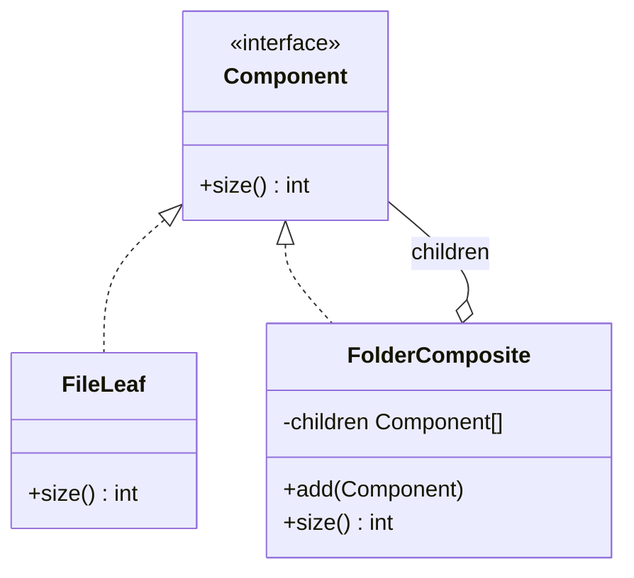

# Composite

> **Familia:** Structural  
> **Intención:** componer objetos en estructuras árbol para que clientes puedan tratar hojas y grupos mediante el mismo contrato.  
> **Estado:** `in-progress`  
> **Implementaciones de lenguaje:** `0/48`  
> **Cobertura de pruebas:** N/A — los ejemplos standalone se validan con evidencia proporcional por ecosistema; no existe una métrica homogénea defendible.  
> **Mapa:** [Volver al catálogo y mapa de relaciones](README.md)

## En una frase

Composite permite pedir la misma operación a un elemento individual o a un grupo de elementos sin obligar al cliente a distinguirlos.

## El problema

Una estructura jerárquica contiene elementos simples y grupos que a su vez contienen otros elementos. Si el cliente debe preguntar constantemente si está frente a una hoja o un grupo para calcular, renderizar, validar o recorrer la estructura, la lógica del árbol se dispersa en cada consumidor.

El problema no es simplemente tener una colección: es necesitar **composición recursiva** y una operación que tenga sentido tanto para una parte como para el conjunto.

## Fuerzas que compiten

- Hojas y grupos tienen distinta estructura interna, pero el cliente necesita tratarlos uniformemente.
- Un grupo debe poder contener hojas y otros grupos recursivamente.
- La operación agregada debe conservar una semántica clara al atravesar el árbol.
- Exponer mutación indiscriminada en todas las hojas puede crear APIs engañosas.
- Para una colección plana, introducir Composite añade complejidad sin beneficio.

## La solución

Definir un contrato común `Component` para la operación que comparten hojas y compuestos. Una hoja resuelve la operación directamente; un compuesto delega en sus hijos y combina sus resultados. El cliente conoce el contrato, no necesita ramificar por tipo concreto.

La gestión de hijos puede vivir sólo en el compuesto (**interfaz segura**) o también en el contrato común (**interfaz transparente**). Genkidama no declara una variante universalmente superior: la elección debe reflejar el dominio.

## Participantes y responsabilidades

| Participante | Responsabilidad |
|---|---|
| `Component` | Define la operación uniforme que el cliente puede pedir a cualquier nodo. |
| `Leaf` | Representa un elemento indivisible y resuelve la operación directamente. |
| `Composite` | Contiene hijos `Component` y combina recursivamente sus resultados. |
| Cliente | Trabaja contra `Component` sin distinguir hoja de grupo para la operación común. |

## Cómo funciona

1. El cliente obtiene un `Component`.
2. Si es una hoja, la operación devuelve su resultado local.
3. Si es un compuesto, ejecuta la misma operación sobre sus hijos.
4. El compuesto agrega los resultados y los devuelve bajo el mismo contrato.
5. La recursión permite árboles de profundidad arbitraria sin duplicar lógica en el cliente.

## Diagrama



La relación clave es recursiva: `FolderComposite` **es** un `Component` y al mismo tiempo **contiene** otros `Component`.

## Ejemplo mínimo

```text
readme = File("README", 2)
api = File("api.md", 3)
guide = File("guide.md", 5)
docs = Folder(api, guide)
root = Folder(readme, docs)

readme.size() == 2
docs.size() == 8
root.size() == 10
```

El cliente llama `size()` igual sobre una hoja y sobre dos niveles de Composite.

## Aplicación real

### Árbol de artefactos

Un generador necesita calcular costo, peso o tamaño de un árbol donde archivos son hojas y directorios o módulos son grupos. Composite permite que la operación agregada se implemente una sola vez por nodo y que nuevos niveles de agrupación no obliguen a reescribir cada consumidor.

Si el conjunto siempre es plano, una lista y una función agregadora son más simples.

## En Genkidama

Genkidama no declara actualmente un uso productivo deliberado de Composite que deba presentarse como ejemplo canónico. El catálogo mantiene el patrón como referencia educativa y no modifica arquitectura productiva para fabricarlo.

## Cuándo usarlo

- El dominio forma una jerarquía parte-todo recursiva.
- La misma operación tiene sentido sobre una hoja y sobre un grupo.
- Los clientes acumulan `if`/`switch` para distinguir elementos y contenedores.
- Nuevos niveles de agrupación deberían reutilizar la misma lógica de recorrido/agregación.

## Cuándo no usarlo

- La colección es plana y una operación de colección resuelve el problema claramente.
- Hojas y grupos no comparten una operación semánticamente honesta.
- El árbol necesita invariantes de mutación tan distintas que un contrato uniforme ocultaría errores.
- Sólo se desea reutilizar código entre objetos; composición común no implica Composite.

## Consecuencias y trade-offs

| A favor | Costo / riesgo |
|---|---|
| Simplifica clientes al unificar hojas y grupos. | Puede hacer demasiado genérico el contrato común. |
| Hace natural la composición recursiva. | La gestión de hijos requiere decidir entre interfaz segura y transparente. |
| Facilita añadir nuevos tipos de hoja o compuesto. | Restricciones sobre qué hijos son válidos pueden ser más difíciles de expresar. |
| Centraliza operaciones agregadas sobre el árbol. | Un árbol muy profundo puede requerir atención a recursión/stack según el runtime. |

## Patrones relacionados

[Consulta también el mapa global de relaciones](README.md#relationship-map).

| Patrón | Relación | Por qué importa |
|---|---|---|
| [Iterator](Iterator.md) | collaborates with | Iterator puede desacoplar el recorrido externo de una estructura Composite. |
| [Visitor](Visitor.md) | collaborates with | Visitor agrega nuevas operaciones sobre un árbol estable sin llenar cada nodo de métodos. |
| [Decorator](Decorator.md) | often confused with | Ambos comparten contratos recursivos; Decorator suele envolver un componente para añadir responsabilidad, Composite agrega varios hijos. |
| [Flyweight](Flyweight.md) | collaborates with | Árboles enormes pueden compartir estado intrínseco de hojas mediante Flyweight. |

## Errores comunes y confusiones

### Llamar Composite a cualquier objeto con hijos

Tener una colección interna no basta. El compuesto debe participar en el mismo contrato que sus elementos y la composición debe representar una relación parte-todo recursiva.

### Forzar `add/remove` en hojas

Una interfaz totalmente transparente puede obligar a las hojas a exponer operaciones que no tienen sentido. Cuando eso degrada seguridad, es preferible que sólo el compuesto administre hijos.

### Confundir Composite con Decorator

Decorator suele envolver un solo componente para modificar responsabilidad; Composite combina cero o más hijos y agrega su comportamiento como conjunto.

## Cómo comprobar una implementación

- La misma operación se invoca sobre una hoja y sobre un compuesto sin ramificar por tipo en el cliente.
- Un compuesto puede contener otro compuesto y la operación sigue funcionando recursivamente.
- El resultado agregado es observable y correcto para más de un nivel del árbol.
- El cliente no conoce tipos concretos para ejecutar la operación común.
- La validación prueba comportamiento (`2`, `8`, `10` en el escenario canónico), no nombres de clases.

## Implementaciones por lenguaje

La tabla es autoritativa para la completitud. El universo canónico mantiene **51 targets**: **48 Applicable** y **3 N/A provisionales**. Existen **22/48 ejemplos materializados** —12 mainstream y 10 portable—; ninguna fila se promueve hasta observar evidencia verde del head correspondiente.

| Lenguaje | Aplicabilidad | Ejemplo | Validación | Nota |
|---|---|---|---|---|
| C# | Applicable | [CompositeExample.cs](../src/Enterprise/C%23/CompositeExample.cs) | ⏳ pendiente | interface + lista de Component |
| TypeScript | Applicable | [composite.ts](../src/Web/TypeScriptTS/composite.ts) | ⏳ pendiente | structural contract |
| Python | Applicable | [composite.py](../src/Scripting/PythonPY/composite.py) | ⏳ pendiente | duck typing |
| C++ | Applicable | [composite.cpp](../src/Systems/C++/composite.cpp) | ⏳ pendiente | abstract base + unique ownership |
| Java | Applicable | [CompositeExample.java](../src/Enterprise/Java/CompositeExample.java) | ⏳ pendiente | interface + List<Component> |
| Rust | Applicable | [composite.rs](../src/Systems/Rust/composite.rs) | ⏳ pendiente | enum + recursive aggregation |
| Go | Applicable | [composite.go](../src/Systems/Go/composite.go) | ⏳ pendiente | implicit interface |
| PHP | Applicable | [composite.php](../src/Scripting/PHP/composite.php) | ⏳ pendiente | interface + arrays |
| Kotlin | Applicable | [CompositeExample.kt](../src/Enterprise/Kotlin/CompositeExample.kt) | ⏳ pendiente | sealed/interface composition |
| Swift | Applicable | [composite.swift](../src/Systems/Swift/composite.swift) | ⏳ pendiente | protocol + recursive nodes |
| F# | Applicable | [composite.fsx](../src/Functional/F%23/composite.fsx) | ⏳ pendiente | discriminated union + recursion |
| JavaScript | Applicable | [composite.js](../src/Web/JavaScriptJS/composite.js) | ⏳ pendiente | objects + recursive children |
| Visual Basic .NET | Applicable | [CompositeExample.vb](../src/Enterprise/VisualBasicNET/CompositeExample.vb) | ⏳ pendiente | interface + List(Of Component) |
| C | Applicable | [composite.c](../src/Systems/C/composite.c) | ⏳ pendiente | tagged node + recursive operation |
| Ruby | Applicable | [composite.rb](../src/Scripting/RubyRB/composite.rb) | ⏳ pendiente | duck typing |
| Lua | Applicable | [composite.lua](../src/Scripting/Lua/composite.lua) | ⏳ pendiente | tables + closures |
| Bash | Applicable | [composite.sh](../src/Shell/Bash/composite.sh) | ⏳ pendiente | node identifiers + recursive function |
| PowerShell | Applicable | [composite.ps1](../src/Shell/PowerShell/composite.ps1) | ⏳ pendiente | objects + captured scriptblocks |
| Haskell | Applicable | [Composite.hs](../src/Functional/Haskell/Composite.hs) | ⏳ pendiente | algebraic data type + recursion |
| Scala | Applicable | [Composite.scala](../src/Functional/Scala/Composite.scala) | ⏳ pendiente | sealed trait + recursive nodes |
| Perl | Applicable | [composite.pl](../src/Scripting/Perl/composite.pl) | ⏳ pendiente | packages + hashes |
| Pascal | Applicable | [composite.pas](../src/Historical/Pascal/composite.pas) | ⏳ pendiente | abstract component + recursive ownership |
| R | Applicable | — | ⏳ pendiente | lists + recursive function |
| GNU Octave | Applicable | — | ⏳ pendiente | structs/cells + recursion |
| Julia | Applicable | — | ⏳ pendiente | abstract type + recursive nodes |
| OCaml | Applicable | — | ⏳ pendiente | variant + recursion |
| Common Lisp | Applicable | — | ⏳ pendiente | structures/lists |
| Clojure | Applicable | — | ⏳ pendiente | persistent maps/vectors |
| Elixir | Applicable | — | ⏳ pendiente | tagged tuples/maps + recursion |
| Erlang | Applicable | — | ⏳ pendiente | tagged terms + recursion |
| Prolog | Applicable | — | ⏳ pendiente | recursive terms/predicates |
| Groovy | Applicable | — | ⏳ pendiente | objects/closures |
| Ada | Applicable | — | ⏳ pendiente | tagged/access types |
| Solidity | Applicable | — | ⏳ pendiente | contracts/struct tree |
| Fortran | Applicable | — | ⏳ pendiente | derived types + recursive allocation |
| Objective-C | Applicable | — | ⏳ pendiente | protocol + NSArray children |
| Zig | Applicable | — | ⏳ pendiente | tagged union + slices |
| Nim | Applicable | — | ⏳ pendiente | ref object variant |
| Dart | Applicable | — | ⏳ pendiente | abstract class + list |
| Crystal | Applicable | — | ⏳ pendiente | abstract class + array |
| COBOL | Applicable | — | ⏳ pendiente | records/procedures + hierarchy table |
| VBA | Applicable | — | ⏳ pendiente | class modules/Collection |
| GDScript | Applicable | — | ⏳ pendiente | objects/Array children |
| MATLAB | Applicable | — | ⏳ pendiente | structs/cells + recursion |
| Assembly | Applicable | — | ⏳ pendiente | explicit node table + aggregation |
| Delphi | Applicable | — | ⏳ pendiente | interfaces/classes |
| MicroPython | Applicable | — | ⏳ pendiente | objects/lists |
| Rockstar | Applicable | — | ⏳ pendiente | keyed arrays + recursive data |
| HTML | N/A | — | — | markup declarativo; cualquier Composite ejecutable pertenece al runtime que procesa la estructura. |
| CSS | N/A | — | — | reglas declarativas; no expresan por sí mismas una jerarquía runtime con operación uniforme parte-todo. |
| SQL | N/A | — | — | SQL declarativo puede consultar jerarquías, pero no representa por sí mismo objetos Component que ejecuten una operación uniforme. |

## Comprueba que lo entendiste

1. ¿Qué hace que una colección de hijos sea Composite y no simplemente una lista dentro de un objeto?
2. ¿Qué trade-off existe entre poner `add/remove` en `Component` y reservarlos para `Composite`?
3. Si sólo necesitas sumar una lista plana de tamaños, ¿por qué Composite sería sobreingeniería?

## Resumen

- **Presión:** clientes deben trabajar con partes individuales y grupos recursivos sin ramificar por tipo.
- **Movimiento:** hojas y compuestos comparten una operación; el compuesto delega y agrega recursivamente.
- **Trade-off:** clientes más simples a cambio de un contrato común y decisiones sobre mutación de hijos.
- **Relación clave:** Iterator/Visitor complementan recorridos y operaciones; Decorator comparte forma recursiva pero resuelve otra fuerza.
- **Portabilidad:** clases no son requisito; ADTs, records, closures, tagged unions, predicates o tablas pueden expresar el mismo árbol parte-todo.

## Referencias

- Gamma, Helm, Johnson y Vlissides, *Design Patterns: Elements of Reusable Object-Oriented Software* — Composite.
- [Patterns as Living Examples](../docs/philosophy/001-patterns-as-living-examples.md).
- [Canonical Design Pattern Authoring Standard](../docs/kb/catalog/pattern-authoring-standard.md).
