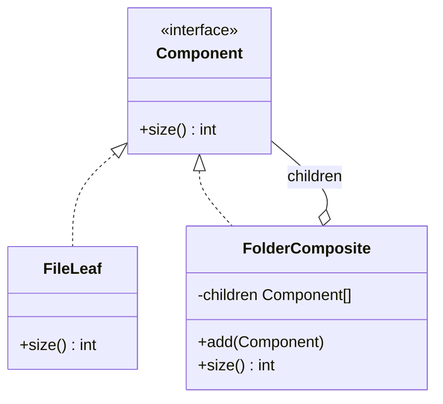

# Composite

> **Familia:** Structural  
> **Intención:** componer objetos en estructuras árbol para tratar hojas y grupos mediante el mismo contrato.  
> **Estado:** `validated`  
> **Implementaciones de lenguaje:** `48/48`  
> **Cobertura de pruebas:** N/A — los ejemplos standalone usan evidencia proporcional por ecosistema; no existe una métrica homogénea defendible.  
> **Mapa:** [Volver al catálogo y mapa de relaciones](README.md)

## En una frase

Composite permite pedir la misma operación a un elemento individual o a un grupo recursivo sin obligar al cliente a distinguirlos.

## El problema

Una jerarquía contiene elementos simples y grupos que contienen otros elementos. Si cada cliente debe preguntar si está frente a una hoja o un grupo antes de calcular, renderizar o validar, la lógica del árbol se duplica y se acopla a tipos concretos.

## Fuerzas que compiten

- Hojas y grupos tienen estructura distinta, pero necesitan una operación común.
- Los grupos deben poder contener hojas y otros grupos recursivamente.
- La agregación debe conservar una semántica clara a cualquier profundidad.
- Una API demasiado transparente puede exponer `add/remove` donde no tiene sentido.
- Para una colección plana, Composite sería ceremonia innecesaria.

## La solución

Definir un contrato `Component` compartido. Una hoja resuelve la operación directamente; un compuesto ejecuta esa misma operación sobre sus hijos y agrega los resultados. El cliente conoce `Component`, no los tipos concretos.

## Participantes y responsabilidades

| Participante | Responsabilidad |
|---|---|
| `Component` | Define la operación uniforme. |
| `Leaf` | Resuelve la operación localmente. |
| `Composite` | Contiene `Component` y agrega recursivamente. |
| Cliente | Usa el contrato común sin ramificar por tipo. |

## Cómo funciona

1. El cliente recibe un `Component`.
2. Una hoja devuelve su resultado local.
3. Un compuesto invoca la misma operación en sus hijos.
4. El compuesto agrega los resultados.
5. Otro compuesto puede aparecer como hijo sin cambiar al cliente.

## Diagrama



La relación esencial es recursiva: `FolderComposite` es un `Component` y contiene otros `Component`.

## Ejemplo mínimo

```text
readme = File(2)
docs = Folder(File(3), File(5))
root = Folder(readme, docs)

readme.size() == 2
docs.size() == 8
root.size() == 10
```

## Aplicación real

### Árbol de artefactos

Un generador puede calcular tamaño, costo o peso de un árbol de archivos y agrupaciones. La operación vive una vez por tipo de nodo y nuevos niveles de agrupación no obligan a reescribir consumidores.

## En Genkidama

Genkidama no declara actualmente un uso productivo deliberado de Composite que deba presentarse como ejemplo canónico. No se modifica arquitectura productiva para fabricarlo.

## Cuándo usarlo

- Existe una relación parte-todo recursiva.
- La misma operación tiene sentido sobre hoja y grupo.
- Los clientes acumulan `if`/`switch` por tipo de nodo.
- Nuevos niveles deberían reutilizar la misma lógica de agregación.

## Cuándo no usarlo

- La colección es plana.
- Hojas y grupos no comparten una operación semánticamente honesta.
- Las invariantes de mutación son demasiado distintas para un contrato común.
- Sólo se busca reutilización de código; composición genérica no implica Composite.

## Consecuencias y trade-offs

| A favor | Costo / riesgo |
|---|---|
| Simplifica clientes. | Puede volver demasiado genérico el contrato. |
| Hace natural la recursión. | Requiere decidir interfaz segura vs. transparente. |
| Facilita nuevos nodos. | Restricciones de hijos pueden ser más difíciles de expresar. |
| Centraliza agregación. | Árboles muy profundos pueden requerir cuidado con stack/runtime. |

## Patrones relacionados

[Consulta también el mapa global de relaciones](README.md#relationship-map).

| Patrón | Relación | Por qué importa |
|---|---|---|
| [Iterator](Iterator.md) | collaborates with | Puede desacoplar recorridos externos del árbol. |
| [Visitor](Visitor.md) | collaborates with | Añade operaciones sobre una estructura estable. |
| [Decorator](Decorator.md) | often confused with | Decorator envuelve normalmente un componente; Composite agrega varios hijos. |
| [Flyweight](Flyweight.md) | collaborates with | Árboles grandes pueden compartir estado intrínseco. |

## Errores comunes y confusiones

### Cualquier objeto con hijos no es Composite

Debe existir un contrato uniforme compartido y una relación parte-todo recursiva.

### Forzar gestión de hijos en hojas

Si `add/remove` no tiene sentido para una hoja, una interfaz segura que reserve esas operaciones al compuesto suele ser más honesta.

### Confundirlo con Decorator

Decorator agrega responsabilidad alrededor de un componente; Composite agrega resultados de múltiples hijos bajo el mismo contrato.

## Cómo comprobar una implementación

- La misma operación funciona sobre hoja y compuesto.
- Un compuesto puede contener otro compuesto.
- La agregación de más de un nivel es correcta.
- El cliente no ramifica por tipo concreto.
- La validación observa `leaf=2`, `docs=8`, `root=10`, no nombres de clases.

## Implementaciones por lenguaje

El universo canónico mantiene **51 targets**: **48 Applicable** y **3 N/A**. Los **48 Applicable tienen ejemplo real enlazado y evidencia verificada**. Los gates usan compile/run, warnings estrictos, formatters, runtimes oficiales o source-contract proporcional según el ecosistema.

| Lenguaje | Aplicabilidad | Ejemplo | Validación |
|---|---|---|---|
| C# | Applicable | [CompositeExample.cs](../src/Enterprise/C%23/CompositeExample.cs) | ✅ verificado |
| TypeScript | Applicable | [composite.ts](../src/Web/TypeScriptTS/composite.ts) | ✅ verificado |
| Python | Applicable | [composite.py](../src/Scripting/PythonPY/composite.py) | ✅ verificado |
| C++ | Applicable | [composite.cpp](../src/Systems/C++/composite.cpp) | ✅ verificado |
| Java | Applicable | [CompositeExample.java](../src/Enterprise/Java/CompositeExample.java) | ✅ verificado |
| Rust | Applicable | [composite.rs](../src/Systems/Rust/composite.rs) | ✅ verificado |
| Go | Applicable | [composite.go](../src/Systems/Go/composite.go) | ✅ verificado |
| PHP | Applicable | [composite.php](../src/Scripting/PHP/composite.php) | ✅ verificado |
| Kotlin | Applicable | [CompositeExample.kt](../src/Enterprise/Kotlin/CompositeExample.kt) | ✅ verificado |
| Swift | Applicable | [composite.swift](../src/Systems/Swift/composite.swift) | ✅ verificado |
| F# | Applicable | [composite.fsx](../src/Functional/F%23/composite.fsx) | ✅ verificado |
| JavaScript | Applicable | [composite.js](../src/Web/JavaScriptJS/composite.js) | ✅ verificado |
| Visual Basic .NET | Applicable | [CompositeExample.vb](../src/Enterprise/VisualBasic/CompositeExample.vb) | ✅ verificado |
| C | Applicable | [composite.c](../src/Systems/C/composite.c) | ✅ verificado |
| Ruby | Applicable | [composite.rb](../src/Scripting/RubyRB/composite.rb) | ✅ verificado |
| Lua | Applicable | [composite.lua](../src/Scripting/Lua/composite.lua) | ✅ verificado |
| Bash | Applicable | [composite.sh](../src/Shell/Bash/composite.sh) | ✅ verificado |
| PowerShell | Applicable | [composite.ps1](../src/Shell/PowerShell/composite.ps1) | ✅ verificado |
| Haskell | Applicable | [Composite.hs](../src/Functional/Haskell/Composite.hs) | ✅ verificado |
| Scala | Applicable | [Composite.scala](../src/Functional/Scala/Composite.scala) | ✅ verificado |
| Perl | Applicable | [composite.pl](../src/Scripting/Perl/composite.pl) | ✅ verificado |
| Pascal | Applicable | [composite.pas](../src/Historical/Pascal/composite.pas) | ✅ verificado |
| R | Applicable | [composite.R](../src/DataScience/R/composite.R) | ✅ verificado |
| GNU Octave | Applicable | [composite.m](../src/DataScience/Octave/composite.m) | ✅ verificado |
| Julia | Applicable | [composite.jl](../src/DataScience/Julia/composite.jl) | ✅ verificado |
| OCaml | Applicable | [composite.ml](../src/Functional/OCaml/composite.ml) | ✅ verificado |
| Common Lisp | Applicable | [composite.lisp](../src/Functional/Lisp/composite.lisp) | ✅ verificado |
| Clojure | Applicable | [composite.clj](../src/Functional/Clojure/composite.clj) | ✅ verificado |
| Elixir | Applicable | [composite.exs](../src/Functional/Elixir/composite.exs) | ✅ verificado |
| Erlang | Applicable | [composite.erl](../src/Functional/Erlang/composite.erl) | ✅ verificado |
| Prolog | Applicable | [composite.pl](../src/Niche/Prolog/composite.pl) | ✅ verificado |
| Groovy | Applicable | [composite.groovy](../src/Scripting/Groovy/composite.groovy) | ✅ verificado |
| Ada | Applicable | [composite.adb](../src/Historical/Ada/composite.adb) | ✅ verificado |
| Solidity | Applicable | [Composite.sol](../src/Niche/Solidity/Composite.sol) | ✅ verificado |
| Fortran | Applicable | [composite.f90](../src/Historical/Fortran/composite.f90) | ✅ verificado |
| Objective-C | Applicable | [composite.m](../src/Systems/Objective-C/composite.m) | ✅ verificado |
| Zig | Applicable | [composite.zig](../src/Systems/Zig/composite.zig) | ✅ verificado |
| Nim | Applicable | [composite.nim](../src/Niche/Nim/composite.nim) | ✅ verificado |
| Dart | Applicable | [composite.dart](../src/Web/Dart/composite.dart) | ✅ verificado |
| Crystal | Applicable | [composite.cr](../src/Niche/Crystal/composite.cr) | ✅ verificado |
| COBOL | Applicable | [composite.cbl](../src/Historical/Cobol/composite.cbl) | ✅ verificado |
| VBA | Applicable | [composite.bas](../src/Shell/VBA/composite.bas) | ✅ verificado |
| GDScript | Applicable | [composite.gd](../src/Niche/GDScript/composite.gd) | ✅ verificado |
| MATLAB | Applicable | [composite.m](../src/DataScience/MATLAB/composite.m) | ✅ verificado |
| Assembly | Applicable | [composite.asm](../src/LowLevel/Assembly/composite.asm) | ✅ verificado |
| Delphi | Applicable | [CompositeExample.pas](../src/Enterprise/Delphi/CompositeExample.pas) | ✅ verificado |
| MicroPython | Applicable | [composite.py](../src/Other/MicroPython/composite.py) | ✅ verificado |
| Rockstar | Applicable | [composite.rock](../src/Other/Rockstar/composite.rock) | ✅ verificado |
| HTML | N/A | — | markup declarativo; la operación ejecutable pertenece al runtime. |
| CSS | N/A | — | reglas declarativas; no expresan por sí mismas una operación uniforme runtime parte-todo. |
| SQL | N/A | — | SQL declarativo consulta jerarquías, pero no representa por sí mismo objetos `Component` con comportamiento uniforme. |

## Comprueba que lo entendiste

1. ¿Qué hace que una colección de hijos sea Composite y no simplemente una lista?
2. ¿Qué trade-off existe entre exponer `add/remove` en `Component` y reservarlo para `Composite`?
3. ¿Por qué una suma sobre una lista plana no justifica Composite?

## Resumen

- **Presión:** trabajar con partes y grupos recursivos sin ramificar por tipo.
- **Movimiento:** hoja y compuesto comparten operación; el compuesto agrega recursivamente.
- **Trade-off:** clientes simples a cambio de un contrato común y decisiones de mutación.
- **Relaciones:** Iterator/Visitor complementan recorridos/operaciones; Decorator se parece estructuralmente pero resuelve otra fuerza.
- **Portabilidad:** clases no son requisito; ADTs, records, closures, tagged unions, términos y tablas pueden preservar la intención.

## Referencias

- Gamma, Helm, Johnson y Vlissides, *Design Patterns: Elements of Reusable Object-Oriented Software* — Composite.
- [Patterns as Living Examples](../docs/philosophy/001-patterns-as-living-examples.md).
- [Canonical Design Pattern Authoring Standard](../docs/kb/catalog/pattern-authoring-standard.md).
