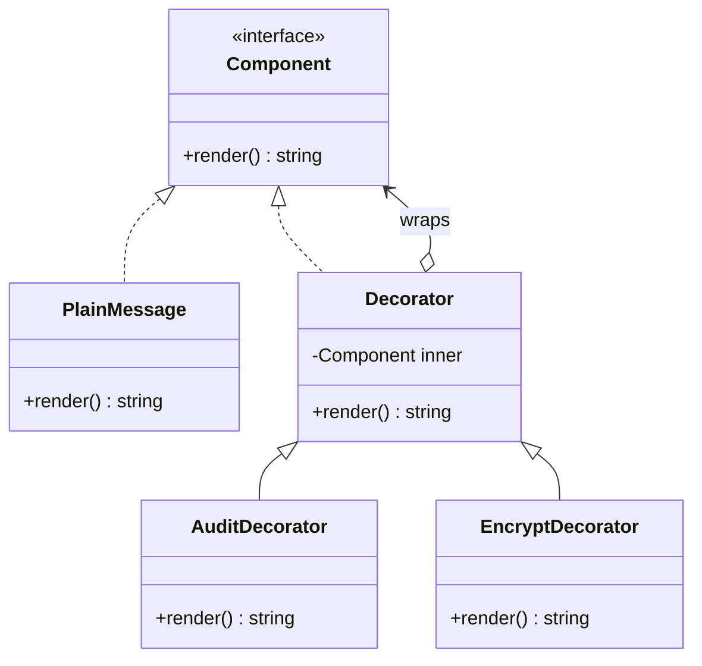

# Decorator

> **Familia:** Structural  
> **Intención:** añadir responsabilidades a un objeto de forma componible, envolviéndolo con objetos que conservan el mismo contrato observable.  
> **Estado:** `validated`  
> **Implementaciones de lenguaje:** `48/48`  
> **Cobertura de pruebas:** N/A — la completitud de lenguajes se valida por comportamiento/toolchain; no existe una métrica homogénea entre 48 ecosistemas standalone.  
> **Mapa:** [Volver al catálogo y mapa de relaciones](README.md)

## En una frase

Decorator permite apilar comportamiento alrededor de un componente sin cambiar al cliente ni crear una subclase por cada combinación de responsabilidades.

## El problema

Un componente cumple un contrato útil, pero algunos clientes necesitan capacidades adicionales —por ejemplo auditoría, compresión, caché, autorización o métricas— en combinaciones que cambian en runtime. Si cada combinación se modela con una subclase (`AuditEncryptedComponent`, `CachedAuthorizedComponent`, etc.), el número de tipos crece combinatoriamente y las responsabilidades quedan acopladas entre sí.

## Fuerzas que compiten

- El cliente debería seguir dependiendo del mismo contrato del componente.
- Las responsabilidades opcionales deben poder combinarse sin una explosión de subclases.
- El orden de los wrappers puede importar y debe ser visible en el diseño.
- Añadir demasiadas capas pequeñas puede dificultar trazabilidad, debugging y configuración.

## La solución

Definir un contrato común `Component`. El componente base implementa el comportamiento esencial. Cada Decorator preserva el mismo contrato, conserva una referencia o función delegada hacia el componente envuelto y añade responsabilidad antes o después de delegar. Como el Decorator sigue siendo consumible mediante el mismo contrato, varios wrappers pueden apilarse dinámicamente.

La intención no exige clases. En lenguajes funcionales o dinámicos puede expresarse con funciones de orden superior, closures, módulos, tablas, registros, callbacks u otros mecanismos que mantengan contrato, delegación y composición.

## Participantes y responsabilidades

| Participante | Responsabilidad |
|---|---|
| `Component` | Contrato que el cliente consume tanto para componentes base como decorados. |
| `ConcreteComponent` | Implementa el comportamiento esencial sin responsabilidades opcionales. |
| `Decorator` | Conserva o captura un componente envuelto y mantiene el mismo contrato observable. |
| `ConcreteDecorator` | Añade una responsabilidad concreta y delega al componente envuelto. |
| Cliente | Compone wrappers según las responsabilidades necesarias y usa sólo el contrato común. |

## Cómo funciona

1. El cliente crea un componente base.
2. Si necesita una responsabilidad adicional, lo envuelve con un Decorator compatible.
3. Cada Decorator conserva el mismo contrato y delega al componente envuelto.
4. Se pueden apilar varios Decorators; cada uno añade su responsabilidad en un orden explícito.
5. El cliente invoca la operación común sin conocer la implementación concreta de cada capa.

## Diagrama



La relación importante es que el wrapper **sigue siendo consumible como `Component`**. Esa sustitución permite apilar responsabilidades sin cambiar al cliente.

## Ejemplo mínimo

```text
base = PlainMessage("alert")
audited = AuditDecorator(base)
encrypted = EncryptDecorator(base)
stacked = AuditDecorator(EncryptDecorator(base))

base.render()      // alert
audited.render()   // audit(alert)
encrypted.render() // enc(alert)
stacked.render()   // audit(enc(alert))
```

El ejemplo canónico de este patrón en Genkidama usa precisamente estas cuatro observaciones:

```text
base=alert
audit=audit(alert)
encrypted=enc(alert)
stacked=audit(enc(alert))
```

La última línea demuestra composición y hace observable el orden de wrappers.

## Aplicación real

### Responsabilidades transversales combinables

Un servicio puede necesitar logging, caché, validación o autorización según el contexto. Decorator permite envolver el mismo contrato de servicio con estas responsabilidades sin que el servicio base conozca cada preocupación transversal ni crear una clase por cada combinación.

Si todas las llamadas necesitan siempre exactamente la misma política y nunca varía la combinación, una composición explícita más simple o middleware dedicado puede ser suficiente.

## En Genkidama

La filosofía del repositorio identifica **logging, caching, validation y authorization wrappers** como presión natural para Decorator. No existe todavía una ruta productiva deliberada auditada que esta página pueda señalar como implementación canónica; por ello el patrón se mantiene como ejemplo educativo y no se fuerza dentro de la arquitectura productiva.

## Cuándo usarlo

- Varias responsabilidades opcionales deben combinarse dinámicamente alrededor del mismo contrato.
- Herencia produciría una explosión de subclases por combinaciones.
- El cliente debe poder tratar componentes decorados y no decorados de forma uniforme.
- Es valioso añadir comportamiento sin modificar el componente base.

## Cuándo no usarlo

- Sólo existe una responsabilidad fija y una composición directa es más clara.
- El wrapper cambia el contrato en vez de preservarlo; considera Adapter.
- El objetivo principal es controlar acceso, ubicación o ciclo de vida de otro objeto; considera Proxy.
- La intención es simplificar un subsistema amplio detrás de una API menor; considera Facade.

## Consecuencias y trade-offs

| A favor | Costo / riesgo |
|---|---|
| Evita explosión de subclases por combinaciones. | Muchas capas pequeñas pueden complicar debugging. |
| Permite combinar responsabilidades en runtime. | El orden de wrappers puede alterar comportamiento y debe documentarse. |
| Mantiene al cliente sobre un contrato estable. | Configurar stacks complejos puede requerir factories/DI. |
| Favorece responsabilidades pequeñas y aisladas. | La identidad del objeto envuelto puede quedar menos evidente. |

## Patrones relacionados

[Consulta también el mapa global de relaciones](README.md#relationship-map).

| Patrón | Relación | Por qué importa |
|---|---|---|
| [Composite](Composite.md) | often implemented with | Ambos comparten un contrato recursivo/compuesto; Decorator suele envolver un único componente mientras Composite agrupa varios. |
| [Proxy](Proxy.md) | often confused with | Ambos envuelven el mismo contrato, pero Proxy controla acceso/ubicación y Decorator añade responsabilidades. |
| [Adapter](Adapter.md) | often confused with | Adapter cambia el contrato para compatibilidad; Decorator preserva el contrato para añadir comportamiento. |
| [Strategy](Strategy.md) | alternative to | Strategy sustituye una política interna; Decorator apila responsabilidades externas alrededor del componente. |

## Errores comunes y confusiones

### Llamar Decorator a cualquier wrapper

Un wrapper sólo es Decorator cuando conserva el contrato del componente y añade una responsabilidad componible. Si traduce una interfaz, es Adapter; si controla acceso a un sujeto, suele ser Proxy.

### Esconder orden significativo

`Audit(Encrypt(component))` y `Encrypt(Audit(component))` pueden producir efectos diferentes. Si el orden importa, debe tratarse como parte del diseño/configuración y verificarse.

### Convertir cada método en una cadena ceremonial

Si no existe presión real de combinación dinámica, una función o composición directa puede ser más clara que una jerarquía de Decorators.

## Cómo comprobar una implementación

- El componente base y los decorados se consumen mediante el mismo contrato observable.
- Cada Decorator delega al componente envuelto y añade una responsabilidad observable.
- Dos responsabilidades pueden aplicarse de forma independiente.
- Dos Decorators pueden apilarse y el resultado refleja el orden de composición.
- La validación observa comportamiento y no depende de que existan clases llamadas `Decorator`.
- Cuando existe toolchain razonable, el ejemplo compila, analiza, formatea o ejecuta con el gate más fuerte y ligero disponible.

## Matriz de implementaciones

El universo canónico mantiene **51 targets**. Decorator clasifica **48 como Applicable** y **HTML, CSS y SQL declarativo como N/A**. Los **48/48 Applicable tienen ejemplo real, enlazado y verificado**. La falta de clases no excluye ningún lenguaje: closures, higher-order functions, records, modules, predicates, tables, callbacks y otros mecanismos son válidos si preservan contrato, delegación y composición.

| Lenguaje / target | Aplicabilidad | Ejemplo | Estado |
|---|---|---|---|
| C# | Applicable | [`src/Enterprise/C#/DecoratorExample.cs`](../src/Enterprise/C%23/DecoratorExample.cs) | ✅ verificado |
| TypeScript | Applicable | [`src/Web/TypeScriptTS/decorator.ts`](../src/Web/TypeScriptTS/decorator.ts) | ✅ verificado |
| Python | Applicable | [`src/Scripting/PythonPY/decorator.py`](../src/Scripting/PythonPY/decorator.py) | ✅ verificado |
| C++ | Applicable | [`src/Systems/C++/decorator.cpp`](../src/Systems/C%2B%2B/decorator.cpp) | ✅ verificado |
| Java | Applicable | [`src/Enterprise/Java/DecoratorExample.java`](../src/Enterprise/Java/DecoratorExample.java) | ✅ verificado |
| Rust | Applicable | [`src/Systems/Rust/decorator.rs`](../src/Systems/Rust/decorator.rs) | ✅ verificado |
| Go | Applicable | [`src/Systems/Go/decorator.go`](../src/Systems/Go/decorator.go) | ✅ verificado |
| PHP | Applicable | [`src/Scripting/PHP/decorator.php`](../src/Scripting/PHP/decorator.php) | ✅ verificado |
| Kotlin | Applicable | [`src/Enterprise/Kotlin/DecoratorExample.kt`](../src/Enterprise/Kotlin/DecoratorExample.kt) | ✅ verificado |
| Swift | Applicable | [`src/Systems/Swift/decorator.swift`](../src/Systems/Swift/decorator.swift) | ✅ verificado |
| F# | Applicable | [`src/Functional/F#/decorator.fsx`](../src/Functional/F%23/decorator.fsx) | ✅ verificado |
| JavaScript | Applicable | [`src/Web/JavaScriptJS/decorator.js`](../src/Web/JavaScriptJS/decorator.js) | ✅ verificado |
| Visual Basic .NET | Applicable | [`src/Enterprise/VisualBasic/DecoratorExample.vb`](../src/Enterprise/VisualBasic/DecoratorExample.vb) | ✅ verificado |
| C | Applicable | [`src/Systems/C/decorator.c`](../src/Systems/C/decorator.c) | ✅ verificado |
| Ruby | Applicable | [`src/Scripting/RubyRB/decorator.rb`](../src/Scripting/RubyRB/decorator.rb) | ✅ verificado |
| Lua | Applicable | [`src/Scripting/Lua/decorator.lua`](../src/Scripting/Lua/decorator.lua) | ✅ verificado |
| Bash | Applicable | [`src/Shell/Bash/decorator.sh`](../src/Shell/Bash/decorator.sh) | ✅ verificado |
| PowerShell | Applicable | [`src/Shell/PowerShell/decorator.ps1`](../src/Shell/PowerShell/decorator.ps1) | ✅ verificado |
| Haskell | Applicable | [`src/Functional/Haskell/Decorator.hs`](../src/Functional/Haskell/Decorator.hs) | ✅ verificado |
| Scala | Applicable | [`src/Functional/Scala/Decorator.scala`](../src/Functional/Scala/Decorator.scala) | ✅ verificado |
| Perl | Applicable | [`src/Scripting/Perl/decorator.pl`](../src/Scripting/Perl/decorator.pl) | ✅ verificado |
| Pascal | Applicable | [`src/Historical/Pascal/decorator.pas`](../src/Historical/Pascal/decorator.pas) | ✅ verificado |
| R | Applicable | [`src/DataScience/R/decorator.R`](../src/DataScience/R/decorator.R) | ✅ verificado |
| GNU Octave | Applicable | [`src/DataScience/Octave/decorator.m`](../src/DataScience/Octave/decorator.m) | ✅ verificado |
| Julia | Applicable | [`src/DataScience/Julia/decorator.jl`](../src/DataScience/Julia/decorator.jl) | ✅ verificado |
| OCaml | Applicable | [`src/Functional/OCaml/decorator.ml`](../src/Functional/OCaml/decorator.ml) | ✅ verificado |
| Common Lisp | Applicable | [`src/Functional/Lisp/decorator.lisp`](../src/Functional/Lisp/decorator.lisp) | ✅ verificado |
| Clojure | Applicable | [`src/Functional/Clojure/decorator.clj`](../src/Functional/Clojure/decorator.clj) | ✅ verificado |
| Elixir | Applicable | [`src/Functional/Elixir/decorator.exs`](../src/Functional/Elixir/decorator.exs) | ✅ verificado |
| Erlang | Applicable | [`src/Functional/Erlang/decorator.erl`](../src/Functional/Erlang/decorator.erl) | ✅ verificado |
| Prolog | Applicable | [`src/Niche/Prolog/decorator.pl`](../src/Niche/Prolog/decorator.pl) | ✅ verificado |
| Groovy | Applicable | [`src/Scripting/Groovy/decorator.groovy`](../src/Scripting/Groovy/decorator.groovy) | ✅ verificado |
| Ada | Applicable | [`src/Historical/Ada/decorator.adb`](../src/Historical/Ada/decorator.adb) | ✅ verificado |
| Solidity | Applicable | [`src/Niche/Solidity/Decorator.sol`](../src/Niche/Solidity/Decorator.sol) | ✅ verificado |
| Fortran | Applicable | [`src/Historical/Fortran/decorator.f90`](../src/Historical/Fortran/decorator.f90) | ✅ verificado |
| Objective-C | Applicable | [`src/Systems/Objective-C/decorator.m`](../src/Systems/Objective-C/decorator.m) | ✅ verificado |
| Zig | Applicable | [`src/Systems/Zig/decorator.zig`](../src/Systems/Zig/decorator.zig) | ✅ verificado |
| Nim | Applicable | [`src/Niche/Nim/decorator.nim`](../src/Niche/Nim/decorator.nim) | ✅ verificado |
| Dart | Applicable | [`src/Web/Dart/decorator.dart`](../src/Web/Dart/decorator.dart) | ✅ verificado |
| Crystal | Applicable | [`src/Niche/Crystal/decorator.cr`](../src/Niche/Crystal/decorator.cr) | ✅ verificado |
| COBOL | Applicable | [`src/Historical/Cobol/decorator.cbl`](../src/Historical/Cobol/decorator.cbl) | ✅ verificado |
| VBA | Applicable | [`src/Shell/VBA/DecoratorExample.bas`](../src/Shell/VBA/DecoratorExample.bas) | ✅ contrato verificado |
| GDScript | Applicable | [`src/Niche/GDScript/decorator.gd`](../src/Niche/GDScript/decorator.gd) | ✅ verificado |
| MATLAB | Applicable | [`src/DataScience/MATLAB/decorator.m`](../src/DataScience/MATLAB/decorator.m) | ✅ verificado |
| Assembly | Applicable | [`src/LowLevel/Assembly/decorator.asm`](../src/LowLevel/Assembly/decorator.asm) | ✅ verificado |
| Delphi | Applicable | [`src/Enterprise/Delphi/DecoratorExample.pas`](../src/Enterprise/Delphi/DecoratorExample.pas) | ✅ contrato verificado |
| MicroPython | Applicable | [`src/Other/MicroPython/decorator.py`](../src/Other/MicroPython/decorator.py) | ✅ verificado |
| Rockstar | Applicable | [`src/Other/Rockstar/decorator.rock`](../src/Other/Rockstar/decorator.rock) | ✅ verificado |
| HTML | N/A | — | Declarativo: el comportamiento ejecutable pertenece al runtime/script que procesa el markup. |
| CSS | N/A | — | Declarativo: reglas de presentación no proporcionan por sí mismas un runtime de wrappers componibles que preserve el contrato de un componente. |
| SQL | N/A | — | SQL declarativo puede transformar datos, pero no expresa por sí mismo el contrato runtime que un Decorator preserva y envuelve. |

## Evidencia de validación

La validación se divide por familias para mantener feedback rápido y toolchains razonables. La certificación final ejecutada sobre el patrón demostró la última tranche con toolchains reales o contratos de fuente donde el runtime propietario no está disponible. En particular, el gate final comprobó Ada, Solidity, Fortran, Zig, Nim, Dart, Crystal, COBOL y Assembly de forma secuencial, además de jobs independientes para Objective-C, GDScript, MATLAB, MicroPython, Rockstar y contratos VBA/Delphi.

La reparación final de Assembly evitó usar `out` como etiqueta, ya que NASM lo interpreta como mnemónico de instrucción. El ejemplo conserva exactamente el mismo contrato observable.

## Comprueba que lo entendiste

1. ¿Qué propiedad distingue a Decorator de Adapter aunque ambos puedan envolver otro objeto?
2. ¿Por qué `Audit(Encrypt(component))` puede no ser equivalente a `Encrypt(Audit(component))`?
3. ¿En qué situación una composición simple sería preferible a una cadena de Decorators?

## Resumen

- **Presión:** añadir responsabilidades combinables sin multiplicar subclases.
- **Movimiento:** envolver un `Component` con objetos que conservan su contrato y delegan.
- **Trade-off:** flexibilidad composicional a cambio de más capas e importancia del orden.
- **Distinción clave:** Decorator preserva contrato para añadir responsabilidad; Adapter cambia contrato y Proxy controla acceso.
- **Portabilidad:** no requiere OOP; cualquier mecanismo que preserve contrato, delegación y composición puede expresar la intención.
- **Estado:** `validated`, con `48/48` targets Applicable verificados.

## Referencias

- Gamma, Helm, Johnson y Vlissides, *Design Patterns: Elements of Reusable Object-Oriented Software* — Decorator.
- [`001-patterns-as-living-examples.md`](../docs/philosophy/001-patterns-as-living-examples.md).
- [`pattern-authoring-standard.md`](../docs/kb/catalog/pattern-authoring-standard.md) — KB-006.
