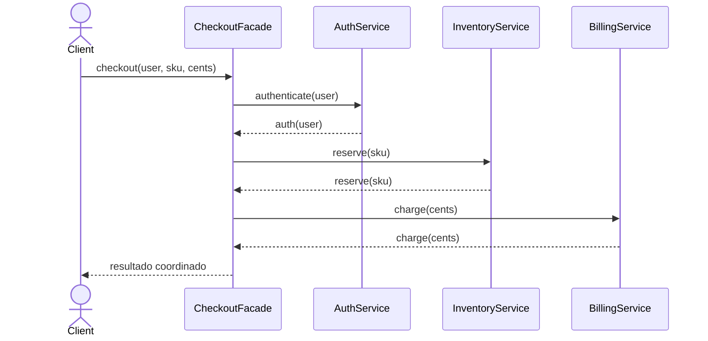

# Facade

> **Familia:** Structural  
> **Intención:** ofrecer una interfaz deliberadamente simple y estable para coordinar un subsistema más amplio sin ocultar que sus componentes siguen existiendo.  
> **Estado:** `in-progress`  
> **Implementaciones verificadas:** `10/48`  
> **Implementaciones materializadas:** `30/48`  
> **Cobertura de pruebas:** N/A — la completitud se valida por comportamiento/toolchain en múltiples ecosistemas standalone; no existe una métrica homogénea agregable.  
> **Mapa:** [Volver al catálogo y mapa de relaciones](README.md)

## En una frase

Facade concentra una operación de alto nivel que de otro modo obligaría al cliente a conocer, ordenar y coordinar varias APIs internas.

## El problema

Un cliente necesita completar una tarea de negocio sencilla —por ejemplo procesar un checkout— pero el subsistema exige autenticar al usuario, reservar inventario y cobrar mediante componentes diferentes. Si cada cliente conoce esas piezas, su orden y sus detalles, el acoplamiento al subsistema crece y cualquier cambio interno se propaga a muchos consumidores.

## Fuerzas que compiten

- El cliente necesita una operación simple orientada a su caso de uso, no conocer toda la topología interna.
- Los subsistemas deben poder evolucionar sin obligar a cambiar todos los consumidores.
- La simplificación no debe convertir al Facade en un objeto omnisciente que absorba toda la lógica del dominio.
- Algunos clientes avanzados pueden necesitar todavía acceso directo a capacidades especializadas del subsistema.

## La solución

Introducir un Facade que conozca las colaboraciones necesarias y exponga una API de más alto nivel. El Facade delega en los subsistemas, coordina el orden requerido y devuelve un resultado útil al cliente. Los subsistemas no necesitan conocer al Facade y pueden seguir siendo reutilizables de manera independiente.

La intención no requiere clases: módulos, funciones, closures, registros, tablas, paquetes o procedimientos pueden ofrecer una frontera simplificada siempre que oculten coordinación accidental sin borrar las capacidades reales del subsistema.

## Participantes y responsabilidades

| Participante | Responsabilidad |
|---|---|
| Cliente | Invoca una operación de alto nivel sin coordinar directamente todos los subsistemas. |
| `Facade` | Expone la API simplificada y orquesta las colaboraciones necesarias. |
| Subsistemas | Conservan las capacidades especializadas y ejecutan el trabajo concreto. |

## Cómo funciona

1. El cliente invoca una operación de alto nivel en el Facade.
2. El Facade traduce esa intención en llamadas a los subsistemas apropiados.
3. El Facade preserva el orden/coordinación requerido entre esas llamadas.
4. Los subsistemas realizan su trabajo sin depender del Facade.
5. El cliente recibe un resultado simple y permanece desacoplado de los detalles internos.

## Diagrama



El punto del diagrama no es esconder que existen tres subsistemas, sino evitar que cada cliente tenga que conocer su secuencia y contratos individuales.

## Ejemplo mínimo

```text
facade = CheckoutFacade(auth, inventory, billing)
result = facade.checkout("alice", "SKU-42", 499)

checkout=auth(alice)>reserve(SKU-42)>charge(499)
```

La salida canónica hace observable que una sola llamada del cliente coordina tres responsabilidades distintas.

## Aplicación real

### API de aplicación sobre varios subsistemas

Una aplicación generada puede exponer una API orientada a casos de uso mientras internamente coordina autorización, persistencia, reglas y servicios externos. Facade reduce el conocimiento accidental que cada consumidor necesita sobre esas piezas.

Si el “subsistema” sólo tiene una o dos operaciones simples y estables, una función directa puede ser más clara que crear una capa adicional.

## En Genkidama

La filosofía del repositorio identifica las **generated application service APIs** como una presión natural para Facade. Esta página no afirma todavía una implementación productiva concreta auditada como canónica; por ahora Facade se mantiene como ejemplo educativo y no se fuerza dentro de la arquitectura de Genkidama.

## Cuándo usarlo

- Un caso de uso requiere coordinar varios subsistemas en una secuencia repetida.
- Se quiere reducir el acoplamiento de clientes a detalles internos cambiantes.
- Una frontera de alto nivel mejora legibilidad, onboarding o sustitución interna.
- Existen consumidores comunes que sólo necesitan un subconjunto coherente de un subsistema grande.

## Cuándo no usarlo

- El subsistema ya tiene una API pequeña y clara; una capa extra sólo añade ceremonia.
- Se necesita convertir una interfaz incompatible en otra; considera Adapter.
- Se necesita controlar acceso, ubicación o ciclo de vida conservando el mismo contrato; considera Proxy.
- El Facade empieza a concentrar reglas de dominio no relacionadas y se convierte en un God Object.

## Consecuencias y trade-offs

| A favor | Costo / riesgo |
|---|---|
| Reduce el conocimiento que el cliente necesita sobre el subsistema. | Introduce una frontera adicional que también debe mantenerse. |
| Centraliza coordinación repetida y orden de llamadas. | Puede crecer hasta convertirse en un punto de acoplamiento excesivo. |
| Permite evolucionar detalles internos detrás de una API estable. | Una API demasiado simplificada puede esconder capacidades necesarias para clientes avanzados. |
| Mejora una frontera de caso de uso sin exigir cambios en los subsistemas. | Puede duplicar parcialmente operaciones si se diseñan facades demasiado generales. |

## Patrones relacionados

[Consulta también el mapa global de relaciones](README.md#relationship-map).

| Patrón | Relación | Por qué importa |
|---|---|---|
| [Adapter](Adapter.md) | often confused with | Adapter cambia un contrato para hacerlo compatible; Facade ofrece una entrada más simple a un subsistema que ya puede ser usable directamente. |
| [Proxy](Proxy.md) | often confused with | Proxy conserva el contrato del sujeto y controla acceso/ubicación; Facade define una API de mayor nivel para varias piezas. |
| [Mediator](Mediator.md) | often confused with | Mediator reduce dependencias bidireccionales entre colegas; Facade simplifica principalmente la relación cliente → subsistema. |
| [Facade for enterprise integration](FacadeEnterpriseIntegration.md) | specializes / generalizes | La variante de integración aplica la misma presión de simplificación a fronteras entre sistemas empresariales. |

## Errores comunes y confusiones

### Llamar Facade a cualquier clase de servicio

Una clase no es Facade sólo por tener métodos convenientes. Debe reducir el conocimiento de varios componentes/subsistemas y presentar una intención de más alto nivel al cliente.

### Convertir el Facade en el dominio

El Facade coordina; no debería absorber reglas que pertenecen a entidades, políticas o servicios especializados. Si toda decisión termina allí, la simplificación inicial se transforma en un cuello de botella arquitectónico.

### Prohibir acceso directo a los subsistemas

Facade no implica necesariamente encapsulación absoluta. Clientes especializados pueden seguir usando APIs internas cuando tengan una razón legítima; el Facade ofrece el camino simple, no obliga a eliminar todos los demás caminos.

## Cómo comprobar una implementación

- El cliente completa el caso de uso mediante una sola API de alto nivel.
- El Facade coordina al menos dos responsabilidades de subsistema distintas.
- Los subsistemas no dependen del Facade para funcionar.
- El orden/coordinación prometido es observable y verificable.
- La prueba valida comportamiento, no que exista una clase llamada `Facade`.
- Cuando hay toolchain razonable, el ejemplo compila, analiza/formatea o ejecuta con un gate ligero y fuerte.

## Implementaciones por lenguaje

El universo canónico mantiene **51 targets**. Para Facade, **48 son Applicable** y **HTML, CSS y SQL declarativo son N/A**. Actualmente hay **10/48 verificados y 30/48 materializados**; los veinte ejemplos posteriores al golden tranche permanecen explícitamente pendientes de evidencia CI antes de promoción factual.

| Lenguaje / target | Aplicabilidad | Ejemplo | Validación | Nota |
|---|---|---|---|---|
| C# | Applicable | [`src/Enterprise/C#/FacadeExample.cs`](../src/Enterprise/C%23/FacadeExample.cs) | CI mainstream | clases y composición explícita |
| TypeScript | Applicable | [`src/Web/TypeScriptTS/facade.ts`](../src/Web/TypeScriptTS/facade.ts) | CI mainstream | clases y API tipada |
| Python | Applicable | [`src/Scripting/PythonPY/facade.py`](../src/Scripting/PythonPY/facade.py) | CI mainstream | objetos ligeros |
| C++ | Applicable | [`src/Systems/C++/facade.cpp`](../src/Systems/C%2B%2B/facade.cpp) | CI mainstream | referencias a subsistemas |
| Java | Applicable | [`src/Enterprise/Java/FacadeExample.java`](../src/Enterprise/Java/FacadeExample.java) | CI mainstream | composición de servicios |
| Rust | Applicable | [`src/Systems/Rust/facade.rs`](../src/Systems/Rust/facade.rs) | CI mainstream | structs y métodos |
| Go | Applicable | [`src/Systems/Go/facade.go`](../src/Systems/Go/facade.go) | CI mainstream | structs y composición |
| PHP | Applicable | [`src/Scripting/PHP/facade.php`](../src/Scripting/PHP/facade.php) | CI mainstream | composición explícita |
| Kotlin | Applicable | [`src/Enterprise/Kotlin/FacadeExample.kt`](../src/Enterprise/Kotlin/FacadeExample.kt) | pendiente CI Facade | clases/funciones son suficientes |
| Swift | Applicable | [`src/Systems/Swift/facade.swift`](../src/Systems/Swift/facade.swift) | pendiente CI Facade | tipos y composición son suficientes |
| F# | Applicable | [`src/Functional/F#/facade.fsx`](../src/Functional/F%23/facade.fsx) | CI mainstream | tipos y función de alto nivel |
| JavaScript | Applicable | [`src/Web/JavaScriptJS/facade.js`](../src/Web/JavaScriptJS/facade.js) | CI mainstream | objetos dinámicos |
| Visual Basic .NET | Applicable | [`src/Enterprise/VB.NET/FacadeExample.vb`](../src/Enterprise/VB.NET/FacadeExample.vb) | pendiente CI Facade | clases/módulos son suficientes |
| C | Applicable | [`src/Systems/C/facade.c`](../src/Systems/C/facade.c) | pendiente CI Facade | funciones y structs pueden formar la frontera |
| Ruby | Applicable | [`src/Scripting/Ruby/facade.rb`](../src/Scripting/Ruby/facade.rb) | pendiente CI Facade | objetos/módulos son suficientes |
| Lua | Applicable | [`src/Scripting/Lua/facade.lua`](../src/Scripting/Lua/facade.lua) | pendiente CI Facade | tablas y funciones son suficientes |
| Bash | Applicable | [`src/Scripting/Bash/facade.sh`](../src/Scripting/Bash/facade.sh) | pendiente CI Facade | funciones pueden coordinar comandos/subsistemas |
| PowerShell | Applicable | [`src/Scripting/PowerShell/FacadeExample.ps1`](../src/Scripting/PowerShell/FacadeExample.ps1) | pendiente CI Facade | funciones/módulos pueden exponer la operación de alto nivel |
| Haskell | Applicable | [`src/Functional/Haskell/Facade.hs`](../src/Functional/Haskell/Facade.hs) | pendiente CI Facade | funciones/registros pueden componer subsistemas |
| Scala | Applicable | [`src/Functional/Scala/Facade.scala`](../src/Functional/Scala/Facade.scala) | pendiente CI Facade | objetos/funciones son suficientes |
| Perl | Applicable | [`src/Scripting/Perl/facade.pl`](../src/Scripting/Perl/facade.pl) | pendiente CI Facade | paquetes/subrutinas son suficientes |
| Pascal | Applicable | — | pendiente | procedimientos/records/objetos pueden coordinar subsistemas |
| R | Applicable | [`src/DataScience/R/facade.R`](../src/DataScience/R/facade.R) | pendiente CI Facade | funciones/listas pueden expresar la frontera |
| GNU Octave | Applicable | [`src/DataScience/Octave/facade.m`](../src/DataScience/Octave/facade.m) | pendiente CI Facade | funciones/structs pueden expresar la frontera |
| Julia | Applicable | [`src/DataScience/Julia/facade.jl`](../src/DataScience/Julia/facade.jl) | pendiente CI Facade | funciones/structs son suficientes |
| OCaml | Applicable | [`src/Functional/OCaml/facade.ml`](../src/Functional/OCaml/facade.ml) | pendiente CI Facade | módulos/records/funciones son suficientes |
| Common Lisp | Applicable | [`src/Functional/Lisp/facade.lisp`](../src/Functional/Lisp/facade.lisp) | pendiente CI Facade | funciones/estructuras son suficientes |
| Clojure | Applicable | — | pendiente | funciones/maps son suficientes |
| Elixir | Applicable | — | pendiente | módulos/funciones coordinan subsistemas |
| Erlang | Applicable | — | pendiente | módulos/funciones coordinan procesos/servicios |
| Prolog | Applicable | [`src/Niche/Prolog/facade.pl`](../src/Niche/Prolog/facade.pl) | pendiente CI Facade | predicados pueden ofrecer una consulta de alto nivel sobre varios predicados |
| Groovy | Applicable | [`src/Scripting/Groovy/facade.groovy`](../src/Scripting/Groovy/facade.groovy) | pendiente CI Facade | clases/closures son suficientes |
| Ada | Applicable | [`src/Historical/Ada/facade.adb`](../src/Historical/Ada/facade.adb) | pendiente CI Facade | packages/procedures son suficientes |
| Solidity | Applicable | — | pendiente | contratos/librerías pueden ofrecer una entrada simplificada |
| Fortran | Applicable | — | pendiente | modules/procedures son suficientes |
| Objective-C | Applicable | — | pendiente | objetos/mensajes son suficientes |
| Zig | Applicable | — | pendiente | structs/functions son suficientes |
| Nim | Applicable | — | pendiente | objects/procs son suficientes |
| Dart | Applicable | — | pendiente | clases/funciones son suficientes |
| Crystal | Applicable | — | pendiente | clases/métodos son suficientes |
| COBOL | Applicable | — | pendiente | programas/secciones pueden coordinar subsistemas |
| VBA | Applicable | — | pendiente | módulos/procedimientos son suficientes |
| GDScript | Applicable | — | pendiente | scripts/objetos son suficientes |
| MATLAB | Applicable | [`src/DataScience/MATLAB/facade.m`](../src/DataScience/MATLAB/facade.m) | pendiente CI Facade | funciones/structs son suficientes |
| Assembly | Applicable | — | pendiente | procedimientos pueden ofrecer una entrada simplificada a rutinas internas |
| Delphi | Applicable | — | pendiente | clases/interfaces son suficientes |
| MicroPython | Applicable | — | pendiente | objetos/funciones son suficientes |
| Rockstar | Applicable | — | pendiente | funciones pueden coordinar responsabilidades |
| HTML | N/A | — | — | markup declarativo sin ejecución/coordinación propia; requiere un runtime externo para implementar la intención. |
| CSS | N/A | — | — | lenguaje de estilos declarativo sin frontera ejecutable que coordine subsistemas. |
| SQL declarativo | N/A | — | — | una consulta declarativa describe datos; sin procedimientos/runtime adicional no ofrece una API de aplicación que coordine subsistemas. |

## Comprueba que lo entendiste

1. ¿Qué presión justificaría introducir un Facade en lugar de dejar que cada cliente invoque directamente Auth, Inventory y Billing?
2. Si una capa convierte la interfaz de un proveedor externo a la interfaz esperada por tu aplicación, ¿por qué eso es Adapter y no Facade?
3. ¿Qué señales indicarían que un Facade dejó de simplificar una frontera y empezó a convertirse en un God Object?

## Resumen

- Facade reduce el conocimiento accidental que un cliente necesita sobre un subsistema complejo.
- Su movimiento central es ofrecer una operación de alto nivel que coordina varias capacidades internas.
- El beneficio de una frontera simple se paga con otra API que debe mantenerse y evitar crecer sin límite.
- Se distingue de Adapter por intención y de Proxy por no preservar necesariamente el contrato del objeto protegido.
- La intención es portable a paradigmas no OOP siempre que exista una frontera ejecutable capaz de coordinar responsabilidades.

## Referencias

- Gamma, Helm, Johnson y Vlissides, *Design Patterns: Elements of Reusable Object-Oriented Software* — Facade.
- [`docs/kb/catalog/pattern-authoring-standard.md`](../docs/kb/catalog/pattern-authoring-standard.md).
- [`docs/philosophy/001-patterns-as-living-examples.md`](../docs/philosophy/001-patterns-as-living-examples.md).