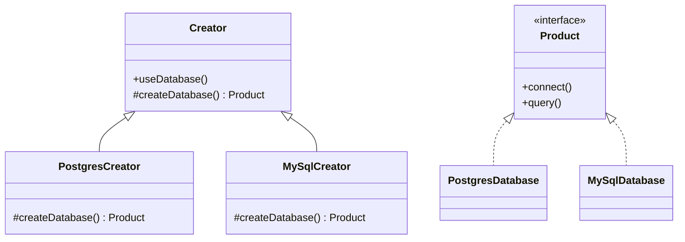

# Factory Method

> **Familia:** Creational  
> **Intención:** definir una operación estable que necesita crear un producto, dejando que una variante sustituible decida qué producto concreto construir.  
> **Estado:** `in-progress`  
> **Implementaciones de lenguaje:** `0/48`  
> **Cobertura de pruebas:** N/A — la completitud se valida por lenguaje con compile/run o evidencia proporcional; no existe una métrica homogénea transversal.  
> **Mapa:** [Volver al catálogo y mapa de relaciones](README.md)

## En una frase

Factory Method mantiene estable **qué hace el Creator con un producto** y separa **cómo obtiene la variante concreta** que necesita para hacerlo.

## El problema

Una operación de alto nivel necesita usar un producto, pero acoplarla a un constructor concreto obliga a modificar esa operación cada vez que aparece una nueva variante. El problema no es simplemente “crear objetos”: es conservar un flujo estable mientras la decisión de creación permanece extensible.

## Fuerzas que compiten

- La lógica de alto nivel debe permanecer independiente del producto concreto.
- La selección del producto debe poder variar sin duplicar el flujo que lo consume.
- La extensión no debe exigir una gran fábrica de condicionales dentro del Creator.
- Para una única variante estable, una función o constructor directo suele ser más simple.

## La solución

Separar la creación detrás de un **factory method** o hook sustituible. El Creator ejecuta una operación estable que solicita un Product mediante ese hook y luego trabaja sólo contra su contrato. En OO el hook suele sobrescribirse; en lenguajes funcionales, dinámicos o de bajo nivel puede ser una función, closure, record de operaciones, callback, módulo o puntero a función.

La esencia es que **la operación consumidora pertenece al mismo límite conceptual que delega la creación**. Una función aislada `createX()` sin un flujo estable que la use es simplemente una fábrica, no evidencia suficiente de Factory Method.

## Participantes y responsabilidades

| Participante | Responsabilidad |
|---|---|
| `Product` | Define el contrato que consume la operación estable. |
| `ConcreteProduct` | Implementa una variante concreta. |
| `Creator` | Contiene la operación estable que trabaja con `Product`. |
| Factory method / hook | Decide qué producto concreto recibe el Creator. |
| `ConcreteCreator` | Sustituye el hook cuando existe una representación OO explícita. |

## Cómo funciona

1. El cliente selecciona o configura una variante de Creator.
2. La operación estable del Creator solicita un Product mediante el factory method/hook.
3. La variante concreta crea el producto apropiado.
4. La operación continúa usando sólo el contrato de Product.
5. Agregar otra variante no requiere duplicar la operación estable.

## Diagrama



La flecha importante no es la herencia: `useDatabase()` permanece estable mientras el hook de creación cambia.

## Ejemplo mínimo

```csharp
public abstract class DatabaseCreator
{
    protected abstract IDatabase CreateDatabase();

    public void UseDatabase()
    {
        var database = CreateDatabase();
        database.Connect();
        database.Query();
    }
}
```

Las variantes concretas sólo deciden qué `IDatabase` devuelve `CreateDatabase()`.

## Aplicación real

### Proveedores de base de datos

Un flujo de inicialización necesita conectar y consultar mediante el mismo contrato, pero el proveedor concreto cambia por configuración. Factory Method encaja cuando esa operación estable pertenece a un Creator extensible y cada variante sólo sustituye la creación.

Si el sistema únicamente necesita seleccionar un objeto en un punto de composición y no existe una operación estable en el Creator, una función factory o inyección directa puede ser suficiente.

## En Genkidama

La filosofía del repositorio identifica **database provider factory y module creation** como lugares donde Factory Method puede aparecer naturalmente. Esta página no reclamará un uso deliberado productivo hasta verificar una implementación concreta que conserve la intención descrita aquí; los ejemplos educativos por sí solos no prueban uso arquitectónico.

## Cuándo usarlo

- Una operación estable necesita un producto cuya variante concreta puede cambiar.
- La lógica consumidora no debe conocer constructores concretos.
- Nuevas variantes deben agregarse sustituyendo un hook de creación, no copiando el flujo.
- El lenguaje ofrece alguna forma idiomática de pasar o sustituir comportamiento de creación.

## Cuándo no usarlo

- Sólo existe una variante estable y un constructor directo es suficiente.
- Sólo necesitas escoger una familia completa de productos relacionados: considera Abstract Factory.
- Sólo necesitas ensamblar un producto por pasos: considera Builder.
- Una simple función factory inyectada en composición expresa todo el problema sin un Creator estable.

## Consecuencias y trade-offs

| A favor | Costo / riesgo |
|---|---|
| Desacopla la operación estable de constructores concretos. | Añade un punto de extensión que puede ser innecesario. |
| Permite extender variantes sin duplicar el flujo consumidor. | En OO puede multiplicar tipos `ConcreteCreator`. |
| Facilita pruebas sustituyendo el hook de creación. | Una jerarquía ceremonial oculta más de lo que aclara. |
| Se traduce bien a callbacks/closures en otros paradigmas. | Llamar “Factory Method” a cualquier función `create` diluye la intención. |

## Patrones relacionados

[Consulta también el mapa global de relaciones](README.md#relationship-map).

| Patrón | Relación | Por qué importa |
|---|---|---|
| [Abstract Factory](AbstractFactory.md) | often implemented with | Una operación de Abstract Factory puede delegar la creación individual a factory methods; Abstract Factory conserva la coherencia de una familia. |
| [Builder](Builder.md) | alternative to | Builder varía un proceso de ensamblado paso a paso; Factory Method varía el producto creado dentro de una operación estable. |
| [Template Method](TemplateMethod.md) | collaborates with | Un template method puede incluir un factory method como uno de sus hooks variables. |
| [Prototype](Prototype.md) | alternative to | Clonar un prototipo puede sustituir el hook constructor cuando la variación se expresa mejor mediante datos preconfigurados. |

## Errores comunes y confusiones

### Confundir una simple función factory con Factory Method

`createDatabase(type)` puede ser una solución válida, pero no demuestra este patrón si no existe una operación estable que delega su necesidad de creación a un hook sustituible.

### Confundirlo con Abstract Factory

Una interfaz con `createDatabase()` y varias implementaciones de fábrica sigue creando un único tipo de producto. Abstract Factory requiere una familia de productos relacionados; Factory Method requiere preservar la operación estable alrededor de la creación variable.

### Forzar herencia donde no hace falta

Callbacks, closures, records o function pointers son representaciones legítimas cuando mantienen el flujo estable y sustituyen sólo el paso de creación.

## Cómo comprobar una implementación

- Cambiar la variante de Creator/hook cambia el producto concreto sin editar la operación estable.
- La operación consumidora sólo conoce el contrato de Product.
- Agregar una variante no obliga a duplicar la lógica estable.
- La evidencia ejecuta al menos dos variantes y observa comportamiento distinto del producto.
- La validación no se limita a buscar nombres como `Factory` o `Create`.

## Preguntas de comprensión

1. ¿Qué diferencia una factory function de Factory Method?
2. ¿Qué parte debe permanecer estable al agregar una nueva variante?
3. ¿Por qué la herencia no es requisito del patrón?
4. ¿Cuándo Abstract Factory resuelve una presión distinta?
5. ¿Qué comportamiento observable demostraría que el hook de creación realmente varía?

## Implementaciones por lenguaje

El universo canónico mantiene **51 targets**. La clasificación inicial es **48 Applicable** y **3 N/A**, sujeta a auditoría por target. Ningún lenguaje se excluye por falta de clases.

| Estado | Cantidad | Criterio |
|---|---:|---|
| Applicable | 48 | Puede expresar una operación estable que delega creación mediante override, callback, closure, módulo, record, predicate o mecanismo equivalente. |
| N/A | 3 | HTML, CSS y SQL declarativo no ofrecen por sí mismos un runtime general para sustituir un hook de creación. |
| Verified | 0 | Ningún ejemplo histórico se promueve sin revisar semántica y evidencia. |

### N/A

- **HTML:** markup declarativo; un hook ejecutable pertenecería al lenguaje/runtime que lo implementa.
- **CSS:** reglas declarativas de presentación; no expresa por sí solo una operación runtime con creación sustituible.
- **SQL:** el target canónico es SQL declarativo; no se usará un dialecto procedural para forzar Factory Method bajo esa etiqueta.

La auditoría mantendrá esta página `in-progress` hasta que los 48 Applicable tengan ejemplo real, enlace y evidencia proporcional.