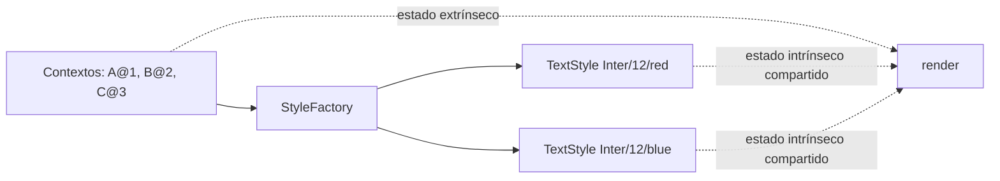

# Flyweight

> **Familia:** Structural  
> **Intención:** compartir estado intrínseco reutilizable entre muchas representaciones ligeras y mantener fuera del objeto compartido el estado que cambia por contexto.  
> **Estado:** `in-progress`  
> **Implementaciones verificadas:** `0/48`  
> **Implementaciones materializadas:** `10/48`  
> **Cobertura de pruebas:** N/A — ejemplos standalone multi-ecosistema; se usa compilación/runtime/contrato por lenguaje en lugar de un porcentaje agregado inventado.  
> **Mapa:** [Volver al catálogo y mapa de relaciones](README.md)

## En una frase

Flyweight evita duplicar miles de veces datos equivalentes: comparte la parte estable y recibe desde fuera la parte contextual de cada uso.

## El problema

Un editor puede representar millones de caracteres. Si cada carácter almacena su propia copia de fuente, tamaño y color, el costo de memoria crece aunque muchos caracteres compartan exactamente el mismo estilo. El reto es reducir duplicación sin confundir lo compartible con posición, carácter u otros datos propios de cada aparición.

## Fuerzas que compiten

- Hay muchísimos objetos conceptualmente pequeños y la duplicación de estado estable cuesta memoria.
- El estado compartido debe ser inmutable o tratado como tal para evitar contaminación entre consumidores.
- El estado contextual sigue variando por aparición y no puede esconderse dentro del objeto compartido.
- El ahorro debe justificar la fábrica/cache y la separación adicional de responsabilidades.

## La solución

Separar **estado intrínseco** —por ejemplo fuente, tamaño y color— de **estado extrínseco** —carácter y posición—. Una fábrica devuelve una única instancia compartida por cada combinación intrínseca. Cada aparición conserva o recibe su contexto por separado.

Flyweight no exige clases: tablas internadas, mapas, átomos, símbolos, records inmutables, closures o valores compartidos pueden expresar la misma intención.

## Participantes y responsabilidades

| Participante | Responsabilidad |
|---|---|
| `Flyweight` | Contiene el estado intrínseco compartible. |
| `FlyweightFactory` | Reutiliza una instancia existente o crea una nueva por clave intrínseca. |
| Contexto / cliente | Conserva estado extrínseco y combina ambos durante el uso. |

## Cómo funciona

1. El cliente identifica la porción estable que puede compartirse.
2. Pide esa porción a la fábrica mediante una clave intrínseca.
3. La fábrica reutiliza el Flyweight si ya existe.
4. El cliente mantiene fuera carácter, posición u otro estado extrínseco.
5. El comportamiento combina Flyweight y contexto sin duplicar el estado estable.

## Diagrama



El punto importante es la frontera de estado: varias apariciones pueden referenciar el mismo estilo rojo, mientras carácter y posición siguen perteneciendo al contexto.

## Ejemplo mínimo

```text
red1 = styles.get("Inter", 12, "red")
red2 = styles.get("Inter", 12, "red")
blue = styles.get("Inter", 12, "blue")

styles=2;shared=true;text=ABC
```

La salida prueba dos cosas: sólo existen dos estilos intrínsecos para tres usos y las dos solicitudes del rojo comparten identidad.

## Aplicación real

### Renderizado con gran cardinalidad

Editores, mapas, juegos y visualizaciones pueden tener cantidades enormes de elementos cuyas propiedades visuales se repiten. Internar estilos o recursos reduce memoria cuando el conjunto de variantes intrínsecas es mucho menor que el número de apariciones.

Si sólo existen unas decenas de objetos o el estado casi nunca se repite, una estructura ordinaria suele ser más simple y suficientemente eficiente.

## En Genkidama

No existe actualmente un uso productivo deliberado y auditado de Flyweight en Genkidama. El patrón se mantiene como ejemplo educativo; no se introduce en arquitectura productiva únicamente para demostrarlo.

## Cuándo usarlo

- Existen muchísimas instancias conceptuales con gran parte del estado repetido.
- El estado intrínseco puede ser compartido de forma segura.
- El contexto extrínseco puede mantenerse fuera o suministrarse al usar el objeto.

## Cuándo no usarlo

- La cantidad de objetos es pequeña o el ahorro de memoria es irrelevante.
- El supuesto estado intrínseco cambia frecuentemente por instancia.
- La cache/fábrica agrega más complejidad que el costo que elimina.
- Sólo necesitas creación diferida; considera Lazy Initialization o un cache simple antes de llamar Flyweight al diseño.

## Consecuencias y trade-offs

| A favor | Costo / riesgo |
|---|---|
| Reduce duplicación de estado intrínseco. | Exige distinguir cuidadosamente estado intrínseco y extrínseco. |
| Puede reducir memoria y costo de construcción. | Añade lookup/cache y gestión de claves. |
| Favorece valores compartidos e inmutables. | El contexto puede volverse más explícito y viajar por más llamadas. |
| Permite reutilización masiva de representaciones equivalentes. | Mutar accidentalmente un Flyweight compartido afecta a múltiples consumidores. |

## Patrones relacionados

[Consulta también el mapa global de relaciones](README.md#relationship-map).

| Patrón | Relación | Por qué importa |
|---|---|---|
| [Factory Method](FactoryMethod.md) | often implemented with | La creación/canonicalización de Flyweights suele concentrarse en una fábrica. |
| [Composite](Composite.md) | collaborates with | Árboles grandes pueden compartir hojas o recursos repetidos cuando su estado intrínseco coincide. |
| [Singleton](Singleton.md) | often confused with | Singleton garantiza una instancia global de un tipo; Flyweight mantiene potencialmente muchas instancias, una por valor intrínseco. |
| [Proxy](Proxy.md) | often confused with | Proxy controla acceso a otro sujeto; Flyweight reduce duplicación compartiendo representación intrínseca. |

## Errores comunes y confusiones

### Llamar Flyweight a cualquier cache

Un cache puede guardar resultados costosos sin separar estado intrínseco/extrínseco. Flyweight se reconoce por esa separación y por reutilizar representaciones equivalentes a gran escala.

### Compartir estado mutable

Si dos contextos reciben el mismo Flyweight y uno puede mutarlo, el ahorro de memoria se convierte en acoplamiento invisible. El estado intrínseco debería ser inmutable o estar protegido por un contrato equivalente.

## Cómo comprobar una implementación

- Dos solicitudes con la misma clave intrínseca reutilizan la misma representación.
- Una clave intrínseca distinta produce otra representación.
- El estado extrínseco no queda absorbido en el objeto compartido.
- La prueba observa reutilización y resultado, no sólo nombres de clases.
- Donde exista tooling razonable, el ejemplo compila, analiza o ejecuta con un gate ligero.

## Implementaciones por lenguaje

Universo actual: **51 targets**. Flyweight clasifica provisionalmente **48 Applicable** y **3 N/A**. La ausencia de clases no convierte un lenguaje ejecutable en N/A.

| Lenguaje / target | Aplicabilidad | Ejemplo | Validación | Nota |
|---|---|---|---|---|
| C# | Applicable | [`src/Enterprise/C#/FlyweightExample.cs`](../src/Enterprise/C%23/FlyweightExample.cs) | pendiente CI Flyweight Mainstream | record inmutable + diccionario |
| TypeScript | Applicable | [`src/Web/TypeScriptTS/flyweight.ts`](../src/Web/TypeScriptTS/flyweight.ts) | pendiente CI Flyweight Mainstream | objetos congelados + Map |
| Python | Applicable | [`src/Scripting/PythonPY/flyweight.py`](../src/Scripting/PythonPY/flyweight.py) | pendiente CI Flyweight Mainstream | dataclass congelada + dict |
| C++ | Applicable | [`src/Systems/C++/flyweight.cpp`](../src/Systems/C%2B%2B/flyweight.cpp) | pendiente CI Flyweight Mainstream | shared_ptr + map |
| Java | Applicable | [`src/Enterprise/Java/FlyweightExample.java`](../src/Enterprise/Java/FlyweightExample.java) | pendiente CI Flyweight Mainstream | record + HashMap |
| Rust | Applicable | [`src/Systems/Rust/flyweight.rs`](../src/Systems/Rust/flyweight.rs) | pendiente CI Flyweight Mainstream | Rc + HashMap |
| Go | Applicable | [`src/Systems/Go/flyweight.go`](../src/Systems/Go/flyweight.go) | pendiente CI Flyweight Mainstream | pointers + map |
| PHP | Applicable | [`src/Scripting/PHP/flyweight.php`](../src/Scripting/PHP/flyweight.php) | pendiente CI Flyweight Mainstream | objetos + array asociativo |
| F# | Applicable | [`src/Functional/F#/flyweight.fsx`](../src/Functional/F%23/flyweight.fsx) | pendiente CI Flyweight Mainstream | valores compartidos + Dictionary |
| JavaScript | Applicable | [`src/Web/JavaScriptJS/flyweight.js`](../src/Web/JavaScriptJS/flyweight.js) | pendiente CI Flyweight Mainstream | objetos congelados + Map |
| Kotlin | Applicable | — | pendiente | maps/values pueden internarse |
| Swift | Applicable | — | pendiente | structs/referencias compartidas pueden separar estado |
| Visual Basic .NET | Applicable | — | pendiente | clases/records y diccionarios |
| C | Applicable | — | pendiente | structs + tabla de internado |
| Ruby | Applicable | — | pendiente | objetos congelados + Hash |
| Lua | Applicable | — | pendiente | tablas + cache |
| Bash | Applicable | — | pendiente | arrays asociativos pueden internar valores simbólicos |
| PowerShell | Applicable | — | pendiente | hashtables/objetos |
| Haskell | Applicable | — | pendiente | mapas y valores inmutables |
| Scala | Applicable | — | pendiente | case classes + Map |
| Perl | Applicable | — | pendiente | hashes/referencias |
| Pascal | Applicable | — | pendiente | records/classes + tabla |
| R | Applicable | — | pendiente | environments/lists |
| GNU Octave | Applicable | — | pendiente | structs/maps según runtime |
| Julia | Applicable | — | pendiente | immutable structs + Dict |
| OCaml | Applicable | — | pendiente | records + Hashtbl |
| Common Lisp | Applicable | — | pendiente | hash tables + objetos/listas |
| Clojure | Applicable | — | pendiente | internamiento mediante atoms/maps cuando haga falta identidad |
| Elixir | Applicable | — | pendiente | procesos/ETS/maps pueden mantener pool explícito |
| Erlang | Applicable | — | pendiente | ETS/maps/process dictionary según alcance educativo |
| Prolog | Applicable | — | pendiente | hechos/tablas pueden representar valores compartidos conceptualmente |
| Groovy | Applicable | — | pendiente | objetos + maps |
| Ada | Applicable | — | pendiente | paquetes y acceso compartido |
| Solidity | Applicable | — | pendiente | almacenamiento keyed puede canonicalizar configuración compartida |
| Fortran | Applicable | — | pendiente | derived types + arrays/tables |
| Objective-C | Applicable | — | pendiente | objetos inmutables + dictionary |
| Zig | Applicable | — | pendiente | structs + mapas/allocator |
| Nim | Applicable | — | pendiente | ref objects/tables |
| Dart | Applicable | — | pendiente | immutable objects + Map |
| Crystal | Applicable | — | pendiente | structs/classes + Hash |
| COBOL | Applicable | — | pendiente | tablas de estado y claves pueden separar datos repetidos/contexto |
| VBA | Applicable | — | pendiente | objects/dictionaries cuando host lo permita |
| GDScript | Applicable | — | pendiente | dictionaries/resources pueden compartirse |
| Assembly | Applicable | — | pendiente | tabla de datos compartidos + índices/contexto |
| Delphi | Applicable | — | pendiente | records/classes + dictionary |
| MicroPython | Applicable | — | pendiente | dict + objetos ligeros |
| Rockstar | Applicable | — | pendiente | variables/arrays permiten modelar pool educativo mínimo |
| MATLAB | Applicable | — | pendiente | structs/containers.Map permiten separar estado |
| HTML | N/A | — | — | markup declarativo sin runtime propio ni identidad compartible ejecutable para esta intención |
| CSS | N/A | — | — | reglas declarativas describen estilo pero no implementan por sí solas una fábrica/pool runtime de Flyweights |
| SQL declarativo | N/A | — | — | consultas/tablas pueden deduplicar datos, pero SQL declarativo por sí solo no ofrece el objeto/contexto ejecutable que requiere este ejemplo sin un runtime procedural adicional |

## Comprueba que lo entendiste

1. Si dos millones de glifos usan veinte estilos, ¿qué datos deberían ser intrínsecos y cuáles extrínsecos para que Flyweight tenga sentido?
2. ¿Por qué una cache de respuestas HTTP no es automáticamente Flyweight aunque reutilice valores?
3. ¿En qué momento la complejidad de fábrica, claves y contexto cuesta más que la memoria que ahorra?

## Resumen

- Flyweight ataca duplicación masiva de estado repetido.
- Comparte estado intrínseco y mantiene fuera el estado extrínseco.
- La reutilización debe ser observable y segura, idealmente con valores inmutables.
- Se distingue de Singleton, Proxy y caches genéricos por su intención.
- La portabilidad depende de la capacidad de compartir/internar representación, no de disponer de clases.

## Referencias

- Gamma, Helm, Johnson y Vlissides, *Design Patterns: Elements of Reusable Object-Oriented Software* — intención y vocabulario original de Flyweight.
- [`docs/philosophy/001-patterns-as-living-examples.md`](../docs/philosophy/001-patterns-as-living-examples.md) — regla de no forzar patrones en arquitectura productiva.
- [`docs/kb/catalog/pattern-authoring-standard.md`](../docs/kb/catalog/pattern-authoring-standard.md) — estándar canónico de autoría y completitud.
