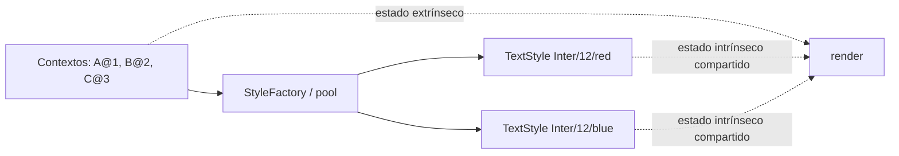

# Flyweight

> **Familia:** Structural  
> **Intención:** compartir estado intrínseco reutilizable entre muchas representaciones ligeras y mantener fuera del objeto compartido el estado que cambia por contexto.  
> **Estado:** `validated`  
> **Implementaciones de lenguaje:** `48/48`  
> **Cobertura de pruebas:** N/A — ejemplos standalone multi-ecosistema; se usa compilación, runtime, análisis o contrato por lenguaje en lugar de inventar un porcentaje agregado.  
> **Mapa:** [Volver al catálogo y mapa de relaciones](README.md)

## En una frase

Flyweight evita duplicar miles de veces datos equivalentes: comparte la parte estable y recibe desde fuera la parte contextual de cada uso.

## El problema

Un editor puede representar millones de caracteres. Si cada carácter almacena su propia copia de fuente, tamaño y color, el costo de memoria crece aunque muchos caracteres compartan exactamente el mismo estilo. El reto es reducir duplicación sin confundir lo compartible con posición, carácter u otros datos propios de cada aparición.

## Fuerzas que compiten

- Hay muchísimas representaciones pequeñas y la duplicación de estado estable cuesta memoria.
- El estado compartido debe ser inmutable o tratado como tal para evitar contaminación entre consumidores.
- El estado contextual sigue variando por aparición y no puede esconderse dentro del objeto compartido.
- El ahorro debe justificar la fábrica, tabla o mecanismo de canonicalización adicional.

## La solución

Separar **estado intrínseco** —por ejemplo fuente, tamaño y color— de **estado extrínseco** —carácter, posición u otro contexto de uso—. Una fábrica, tabla o función de internado devuelve una única representación por combinación intrínseca. Cada aparición conserva o recibe su contexto por separado.

Flyweight no exige clases: tablas internadas, mapas, records inmutables, referencias, símbolos, predicados o valores canonicalizados pueden expresar la misma intención.

## Participantes y responsabilidades

| Participante | Responsabilidad |
|---|---|
| `Flyweight` | Contiene el estado intrínseco compartible. |
| `FlyweightFactory` / pool | Reutiliza una representación existente o crea una nueva por clave intrínseca. |
| Contexto / cliente | Conserva el estado extrínseco y combina ambos durante el uso. |

## Cómo funciona

1. El cliente identifica la porción estable que puede compartirse.
2. Solicita esa porción mediante una clave intrínseca.
3. La fábrica o pool reutiliza el Flyweight si ya existe.
4. El cliente mantiene fuera carácter, posición u otro estado extrínseco.
5. El comportamiento combina Flyweight y contexto sin duplicar el estado estable.

## Diagrama



Varias apariciones pueden compartir el mismo estilo rojo, mientras carácter y posición siguen perteneciendo al contexto.

## Ejemplo mínimo

```text
red1 = styles.get("Inter", 12, "red")
red2 = styles.get("Inter", 12, "red")
blue = styles.get("Inter", 12, "blue")

styles=2;shared=true;text=ABC
```

La salida demuestra dos representaciones intrínsecas para tres solicitudes y reutilización de la representación roja según el modelo de identidad o canonicalización del lenguaje.

## Aplicación real

### Renderizado con gran cardinalidad

Editores, mapas, juegos y visualizaciones pueden tener cantidades enormes de elementos cuyas propiedades visuales se repiten. Internar estilos o recursos reduce memoria cuando el conjunto de variantes intrínsecas es mucho menor que el número de apariciones.

Si sólo existen unas decenas de objetos o el estado casi nunca se repite, una estructura ordinaria suele ser más simple y suficientemente eficiente.

## En Genkidama

No existe actualmente un uso productivo deliberado y auditado de Flyweight en Genkidama. El patrón se mantiene como ejemplo educativo; no se introduce en arquitectura productiva únicamente para demostrarlo.

## Cuándo usarlo

- Existen muchísimas instancias conceptuales con gran parte del estado repetido.
- El estado intrínseco puede compartirse de forma segura.
- El contexto extrínseco puede mantenerse fuera o suministrarse al usar la representación.

## Cuándo no usarlo

- La cantidad de objetos es pequeña o el ahorro de memoria es irrelevante.
- El supuesto estado intrínseco cambia frecuentemente por instancia.
- El pool agrega más complejidad que el costo que elimina.
- Sólo necesitas creación diferida; considera Lazy Initialization o un cache simple.

## Consecuencias y trade-offs

| A favor | Costo / riesgo |
|---|---|
| Reduce duplicación de estado intrínseco. | Exige distinguir cuidadosamente estado intrínseco y extrínseco. |
| Puede reducir memoria y costo de construcción. | Añade lookup, claves y gestión del pool. |
| Favorece representaciones compartidas e inmutables. | El contexto se vuelve más explícito. |
| Reutiliza masivamente valores equivalentes. | Mutar accidentalmente un Flyweight compartido afecta a múltiples consumidores. |

## Patrones relacionados

[Consulta también el mapa global de relaciones](README.md#relationship-map).

| Patrón | Relación | Por qué importa |
|---|---|---|
| [Factory Method](FactoryMethod.md) | often implemented with | La creación y canonicalización de Flyweights suele concentrarse en una fábrica. |
| [Composite](Composite.md) | collaborates with | Árboles grandes pueden compartir hojas o recursos repetidos. |
| [Singleton](Singleton.md) | often confused with | Singleton garantiza una instancia global de un tipo; Flyweight mantiene potencialmente muchas, una por estado intrínseco. |
| [Proxy](Proxy.md) | often confused with | Proxy controla acceso a otro sujeto; Flyweight reduce duplicación compartiendo representación. |

## Errores comunes y confusiones

### Llamar Flyweight a cualquier cache

Un cache puede guardar resultados costosos sin separar estado intrínseco y extrínseco. Flyweight se reconoce por esa separación y por reutilizar representaciones equivalentes.

### Compartir estado mutable

Si dos contextos reciben el mismo Flyweight y uno puede mutarlo, el ahorro de memoria se convierte en acoplamiento invisible. El estado intrínseco debería ser inmutable o estar protegido por un contrato equivalente.

## Cómo comprobar una implementación

- Dos solicitudes con la misma clave intrínseca reutilizan la misma representación o valor canonicalizado.
- Una clave intrínseca distinta produce otra representación.
- El estado extrínseco no queda absorbido dentro del valor compartido.
- La prueba observa reutilización y resultado, no sólo nombres de clases.
- Donde exista tooling razonable, el ejemplo compila, analiza o ejecuta con un gate ligero.

## Implementaciones por lenguaje

Universo actual: **51 targets**. Flyweight clasifica **48 Applicable** y **3 N/A**. La ausencia de clases no convierte un lenguaje ejecutable en N/A.

| Lenguaje / target | Aplicabilidad | Ejemplo verificado | Validación | Nota |
|---|---|---|---|---|
| C# | Applicable | [`FlyweightExample.cs`](../src/Enterprise/C%23/FlyweightExample.cs) | Flyweight Mainstream ✅ | record/objeto + diccionario |
| TypeScript | Applicable | [`flyweight.ts`](../src/Web/TypeScriptTS/flyweight.ts) | Flyweight Mainstream ✅ | objetos + `Map` |
| Python | Applicable | [`flyweight.py`](../src/Scripting/PythonPY/flyweight.py) | Flyweight Mainstream ✅ | objetos + `dict` |
| C++ | Applicable | [`flyweight.cpp`](../src/Systems/C%2B%2B/flyweight.cpp) | Flyweight Mainstream ✅ | referencias + map |
| Java | Applicable | [`FlyweightExample.java`](../src/Enterprise/Java/FlyweightExample.java) | Flyweight Mainstream ✅ | record/objeto + `HashMap` |
| Rust | Applicable | [`flyweight.rs`](../src/Systems/Rust/flyweight.rs) | Flyweight Mainstream ✅ | `Rc` + `HashMap` |
| Go | Applicable | [`flyweight.go`](../src/Systems/Go/flyweight.go) | Flyweight Mainstream ✅ | pointers + map |
| PHP | Applicable | [`flyweight.php`](../src/Scripting/PHP/flyweight.php) | Flyweight Mainstream ✅ | objetos + array asociativo |
| F# | Applicable | [`flyweight.fsx`](../src/Functional/F%23/flyweight.fsx) | Flyweight Mainstream ✅ | valores compartidos + Dictionary |
| JavaScript | Applicable | [`flyweight.js`](../src/Web/JavaScriptJS/flyweight.js) | Flyweight Mainstream ✅ | objetos + `Map` |
| Kotlin | Applicable | [`FlyweightExample.kt`](../src/Enterprise/Kotlin/FlyweightExample.kt) | Flyweight Mainstream ✅ | data class + MutableMap |
| Swift | Applicable | [`flyweight.swift`](../src/Systems/Swift/flyweight.swift) | Flyweight Mainstream ✅ | referencias + Dictionary |
| Visual Basic .NET | Applicable | [`FlyweightExample.vb`](../src/Enterprise/VB.NET/FlyweightExample.vb) | Flyweight Mainstream ✅ | objetos + Dictionary |
| C | Applicable | [`flyweight.c`](../src/Systems/C/flyweight.c) | Flyweight Mainstream ✅ | structs + tabla de internado |
| Ruby | Applicable | [`flyweight.rb`](../src/Scripting/Ruby/flyweight.rb) | Flyweight Mainstream ✅ | Struct + Hash |
| Lua | Applicable | [`flyweight.lua`](../src/Scripting/Lua/flyweight.lua) | Flyweight Mainstream ✅ | tablas + cache |
| Bash | Applicable | [`flyweight.sh`](../src/Scripting/Bash/flyweight.sh) | Flyweight Mainstream ✅ | array asociativo + clave canonicalizada |
| PowerShell | Applicable | [`flyweight.ps1`](../src/Scripting/PowerShell/flyweight.ps1) | Flyweight Mainstream ✅ | hashtable + objetos compartidos |
| Haskell | Applicable | [`flyweight.hs`](../src/Functional/Haskell/flyweight.hs) | Flyweight Mainstream ✅ | `Map` + valores inmutables |
| Perl | Applicable | [`flyweight.pl`](../src/Scripting/Perl/flyweight.pl) | Flyweight Mainstream ✅ | hashes + referencias |
| Pascal | Applicable | [`flyweight.pas`](../src/Historical/Pascal/flyweight.pas) | Flyweight Mainstream ✅ | tabla canonicalizada |
| R | Applicable | [`flyweight.R`](../src/DataScience/R/flyweight.R) | Flyweight Mainstream ✅ | environment/listas |
| GNU Octave | Applicable | [`flyweight.m`](../src/DataScience/Octave/flyweight.m) | Flyweight Mainstream ✅ | tabla/mapa del runtime |
| OCaml | Applicable | [`flyweight.ml`](../src/Functional/OCaml/flyweight.ml) | Flyweight Mainstream ✅ | records + Hashtbl |
| Common Lisp | Applicable | [`flyweight.lisp`](../src/Functional/CommonLisp/flyweight.lisp) | Flyweight Mainstream ✅ | hash table + valor compartido |
| Scala | Applicable | [`Flyweight.scala`](../src/Functional/Scala/Flyweight.scala) | Flyweight Mainstream/data-functional ✅ | case class + mutable Map |
| Julia | Applicable | [`flyweight.jl`](../src/DataScience/Julia/flyweight.jl) | Flyweight Mainstream/data-functional ✅ | struct + Dict |
| Clojure | Applicable | [`flyweight.clj`](../src/Functional/Clojure/flyweight.clj) | Flyweight Mainstream/data-functional ✅ | atom + mapa canonicalizado |
| Elixir | Applicable | [`flyweight.exs`](../src/Functional/Elixir/flyweight.exs) | Flyweight Mainstream/data-functional ✅ | mapa inmutable + estado explícito |
| Erlang | Applicable | [`flyweight.erl`](../src/Functional/Erlang/flyweight.erl) | Flyweight Mainstream/data-functional ✅ | mapas + estado explícito |
| Prolog | Applicable | [`flyweight.pl`](../src/Niche/Prolog/flyweight.pl) | Flyweight Mainstream/portable-historical ✅ | tabla/predicados canonicalizados |
| Groovy | Applicable | [`flyweight.groovy`](../src/Scripting/Groovy/flyweight.groovy) | Flyweight Mainstream/portable-historical ✅ | objetos + Map |
| Ada | Applicable | [`flyweight.adb`](../src/Historical/Ada/flyweight.adb) | Flyweight Mainstream/portable-historical ✅ | record + pool explícito |
| Solidity | Applicable | [`Flyweight.sol`](../src/Niche/Solidity/Flyweight.sol) | Flyweight Mainstream/portable-historical ✅ | mapping keyed + IDs canonicalizados |
| Fortran | Applicable | [`flyweight.f90`](../src/Historical/Fortran/flyweight.f90) | Flyweight Mainstream/portable-historical ✅ | derived type + tabla |
| Objective-C | Applicable | [`flyweight.m`](../src/Systems/Objective-C/flyweight.m) | Flyweight Portable #4 ✅ | objetos + dictionary |
| Zig | Applicable | [`flyweight.zig`](../src/Systems/Zig/flyweight.zig) | Flyweight Portable #4 ✅ | structs + pool explícito |
| Nim | Applicable | [`flyweight.nim`](../src/Niche/Nim/flyweight.nim) | Flyweight Portable #4 ✅ | ref objects + seq |
| Dart | Applicable | [`flyweight.dart`](../src/Web/Dart/flyweight.dart) | Flyweight Portable #4 ✅ | objetos + Map |
| Crystal | Applicable | [`flyweight.cr`](../src/Niche/Crystal/flyweight.cr) | Flyweight Portable #4 ✅ | objetos + Hash |
| COBOL | Applicable | [`flyweight.cbl`](../src/Historical/Cobol/flyweight.cbl) | Flyweight Final #1 ✅ | IDs canonicalizados + estado compartido |
| VBA | Applicable | [`FlyweightExample.bas`](../src/Shell/VBA/FlyweightExample.bas) | Flyweight Final #1 source contract ✅ | `Scripting.Dictionary` + IDs canonicalizados |
| GDScript | Applicable | [`flyweight.gd`](../src/Niche/GDScript/flyweight.gd) | Flyweight Final #1 ✅ | `RefCounted` + Dictionary |
| Assembly | Applicable | [`flyweight.asm`](../src/LowLevel/Assembly/flyweight.asm) | Flyweight Final #1 ✅ | tabla/IDs compartidos explícitos |
| Delphi | Applicable | [`FlyweightExample.pas`](../src/Enterprise/Delphi/FlyweightExample.pas) | Flyweight Final #1 source contract ✅ | objetos + `TObjectDictionary` |
| MicroPython | Applicable | [`flyweight.py`](../src/Other/MicroPython/flyweight.py) | Flyweight Final #1 ✅ | objetos + dict |
| Rockstar | Applicable | [`flyweight.rock`](../src/Other/Rockstar/flyweight.rock) | Flyweight Final #1 ✅ | array asociativo como pool mínimo |
| MATLAB | Applicable | [`flyweight.m`](../src/DataScience/MATLAB/flyweight.m) | Flyweight Final #1 ✅ | `containers.Map` + IDs canonicalizados |
| HTML | N/A | — | — | markup declarativo sin runtime propio ni identidad/pool ejecutable para esta intención |
| CSS | N/A | — | — | comparte reglas declarativas, pero no implementa por sí solo una fábrica/pool runtime de Flyweights |
| SQL declarativo | N/A | — | — | puede deduplicar datos, pero necesita una capa procedural/runtime adicional para expresar este ejemplo de objeto/contexto |

## Comprueba que lo entendiste

1. Si dos millones de glifos usan veinte estilos, ¿qué datos deberían ser intrínsecos y cuáles extrínsecos para que Flyweight tenga sentido?
2. ¿Por qué una cache de respuestas HTTP no es automáticamente Flyweight aunque reutilice valores?
3. ¿En qué momento la complejidad de fábrica, claves y contexto cuesta más que la memoria que ahorra?

## Resumen

- Flyweight ataca duplicación masiva de estado repetido.
- Comparte estado intrínseco y mantiene fuera el estado extrínseco.
- La reutilización debe ser observable y segura, idealmente con valores inmutables.
- Se distingue de Singleton, Proxy y caches genéricos por su intención.
- La portabilidad depende de poder compartir o internar representación, no de disponer de clases.

## Referencias

- Gamma, Helm, Johnson y Vlissides, *Design Patterns: Elements of Reusable Object-Oriented Software* — intención y vocabulario original de Flyweight.
- [`docs/philosophy/001-patterns-as-living-examples.md`](../docs/philosophy/001-patterns-as-living-examples.md) — regla de no forzar patrones en arquitectura productiva.
- [`docs/kb/catalog/pattern-authoring-standard.md`](../docs/kb/catalog/pattern-authoring-standard.md) — estándar canónico de autoría y completitud.
