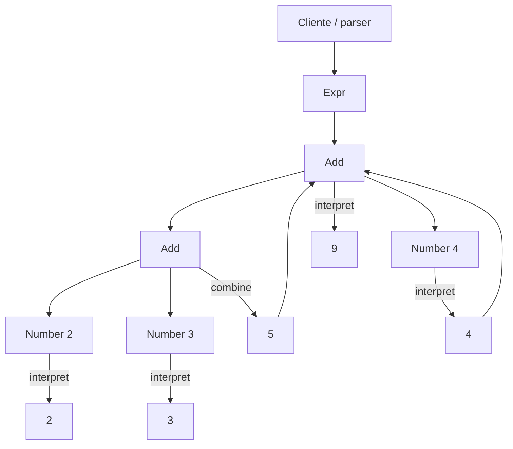

# Interpreter

> **Familia:** Behavioral  
> **Intención:** representar una gramática pequeña y su semántica de evaluación para construir, combinar e interpretar expresiones de forma uniforme.  
> **Estado:** `validated`  
> **Implementaciones de lenguaje:** `49/49`  
> **Cobertura de pruebas:** N/A — artefactos standalone políglotas; se usa compile/analyze/runtime por ecosistema en lugar de un porcentaje agregado sintético.  
> **Mapa:** [Volver al catálogo y mapa de relaciones](README.md)

## En una frase

Interpreter convierte las reglas de un lenguaje pequeño en una representación ejecutable capaz de evaluar expresiones válidas de esa gramática.

## El problema

Cuando un sistema evalúa repetidamente expresiones de un DSL acotado —reglas, filtros o fórmulas—, dispersar la semántica en condicionales del consumidor mezcla construcción, representación y evaluación. El patrón conviene cuando la gramática es pequeña y estable, las expresiones concretas varían y la semántica necesita permanecer explícita y comprobable.

## Fuerzas que compiten

- La gramática y su semántica deben ser visibles y verificables.
- Las expresiones deben componerse sin duplicar la lógica de evaluación.
- Parsing y evaluación son responsabilidades distintas: producir un AST no equivale a interpretarlo.
- Añadir una producción pequeña debería ser local; una gramática grande puede volver el diseño costoso.
- La intención no depende de clases: ADTs, tagged unions, términos, predicados, records, tablas o datos relacionales también pueden expresarla.
- Un intérprete directo privilegia claridad; un compilador o representación optimizada puede ser mejor cuando importan escala, diagnostics u optimización.

## La solución

Representar las producciones relevantes como nodos o valores y definir una operación de interpretación. Los terminales producen valores básicos; los no terminales interpretan y combinan subexpresiones. Un contexto aporta variables cuando hace falta. Los ejemplos de cierre usan una gramática mínima equivalente a `Expr := Number ('+' Number)*` o una expresión binaria comparable.

## Participantes y responsabilidades

| Participante | Responsabilidad |
|---|---|
| `Expression` / nodo | Representa una producción o expresión. |
| Terminal | Produce un valor básico. |
| No terminal | Combina o transforma subexpresiones. |
| `Context` | Aporta variables o estado externo de evaluación. |
| Cliente / parser | Construye una expresión válida; puede vivir fuera del patrón. |

## Cómo funciona

1. El cliente construye `Add(Add(Number(2), Number(3)), Number(4))` o su equivalente idiomático.
2. Cada `Number` interpreta su valor.
3. Cada `Add` interpreta recursivamente sus operandos y combina los resultados.
4. La expresión completa produce `9`.
5. Otra expresión de la misma gramática usa el mismo mecanismo sin añadir condicionales al consumidor.

## Diagrama



## Ejemplo mínimo

```text
expression = Add(Add(Number(2), Number(3)), Number(4))
interpret(expression)
=> 9
```

## Aplicación real

Interpreter encaja en DSLs pequeños de reglas, filtros o políticas donde el vocabulario está controlado y la evaluación es más importante que construir un lenguaje de propósito general. Si la gramática crece hasta requerir precedencia compleja, recuperación de errores, optimización o tooling amplio, un parser/compilador o motor especializado suele ser más sostenible.

## En Genkidama

No existe actualmente un uso deliberado de Interpreter en la arquitectura productiva de Genkidama. El patrón vive en el catálogo y sus ejemplos pedagógicos; el proyecto no introduce una DSL o jerarquía artificial para exhibirlo.

## Cuándo usarlo

- Existe un lenguaje o DSL pequeño con gramática estable y explícita.
- Muchas expresiones deben evaluarse con la misma semántica.
- Las reglas se representan naturalmente como árbol, ADT, términos, tokens u otra estructura componible.
- Es valioso probar cada producción y su composición de forma aislada.

## Cuándo no usarlo

- Una función o `switch` pequeño expresa mejor una regla que no necesita lenguaje propio.
- La gramática es grande o exige diagnostics, optimización y tooling sofisticado.
- Sólo se necesita seleccionar entre algoritmos intercambiables; [Strategy](Strategy.md) comunica mejor esa fuerza.
- Ya existe un parser o motor de reglas mantenido que resuelve el problema con menor costo.
- Sólo existe un parser que produce AST, sin semántica de evaluación.

## Consecuencias y trade-offs

| A favor | Costo / riesgo |
|---|---|
| Hace explícitas gramática y semántica. | Puede multiplicar nodos/casos al crecer la gramática. |
| Permite composición y pruebas aisladas. | Interpretar árboles puede ser más lento que compilar u optimizar. |
| Funciona en paradigmas OO, funcionales, lógicos y declarativos programables. | Parsing y evaluación pueden confundirse si no se separan. |
| Facilita añadir producciones pequeñas. | Operaciones transversales sobre todo el AST pueden favorecer Visitor. |
| El contexto hace visibles variables externas. | Un contexto mutable o enorme puede ocultar dependencias. |

## Patrones relacionados

[Consulta también el mapa global de relaciones](README.md#relationship-map).

| Patrón | Relación | Por qué importa |
|---|---|---|
| [Composite](Composite.md) | often implemented with | Las expresiones suelen formar árboles parte-todo. |
| [Visitor](Visitor.md) | collaborates with | Separa operaciones cuando muchas deben aplicarse al mismo AST. |
| [Flyweight](Flyweight.md) | collaborates with | Puede compartir terminales o símbolos repetidos cuando el volumen lo justifica. |
| [Strategy](Strategy.md) | often confused with | Strategy selecciona un algoritmo; Interpreter define semántica de una gramática. |
| [Command](Command.md) | often confused with | Command reifica una solicitud; Interpreter evalúa una expresión. |

## Errores comunes y confusiones

### Parser ≠ Interpreter

Un parser transforma texto en tokens o AST. Interpreter define qué significa esa estructura al evaluarla. Pueden colaborar, pero uno no demuestra automáticamente al otro.

### Forzar una clase por producción

La intención no depende de OOP. Pattern matching sobre ADTs, términos Prolog, tablas Lua, predicados, structs o datos relacionales pueden ser más idiomáticos.

### Usarlo para una gramática demasiado grande

Si aparecen cientos de producciones, optimización, diagnostics ricos o fases de compilación, la simplicidad original desaparece y conviene tooling especializado.

### Esconder la semántica en el cliente

Si los nodos son sólo DTOs y un consumidor gigante decide todo su significado, la gramática está representada pero la interpretación sigue centralizada.

## Cómo comprobar una implementación

- Hay representación explícita de terminal y composición no terminal, o equivalente idiomático.
- Evaluar `2 + 3 + 4` —o el contrato equivalente documentado por el target— produce el resultado esperado.
- La composición interpreta subexpresiones; el resultado no está hardcodeado.
- El ejemplo canónico es individualmente direccionable; un runner multipatrón sólo lo orquesta.
- Donde es razonable, el gate compila/analiza y ejecuta; si el runtime propietario no está disponible se usa el contrato estático más fuerte disponible y se documenta esa limitación.

## Implementaciones por lenguaje

Universo actual: **51 targets**: **49 Applicable** y **2 N/A**. HTML y CSS pueden describir estructura o reglas, pero por sí mismos no permiten al autor definir y ejecutar la semántica programable de otra gramática. La ausencia de clases no excluye a ningún target.

| Lenguaje / target | Aplicabilidad | Ejemplo canónico | Validación |
|---|---|---|---|
| C# | Applicable | [`Interpreter.cs`](../src/Enterprise/C%23/patterns/Interpreter.cs) | .NET/cohort ✅ |
| TypeScript | Applicable | [`interpreter.ts`](../src/Web/TypeScriptTS/patterns/interpreter.ts) | Node/cohort ✅ |
| Python | Applicable | [`interpreter.py`](../src/Scripting/PythonPY/patterns/interpreter.py) | standalone + runner ✅ |
| C++ | Applicable | [`interpreter.cpp`](../src/Systems/C%2B%2B/patterns/interpreter.cpp) | native/cohort ✅ |
| Java | Applicable | [`interpreter.java`](../src/Enterprise/Java/patterns/interpreter.java) | JVM/cohort ✅ |
| Rust | Applicable | [`interpreter.rs`](../src/Systems/Rust/patterns/interpreter.rs) | native/cohort ✅ |
| Go | Applicable | [`interpreter.go`](../src/Systems/Go/interpreter.go) | Interpreter Final ✅ |
| PHP | Applicable | [`interpreter.php`](../src/Scripting/PHP/patterns/interpreter.php) | PHP gate ✅ |
| F# | Applicable | [`Interpreter.fsx`](../src/Functional/F%23/patterns/Interpreter.fsx) | .NET/cohort ✅ |
| JavaScript | Applicable | [`interpreter.js`](../src/Web/JavaScriptJS/patterns/interpreter.js) | Node gate ✅ |
| SQL declarativo | Applicable | [`interpreter.sql`](../src/Data/SQL/interpreter.sql) | SQLite runtime ✅ |
| Kotlin | Applicable | [`Interpreter.kt`](../src/Enterprise/Kotlin/patterns/Interpreter.kt) | JVM/cohort ✅ |
| Swift | Applicable | [`Interpreter.swift`](../src/Systems/Swift/patterns/Interpreter.swift) | Swift/cohort ✅ |
| Visual Basic .NET | Applicable | [`Interpreter.vb`](../src/Enterprise/VB.NET/patterns/Interpreter.vb) | .NET/cohort ✅ |
| C | Applicable | [`interpreter.c`](../src/Systems/C/patterns/interpreter.c) | native/cohort ✅ |
| Ruby | Applicable | [`interpreter.rb`](../src/Scripting/Ruby/patterns/interpreter.rb) | Ruby gate ✅ |
| Lua | Applicable | [`interpreter.lua`](../src/Scripting/Lua/patterns/interpreter.lua) | Lua gate ✅ |
| Bash | Applicable | [`interpreter.sh`](../src/Scripting/Bash/patterns/interpreter.sh) | Bash gate ✅ |
| PowerShell | Applicable | [`interpreter.ps1`](../src/Scripting/PowerShell/patterns/interpreter.ps1) | PowerShell gate ✅ |
| Haskell | Applicable | [`Interpreter.hs`](../src/Functional/Haskell/Interpreter.hs) | GHC/Interpreter Final ✅ |
| Perl | Applicable | [`interpreter.pl`](../src/Scripting/Perl/interpreter.pl) | Perl runtime ✅ |
| Pascal | Applicable | [`interpreter_pattern.pas`](../src/Systems/Pascal/interpreter_pattern.pas) | GNU/cohort ✅ |
| R | Applicable | [`interpreter.R`](../src/DataScience/R/patterns/interpreter.R) | R/cohort ✅ |
| GNU Octave | Applicable | [`interpreter.m`](../src/DataScience/Octave/patterns/interpreter.m) | Octave/cohort ✅ |
| OCaml | Applicable | [`interpreter.ml`](../src/Functional/OCaml/patterns/interpreter.ml) | OCaml/cohort ✅ |
| Common Lisp | Applicable | [`interpreter.lisp`](../src/Functional/CommonLisp/patterns/interpreter.lisp) | SBCL/cohort ✅ |
| Scala | Applicable | [`Interpreter.scala`](../src/Functional/Scala/patterns/Interpreter.scala) | JVM/cohort ✅ |
| Julia | Applicable | [`interpreter.jl`](../src/DataScience/Julia/interpreter.jl) | Julia runtime ✅ |
| Clojure | Applicable | [`interpreter.clj`](../src/Functional/Clojure/patterns/interpreter.clj) | JVM/cohort ✅ |
| Elixir | Applicable | [`interpreter.exs`](../src/Functional/Elixir/patterns/interpreter.exs) | Elixir/cohort ✅ |
| Erlang | Applicable | [`interpreter.erl`](../src/Functional/Erlang/patterns/interpreter.erl) | Erlang/cohort ✅ |
| Prolog | Applicable | [`interpreter.pl`](../src/Functional/Prolog/patterns/interpreter.pl) | SWI-Prolog/cohort ✅ |
| Groovy | Applicable | [`interpreter.groovy`](../src/Functional/Groovy/patterns/interpreter.groovy) | Groovy/cohort ✅ |
| Ada | Applicable | [`interpreter_pattern.adb`](../src/Systems/Ada/interpreter_pattern.adb) | GNU/cohort ✅ |
| Solidity | Applicable | [`Interpreter.sol`](../src/Niche/Solidity/patterns/Interpreter.sol) | Solidity/cohort ✅ |
| Fortran | Applicable | [`interpreter.f90`](../src/Systems/Fortran/patterns/interpreter.f90) | GNU/cohort ✅ |
| Objective-C | Applicable | [`interpreter.m`](../src/Systems/Objective-C/interpreter.m) | Clang/GNUstep ✅ |
| Zig | Applicable | [`interpreter.zig`](../src/Systems/Zig/interpreter.zig) | Zig runtime ✅ |
| Nim | Applicable | [`interpreter.nim`](../src/Niche/Nim/interpreter.nim) | Nim runtime ✅ |
| Dart | Applicable | [`interpreter.dart`](../src/Web/Dart/interpreter.dart) | Dart runtime ✅ |
| Crystal | Applicable | [`interpreter.cr`](../src/Niche/Crystal/interpreter.cr) | Crystal runtime ✅ |
| COBOL | Applicable | [`interpreter_pattern.cpy`](../src/Historical/Cobol/patterns/interpreter_pattern.cpy) | GNU/cohort ✅ |
| VBA | Applicable | [`InterpreterExample.bas`](../src/Shell/VBA/InterpreterExample.bas) | source contract ✅ |
| GDScript | Applicable | [`interpreter.gd`](../src/Niche/GDScript/interpreter.gd) | Godot runtime ✅ |
| Assembly | Applicable | [`interpreter.asm`](../src/LowLevel/Assembly/interpreter.asm) | NASM + runtime ✅ |
| Delphi | Applicable | [`InterpreterExample.pas`](../src/Enterprise/Delphi/InterpreterExample.pas) | source contract ✅ |
| MicroPython | Applicable | [`interpreter.py`](../src/Other/MicroPython/interpreter.py) | MicroPython runtime ✅ |
| Rockstar | Applicable | [`interpreter.rock`](../src/Other/Rockstar/interpreter.rock) | Rockstar runtime ✅ |
| MATLAB | Applicable | [`interpreter.m`](../src/DataScience/MATLAB/interpreter.m) | MATLAB Actions ✅ |
| HTML | N/A | — | markup declarativo sin evaluador programable de otra gramática |
| CSS | N/A | — | reglas de estilo sin mecanismo general para construir/ejecutar un intérprete |

## Comprueba que lo entendiste

1. Si un parser ya produce un AST, ¿qué responsabilidad adicional debe existir para demostrar Interpreter?
2. ¿Por qué un ADT con pattern matching puede expresar Interpreter tan válidamente como una jerarquía de clases?
3. ¿Qué señales indican que la gramática dejó de ser lo bastante pequeña para este patrón?

## Resumen

- Interpreter hace explícitas una gramática pequeña y su semántica.
- Parsing no equivale a interpretación.
- Clases no son requisito; ADTs, términos, records, predicados y datos pueden preservar la intención.
- Composite aparece naturalmente en árboles de expresión y Visitor puede separar operaciones transversales.
- Genkidama no fuerza actualmente Interpreter en arquitectura productiva.

## Referencias

- Gamma, Helm, Johnson y Vlissides, *Design Patterns: Elements of Reusable Object-Oriented Software*.
- [Patterns as Living Examples](../docs/philosophy/001-patterns-as-living-examples.md).
- [KB-006 — Canonical Design Pattern Authoring Standard](../docs/kb/catalog/pattern-authoring-standard.md).
