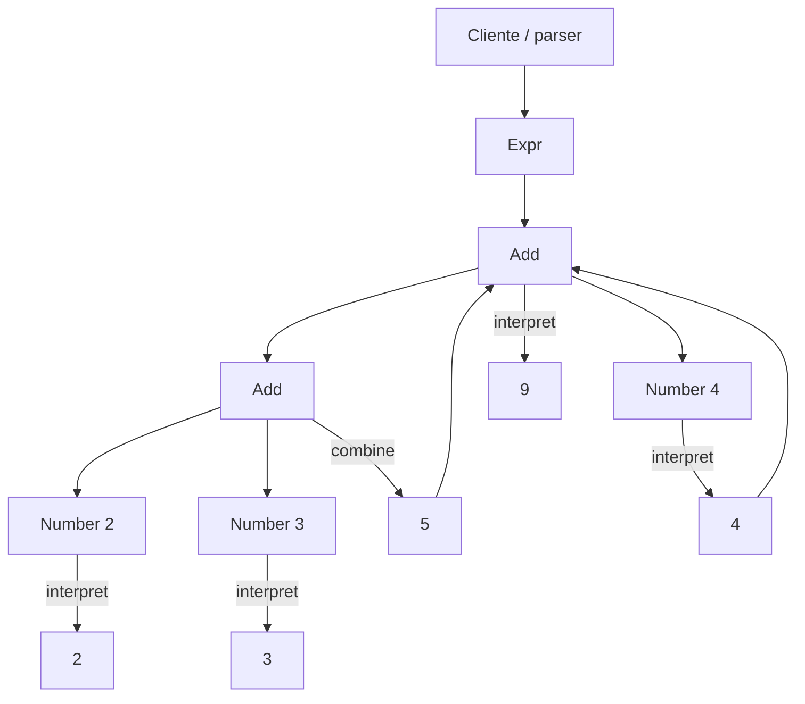

# Interpreter

> **Familia:** Behavioral  
> **Intención:** representar una gramática y su semántica de evaluación de forma explícita para que expresiones de un lenguaje pequeño puedan construirse, combinarse e interpretarse de manera uniforme.  
> **Estado:** `validated`  
> **Implementaciones de lenguaje:** `49/49`  
> **Cobertura de pruebas:** N/A — los ejemplos son artefactos standalone políglotas; compile/analyze/runtime por ecosistema aporta una señal más fuerte que un porcentaje agregado sintético.  
> **Mapa:** [Volver al catálogo y mapa de relaciones](README.md)

## En una frase

Interpreter convierte las reglas de un lenguaje pequeño en una estructura ejecutable que sabe evaluar expresiones válidas de esa gramática.

## El problema

Un sistema necesita evaluar repetidamente expresiones de un lenguaje acotado: reglas, filtros, fórmulas o comandos con una gramática pequeña. Resolver cada variante con condicionales dispersos mezcla parsing, representación y semántica, y hace difícil extender o razonar sobre las reglas del lenguaje.

El patrón resulta útil cuando la gramática es suficientemente estable y pequeña para representarse directamente, pero las expresiones concretas varían y deben evaluarse muchas veces. Si el lenguaje crece hasta necesitar recuperación de errores, optimización, análisis semántico complejo o tooling completo, un parser/compilador dedicado suele ser más apropiado.

## Fuerzas que compiten

- La gramática y su semántica deben permanecer visibles y comprobables.
- Las expresiones concretas deben poder componerse sin duplicar lógica de evaluación.
- Añadir una producción sencilla debería localizar el cambio en una representación coherente.
- Parsing y evaluación son responsabilidades relacionadas pero distintas: construir un AST no equivale a interpretarlo.
- Una jerarquía de clases no es requisito; ADTs, tagged unions, tuples, tablas, predicados o datos relacionales pueden expresar la misma intención.
- Una gramática grande puede provocar demasiados tipos, ramas o recorridos y hacer que el patrón deje de ser económico.

## La solución

Representar las producciones relevantes de la gramática como valores o nodos y definir una operación de interpretación sobre ellos. Los nodos terminales producen valores básicos; los no terminales combinan resultados de subexpresiones. El contexto aporta variables u otros datos externos cuando la evaluación los necesita.

Los ejemplos de cierre usan deliberadamente una gramática mínima equivalente a `Expr := Number ('+' Number)*` o una expresión binaria comparable. Lo importante no es la sintaxis superficial del lenguaje anfitrión, sino que exista una representación explícita de la expresión y una semántica ejecutable que la recorra.

## Participantes y responsabilidades

| Participante | Responsabilidad |
|---|---|
| `Expression` / nodo | Representa una producción o expresión del lenguaje. |
| Terminal | Produce un valor sin delegar en otras expresiones. |
| No terminal | Combina o transforma una o más subexpresiones. |
| `Context` | Aporta variables o estado externo requerido por la evaluación. |
| Cliente / parser | Construye la expresión válida; puede existir fuera del patrón. |

## Cómo funciona

1. El cliente construye `Add(Add(Number(2), Number(3)), Number(4))` o su equivalente idiomático.
2. Cada `Number` interpreta su valor terminal.
3. Cada `Add` interpreta recursivamente sus operandos y combina los resultados.
4. La expresión completa produce `9`.
5. El mismo mecanismo puede interpretar otra expresión de la misma gramática sin añadir condicionales al cliente.

## Diagrama



## Ejemplo mínimo

```text
expression = Add(Add(Number(2), Number(3)), Number(4))
interpret(expression)
=> 9
```

El cliente manipula una expresión del lenguaje; la semántica de cada producción vive en el intérprete o en la representación correspondiente, no en una cadena de `if` del consumidor.

## Aplicación real

Interpreter encaja bien en DSLs pequeños de reglas, filtros, políticas o expresiones donde el vocabulario está controlado y la evaluación es más importante que construir un lenguaje de propósito general. Por ejemplo, una regla `and(isActive, hasRole("admin"))` puede representarse como un árbol y evaluarse contra distintos contextos sin codificar cada combinación en el consumidor.

No es una recomendación para construir un compilador completo con una clase por producción. Cuando la gramática crece, herramientas de parsing, bytecode, visitors especializados o un motor de reglas pueden ofrecer una estructura más sostenible.

## En Genkidama

No existe actualmente un uso deliberado de Interpreter en la arquitectura productiva de Genkidama. El patrón vive en el catálogo y sus ejemplos pedagógicos. Esta ausencia es intencionalmente explícita: el proyecto no introduce una DSL o jerarquía de expresiones artificial sólo para exhibir el patrón.

## Cuándo usarlo

- Existe un lenguaje o DSL pequeño con una gramática estable y explícita.
- Muchas expresiones distintas deben evaluarse con la misma semántica.
- Las reglas pueden representarse naturalmente como árbol, ADT, términos, tokens u otra estructura composable.
- Es valioso poder probar cada producción y la composición de expresiones de manera aislada.
- Extender el lenguaje con unas pocas producciones sigue siendo barato y comprensible.

## Cuándo no usarlo

- Una función o un `switch` pequeño expresa mejor una regla que no necesita lenguaje propio.
- La gramática es grande, cambia con frecuencia o requiere precedencia, recuperación de errores, optimización y tooling sofisticado.
- El problema real es sólo seleccionar entre algoritmos intercambiables; considera [Strategy](Strategy.md).
- Ya existe una biblioteca/parser/motor de reglas bien soportado que resuelve el lenguaje con menos mantenimiento.
- Se pretende llamar Interpreter a un parser que sólo produce un AST pero no define su semántica de evaluación.

## Consecuencias y trade-offs

| A favor | Costo / riesgo |
|---|---|
| Hace explícitas gramática y semántica. | Puede producir muchos nodos o casos conforme crece la gramática. |
| Permite componer expresiones y probarlas aisladamente. | Un árbol interpretado puede ser más lento que código compilado o una representación optimizada. |
| Se expresa en paradigmas OO, funcionales, lógicos y declarativos programables. | Parsing, validación y evaluación pueden confundirse si no se separan responsabilidades. |
| Facilita añadir producciones pequeñas de forma localizada. | Cambios transversales sobre todas las producciones pueden favorecer Visitor u otra representación. |
| El contexto hace explícitas variables y dependencias de evaluación. | Un contexto mutable o sobredimensionado puede ocultar dependencias y efectos. |

## Patrones relacionados

[Consulta también el mapa global de relaciones](README.md#relationship-map).

| Patrón | Relación | Por qué importa |
|---|---|---|
| [Composite](Composite.md) | often implemented with | Una expresión suele formar un árbol parte-todo donde terminales y no terminales se recorren uniformemente. |
| [Visitor](Visitor.md) | collaborates with | Cuando muchas operaciones deben aplicarse al mismo AST, Visitor puede separar esas operaciones de los nodos. |
| [Flyweight](Flyweight.md) | collaborates with | Terminales o símbolos repetidos pueden compartir estado intrínseco cuando el volumen lo justifica. |
| [Strategy](Strategy.md) | often confused with | Strategy selecciona un algoritmo; Interpreter define la semántica de expresiones de una gramática. |
| [Command](Command.md) | often confused with | Command reifica una solicitud para ejecutarla; Interpreter evalúa una expresión conforme a reglas de lenguaje. |

## Errores comunes y confusiones

### Confundir parser con Interpreter

Un parser transforma texto en tokens o AST. Interpreter define qué significa esa estructura al evaluarla. Pueden coexistir, pero uno no demuestra automáticamente al otro.

### Forzar una clase por producción

La intención no depende de OOP. Un ADT con pattern matching, una tagged union, términos Prolog, tablas Lua, predicados, structs con function pointers o filas SQL pueden representar producciones y su semántica de forma más idiomática.

### Usarlo para una gramática demasiado grande

La simplicidad inicial puede degradarse en cientos de nodos y reglas. Si el lenguaje requiere pipeline de compilación, optimización o diagnostics ricos, conviene adoptar herramientas diseñadas para ello.

### Esconder toda la semántica en el cliente

Si los nodos son sólo DTOs y un consumidor gigante decide qué significa cada combinación, la gramática está representada pero la responsabilidad de interpretación sigue centralizada y puede perder la claridad que justifica el patrón.

## Cómo comprobar una implementación

- Existe una representación explícita de al menos una expresión terminal y una composición no terminal, o su equivalente idiomático.
- Evaluar `2 + 3 + 4` —o el contrato equivalente documentado por el target— produce el resultado esperado.
- La evaluación compuesta obtiene sus resultados recorriendo/interpretando subexpresiones, no mediante un valor final hardcodeado.
- El ejemplo canónico individual puede localizarse desde esta página; un runner multipatrón sólo lo orquesta y no lo sustituye.
- Cuando el ecosistema permite ejecución razonable, el gate compila/analiza y ejecuta el comportamiento; cuando no, se usa el contrato estático más fuerte disponible y se documenta la limitación.

## Implementaciones por lenguaje

Universo actual: **51 targets**. Interpreter clasifica **49 Applicable** y **2 N/A**. HTML y CSS pueden describir estructura o reglas declarativas, pero por sí mismos no ofrecen al autor un mecanismo programable para definir y ejecutar la semántica de otra gramática. La ausencia de clases no es criterio de exclusión: los otros targets usan funciones, ADTs, términos, records, predicados, tagged unions, objetos, datos o mecanismos equivalentes.

Los 49 targets Applicable tienen un artefacto canónico individual y evidencia proporcional al ecosistema. Los runners y ledgers agregados sirven como orquestación/evidencia, nunca como reemplazo de la celda canónica `pattern × language`.

| Lenguaje / target | Aplicabilidad | Ejemplo canónico | Validación |
|---|---|---|---|
| C# | Applicable | [`Interpreter.cs`](../src/Enterprise/C%23/patterns/Interpreter.cs) | cohort/.NET gate ✅ |
| TypeScript | Applicable | [`interpreter.ts`](../src/Web/TypeScriptTS/patterns/interpreter.ts) | portable-functional/Node gate ✅ |
| Python | Applicable | [`interpreter.py`](../src/Scripting/PythonPY/patterns/interpreter.py) | Python standalone + runner gate ✅ |
| C++ | Applicable | [`interpreter.cpp`](../src/Systems/C%2B%2B/patterns/interpreter.cpp) | portable-functional native gate ✅ |
| Java | Applicable | [`Interpreter.java`](../src/Enterprise/Java/patterns/Interpreter.java) | portable-functional JVM gate ✅ |
| Rust | Applicable | [`interpreter.rs`](../src/Systems/Rust/patterns/interpreter.rs) | portable-functional native gate ✅ |
| Go | Applicable | [`interpreter.go`](../src/Systems/Go/interpreter.go) | Interpreter final Go gate ✅ |
| PHP | Applicable | [`interpreter.php`](../src/Scripting/PHP/patterns/interpreter.php) | PHP/portable gate ✅ |
| F# | Applicable | [`Interpreter.fsx`](../src/Functional/F%23/patterns/Interpreter.fsx) | .NET cohort gate ✅ |
| JavaScript | Applicable | [`interpreter.js`](../src/Web/JavaScriptJS/patterns/interpreter.js) | JavaScript/Node gate ✅ |
| SQL declarativo | Applicable | [`interpreter.sql`](../src/Data/SQL/interpreter.sql) | Interpreter final SQLite runtime ✅ |
| Kotlin | Applicable | [`Interpreter.kt`](../src/Enterprise/Kotlin/patterns/Interpreter.kt) | JVM cohort gate ✅ |
| Swift | Applicable | [`Interpreter.swift`](../src/Systems/Swift/patterns/Interpreter.swift) | Swift cohort gate ✅ |
| Visual Basic .NET | Applicable | [`Interpreter.vb`](../src/Enterprise/VB.NET/patterns/Interpreter.vb) | .NET cohort gate ✅ |
| C | Applicable | [`interpreter.c`](../src/Systems/C/patterns/interpreter.c) | portable-functional native gate ✅ |
| Ruby | Applicable | [`interpreter.rb`](../src/Scripting/Ruby/patterns/interpreter.rb) | Ruby gate ✅ |
| Lua | Applicable | [`interpreter.lua`](../src/Scripting/Lua/patterns/interpreter.lua) | Lua gate ✅ |
| Bash | Applicable | [`interpreter.sh`](../src/Scripting/Bash/patterns/interpreter.sh) | Bash gate ✅ |
| PowerShell | Applicable | [`interpreter.ps1`](../src/Scripting/PowerShell/patterns/interpreter.ps1) | PowerShell gate ✅ |
| Haskell | Applicable | [`Interpreter.hs`](../src/Functional/Haskell/Interpreter.hs) | Interpreter final GHC gate ✅ |
| Perl | Applicable | [`interpreter.pl`](../src/Scripting/Perl/interpreter.pl) | Interpreter final Perl runtime ✅ |
| Pascal | Applicable | [`interpreter_pattern.pas`](../src/Systems/Pascal/interpreter_pattern.pas) | GNU/Pascal cohort gate ✅ |
| R | Applicable | [`interpreter.R`](../src/DataScience/R/patterns/interpreter.R) | portable-functional R gate ✅ |
| GNU Octave | Applicable | [`interpreter.m`](../src/DataScience/Octave/patterns/interpreter.m) | portable-functional Octave gate ✅ |
| OCaml | Applicable | [`interpreter.ml`](../src/Functional/OCaml/patterns/interpreter.ml) | portable-functional OCaml gate ✅ |
| Common Lisp | Applicable | [`interpreter.lisp`](../src/Functional/CommonLisp/patterns/interpreter.lisp) | portable-functional SBCL gate ✅ |
| Scala | Applicable | [`Interpreter.scala`](../src/Functional/Scala/patterns/Interpreter.scala) | JVM cohort gate ✅ |
| Julia | Applicable | [`interpreter.jl`](../src/DataScience/Julia/interpreter.jl) | Interpreter final Julia runtime ✅ |
| Clojure | Applicable | [`interpreter.clj`](../src/Functional/Clojure/patterns/interpreter.clj) | JVM cohort gate ✅ |
| Elixir | Applicable | [`interpreter.exs`](../src/Functional/Elixir/patterns/interpreter.exs) | portable-functional Elixir gate ✅ |
| Erlang | Applicable | [`interpreter.erl`](../src/Functional/Erlang/patterns/interpreter.erl) | portable-functional Erlang gate ✅ |
| Prolog | Applicable | [`interpreter.pl`](../src/Functional/Prolog/patterns/interpreter.pl) | portable-functional SWI-Prolog gate ✅ |
| Groovy | Applicable | [`interpreter.groovy`](../src/Functional/Groovy/patterns/interpreter.groovy) | portable-functional Groovy gate ✅ |
| Ada | Applicable | [`interpreter_pattern.adb`](../src/Systems/Ada/interpreter_pattern.adb) | GNU/Ada cohort gate ✅ |
| Solidity | Applicable | [`Interpreter.sol`](../src/Niche/Solidity/patterns/Interpreter.sol) | Solidity cohort gate ✅ |
| Fortran | Applicable | [`interpreter.f90`](../src/Systems/Fortran/patterns/interpreter.f90) | GNU/Fortran cohort gate ✅ |
| Objective-C | Applicable | [`interpreter.m`](../src/Systems/Objective-C/interpreter.m) | Interpreter final Clang/GNUstep gate ✅ |
| Zig | Applicable | [`interpreter.zig`](../src/Systems/Zig/interpreter.zig) | Interpreter final Zig gate ✅ |
| Nim | Applicable | [`interpreter.nim`](../src/Niche/Nim/interpreter.nim) | Nim + Interpreter final gate ✅ |
| Dart | Applicable | [`interpreter.dart`](../src/Web/Dart/interpreter.dart) | Interpreter final Dart gate ✅ |
| Crystal | Applicable | [`interpreter.cr`](../src/Niche/Crystal/interpreter.cr) | Interpreter final Crystal gate ✅ |
| COBOL | Applicable | [`interpreter_pattern.cpy`](../src/Historical/Cobol/patterns/interpreter_pattern.cpy) | GNU/COBOL cohort gate ✅ |
| VBA | Applicable | [`InterpreterExample.bas`](../src/Shell/VBA/InterpreterExample.bas) | Interpreter final source contract ✅ |
| GDScript | Applicable | [`interpreter.gd`](../src/Niche/GDScript/interpreter.gd) | Interpreter final Godot runtime ✅ |
| Assembly | Applicable | [`interpreter.asm`](../src/LowLevel/Assembly/interpreter.asm) | Interpreter final NASM + runtime ✅ |
| Delphi | Applicable | [`InterpreterExample.pas`](../src/Enterprise/Delphi/InterpreterExample.pas) | Interpreter final source contract ✅ |
| MicroPython | Applicable | [`interpreter.py`](../src/Other/MicroPython/interpreter.py) | Interpreter final MicroPython runtime ✅ |
| Rockstar | Applicable | [`interpreter.rock`](../src/Other/Rockstar/interpreter.rock) | Interpreter final Rockstar runtime ✅ |
| MATLAB | Applicable | [`interpreter.m`](../src/DataScience/MATLAB/interpreter.m) | native MATLAB Actions gate ✅ |
| HTML | N/A | — | markup declarativo: puede representar estructura, pero no ejecutar la semántica de otra gramática por sí mismo |
| CSS | N/A | — | lenguaje declarativo de estilos sin mecanismo general del autor para construir y ejecutar un intérprete |

## Comprueba que lo entendiste

1. Si un parser ya produce un AST, ¿qué responsabilidad adicional debe existir para que el diseño demuestre Interpreter?
2. ¿Por qué un ADT con pattern matching puede expresar Interpreter tan válidamente como una jerarquía de clases?
3. ¿Qué señales indicarían que la gramática dejó de ser lo bastante pequeña para que Interpreter siga siendo una buena elección?

## Resumen

- Interpreter hace explícitas la gramática de un lenguaje pequeño y su semántica de evaluación.
- Parsing y interpretación son responsabilidades distintas: construir una expresión no equivale a evaluarla.
- La intención es portable a paradigmas sin clases mediante ADTs, tagged unions, términos, predicados, records, datos y funciones.
- Composite aparece naturalmente cuando las expresiones forman árboles; Visitor ayuda cuando crecen las operaciones sobre ese árbol.
- Genkidama no fuerza actualmente Interpreter en su arquitectura productiva; el catálogo conserva el ejemplo como conocimiento ejecutable.

## Referencias

- Gamma, Helm, Johnson y Vlissides, *Design Patterns: Elements of Reusable Object-Oriented Software*.
- [Patterns as Living Examples](../docs/philosophy/001-patterns-as-living-examples.md).
- [KB-006 — Canonical Design Pattern Authoring Standard](../docs/kb/catalog/pattern-authoring-standard.md).
