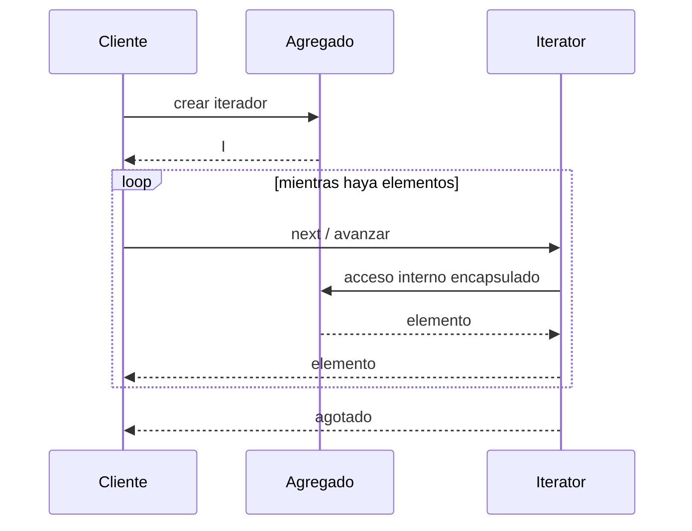

# Iterator

> **Familia:** Behavioral  
> **Intención:** proporcionar una forma de recorrer secuencialmente los elementos de un agregado sin exponer su representación interna.  
> **Estado:** `validated`  
> **Implementaciones de lenguaje:** `49/49`  
> **Cobertura de pruebas:** N/A — ejemplos standalone políglotas; se usa compile/analyze/runtime por ecosistema en lugar de un porcentaje agregado sintético.  
> **Mapa:** [Volver al catálogo y mapa de relaciones](README.md)

## En una frase

Iterator separa la política de recorrido de la representación interna de una colección para que el cliente pueda avanzar elemento por elemento sin conocer cómo se almacenan.

## El problema

Un cliente necesita recorrer elementos de una colección, árbol, secuencia o agregado, pero acoplarlo a índices, nodos, punteros, consultas o estructuras internas hace que cada cambio de representación se propague a los consumidores. Además, distintos recorridos pueden necesitar estado independiente o políticas distintas sin exponer detalles del agregado.

## Fuerzas que compiten

- El cliente necesita recorrer elementos sin depender de la representación interna del agregado.
- El estado de recorrido debe poder vivir separado del agregado cuando existen recorridos simultáneos o repetibles.
- La solución debe aprovechar protocolos nativos de cada lenguaje cuando existen, no imitar mecánicamente una interfaz OO.
- Un recorrido explícito añade abstracción; para una colección trivial, la iteración nativa directa puede ser suficiente.
- El orden, agotamiento y comportamiento ante colección vacía deben ser observables y verificables.
- Diferentes recorridos pueden compartir el mismo agregado sin compartir accidentalmente un cursor mutable.

## La solución

Encapsular el estado y la regla de avance en un iterador —objeto, generador, closure, enumerador, proceso, predicado o mecanismo nativo equivalente— que entrega los elementos del agregado en una secuencia definida. El agregado conserva su representación; el cliente sólo conoce el protocolo de recorrido.

## Participantes y responsabilidades

| Participante | Responsabilidad |
|---|---|
| Agregado / colección | Conserva los elementos y su representación interna. |
| Iterador | Mantiene el estado de recorrido y determina el siguiente elemento. |
| Cliente | Consume el protocolo del iterador sin depender de índices, nodos o almacenamiento. |
| Política de recorrido | Define orden, filtrado o dirección cuando el caso necesita más de una variante. |

## Cómo funciona

1. El cliente solicita o construye un iterador para un agregado.
2. El iterador inicia su estado de recorrido sin revelar la representación interna.
3. Cada avance devuelve el elemento actual/siguiente según el protocolo idiomático del target.
4. El iterador indica agotamiento mediante el mecanismo natural del ecosistema.
5. Otro iterador puede recorrer el mismo agregado de forma independiente cuando el contrato lo permite.

## Diagrama



El cliente observa una secuencia y una condición de agotamiento; no necesita saber si el agregado usa arreglo, lista, árbol, consulta, tabla, mensajes u otra representación.

## Ejemplo mínimo

```text
coleccion = [10, 20, 30]
iterador = coleccion.iterator()

iterador.next() => 10
iterador.next() => 20
iterador.next() => 30
iterador.hasNext() => false
```

La forma concreta puede ser `__iter__`, `yield`, `Iterator`, `Enumerator`, lazy sequence, closure, predicado o cursor; el requisito es preservar la separación entre recorrido y representación.

## Aplicación real

Un árbol de componentes puede ofrecer recorrido depth-first sin obligar a cada consumidor a conocer hijos, índices y estructura de nodos. El cliente procesa una secuencia uniforme y el agregado conserva libertad para cambiar su representación. Si sólo existe una lista pequeña y el `for` nativo ya oculta correctamente su representación, introducir un tipo Iterator adicional no aporta valor.

## En Genkidama

No se encontró un uso productivo deliberado de Iterator que justifique introducir el patrón como arquitectura propia. Genkidama usa mecanismos normales de iteración de sus lenguajes donde corresponden; el patrón se mantiene en el catálogo y en ejemplos pedagógicos sin distorsionar la arquitectura productiva para exhibirlo.

## Cuándo usarlo

- El cliente debe recorrer un agregado sin conocer su estructura interna.
- Se necesitan recorridos independientes o simultáneos sobre el mismo agregado.
- Existen varias políticas de recorrido y conviene encapsularlas.
- El ecosistema ya ofrece un protocolo nativo de iteración que expresa naturalmente el intent.
- Cambiar la representación interna no debería obligar a reescribir consumidores.

## Cuándo no usarlo

- Un `for`, `foreach`, comprehensión o función de orden superior nativa ya expresa todo el recorrido sin filtrar representación.
- La colección es trivial y crear un tipo/capa adicional sólo añade ceremonia.
- La necesidad real es aplicar una nueva operación a cada tipo de nodo de una estructura; [Visitor](Visitor.md) puede expresar mejor esa fuerza.
- La necesidad es modelar la relación parte-todo, no recorrerla; [Composite](Composite.md) resuelve otra responsabilidad.
- El consumidor necesita acceso aleatorio explícito y el recorrido secuencial no simplifica el contrato.

## Consecuencias y trade-offs

| A favor | Costo / riesgo |
|---|---|
| Oculta la representación interna del agregado. | Añade un protocolo o estado adicional cuando la iteración nativa ya bastaba. |
| Permite recorridos independientes y repetibles cuando el contrato lo soporta. | Un cursor mutable compartido puede introducir dependencia temporal y errores sutiles. |
| Facilita variar el orden de recorrido sin cambiar al consumidor. | Más políticas de recorrido significan más comportamiento que probar. |
| Se expresa idiomáticamente en paradigmas OO, funcionales, lógicos y de scripting. | Traducir literalmente una interfaz OO puede producir ejemplos no idiomáticos. |
| Hace observable el contrato de orden y agotamiento. | Mutaciones concurrentes del agregado requieren una política explícita. |

## Patrones relacionados

[Consulta también el mapa global de relaciones](README.md#relationship-map).

| Patrón | Relación | Por qué importa |
|---|---|---|
| [Composite](Composite.md) | collaborates with | Iterator permite recorrer árboles Composite sin exponer su estructura interna. |
| [Visitor](Visitor.md) | collaborates with | Iterator decide cómo recorrer; Visitor decide qué operación ejecutar sobre tipos de elementos. |
| [Command](Command.md) | often confused with | Command encapsula una solicitud; Iterator encapsula estado y política de recorrido. |
| [Interpreter](Interpreter.md) | collaborates with | Un AST puede recorrerse con Iterator, mientras Interpreter conserva la semántica de evaluación. |

## Errores comunes y confusiones

### Un `for` no demuestra automáticamente el patrón

Un bucle es sintaxis de consumo. Existe intención de Iterator cuando el mecanismo de recorrido oculta la representación y encapsula el avance; muchos lenguajes ofrecen ese mecanismo de forma nativa, por lo que no hace falta crear clases adicionales.

### Iterator ≠ Visitor

Iterator responde **cómo avanzo por los elementos**. Visitor responde **qué operación hago según el tipo de elemento**. Pueden colaborar sobre la misma estructura, pero no son intercambiables.

### Compartir accidentalmente un cursor

Si dos consumidores reutilizan el mismo estado mutable cuando esperan recorridos independientes, uno altera la posición observada por el otro. La independencia o el carácter consumible debe quedar explícito en el contrato.

### Exponer índices o nodos internos

Si el cliente debe conocer offsets, enlaces o estructura física para avanzar, la representación continúa filtrándose y se pierde una fuerza central del patrón.

## Cómo comprobar una implementación

- Recorrer una colección conocida produce el orden documentado y todos los elementos exactamente una vez para ese recorrido.
- Colecciones vacías y de un solo elemento terminan correctamente.
- El agotamiento se expresa con el mecanismo idiomático del target y no mediante un valor ambiguo cuando puede evitarse.
- Cuando el contrato promete recorridos independientes/repetibles, dos iteradores no comparten accidentalmente posición mutable.
- El cliente no necesita índices, nodos, punteros ni detalles de almacenamiento para avanzar.
- El ejemplo canónico es individualmente direccionable; un runner multipatrón sólo lo orquesta y no esconde otra implementación.

## Implementaciones por lenguaje

Universo actual: **51 targets**: **49 Applicable** y **2 N/A**. HTML y CSS pueden expresar orden o selección declarativa, pero por sí solos no ofrecen al autor un estado programable de recorrido con avance/current controlable. La ausencia de clases no excluye a ningún target.

| Lenguaje / target | Aplicabilidad | Ejemplo canónico | Validación |
|---|---|---|---|
| C# | Applicable | [`Iterator.cs`](../src/Enterprise/C%23/patterns/Iterator.cs) | .NET/cohort ✅ |
| TypeScript | Applicable | [`iterator.ts`](../src/Web/TypeScriptTS/patterns/iterator.ts) | Node/cohort ✅ |
| Python | Applicable | [`iterator.py`](../src/Scripting/PythonPY/patterns/iterator.py) | standalone + runner ✅ |
| C++ | Applicable | [`iterator.cpp`](../src/Systems/C%2B%2B/patterns/iterator.cpp) | native/cohort ✅ |
| Java | Applicable | [`iterator.java`](../src/Enterprise/Java/patterns/iterator.java) | JVM/cohort ✅ |
| Rust | Applicable | [`iterator.rs`](../src/Systems/Rust/patterns/iterator.rs) | native/cohort ✅ |
| Go | Applicable | [`iterator.go`](../src/Systems/Go/iterator.go) | dedicated canonical gate ✅ |
| PHP | Applicable | [`iterator.php`](../src/Scripting/PHP/patterns/iterator.php) | PHP gate ✅ |
| F# | Applicable | [`Iterator.fsx`](../src/Functional/F%23/patterns/Iterator.fsx) | .NET/cohort ✅ |
| JavaScript | Applicable | [`iterator.js`](../src/Web/JavaScriptJS/patterns/iterator.js) | Node gate ✅ |
| SQL declarativo | Applicable | [`iterator.sql`](../src/Data/SQL/iterator.sql) | SQLite runtime ✅ |
| Kotlin | Applicable | [`Iterator.kt`](../src/Enterprise/Kotlin/patterns/Iterator.kt) | JVM/cohort ✅ |
| Swift | Applicable | [`Iterator.swift`](../src/Systems/Swift/patterns/Iterator.swift) | Swift/cohort ✅ |
| Visual Basic .NET | Applicable | [`Iterator.vb`](../src/Enterprise/VB.NET/patterns/Iterator.vb) | .NET/cohort ✅ |
| C | Applicable | [`iterator.c`](../src/Systems/C/patterns/iterator.c) | native/cohort ✅ |
| Ruby | Applicable | [`iterator.rb`](../src/Scripting/Ruby/patterns/iterator.rb) | Ruby gate ✅ |
| Lua | Applicable | [`iterator.lua`](../src/Scripting/Lua/patterns/iterator.lua) | Lua gate ✅ |
| Bash | Applicable | [`iterator.sh`](../src/Scripting/Bash/patterns/iterator.sh) | Bash gate ✅ |
| PowerShell | Applicable | [`iterator.ps1`](../src/Scripting/PowerShell/patterns/iterator.ps1) | PowerShell gate ✅ |
| Haskell | Applicable | [`Iterator.hs`](../src/Functional/Haskell/Iterator.hs) | dedicated canonical gate ✅ |
| Perl | Applicable | [`iterator.pl`](../src/Scripting/Perl/iterator.pl) | Perl runtime ✅ |
| Pascal | Applicable | [`iterator_pattern.pas`](../src/Systems/Pascal/iterator_pattern.pas) | GNU/cohort ✅ |
| R | Applicable | [`iterator.R`](../src/DataScience/R/patterns/iterator.R) | R/cohort ✅ |
| GNU Octave | Applicable | [`iterator.m`](../src/DataScience/Octave/patterns/iterator.m) | Octave/cohort ✅ |
| OCaml | Applicable | [`iterator.ml`](../src/Functional/OCaml/patterns/iterator.ml) | OCaml/cohort ✅ |
| Common Lisp | Applicable | [`iterator.lisp`](../src/Functional/CommonLisp/patterns/iterator.lisp) | SBCL/cohort ✅ |
| Scala | Applicable | [`Iterator.scala`](../src/Functional/Scala/patterns/Iterator.scala) | JVM/cohort ✅ |
| Julia | Applicable | [`iterator.jl`](../src/DataScience/Julia/iterator.jl) | dedicated canonical gate ✅ |
| Clojure | Applicable | [`iterator.clj`](../src/Functional/Clojure/patterns/iterator.clj) | JVM/cohort ✅ |
| Elixir | Applicable | [`iterator.exs`](../src/Functional/Elixir/patterns/iterator.exs) | Elixir/cohort ✅ |
| Erlang | Applicable | [`iterator.erl`](../src/Functional/Erlang/patterns/iterator.erl) | Erlang/cohort ✅ |
| Prolog | Applicable | [`iterator.pl`](../src/Functional/Prolog/patterns/iterator.pl) | SWI-Prolog/cohort ✅ |
| Groovy | Applicable | [`iterator.groovy`](../src/Functional/Groovy/patterns/iterator.groovy) | Groovy/cohort ✅ |
| Ada | Applicable | [`iterator_pattern.adb`](../src/Systems/Ada/iterator_pattern.adb) | GNU/cohort ✅ |
| Solidity | Applicable | [`Iterator.sol`](../src/Niche/Solidity/patterns/Iterator.sol) | Solidity/cohort ✅ |
| Fortran | Applicable | [`iterator.f90`](../src/Systems/Fortran/patterns/iterator.f90) | GNU/cohort ✅ |
| Objective-C | Applicable | [`iterator.m`](../src/Systems/Objective-C/iterator.m) | dedicated canonical gate ✅ |
| Zig | Applicable | [`iterator.zig`](../src/Systems/Zig/iterator.zig) | dedicated canonical gate ✅ |
| Nim | Applicable | [`iterator.nim`](../src/Niche/Nim/patterns/iterator.nim) | Nim canonical/cohort ✅ |
| Dart | Applicable | [`iterator.dart`](../src/Web/Dart/iterator.dart) | dedicated canonical gate ✅ |
| Crystal | Applicable | [`iterator.cr`](../src/Niche/Crystal/iterator.cr) | dedicated canonical gate ✅ |
| COBOL | Applicable | [`iterator_pattern.cpy`](../src/Historical/Cobol/patterns/iterator_pattern.cpy) | GNU/cohort ✅ |
| VBA | Applicable | [`IteratorExample.bas`](../src/Shell/VBA/IteratorExample.bas) | source contract ✅ |
| GDScript | Applicable | [`iterator.gd`](../src/Niche/GDScript/iterator.gd) | Godot runtime ✅ |
| Assembly | Applicable | [`iterator.asm`](../src/LowLevel/Assembly/iterator.asm) | NASM + runtime ✅ |
| Delphi | Applicable | [`IteratorExample.pas`](../src/Enterprise/Delphi/IteratorExample.pas) | source contract ✅ |
| MicroPython | Applicable | [`iterator.py`](../src/Other/MicroPython/iterator.py) | MicroPython runtime ✅ |
| Rockstar | Applicable | [`iterator.rock`](../src/Other/Rockstar/iterator.rock) | Rockstar runtime ✅ |
| MATLAB | Applicable | [`iterator.m`](../src/DataScience/MATLAB/iterator.m) | MATLAB Actions ✅ |
| HTML | N/A | — | markup declarativo sin cursor/estado de recorrido programable por el autor |
| CSS | N/A | — | selector matching sin protocolo programable de current/next o estado de recorrido |

## Comprueba que lo entendiste

1. ¿Qué diferencia hay entre consumir una secuencia con `for` y diseñar un Iterator que oculta la representación del agregado?
2. Si dos consumidores necesitan recorrer simultáneamente el mismo árbol, ¿qué propiedad del estado del iterador evita que interfieran entre sí?
3. ¿Cuándo una abstracción Iterator explícita sería sobreingeniería frente al protocolo nativo del lenguaje?

## Resumen

- Iterator separa recorrido y representación del agregado.
- El estado de avance puede expresarse con objetos, generadores, closures, enumeradores, procesos o mecanismos nativos equivalentes.
- El beneficio principal es desacoplar al consumidor; el costo es introducir estado/política de recorrido cuando una iteración simple quizá bastaba.
- Composite y Visitor colaboran frecuentemente con Iterator, pero resuelven responsabilidades distintas.
- En Genkidama la portabilidad del intent importa más que reproducir una interfaz OO literal.

## Referencias

- Gamma, Helm, Johnson y Vlissides, *Design Patterns: Elements of Reusable Object-Oriented Software* — Iterator.
- [KB-006 — Canonical Design Pattern Authoring Standard](../docs/kb/catalog/pattern-authoring-standard.md)
- [Patterns as Living Examples](../docs/philosophy/001-patterns-as-living-examples.md)