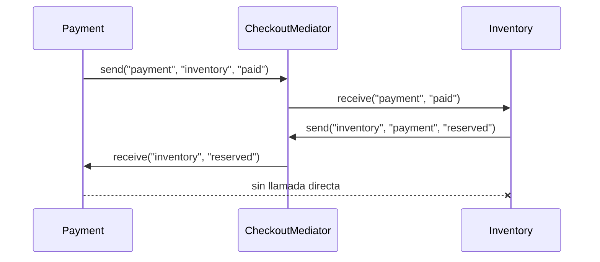

# Mediator

> **Familia:** Behavioral  
> **Intención:** Centralizar la coordinación entre colegas para que colaboren sin conocerse ni llamarse directamente entre sí.  
> **Estado:** `in-progress`  
> **Implementaciones de lenguaje:** `35/?` — 35 targets Applicable ya tienen canónico auditado y verificado; la clasificación total de 51 targets aún no está cerrada.  
> **Cobertura de pruebas:** `N/A` — los ejemplos son standalone y heterogéneos; se usa compile/analyze/runtime y failure modes cuando es la evidencia más fuerte razonable.  
> **Mapa:** [Volver al catálogo y mapa de relaciones](README.md)

## En una frase

Mediator concentra las reglas de interacción entre varios colegas en un coordinador explícito, evitando que cada participante acumule conocimiento directo de los demás.

## El problema

Cuando varios componentes necesitan reaccionar entre sí, es fácil que cada uno termine llamando directamente a muchos otros. Con el tiempo aparece una red de dependencias difícil de cambiar: agregar un colega obliga a editar varios participantes, una regla de coordinación se duplica y probar una interacción exige montar demasiados objetos.

La presión real no es simplemente “tener muchos eventos”. Es que la **política de colaboración** entre pares empieza a pertenecer a demasiados sitios a la vez.

## Fuerzas que compiten

- Los colegas deben permanecer enfocados en su responsabilidad local y conocer lo menos posible del resto.
- Las reglas de coordinación necesitan un lugar explícito y verificable.
- Centralizar demasiado comportamiento puede convertir al mediador en un objeto dominante y difícil de mantener.
- Un simple callback, llamada directa o dispatcher puede ser más claro cuando sólo existen dos participantes y una interacción estable.
- La solución debe preservar el mecanismo idiomático del lenguaje: objetos, funciones, closures, maps de receptores, procesos o mensajes son válidos si conservan la intención.

## La solución

Introducir un mediador que conozca cómo enrutar o coordinar la colaboración. Los colegas notifican o envían solicitudes al mediador; el mediador decide qué colega debe recibirlas y aplica la política de interacción. Los colegas dejan de depender unos de otros directamente.

La esencia no es una clase llamada `Mediator`. Un logger de eventos, un `switch` que traduce strings o una función identidad `sender -> message` no demuestran el patrón si no existe coordinación real entre colegas desacoplados.

## Participantes y responsabilidades

| Participante | Responsabilidad |
|---|---|
| `Mediator` | Poseer la política de coordinación y el routing entre colegas. |
| `Colleague` | Ejecutar su responsabilidad local y comunicarse con otros sólo a través del mediador. |
| `Receiver / handler` | Recibir la interacción que el mediador enruta sin requerir referencia directa al emisor. |
| Composición | Registrar o conectar colegas con el mediador y definir su ciclo de vida. |

## Cómo funciona

1. La composición registra los colegas en el mediador.
2. Un colega produce una interacción dirigida a otro participante o una notificación que requiere coordinación.
3. En vez de llamar al receptor directamente, entrega la interacción al mediador.
4. El mediador aplica la política y enruta al receptor apropiado.
5. Un destinatario desconocido produce un failure mode observable en lugar de quedar silenciosamente aceptado cuando el ecosistema permite expresarlo razonablemente.

## Diagrama



Lo importante es que la colaboración `Payment <-> Inventory` existe, pero su conocimiento mutuo no: la política de comunicación pertenece al mediador.

## Ejemplo mínimo

```text
routes = {
  "inventory" -> inventory_receive,
  "payment"   -> payment_receive
}

send(sender, recipient, message):
  receiver = routes[recipient] or fail("unknown colleague")
  receiver(sender, message)
```

Esta forma deliberadamente abstracta representa el mecanismo común que los canónicos del PR #128 expresan con tipos, closures, maps, funciones, tablas o mecanismos nativos de cada target.

## Aplicación real

### Coordinación de checkout

Un flujo de checkout puede necesitar que Payment e Inventory se coordinen sin que cada módulo conozca la API concreta del otro. El mediador puede ser dueño de la política “pago confirmado -> reservar inventario” y “inventario reservado -> confirmar al flujo de pago”.

Mediator encaja cuando esa política cambia o incorpora más colegas. Si sólo existe una llamada estable `payment -> inventory` sin más reglas, una dependencia directa o función inyectada suele ser más simple.

## En Genkidama

No se ha verificado un uso deliberado actual de Mediator en la arquitectura productiva de Genkidama. La filosofía del repositorio exige no introducir patrones sólo para exhibirlos; por ello esta página trata los ejemplos educativos como evidencia separada y no modifica producción para aumentar artificialmente el catálogo de usos.

## Cuándo usarlo

- Varios colegas acumulan referencias directas entre sí y las reglas de interacción empiezan a dispersarse.
- Una misma política de coordinación debe poder cambiar sin editar cada participante.
- Se necesita probar la colaboración independientemente de las implementaciones concretas de los colegas.
- Registrar o sustituir participantes detrás de un coordinador reduce acoplamiento real.

## Cuándo no usarlo

- Dos componentes tienen una relación simple, estable y clara con una dependencia directa.
- El supuesto mediador sólo reenvía una llamada sin poseer ninguna política de coordinación.
- Un bus de mensajes o Publish-Subscribe es necesario porque los participantes cruzan procesos, servicios o dominios de despliegue.
- La centralización haría que toda la lógica de negocio termine en un “God Mediator”.

## Consecuencias y trade-offs

| A favor | Costo / riesgo |
|---|---|
| Reduce dependencias directas entre colegas. | El mediador puede crecer demasiado si absorbe responsabilidades de dominio. |
| Hace explícita la política de coordinación. | Agrega una indirección que puede ser innecesaria en colaboraciones pequeñas. |
| Facilita sustituir o registrar colegas. | Un routing demasiado genérico puede perder type safety o claridad. |
| Permite probar interacciones desde un punto central. | Puede ocultar flujo de control si nombres, mensajes y failure modes no son explícitos. |

## Patrones relacionados

[Consulta también el mapa global de relaciones](README.md#relationship-map).

| Patrón | Relación | Por qué importa |
|---|---|---|
| [Observer](Observer.md) | collaborates with | Un mediador puede observar eventos de colegas y coordinar reacciones; Observer distribuye notificaciones, Mediator concentra política de colaboración. |
| [Presentation-Abstraction-Control](PresentationAbstractionControl.md) | collaborates with | PAC puede usar controladores con comportamiento de mediación entre presentación y abstracción; sus intenciones y escala siguen siendo distintas. |
| [Message Bus](MessageBus.md) | alternative to | Un Message Bus sirve mejor cuando el desacoplamiento y routing cruzan componentes o límites mayores; Mediator suele ser una coordinación local y explícita. |
| [Publish-Subscribe](PublishSubscribe.md) | often confused with | Pub/Sub enfatiza fan-out y desconocimiento entre publishers/subscribers; Mediator conoce y gobierna la coordinación entre colegas. |

## Errores comunes y confusiones

### Llamar Mediator a un dispatcher condicional

Una función que recibe `sender,event` y devuelve una constante no prueba que existan colegas desacoplados. Debe observarse coordinación cuya política pertenezca al mediador.

### Confundirlo con Observer

Observer responde “¿quién quiere enterarse de un cambio?”. Mediator responde “¿cómo deben colaborar estos colegas sin conocerse directamente?”. Pueden combinarse, pero no son definiciones intercambiables.

### Convertirlo en un God Object

Centralizar coordinación no significa mover toda la lógica de negocio al mediador. Los colegas conservan su comportamiento local; el mediador conserva la política de interacción.

## Cómo comprobar una implementación

- Dos colegas pueden colaborar sin referencias directas entre ellos.
- Cambiar el routing o sustituir un receptor ocurre en el mediador/composición, no en todos los emisores.
- Existe al menos una interacción real en ambos sentidos o una coordinación equivalente que demuestre la política central.
- Un destinatario inválido produce un resultado/error observable cuando el target permite expresarlo razonablemente.
- Las pruebas o assertions protegen comportamiento de coordinación, no el nombre de una clase o una literal tautológica.

## Implementaciones por lenguaje

La tabla final será autoritativa cuando las 51 celdas estén reconciliadas. Las 33 filas Applicable iniciales fueron certificadas por Product CI, Quality y Polyglot CI verdes en `54ebb7c4827a840ffea51c1dfa80efccdc82976f`. Haskell y Go se verificaron como canónicos independientes en `0eca59befe0d0c3dfbe418d1d3be4eca9781513b` mediante `Mediator Canonical CI`. En total hay 35 Applicable verificados y 2 N/A técnicamente justificados.

| Lenguaje | Aplicabilidad | Ejemplo verificado | Validación | Nota |
|---|---|---|---|---|
| MATLAB | Applicable | [`mediator.m`](../src/DataScience/MATLAB/mediator.m) | MATLAB validator / Polyglot CI ✅ | Nested functions + tabla de receivers. |
| GNU Octave | Applicable | [`mediator.m`](../src/DataScience/Octave/patterns/mediator.m) | Polyglot CI compile/run ✅ | Function handles + nested functions. |
| R | Applicable | [`mediator.R`](../src/DataScience/R/patterns/mediator.R) | Polyglot CI runtime assertions ✅ | Environment como registry de colegas. |
| C# | Applicable | [`Mediator.cs`](../src/Enterprise/C%23/patterns/Mediator.cs) | Product/Polyglot CI compile/run ✅ | `Dictionary` de receivers. |
| Java | Applicable | [`mediator.java`](../src/Enterprise/Java/patterns/mediator.java) | Polyglot CI compile/run ✅ | Registry tipado de receivers. |
| Kotlin | Applicable | [`Mediator.kt`](../src/Enterprise/Kotlin/patterns/Mediator.kt) | Polyglot CI compile/run ✅ | Map de funciones receptoras. |
| Visual Basic .NET | Applicable | [`Mediator.vb`](../src/Enterprise/VB.NET/patterns/Mediator.vb) | Product/Polyglot CI compile/run ✅ | `Dictionary(Of String, Action(...))`. |
| Haskell | Applicable | [`mediator.hs`](../src/Functional/Haskell/patterns/mediator.hs) | GHC 9.14.1 `-Wall -Werror` + runtime ✅ | `Map` de funciones receptoras + `Either` para failure mode. |
| Clojure | Applicable | [`mediator.clj`](../src/Functional/Clojure/patterns/mediator.clj) | Polyglot CI runtime assertions ✅ | Map funcional de colegas. |
| Common Lisp | Applicable | [`mediator.lisp`](../src/Functional/CommonLisp/patterns/mediator.lisp) | Polyglot CI runtime assertions ✅ | Hash table + receiver functions. |
| Elixir | Applicable | [`mediator.exs`](../src/Functional/Elixir/patterns/mediator.exs) | Polyglot CI runtime assertions ✅ | Functions/modules como colegas. |
| Erlang | Applicable | [`mediator.erl`](../src/Functional/Erlang/patterns/mediator.erl) | Polyglot CI compile/run ✅ | Map de receiver functions. |
| F# | Applicable | [`Mediator.fsx`](../src/Functional/F%23/patterns/Mediator.fsx) | Polyglot CI `dotnet fsi` ✅ | `Map` + discriminated messages/`Result`. |
| Groovy | Applicable | [`mediator.groovy`](../src/Functional/Groovy/patterns/mediator.groovy) | Polyglot CI compile/run ✅ | Map de closures. |
| OCaml | Applicable | [`mediator.ml`](../src/Functional/OCaml/patterns/mediator.ml) | Polyglot CI compile/run ✅ | `Hashtbl` + funciones receptoras. |
| Prolog | Applicable | [`mediator.pl`](../src/Functional/Prolog/patterns/mediator.pl) | Polyglot CI runtime assertions ✅ | Predicados como registry/routing. |
| Scala | Applicable | [`Mediator.scala`](../src/Functional/Scala/patterns/Mediator.scala) | Polyglot CI compile/run ✅ | Map de funciones receptoras. |
| COBOL | Applicable | [`mediator_pattern.cpy`](../src/Historical/Cobol/patterns/mediator_pattern.cpy) | Polyglot CI GnuCOBOL compile/run ✅ | Copybook con routing y receiver paragraphs. |
| Solidity | Applicable | [`Mediator.sol`](../src/Niche/Solidity/patterns/Mediator.sol) | Polyglot CI compile/contract assertions ✅ | Routing puro con resultado explícito. |
| Bash | Applicable | [`mediator.sh`](../src/Scripting/Bash/patterns/mediator.sh) | Polyglot CI shell runtime assertions ✅ | Associative routing/functions. |
| Lua | Applicable | [`mediator.lua`](../src/Scripting/Lua/patterns/mediator.lua) | Polyglot CI runtime assertions ✅ | Table de receiver closures. |
| PHP | Applicable | [`mediator.php`](../src/Scripting/PHP/patterns/mediator.php) | Polyglot CI lint/run ✅ | Callable registry. |
| PowerShell | Applicable | [`mediator.ps1`](../src/Scripting/PowerShell/patterns/mediator.ps1) | Polyglot CI runtime assertions ✅ | Hashtable de scriptblocks. |
| Python | Applicable | [`mediator.py`](../src/Scripting/PythonPY/mediator.py) | Python 3.13 compile + sweep runtime ✅ | Dict de callables; canónico extraído del sweep. |
| Ruby | Applicable | [`mediator.rb`](../src/Scripting/Ruby/patterns/mediator.rb) | Polyglot CI runtime assertions ✅ | Hash de callables. |
| Ada | Applicable | [`mediator_pattern.adb`](../src/Systems/Ada/mediator_pattern.adb) | GNAT Ada 2022 compile/run ✅ | Access-to-subprogram routing. |
| C++ | Applicable | [`mediator.cpp`](../src/Systems/C%2B%2B/patterns/mediator.cpp) | Polyglot CI C++20 compile/run ✅ | Registry de callbacks tipados. |
| C | Applicable | [`mediator.c`](../src/Systems/C/patterns/mediator.c) | Polyglot CI compile/run ✅ | Tabla de function pointers. |
| Fortran | Applicable | [`mediator.f90`](../src/Systems/Fortran/patterns/mediator.f90) | Polyglot CI Fortran compile/run ✅ | Procedure pointers como colegas. |
| Go | Applicable | [`mediator.go`](../src/Systems/Go/patterns/mediator.go) | Go 1.26.5 `gofmt` + `go vet` + runtime ✅ | Map de receiver functions + error explícito. |
| Pascal | Applicable | [`mediator_pattern.pas`](../src/Systems/Pascal/mediator_pattern.pas) | Polyglot CI Free Pascal compile/run ✅ | Procedure registry y routing. |
| Rust | Applicable | [`mediator.rs`](../src/Systems/Rust/patterns/mediator.rs) | Polyglot CI `rustc` compile/run ✅ | `HashMap` + `Result` failure mode. |
| Swift | Applicable | [`Mediator.swift`](../src/Systems/Swift/patterns/Mediator.swift) | Polyglot CI `swiftc` compile/run ✅ | Dictionary de receiver closures + error enum. |
| JavaScript | Applicable | [`mediator.js`](../src/Web/JavaScriptJS/patterns/mediator.js) | Product/Polyglot CI Node assertions ✅ | Object registry + explicit failure. |
| TypeScript | Applicable | [`mediator.ts`](../src/Web/TypeScriptTS/patterns/mediator.ts) | Product/Polyglot CI strict compile/run ✅ | Typed receiver registry. |
| HTML | N/A | — | — | El markup puro no tiene un modelo de ejecución programable capaz de poseer coordinación entre pares; DOM events y routing pertenecen a JavaScript u otro runtime ejecutable. |
| CSS | N/A | — | — | Selectores y cascade pueden afectar múltiples elementos, pero CSS puro no puede poseer routing o coordinación ejecutable entre colegas. |

Quedan 14 targets todavía sin reconciliar en esta tabla: SQL declarativo, Perl, Julia, Objective-C, Zig, Nim, Dart, Crystal, VBA, GDScript, Assembly, Delphi, MicroPython y Rockstar. Se mantienen sin clasificar aquí hasta inspeccionar su mecanismo real; no se convierten en `N/A` por ausencia de OOP ni se inventan enlaces.

## Comprueba que lo entendiste

1. Si dos componentes sólo realizan una llamada directa estable, ¿qué presión adicional justificaría introducir Mediator?
2. ¿Por qué un Observer que notifica a diez suscriptores no es automáticamente un Mediator?
3. ¿Qué señales indicarían que un mediador útil se está convirtiendo en un God Object?

## Resumen

- Mediator existe para centralizar **política de colaboración**, no para renombrar un dispatcher.
- Los colegas se comunican a través del mediador y reducen conocimiento directo entre sí.
- El beneficio principal es desacoplar la red de interacción; el costo principal es una nueva centralización que debe mantenerse acotada.
- Observer puede colaborar con Mediator, pero distribuye notificaciones en vez de definir la misma intención.
- La expresión idiomática puede usar objetos, funciones, closures, maps, procesos o mensajes; la intención importa más que la forma OO.

## Referencias

- [Catálogo y mapa de relaciones](README.md)
- [Patterns as Living Examples](../docs/philosophy/001-patterns-as-living-examples.md)
- [KB-006 — Canonical Design Pattern Authoring Standard](../docs/kb/catalog/pattern-authoring-standard.md)
- [High-overhead cohort sweep](../docs/pattern-sweeps/high-overhead-cohort.md)
- [HTML pattern sweep](../docs/pattern-sweeps/html.md)
- [CSS pattern sweep](../docs/pattern-sweeps/css.md)
