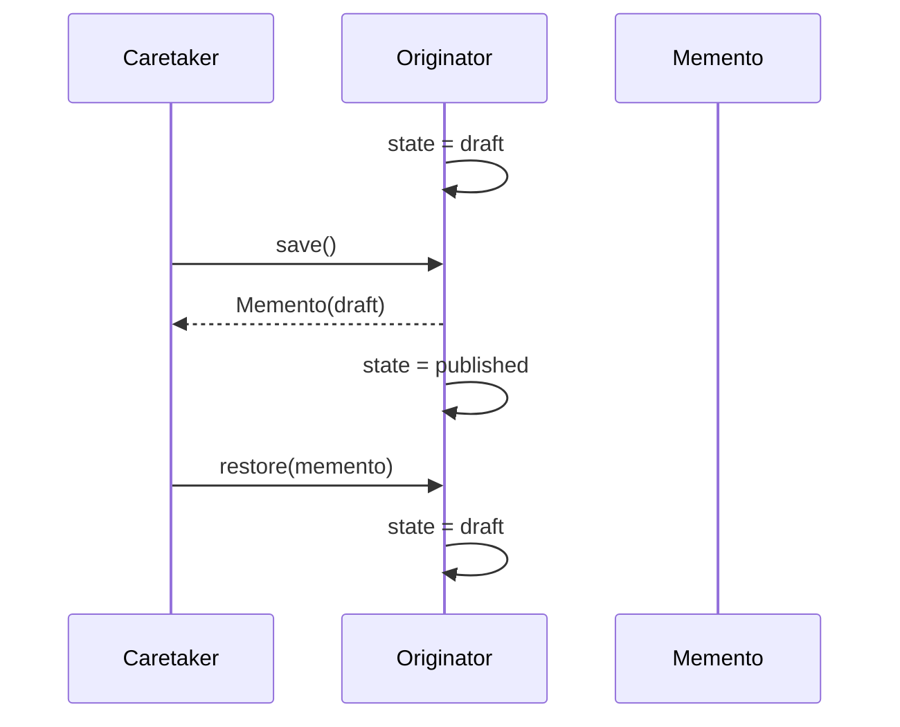

# Memento

> **Familia:** Behavioral  
> **Intención:** Capturar el estado restorable de un originador sin exponer ni trasladar arbitrariamente su responsabilidad de mutación.  
> **Estado:** `in-progress`  
> **Implementaciones de lenguaje:** `34/49`  
> **Cobertura de pruebas:** `N/A` como porcentaje agregado; los ejemplos standalone usan compile/analyze/runtime según el target.  
> **Mapa:** [Volver al catálogo y mapa de relaciones](README.md)

## En una frase

Memento guarda una fotografía restorable del estado y permite devolverla al originador sin convertir al caretaker en dueño de sus internals.

## El problema

Undo, checkpoints y rollback local suelen tentar a copiar campos desde fuera del objeto o módulo. Eso rompe encapsulación: el historial conoce la representación, las restauraciones pueden violar invariantes y cada cambio interno obliga a cambiar también al caretaker.

La presión es conservar un estado anterior suficiente para restaurar el comportamiento observable sin transferir la responsabilidad de captura/restauración fuera del originador.

## Fuerzas que compiten

- El snapshot debe ser suficiente para restaurar el estado relevante.
- El originador debe conservar las reglas de captura y restauración.
- El caretaker necesita almacenar/seleccionar snapshots sin editar sus internals.
- Una copia superficial puede compartir referencias y dejar de ser un snapshot real.
- Una copia profunda puede ser costosa en memoria o IO.
- Persistencia durable y event sourcing tienen requisitos distintos.

## La solución

Separar estado vivo, snapshot e historial. El originador crea y acepta el memento; el memento conserva la representación restorable; el caretaker sólo almacena o selecciona snapshots. La forma puede ser objeto, record, struct, tuple, map, valor persistente, fila versionada u otro mecanismo idiomático.

## Participantes y responsabilidades

| Participante | Responsabilidad |
|---|---|
| `Originator` | Poseer el estado vivo y definir `save/restore` o equivalente. |
| `Memento` | Representar una fotografía restorable suficientemente aislada. |
| `Caretaker` | Conservar y seleccionar snapshots sin conocer cómo mutar internals. |

## Cómo funciona

1. El originador parte de un estado observable.
2. Produce un snapshot.
3. El caretaker lo conserva.
4. El estado vivo cambia.
5. El caretaker devuelve el snapshot seleccionado.
6. El originador restaura y vuelve al comportamiento observable anterior.

## Diagrama



El punto importante es que el caretaker transporta el snapshot; no reconstruye ni parchea por su cuenta la representación interna.

## Ejemplo mínimo

```text
originator.state = "draft"
snapshot = originator.save()
originator.state = "published"
originator.restore(snapshot)
assert originator.state == "draft"
```

## Aplicación real

### Undo de un editor

Un editor puede guardar snapshots antes de operaciones destructivas. El historial conoce mementos, no cada campo privado del documento. Encaja cuando capturar/restaurar estado es razonablemente barato; para historiales extensos, auditoría o reconstrucción temporal puede convenir Command reversible o event sourcing.

## En Genkidama

No existe un uso deliberado verificado de Memento en la arquitectura productiva actual. Los artefactos bajo `src/**` son ejemplos educativos; no se fuerza el patrón en producción.

## Cuándo usarlo

- Se necesita undo, checkpoint o rollback local de estado.
- Exponer campos al historial rompería encapsulación.
- El originador puede definir un snapshot consistente.
- El costo de captura/restauración es proporcional al problema.

## Cuándo no usarlo

- Una operación inversa pequeña es más clara que copiar estado completo.
- Se requiere auditoría durable o reconstrucción histórica de hechos.
- El estado incluye recursos externos no restaurables como sockets o transacciones abiertas.
- El caretaker necesita editar el contenido del snapshot.

## Consecuencias y trade-offs

| A favor | Costo / riesgo |
|---|---|
| Conserva encapsulación. | Snapshots pueden consumir memoria/IO. |
| Hace explícitos checkpoints y rollback. | Copias superficiales pueden conservar aliasing. |
| Permite historiales independientes de internals. | Cambios de esquema complican snapshots persistidos. |
| También funciona con valores inmutables. | Puede confundirse con Prototype, Command o event sourcing. |

## Patrones relacionados

[Consulta también el mapa global de relaciones](README.md#relationship-map).

| Patrón | Relación | Por qué importa |
|---|---|---|
| [Command](Command.md) | collaborates with | Un Command puede guardar un Memento antes de ejecutar para soportar undo. |
| [Prototype](Prototype.md) | often confused with | Prototype crea otro objeto; Memento conserva estado para restaurar un originador. |
| [State](State.md) | often confused with | State modela comportamiento dependiente del estado; Memento captura una versión previa. |

## Errores comunes y confusiones

### Guardar una referencia mutable y llamarla snapshot

Si el estado vivo y el memento comparten el mismo objeto mutable, una mutación posterior altera también el supuesto snapshot. La evidencia debe demostrar independencia suficiente para restaurar el valor anterior.

### Confundir serialización con Memento

Serializar es sólo un mecanismo. Es Memento únicamente cuando representa estado restorable y mantiene correctamente las responsabilidades de captura/restauración.

## Cómo comprobar una implementación

- Existe un estado inicial observable.
- El snapshot se captura antes de la mutación.
- La mutación posterior no altera retroactivamente el snapshot.
- `save -> change -> restore` devuelve el estado observable anterior.
- El caretaker no necesita parchear internals.
- Snapshot inválido o historial vacío produce un failure mode explícito cuando sea razonable para el target.

## Implementaciones por lenguaje

La tabla clasifica los 51 targets actuales. Sólo se cuenta como implementado un canónico individual auditado con evidencia repository-native ejecutada; los cambios posteriores en su gate deben volver a cerrar verdes antes de declarar estabilidad del head actual. El cohort integrado por PR #97 aporta evidencia histórica explícita de **546/546** celdas verdes para sus 14 targets y el ledger `docs/pattern-sweeps/medium-high-cohort.md` sigue siendo autoritativo para esas celdas. El ledger `docs/pattern-sweeps/portable-functional-cohort.md` aporta otros 13 targets con canónicos individualmente direccionables y ownership Polyglot actual; en este patrón se reconcilian sus ocho celdas todavía pendientes sólo después de auditar el canónico y observar el gate verde del head revisado. MATLAB se acredita del mismo modo desde su ledger target-major y el Polyglot actual.

| Lenguaje | Aplicabilidad | Ejemplo verificado | Validación | Nota |
|---|---|---|---|---|
| C# | Applicable | [`Memento.cs`](../src/Enterprise/C%23/patterns/Memento.cs) | PR #97 medium-high: .NET 10 LTS 117/117 ✅ | Valor snapshot/restauración; runner sólo orquesta. |
| Python | Applicable | [`memento.py`](../src/Scripting/PythonPY/memento.py) | `py_compile` + runtime + failure mode; Scripting gate verde en `d56817ac` | `DocumentMemento` inmutable; el sweep importa el canónico en vez de duplicarlo. |
| JavaScript | Applicable | [`memento.js`](../src/Web/JavaScriptJS/patterns/memento.js) | syntax + standalone + aggregate, Web gate verde | Snapshot inmutable y restore observable. |
| COBOL | Applicable | [`memento_pattern.cpy`](../src/Historical/Cobol/patterns/memento_pattern.cpy) | PR #97 medium-high: GNU 156/156 ✅ | Copybook direccionable con captura, cambio y restauración. |
| Solidity | Applicable | [`Memento.sol`](../src/Niche/Solidity/patterns/Memento.sol) | PR #97 medium-high: Node/Solidity 78/78 ✅ | Enum/valores y restauración pura sin forzar clases. |
| TypeScript | Applicable | [`memento.ts`](../src/Web/TypeScriptTS/patterns/memento.ts) | PR #97 medium-high: Node 24 LTS 78/78 ✅ | Valor snapshot y restore observable. |
| Java | Applicable | [`memento.java`](../src/Enterprise/Java/patterns/memento.java) | JVM family + Polyglot CI verde en `15568ed5` ✅ | Snapshot de valor y restauración observable. |
| Go | Applicable | — | pendiente | Auditar canónico heredado. |
| Rust | Applicable | [`memento.rs`](../src/Systems/Rust/patterns/memento.rs) | Native family + Polyglot CI verde en `15568ed5` ✅ | Valor copiable como snapshot/restauración. |
| PHP | Applicable | [`memento.php`](../src/Scripting/PHP/patterns/memento.php) | `php -l` + runtime + aggregate, Scripting gate verde | Objeto originador con `save/restore`. |
| Kotlin | Applicable | [`Memento.kt`](../src/Enterprise/Kotlin/patterns/Memento.kt) | PR #97 medium-high: JVM 117/117 ✅ | Estado mutable + snapshot de valor; runner delega. |
| Swift | Applicable | [`Memento.swift`](../src/Systems/Swift/patterns/Memento.swift) | PR #97 medium-high: Swift 39/39 ✅ | Value semantics para snapshot/restauración. |
| C++ | Applicable | [`memento.cpp`](../src/Systems/C++/patterns/memento.cpp) | Native family + Polyglot CI verde en `15568ed5` ✅ | Snapshot de valor con restauración observable. |
| PowerShell | Applicable | [`memento.ps1`](../src/Scripting/PowerShell/patterns/memento.ps1) | parse + runtime individual, Data/Shell gate verde | Snapshot/restauración directamente auditados. |
| Ruby | Applicable | [`memento.rb`](../src/Scripting/Ruby/patterns/memento.rb) | `ruby -c` + runtime + aggregate, Scripting gate verde | Hash duplicado/congelado como snapshot. |
| Dart | Applicable | — | pendiente | Auditar canónico heredado. |
| C | Applicable | [`memento.c`](../src/Systems/C/patterns/memento.c) | Native family + Polyglot CI verde en `15568ed5` ✅ | Snapshot de valor con restauración observable. |
| Visual Basic .NET | Applicable | [`Memento.vb`](../src/Enterprise/VB.NET/patterns/Memento.vb) | PR #97 medium-high: .NET 10 LTS 117/117 ✅ | Valor snapshot/restauración; runner sólo orquesta. |
| F# | Applicable | [`Memento.fsx`](../src/Functional/F%23/patterns/Memento.fsx) | PR #97 medium-high: .NET 10 LTS 117/117 ✅ | Mutable local + valor inmutable como snapshot. |
| R | Applicable | [`memento.R`](../src/DataScience/R/patterns/memento.R) | parse + runtime individual, Data/Shell gate verde | Snapshot/restauración directamente auditados. |
| Julia | Applicable | — | pendiente | Auditar canónico heredado. |
| HTML | N/A | — | — | Markup estático no posee ciclo ejecutable propio de captura/restauración; JavaScript sería otro target. |
| Shell / Bash | Applicable | [`memento.sh`](../src/Scripting/Bash/patterns/memento.sh) | `bash -n` + runtime + aggregate, Scripting gate verde | Variables y funciones como originador/snapshot. |
| Elixir | Applicable | [`memento.exs`](../src/Functional/Elixir/patterns/memento.exs) | compile/run individual, BEAM gate verde | Estado inmutable y restauración directamente auditados. |
| Erlang | Applicable | [`memento.erl`](../src/Functional/Erlang/patterns/memento.erl) | compile/run individual, BEAM gate verde | Terms inmutables como snapshot directamente auditado. |
| Scala | Applicable | [`Memento.scala`](../src/Functional/Scala/patterns/Memento.scala) | PR #97 medium-high: JVM 117/117 ✅ | Valor snapshot y restauración; runner sólo orquesta. |
| Clojure | Applicable | [`memento.clj`](../src/Functional/Clojure/patterns/memento.clj) | PR #97 medium-high: JVM 117/117 ✅ | `atom` como originador y valor desreferenciado como snapshot. |
| Haskell | Applicable | — | pendiente | Auditar canónico heredado. |
| OCaml | Applicable | [`memento.ml`](../src/Functional/OCaml/patterns/memento.ml) | Functional family + Polyglot CI verde en `15568ed5` ✅ | `ref` mutable con snapshot de valor y restore. |
| Lua | Applicable | [`memento.lua`](../src/Scripting/Lua/patterns/memento.lua) | `luac -p` + runtime + aggregate, Scripting gate verde | Tabla snapshot independiente. |
| Perl | Applicable | — | pendiente | Auditar canónico heredado. |
| Groovy | Applicable | [`memento.groovy`](../src/Functional/Groovy/patterns/memento.groovy) | JVM family + Polyglot CI verde en `15568ed5` ✅ | `clone()` separa el snapshot antes de restaurar. |
| Fortran | Applicable | [`memento.f90`](../src/Systems/Fortran/patterns/memento.f90) | PR #97 medium-high: GNU 156/156 ✅ | Valor fixed-length separado y restauración observable. |
| Ada | Applicable | [`memento_pattern.adb`](../src/Systems/Ada/memento_pattern.adb) | PR #97 medium-high: GNU 156/156 ✅ | `Unbounded_String` snapshot separado; runner requiere el canónico. |
| Pascal | Applicable | [`memento_pattern.pas`](../src/Systems/Pascal/memento_pattern.pas) | PR #97 medium-high: GNU 156/156 ✅ | Unidad direccionable con snapshot/restauración. |
| Objective-C | Applicable | — | pendiente | Auditar canónico heredado. |
| Nim | Applicable | [`memento_example.nim`](../src/Niche/Nim/patterns/memento_example.nim) | PR #97 medium-high: Nim 39/39 ✅ | Valor snapshot separado; runner importa el módulo. |
| Crystal | Applicable | — | pendiente | Auditar canónico heredado. |
| Zig | Applicable | — | pendiente | Auditar canónico heredado. |
| MATLAB | Applicable | [`memento.m`](../src/DataScience/MATLAB/memento.m) | MATLAB family + Polyglot CI verde en `15568ed5` ✅ | `struct` snapshot separado con `saveState/restoreState`. |
| GDScript | Applicable | — | pendiente | Dictionaries/valores permiten snapshot y restore. |
| Assembly | Applicable | — | pendiente | Memoria/buffers permiten copiar y restaurar estado. |
| Common Lisp | Applicable | [`memento.lisp`](../src/Functional/CommonLisp/patterns/memento.lisp) | Functional family + Polyglot CI verde en `15568ed5` ✅ | Binding snapshot separado y restauración explícita. |
| Prolog | Applicable | [`memento.pl`](../src/Functional/Prolog/patterns/memento.pl) | Functional family + Polyglot CI verde en `15568ed5` ✅ | Term snapshot restaurado sin exigir objetos mutables. |
| VBA | Applicable | — | pendiente | Auditar canónico heredado. |
| Delphi | Applicable | — | pendiente | Records/objetos permiten snapshot/restauración. |
| GNU Octave | Applicable | [`memento.m`](../src/DataScience/Octave/patterns/memento.m) | parse + runtime individual, Data/Shell gate verde | Snapshot/restauración directamente auditados. |
| SQL declarativo | Applicable | — | pendiente | Filas/versiones inmutables pueden representar snapshot y restauración declarativa. |
| CSS | N/A | — | — | Puede representar/selectar estados visuales, pero no captura, conserva y restaura estado arbitrario por sí misma. |
| MicroPython | Applicable | — | pendiente | Dicts/tuples/copias permiten snapshot/restauración. |
| Rockstar | Applicable | — | pendiente | Variables y funciones permiten preservar estado restorable. |

## Comprueba que lo entendiste

1. ¿Por qué una copia superficial que comparte referencias mutables puede fallar aunque `restore` exista?
2. ¿Cuándo elegirías Command reversible en lugar de Memento para undo?
3. ¿Por qué serializar un objeto no demuestra por sí solo que exista Memento?

## Resumen

- Memento resuelve restauración de estado sin exponer internals al caretaker.
- El originador sigue siendo dueño de captura y restore.
- El costo principal es memoria/IO y manejo correcto de copias/versiones.
- Command colabora frecuentemente; Prototype y State tienen intenciones distintas.
- El patrón puede expresarse sin clases cuando el target ofrece valores, módulos, tablas, filas o mecanismos equivalentes.

## Referencias

- Gamma, Helm, Johnson, Vlissides, *Design Patterns: Elements of Reusable Object-Oriented Software*.
- [`docs/philosophy/001-patterns-as-living-examples.md`](../docs/philosophy/001-patterns-as-living-examples.md)
- [`docs/kb/catalog/pattern-authoring-standard.md`](../docs/kb/catalog/pattern-authoring-standard.md)
- [`docs/pattern-sweeps/medium-high-cohort.md`](../docs/pattern-sweeps/medium-high-cohort.md)
- [`docs/pattern-sweeps/portable-functional-cohort.md`](../docs/pattern-sweeps/portable-functional-cohort.md)
- [`docs/pattern-sweeps/matlab.md`](../docs/pattern-sweeps/matlab.md)
