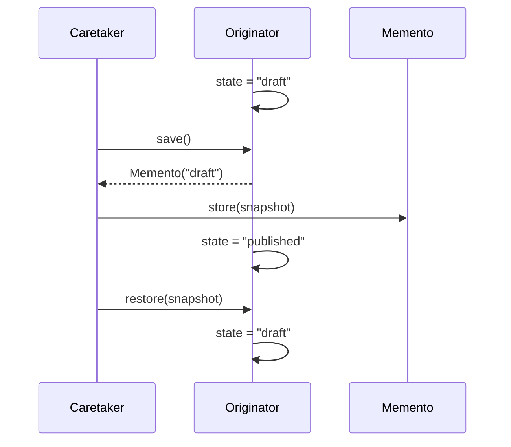

# Memento

> **Familia:** Behavioral  
> **Intención:** Capturar el estado restorable de un originador sin exponer ni trasladar arbitrariamente su responsabilidad de mutación.  
> **Estado:** `in-progress`  
> **Aplicabilidad:** `49/51` targets son Applicable; HTML y CSS son N/A con justificación técnica.  
> **Inventario inicial:** la búsqueda factual en `dev` encuentra 33 archivos cuyo nombre contiene `memento` y 49 artefactos bajo `src/**` que mencionan Memento; ese conteo incluye sweeps/runners y por ello **no** se trata todavía como 49 canónicos KB-006.  
> **Cobertura de pruebas:** `N/A` como porcentaje agregado; cada target debe usar compile/analyze/runtime o el contrato de fuente más fuerte razonable.  
> **Mapa:** [Volver al catálogo y mapa de relaciones](README.md)

## En una frase

Memento permite guardar una fotografía opaca o controlada del estado de un objeto, módulo, proceso o valor y restaurarla después sin entregar al caretaker permiso para editar los detalles internos del originador.

## El problema

Un editor, una configuración, una sesión o un agregado mutable puede necesitar `undo`, checkpoints o recuperación. Copiar campos desde fuera parece sencillo, pero convierte al consumidor en conocedor de la representación interna: cada cambio de estructura obliga a cambiar también el código de historial y la restauración puede violar invariantes.

La presión real es conservar una versión anterior del estado **sin romper encapsulación ni transferir la propiedad de las reglas de restauración**.

## Fuerzas que compiten

- El estado guardado debe ser suficiente para restaurar el comportamiento observable relevante.
- El originador debe seguir siendo dueño de cómo captura y restaura su representación.
- El caretaker necesita conservar, ordenar o descartar snapshots sin mutar sus internals arbitrariamente.
- Copias profundas pueden ser costosas; copias superficiales pueden compartir referencias y dejar de ser snapshots reales.
- En lenguajes inmutables, el patrón puede expresarse con valores persistentes en lugar de objetos mutables.
- Persistencia durable, event sourcing y backup tienen requisitos adicionales que Memento por sí solo no resuelve.

## La solución

Separar tres responsabilidades conceptuales:

| Participante | Responsabilidad |
|---|---|
| `Originator` | Poseer el estado vivo y las reglas para capturarlo/restaurarlo. |
| `Memento` | Representar una fotografía restorable; puede ser objeto, record, struct, tuple, map, valor, bytes o mecanismo equivalente. |
| `Caretaker` | Conservar snapshots e identificar cuál restaurar sin editar la representación interna del originador. |

La esencia no exige una clase llamada `Memento`. Un valor inmutable, una closure, un record, una estructura, una fila versionada o una copia explícita pueden conservar la intención si existe una frontera clara entre estado vivo, snapshot e historial/restauración.

## Cómo funciona

1. El originador parte de un estado observable, por ejemplo `draft`.
2. El originador produce un snapshot.
3. El caretaker conserva ese snapshot sin alterar sus internals.
4. El originador cambia a otro estado, por ejemplo `published`.
5. El caretaker devuelve el snapshot elegido al originador.
6. El originador restaura su estado y vuelve a producir el comportamiento observable previo.
7. Si no existe snapshot válido, el ecosistema debe producir un failure mode explícito cuando sea razonable.

## Diagrama



## Ejemplo mínimo

```text
originator.state = "draft"
snapshot = originator.save()
history.push(snapshot)

originator.state = "published"
originator.restore(history.pop())

assert originator.state == "draft"
```

El contrato importante no es el nombre de las funciones, sino que el snapshot represente un estado anterior real y la restauración vuelva al comportamiento observable anterior.

## Aplicación real

### Undo de un editor

Un editor puede guardar snapshots antes de operaciones destructivas. El historial sólo conoce mementos; el editor conoce cómo reconstruir su estado. Esto evita que la pila de `undo` dependa de cada campo privado del documento.

Memento encaja mejor cuando el costo de snapshot es aceptable y la restauración de un estado anterior es la necesidad central. Para historiales extensos o auditoría de dominio, Command reversible o event sourcing pueden ser más apropiados.

## En Genkidama

No se ha verificado un uso deliberado actual de Memento en la arquitectura productiva de Genkidama. Los ejemplos existentes bajo `src/**` son evidencia educativa y no justifican introducir el patrón en producción. Esta separación respeta la filosofía architecture-first del repositorio.

## Cuándo usarlo

- Se necesita `undo`, checkpoint o rollback local de estado.
- Exponer todos los campos al historial rompería encapsulación.
- El originador puede definir de manera clara qué constituye un snapshot consistente.
- El costo de capturar/restaurar es proporcional al problema.

## Cuándo no usarlo

- Una operación inversa pequeña y explícita es más barata y clara que copiar estado completo.
- Se requiere auditoría durable, reconstrucción temporal o integración distribuida; event sourcing puede ser una intención distinta y más fuerte.
- El snapshot copiaría recursos externos no restaurables (sockets, handles, transacciones abiertas) y daría una falsa garantía.
- El caretaker necesita editar el contenido del snapshot: eso indica que la responsabilidad está mal ubicada.

## Consecuencias y trade-offs

| A favor | Costo / riesgo |
|---|---|
| Conserva encapsulación de la representación. | Los snapshots pueden consumir memoria/IO significativo. |
| Hace explícitos checkpoints y rollback. | Copias superficiales pueden conservar aliasing accidental. |
| Permite historiales sin conocer internals. | Cambios de esquema pueden complicar snapshots persistidos. |
| Funciona también con valores inmutables. | Puede confundirse con Prototype, Command o event sourcing. |

## Patrones relacionados y confusiones

| Patrón | Relación | Diferencia esencial |
|---|---|---|
| [Command](Command.md) | collaborates with | Command puede guardar un Memento antes de ejecutar y usarlo para undo; Command representa una petición, Memento representa estado. |
| [Prototype](Prototype.md) | often confused with | Prototype crea un nuevo objeto a partir de otro; Memento conserva estado para restaurar un originador. |
| [State](State.md) | often confused with | State cambia comportamiento mediante objetos/representaciones de estado; Memento captura una versión previa de ese estado. |
| Event Sourcing | alternative at another scale | Event sourcing conserva eventos como fuente de verdad; Memento conserva snapshots de estado y no implica un log de hechos. |

## Errores comunes

### Guardar una referencia mutable y llamarla snapshot

Si el originador y el memento siguen apuntando al mismo objeto mutable, editar el estado vivo también cambia el supuesto snapshot. La verificación debe demostrar independencia suficiente para restaurar el valor anterior.

### Convertir el caretaker en segundo originador

El caretaker puede ordenar o seleccionar mementos, pero no debería conocer y parchear cada campo interno del estado.

### Confundir serialización con Memento

Serializar datos es un mecanismo. Sólo demuestra Memento si el resultado representa un estado restorable y la responsabilidad de captura/restauración permanece correctamente ubicada.

## Cómo comprobar una implementación

- Existe un estado inicial observable.
- Se captura un snapshot antes de mutar el estado vivo.
- La mutación posterior no altera retroactivamente el snapshot.
- Restaurar el snapshot devuelve el comportamiento/estado observable anterior.
- El caretaker no necesita editar internals del originador.
- Empty history, snapshot inválido o incompatibilidad de versión producen un resultado explícito cuando el target permite expresarlo razonablemente.
- La prueba protege `save -> change -> restore`, no sólo la existencia de un tipo llamado `Memento`.

## Implementaciones por lenguaje

Esta tabla clasifica **todos los 51 targets actuales**. `Applicable` significa que el lenguaje puede expresar idiomáticamente captura + conservación + restauración; no implica todavía que el canónico individual haya sido auditado bajo KB-006. El siguiente trabajo del PR convierte el inventario heredado de sweeps en evidencia direccionable y verificada.

| Lenguaje | Aplicabilidad | Evidencia / estado inicial |
|---|---|---|
| C# | Applicable | Auditar canónico heredado y gate. |
| Python | Applicable | `pattern_sweep.py` contiene semántica Memento; requiere canónico individual KB-006. |
| JavaScript | Applicable | [`memento.js`](../src/Web/JavaScriptJS/patterns/memento.js) descubierto en `dev`; auditar gate. |
| COBOL | Applicable | Auditar canónico heredado y gate. |
| Solidity | Applicable | Auditar canónico heredado y gate. |
| TypeScript | Applicable | Auditar canónico heredado y gate. |
| Java | Applicable | Auditar canónico heredado y gate. |
| Go | Applicable | Auditar canónico heredado y gate. |
| Rust | Applicable | Auditar canónico heredado y gate. |
| PHP | Applicable | [`memento.php`](../src/Scripting/PHP/patterns/memento.php) descubierto en `dev`; auditar gate. |
| Kotlin | Applicable | Auditar canónico heredado y gate. |
| Swift | Applicable | Auditar canónico heredado y gate. |
| C++ | Applicable | Auditar canónico heredado y gate. |
| PowerShell | Applicable | [`memento.ps1`](../src/Scripting/PowerShell/patterns/memento.ps1) descubierto en `dev`; auditar gate. |
| Ruby | Applicable | [`memento.rb`](../src/Scripting/Ruby/patterns/memento.rb) descubierto en `dev`; auditar gate. |
| Dart | Applicable | Auditar canónico heredado y gate. |
| C | Applicable | [`memento.c`](../src/Systems/C/patterns/memento.c) descubierto en `dev`; auditar gate. |
| Visual Basic .NET | Applicable | Auditar canónico heredado y gate. |
| F# | Applicable | Auditar canónico heredado y gate. |
| R | Applicable | [`memento.R`](../src/DataScience/R/patterns/memento.R) descubierto en `dev`; auditar gate. |
| Julia | Applicable | Auditar canónico heredado y gate. |
| HTML | N/A | Markup declarativo estático: puede representar datos, pero no posee ciclo de estado ejecutable, captura y restauración. JavaScript asociado sería otro target. |
| Shell / Bash | Applicable | [`memento.sh`](../src/Scripting/Bash/patterns/memento.sh) descubierto en `dev`; auditar gate. |
| Elixir | Applicable | [`memento.exs`](../src/Functional/Elixir/patterns/memento.exs) descubierto en `dev`; auditar gate. |
| Erlang | Applicable | [`memento.erl`](../src/Functional/Erlang/patterns/memento.erl) descubierto en `dev`; auditar gate. |
| Scala | Applicable | Auditar canónico heredado y gate. |
| Clojure | Applicable | [`memento.clj`](../src/Functional/Clojure/patterns/memento.clj) descubierto en `dev`; auditar gate. |
| Haskell | Applicable | Auditar canónico heredado y gate. |
| OCaml | Applicable | Auditar canónico heredado y gate. |
| Lua | Applicable | Auditar canónico heredado y gate. |
| Perl | Applicable | Auditar canónico heredado y gate. |
| Groovy | Applicable | Auditar canónico heredado y gate. |
| Fortran | Applicable | [`memento.f90`](../src/Systems/Fortran/patterns/memento.f90) descubierto en `dev`; auditar gate. |
| Ada | Applicable | [`memento_pattern.adb`](../src/Systems/Ada/memento_pattern.adb) descubierto en `dev`; auditar gate. |
| Pascal | Applicable | [`memento_pattern.pas`](../src/Systems/Pascal/memento_pattern.pas) descubierto en `dev`; auditar gate. |
| Objective-C | Applicable | Auditar canónico heredado y gate. |
| Nim | Applicable | Auditar canónico heredado y gate. |
| Crystal | Applicable | Auditar canónico heredado y gate. |
| Zig | Applicable | Auditar canónico heredado y gate. |
| MATLAB | Applicable | [`memento.m`](../src/DataScience/MATLAB/memento.m) descubierto en `dev`; auditar gate. |
| GDScript | Applicable | Valores/dictionaries y runtime permiten snapshots/restauración; canónico por materializar o localizar. |
| Assembly | Applicable | Memoria/buffers permiten copiar y restaurar estado; canónico por materializar o localizar. |
| Common Lisp | Applicable | Auditar canónico heredado y gate. |
| Prolog | Applicable | Hechos/terms y predicados pueden conservar/restaurar una representación de estado; auditar canónico. |
| VBA | Applicable | Auditar canónico heredado y gate. |
| Delphi | Applicable | Objetos/records permiten snapshot/restauración; auditar canónico o materializar. |
| GNU Octave | Applicable | [`memento.m`](../src/DataScience/Octave/patterns/memento.m) descubierto en `dev`; auditar gate. |
| SQL declarativo | Applicable | Puede modelar snapshots como filas/versiones inmutables y restaurar estado mediante `INSERT/SELECT/UPDATE` declarativos; no requiere clases. Falta canónico individual y boundary de validación. |
| CSS | N/A | Hoja declarativa de estilo: puede seleccionar/representar estados visuales, pero no captura, conserva y restaura estado arbitrario por sí misma. |
| MicroPython | Applicable | Dicts/tuples/copias permiten snapshots/restauración; localizar o materializar canónico. |
| Rockstar | Applicable | Variables y funciones permiten representar estado y snapshot; localizar o materializar canónico y validar con el runtime existente. |

## Inventario factual de arranque

La búsqueda remota en `dev@505f331b1d10644474beb55a8d8aeb1138fb791a` produce dos señales distintas que no deben confundirse:

- `filename:memento` encuentra **33** archivos; son candidatos fuertes a canónico individual.
- `memento path:src` encuentra **49** artefactos; incluye implementaciones embebidas en sweeps/runners, por lo que no satisface automáticamente KB-006.

El PR avanzará debt-first: primero se auditan los 33 canónicos ya direccionables y sus gates; después se extraen o materializan sólo los Applicable faltantes. No se duplicará una implementación válida ni se perseguirá coverage artificial.