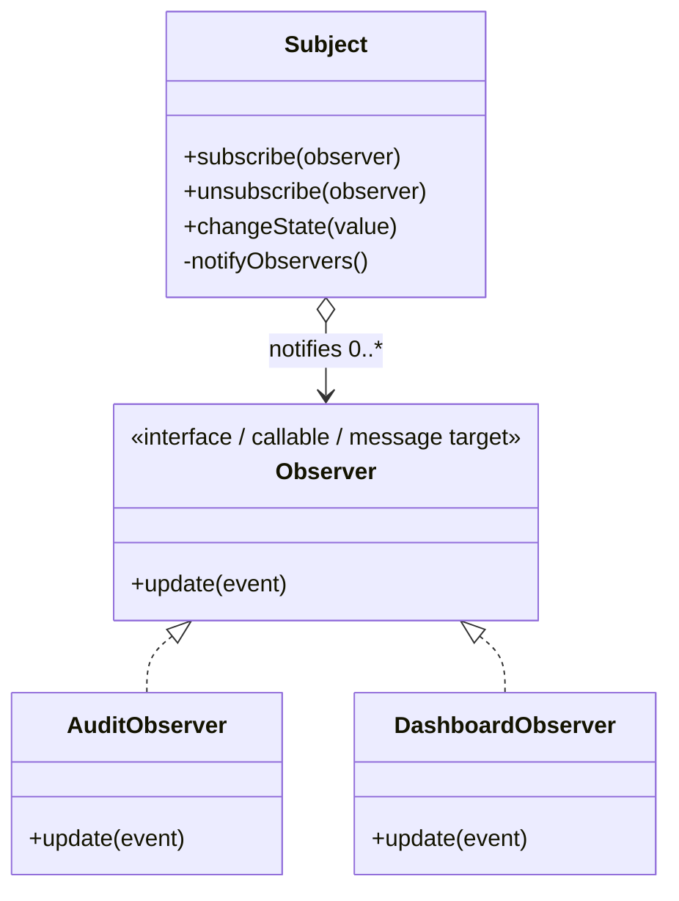

# Observer

> **Familia:** Behavioral  
> **Intención:** Notificar a múltiples dependientes cuando cambia un subject sin acoplarlo a las implementaciones concretas de esos dependientes.  
> **Estado:** `in-progress`  
> **Implementaciones de lenguaje:** `40/49` materializadas; `39/49` verificadas  
> **Cobertura de pruebas:** N/A — la matriz standalone usa compile/analyze/runtime/source contracts por ecosistema; no existe un porcentaje agregado significativo.  
> **Mapa:** [Volver al catálogo y mapa de relaciones](README.md)

## En una frase

Observer separa a quien detecta o publica un cambio de quienes reaccionan a él mediante una relación uno-a-muchos mantenida detrás de un contrato de notificación.

## El problema

Un componente mantiene estado o produce un hecho relevante y varios consumidores independientes necesitan reaccionar cuando ese estado cambia. Hacer que el productor conozca y llame directamente a cada consumidor crea acoplamiento, obliga a modificarlo al añadir receptores y mezcla la responsabilidad de cambiar estado con las consecuencias externas del cambio.

## Fuerzas que compiten

- El productor debe poder evolucionar sin conocer todos los consumidores presentes o futuros.
- Los consumidores necesitan enterarse de cambios sin sondeo continuo.
- Debe existir un contrato claro para suscribir, notificar y, cuando aplique, cancelar la suscripción.
- El orden, sincronía y manejo de errores de las notificaciones pueden afectar semántica y rendimiento.
- Las referencias a observers pueden introducir fugas de memoria o ciclos de vida difíciles si no se liberan.
- Una cascada de observers puede volver implícito el flujo de control y dificultar diagnóstico.
- En lenguajes funcionales, de mensajes o declarativos, la intención puede expresarse con funciones, procesos, relaciones, predicados o datos de suscripción sin imitar clases.

## La solución

Define un contrato de notificación pequeño. El subject conserva o recibe las suscripciones y, cuando ocurre un cambio relevante, notifica a los observers sin conocer su lógica concreta. Cada observer mantiene su propia reacción. El diseño debe hacer explícitas las políticas de ciclo de vida, baja, orden, sincronía, duplicados y errores cuando importen al dominio.

## Participantes y responsabilidades

| Participante | Responsabilidad |
|---|---|
| `Subject / Publisher` | Mantener o recibir suscripciones y decidir cuándo emitir una notificación. |
| `Observer / Subscriber` | Recibir el evento o estado relevante y ejecutar una reacción independiente. |
| `Subscription` | Representar el vínculo mediante referencia, callback, función, PID, canal, fila u otro mecanismo idiomático. |
| `Notification` | Transportar la información mínima necesaria para la reacción, por push o por pull. |

## Cómo funciona

1. Uno o más observers se registran detrás del contrato de notificación.
2. El subject cambia de estado o detecta un hecho relevante.
3. El subject recorre o activa las suscripciones y emite la notificación.
4. Cada observer reacciona sin que el subject conozca su implementación concreta.
5. Si existe baja, el observer retirado deja de recibir notificaciones posteriores.

## Diagrama

Lo importante no es la herencia del diagrama, sino que el subject conoce un contrato estable y no las reacciones concretas. En otros paradigmas ese contrato puede ser una función, proceso, mensaje, señal, predicado o relación.

## Ejemplo mínimo

Un documento publica su nuevo estado a dos callbacks, `audit` y `dashboard`. Ambos se registran sin modificar al documento. Después se elimina `dashboard`; la siguiente publicación llega sólo a `audit`. Los canónicos recientes añaden además rechazo de suscripción duplicada para hacer observable una política de ciclo de vida.

## Aplicación real

### Notificación de eventos de dominio

Un publicador recibe un evento y una colección de handlers independientes. El publicador recorre el contrato común y cada handler decide su propia reacción. Esto permite añadir consumidores sin introducir conocimiento de sus tipos concretos dentro del publicador. Si sólo existiera un consumidor fijo y estable, una llamada directa sería más simple.

## En Genkidama

Genkidama sí usa deliberadamente esta fuerza en [`GenkidamaEventPublisher`](../src/Genkidama.Events/GenkidamaEventPublisher.cs): `PublishAsync` recibe un `StandardEvent`/evento compatible y una colección de `IGenkidamaEventHandler<TEvent>`, y entrega el evento a cada handler detrás del contrato común. Las pruebas de [`GenkidamaEventPublisherTests`](../tests/Genkidama.Events.Tests/GenkidamaEventPublisherTests.cs) verifican la entrega a múltiples handlers. La filosofía del repositorio también registra explícitamente “Observer: StandardEvent and notification dispatch”.

No se introduce infraestructura adicional sólo para exhibir el patrón; esta sección documenta un uso productivo que ya existe.

## Cuándo usarlo

- Cuando varios consumidores independientes deben reaccionar a cambios de un productor.
- Cuando añadir o retirar consumidores no debería modificar al productor.
- Cuando callbacks, eventos, señales, mensajes o relaciones de suscripción son parte natural del ecosistema.
- Cuando la consistencia requerida tolera y documenta la semántica de entrega elegida.

## Cuándo no usarlo

- Cuando sólo existe un consumidor estable y una llamada directa expresa mejor la intención.
- Cuando el orden exacto de una cadena de pasos es parte esencial del dominio; una pipeline o Chain of Responsibility puede ser más clara.
- Cuando se necesita desacoplamiento entre procesos o servicios con durabilidad, reintentos y replay; un broker/pub-sub durable puede ser mejor ajuste.
- Cuando el coste de un flujo de control implícito supera el beneficio del desacoplamiento.

## Consecuencias y trade-offs

| A favor | Costo / riesgo |
|---|---|
| Reduce el conocimiento del subject sobre consumidores concretos. | El flujo de control puede quedar distribuido e invisible a simple vista. |
| Permite incorporar observers sin modificar la lógica central del publisher. | Un observer lento o defectuoso puede afectar al publisher si la entrega es síncrona. |
| Encaja con eventos, signals, callbacks, procesos y estilos funcionales. | Suscripciones no liberadas pueden producir fugas o callbacks a objetos muertos. |
| Facilita sustituir o añadir reacciones. | Orden, duplicados, reentrancia y excepciones requieren política explícita cuando importan. |

## Patrones relacionados

[Consulta también el mapa global de relaciones](README.md#relationship-map).

| Patrón | Relación | Por qué importa |
|---|---|---|
| [Mediator](Mediator.md) | often confused with | Mediator centraliza reglas de colaboración entre peers; Observer distribuye notificaciones de un subject a dependientes. |
| [Publish-Subscribe](PublishSubscribe.md) | collaborates with | Ambos desacoplan productores y consumidores, pero Pub/Sub suele añadir un broker o canal que desacopla ubicación y tiempo. |
| [MVC](MVC.md) | often implemented with | Las vistas pueden observar cambios del modelo sin que el modelo conozca vistas concretas. |
| [MVVM](MVVM.md) | often implemented with | Binding/notificación de cambios suele expresar una relación Observer. |
| [State](State.md) | often confused with | State cambia comportamiento según estado interno; Observer comunica cambios a dependientes externos. |

## Errores comunes y confusiones

### Confundir una lista de callbacks con una política Observer completa

Invocar una lista una sola vez no resuelve por sí mismo ciclo de vida, duplicados, baja, orden, reentrancia ni errores. Cuando esas propiedades importan, deben formar parte explícita del contrato.

### Confundir Observer con Pub/Sub durable

Observer puede ser totalmente local y síncrono. Un broker durable añade persistencia, reintentos, replay y desacoplamiento temporal; no debe prometerse esa semántica sólo porque existen varios subscribers.

### Permitir reentrancia sin límites

Un observer que modifica inmediatamente al subject puede volver a disparar la misma cadena. Si el dominio lo permite, debe existir una política clara para evitar bucles o estados parciales.

## Cómo comprobar una implementación

- Registrar al menos dos observers independientes sin que el publisher dependa de sus tipos concretos.
- Provocar un cambio y comprobar que ambos reciben la notificación esperada.
- Cuando exista baja, comprobar que el observer retirado deja de recibir eventos posteriores.
- Cuando se prohíban duplicados, comprobar que repetir la suscripción no duplica entregas.
- Ejecutar o analizar el ejemplo con el toolchain repository-native más fuerte y ligero razonablemente disponible.

## Implementaciones por lenguaje

La tabla es autoritativa para la completitud final. Un sweep o función embebida no cuenta por sí sola como canónico direccionable bajo KB-006.

| Lenguaje | Aplicabilidad | Ejemplo verificado | Validación | Nota |
|---|---|---|---|---|
| C# | Applicable | [`Observer.cs`](../src/Enterprise/C%23/patterns/Observer.cs) | cohort ejecutable | Canónico existente. |
| TypeScript | Applicable | [`observer.ts`](../src/Web/TypeScriptTS/patterns/observer.ts) | repository-native | Canónico existente. |
| Ada | Applicable | [`observer_pattern.adb`](../src/Systems/Ada/observer_pattern.adb) | repository-native | Canónico existente. |
| Solidity | Applicable | [`Observer.sol`](../src/Niche/Solidity/patterns/Observer.sol) | repository-native | Canónico existente. |
| Fortran | Applicable | [`observer.f90`](../src/Systems/Fortran/patterns/observer.f90) | repository-native | Canónico existente. |
| Pascal | Applicable | [`observer_pattern.pas`](../src/Systems/Pascal/observer_pattern.pas) | repository-native | Canónico existente. |
| Python | Applicable | [`observer.py`](../src/Scripting/PythonPY/observer.py) | `py_compile` + runtime + sentinel | Callbacks. |
| VB.NET | Applicable | [`Observer.vb`](../src/Enterprise/VB.NET/patterns/Observer.vb) | repository-native | Canónico existente. |
| C++ | Applicable | [`observer.cpp`](../src/Systems/C%2B%2B/patterns/observer.cpp) | `g++-14 -std=c++23 -Wall -Wextra -Werror` + runtime | Canónico existente. |
| Objective-C | Applicable | [`observer.m`](../src/Systems/Objective-C/observer.m) | Clang/GNUstep `-Wall -Wextra -Werror` + runtime | Sweep delega al canónico. |
| Java | Applicable | [`observer.java`](../src/Enterprise/Java/patterns/observer.java) | `javac -Xlint:all -Werror` + runtime | Canónico existente. |
| Rust | Applicable | [`observer.rs`](../src/Systems/Rust/patterns/observer.rs) | `rustc --edition=2024 -D warnings` + runtime | Canónico existente. |
| Zig | Applicable | [`observer.zig`](../src/Systems/Zig/observer.zig) | `zig fmt --check` + compile/run en Long-tail | Verificado en `966de4c0...`. |
| Go | Applicable | [`observer.go`](../src/Systems/Go/observer.go) | `gofmt` + `go vet` + runtime directo y sweep | Verificado en `52157a3f...`. |
| PHP | Applicable | [`observer.php`](../src/Scripting/PHP/patterns/observer.php) | repository-native | Canónico existente. |
| Nim | Applicable | [`observer_example.nim`](../src/Niche/Nim/patterns/observer_example.nim) | repository-native | Canónico existente. |
| Dart | Applicable | [`observer.dart`](../src/Web/Dart/observer.dart) | `dart format` + `dart analyze --fatal-*` + runtime directo y sweep | Verificado en `7b5f8f99...`; sweep delega al canónico. |
| Kotlin | Applicable | [`Observer.kt`](../src/Enterprise/Kotlin/patterns/Observer.kt) | repository-native | Canónico existente. |
| Swift | Applicable | [`Observer.swift`](../src/Systems/Swift/patterns/Observer.swift) | repository-native | Canónico existente. |
| F# | Applicable | [`Observer.fsx`](../src/Functional/F%23/patterns/Observer.fsx) | repository-native | Canónico existente. |
| Crystal | Applicable | [`observer.cr`](../src/Niche/Crystal/observer.cr) | Crystal format/build/runtime en Long-tail | Verificado en `8f91de5a...`; sweep delega al canónico. |
| Lua | Applicable | [`observer.lua`](../src/Scripting/Lua/patterns/observer.lua) | `luac -p` + runtime | Canónico existente. |
| Haskell | Applicable | [`Observer.hs`](../src/Functional/Haskell/Observer.hs) | `ghc -Wall -Werror` + runtime en Long-tail | Verificado en `a26b0054...`; sweep delega a `Observer.examplePasses`. |
| COBOL | Applicable | [`observer_pattern.cpy`](../src/Historical/Cobol/patterns/observer_pattern.cpy) | repository-native | Canónico existente. |
| Scala | Applicable | [`Observer.scala`](../src/Functional/Scala/patterns/Observer.scala) | repository-native | Canónico existente. |
| Groovy | Applicable | [`observer.groovy`](../src/Functional/Groovy/patterns/observer.groovy) | runtime JVM cohort | Canónico existente. |
| Ruby | Applicable | [`observer.rb`](../src/Scripting/Ruby/patterns/observer.rb) | repository-native | Canónico existente. |
| C | Applicable | [`observer.c`](../src/Systems/C/patterns/observer.c) | `gcc-14 -std=c23 -Wall -Wextra -Werror` + runtime | Canónico existente. |
| OCaml | Applicable | [`observer.ml`](../src/Functional/OCaml/patterns/observer.ml) | `ocamlc -w +a-70 -warn-error +a-70` + runtime sobre OCaml 5.5.0 | Verificado en `dc238904...` con Quality, Product CI y Polyglot CI verdes. |
| Julia | Applicable | [`observer.jl`](../src/DataScience/Julia/observer.jl) | Julia 1.12.7 + runtime agregado | Verificado en `305c686b...`; el sweep delega al canónico. |
| VBA | Applicable | [`ObserverExample.bas`](../src/Shell/VBA/ObserverExample.bas) | Quality source contract | Canónico materializado; VERIFY pendiente. |
| GDScript | Applicable | — | — | Signals/callables son mecanismos idiomáticos. |
| JavaScript | Applicable | [`observer.js`](../src/Web/JavaScriptJS/patterns/observer.js) | repository-native | Canónico existente. |
| MATLAB | Applicable | [`observer.m`](../src/DataScience/MATLAB/observer.m) | repository-native | Canónico existente. |
| Perl | Applicable | — | — | Callbacks/closures permiten Observer. |
| R | Applicable | [`observer.R`](../src/DataScience/R/patterns/observer.R) | repository-native | Canónico existente. |
| PowerShell | Applicable | [`observer.ps1`](../src/Scripting/PowerShell/patterns/observer.ps1) | repository-native | Canónico existente. |
| HTML | N/A | — | — | HTML puro describe estructura/semántica, pero no mantiene ni despacha por sí solo subscribers arbitrarios del dominio; hacerlo requiere un runtime externo. |
| Assembly | Applicable | — | — | Tabla de callbacks/direcciones o mensajes permite expresar la dependencia. |
| Elixir | Applicable | [`observer.exs`](../src/Functional/Elixir/patterns/observer.exs) | repository-native | Canónico existente. |
| Shell | Applicable | [`observer.sh`](../src/Scripting/Bash/patterns/observer.sh) | repository-native | Canónico existente. |
| Erlang | Applicable | [`observer.erl`](../src/Functional/Erlang/patterns/observer.erl) | repository-native | Canónico existente. |
| Clojure | Applicable | [`observer.clj`](../src/Functional/Clojure/patterns/observer.clj) | repository-native | Canónico existente. |
| Common Lisp | Applicable | — | — | Funciones/closures permiten suscriptores. |
| Prolog | Applicable | — | — | Hechos/predicados dinámicos y reglas de despacho permiten suscripciones. |
| Delphi | Applicable | — | — | Eventos, métodos y listas de callbacks permiten Observer. |
| Octave | Applicable | [`observer.m`](../src/DataScience/Octave/patterns/observer.m) | repository-native | Canónico existente. |
| SQL declarativo | Applicable | — | — | Suscripciones y cambios pueden modelarse como relaciones y derivar la relación de notificaciones. |
| CSS | N/A | — | — | CSS reacciona al estado de árbol/rendering, pero no ofrece por sí solo un mecanismo general de suscripción/despacho entre participantes del dominio; usar DOM/JS cambia de target. |
| MicroPython | Applicable | — | — | Callbacks/listas de funciones permiten Observer. |
| Rockstar | Applicable | — | — | Funciones y estado explícito pueden modelar publisher/subscribers. |

**Conteo factual:** 40 canónicos están materializados y 39 están verificados. Julia quedó certificada en `305c686b...`; VBA es el canónico materializado número 40 y permanece bajo VERIFY mediante su contrato semántico de fuente, ya que el CI del repositorio no ejecuta Microsoft Office/VBA.

## Comprueba que lo entendiste

1. Si un publisher tiene cinco consumidores y cada nuevo consumidor obliga a editar el publisher, ¿qué presión de diseño indica Observer y qué contrato mínimo introducirías?
2. ¿Qué cambia semánticamente al sustituir un Observer síncrono en memoria por Publish-Subscribe durable mediante broker?
3. ¿Cuándo una llamada directa es preferible a Observer aunque técnicamente puedas registrar callbacks?

## Resumen

- Observer resuelve la presión uno-a-muchos sin acoplar el subject a consumidores concretos.
- La mecánica puede ser interfaz, callback, señal, proceso, mensaje, predicado o relación; el intent importa más que la ceremonia OOP.
- El beneficio de extensibilidad trae costes de ciclo de vida, flujo implícito, orden, errores y reentrancia.
- Mediator, Publish-Subscribe, MVC/MVVM y State son vecinos importantes, pero no equivalentes.
- Genkidama ya usa esta fuerza en su `StandardEvent`/notification dispatch; el catálogo no necesita inventar un uso productivo.

## Referencias

- Gamma, Helm, Johnson, Vlissides — *Design Patterns: Elements of Reusable Object-Oriented Software*, Observer.
- Freeman et al. — *Head First Design Patterns*, Observer.
- [`docs/philosophy/001-patterns-as-living-examples.md`](../docs/philosophy/001-patterns-as-living-examples.md).
- [`docs/kb/catalog/pattern-authoring-standard.md`](../docs/kb/catalog/pattern-authoring-standard.md).