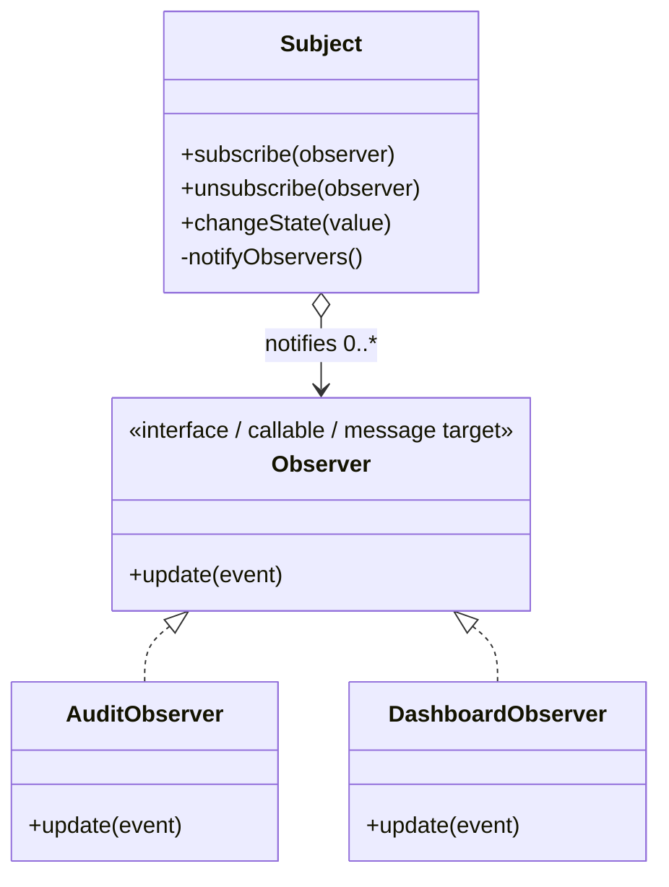

# Observer

> **Estado:** `in_progress`  
> **Estándar:** [KB-006 — Pattern Authoring Standard](../docs/kb/catalog/pattern-authoring-standard.md)  
> **Universo canónico:** 51 targets  
> **Aplicabilidad:** 49 `Applicable` / 2 `N/A`  
> **Implementaciones canónicas verificadas:** 32/49

## Problema

Un componente mantiene estado o produce un hecho relevante y varios consumidores independientes necesitan reaccionar cuando ese estado cambia. Hacer que el productor conozca y llame directamente a cada consumidor crea acoplamiento, obliga a modificarlo al añadir receptores y mezcla la responsabilidad de cambiar estado con las consecuencias externas del cambio.

Observer establece una dependencia uno-a-muchos: el **Subject** mantiene o recibe suscripciones y, cuando ocurre un cambio relevante, notifica a los **Observers** mediante un contrato estable. Los observers deciden su propia reacción sin que el subject conozca su lógica concreta.

## Fuerzas

- El productor debe poder evolucionar sin conocer todos los consumidores presentes o futuros.
- Los consumidores necesitan enterarse de cambios sin sondeo continuo.
- Debe existir un contrato claro para suscribir, notificar y, cuando aplique, cancelar la suscripción.
- El orden, sincronía y manejo de errores de las notificaciones pueden afectar semántica y rendimiento.
- Las referencias a observers pueden introducir fugas de memoria o ciclos de vida difíciles si no se liberan.
- Una cascada de observers puede volver implícito el flujo de control y dificultar diagnóstico.
- En lenguajes funcionales, de mensajes o declarativos, la intención puede expresarse con funciones, procesos, relaciones, predicados o datos de suscripción sin imitar clases.

## Intención

Separar a quien **detecta/publica un cambio** de quienes **reaccionan al cambio**, permitiendo registrar uno o varios dependientes detrás de un contrato de notificación sin acoplar el subject a implementaciones concretas.

## Roles y responsabilidades

- **Subject / Publisher:** conserva el conjunto de suscriptores o el mecanismo equivalente y decide cuándo emitir una notificación.
- **Observer / Subscriber:** recibe el evento o estado relevante y ejecuta una reacción independiente.
- **Subscription:** representa el vínculo entre ambos; puede ser una referencia, callback, función, PID, canal, predicado, fila o mecanismo idiomático equivalente.
- **Notification:** transporta la mínima información necesaria para que el observer reaccione. Puede ser push (el subject envía datos) o pull (el observer consulta después de ser avisado).

## Solución

1. Define un contrato de notificación pequeño y estable.
2. Permite registrar uno o varios observers sin que el subject dependa de sus tipos concretos.
3. Cuando el subject cambia de forma relevante, recorre o activa las suscripciones y emite la notificación.
4. Mantén la reacción específica dentro de cada observer.
5. Define explícitamente ciclo de vida, baja, orden, sincronía y política de errores cuando importen al dominio.

## Aplicabilidad e implementaciones por lenguaje

`Applicable` significa que el target puede expresar la semántica Observer de forma idiomática. Un sweep o función embebida no cuenta por sí sola como implementación canónica direccionable bajo KB-006.

| Target | Estado | Ejemplo canónico | Evidencia / nota |
|---|---|---|---|
| C# | Applicable | [`Observer.cs`](../src/Enterprise/C%23/patterns/Observer.cs) | Canónico existente; contrato ejecutable del cohort. |
| TypeScript | Applicable | [`observer.ts`](../src/Web/TypeScriptTS/patterns/observer.ts) | Canónico existente. |
| Ada | Applicable | [`observer_pattern.adb`](../src/Systems/Ada/observer_pattern.adb) | Canónico existente. |
| Solidity | Applicable | [`Observer.sol`](../src/Niche/Solidity/patterns/Observer.sol) | Canónico existente. |
| Fortran | Applicable | [`observer.f90`](../src/Systems/Fortran/patterns/observer.f90) | Canónico existente. |
| Pascal | Applicable | [`observer_pattern.pas`](../src/Systems/Pascal/observer_pattern.pas) | Canónico existente. |
| Python | Applicable | [`observer.py`](../src/Scripting/PythonPY/observer.py) | `py_compile` + runtime + sentinel en Scripting / Linux. |
| VB.NET | Applicable | [`Observer.vb`](../src/Enterprise/VB.NET/patterns/Observer.vb) | Canónico existente. |
| C++ | Applicable | [`observer.cpp`](../src/Systems/C%2B%2B/patterns/observer.cpp) | `g++-14 -std=c++23 -Wall -Wextra -Werror` + runtime en Native Patterns. |
| Objective-C | Applicable | [`observer.m`](../src/Systems/Objective-C/observer.m) | Clang/GNUstep `-Wall -Wextra -Werror` + runtime por delegación desde Long-tail. |
| Java | Applicable | [`observer.java`](../src/Enterprise/Java/patterns/observer.java) | `javac -Xlint:all -Werror` + runtime en JVM Patterns. |
| Rust | Applicable | [`observer.rs`](../src/Systems/Rust/patterns/observer.rs) | `rustc --edition=2024 -D warnings` + runtime en Native Patterns. |
| Zig | Applicable | [`observer.zig`](../src/Systems/Zig/observer.zig) | Materializado; el sweep delega al canónico. VERIFY pendiente en Long-tail (`zig fmt --check` + `zig run`). |
| Go | Applicable | — | El sweep no sustituye al canónico. |
| PHP | Applicable | [`observer.php`](../src/Scripting/PHP/patterns/observer.php) | Canónico existente. |
| Nim | Applicable | [`observer_example.nim`](../src/Niche/Nim/patterns/observer_example.nim) | Canónico existente. |
| Dart | Applicable | — | El sweep no sustituye al canónico. |
| Kotlin | Applicable | [`Observer.kt`](../src/Enterprise/Kotlin/patterns/Observer.kt) | Canónico existente. |
| Swift | Applicable | [`Observer.swift`](../src/Systems/Swift/patterns/Observer.swift) | Canónico existente. |
| F# | Applicable | [`Observer.fsx`](../src/Functional/F%23/patterns/Observer.fsx) | Canónico existente. |
| Crystal | Applicable | — | El sweep no sustituye al canónico. |
| Lua | Applicable | [`observer.lua`](../src/Scripting/Lua/patterns/observer.lua) | `luac -p` + runtime dentro del cohort Scripting de 39 canónicos Lua. |
| Haskell | Applicable | — | El sweep no sustituye al canónico. |
| COBOL | Applicable | [`observer_pattern.cpy`](../src/Historical/Cobol/patterns/observer_pattern.cpy) | Canónico existente. |
| Scala | Applicable | [`Observer.scala`](../src/Functional/Scala/patterns/Observer.scala) | Canónico existente. |
| Groovy | Applicable | [`observer.groovy`](../src/Functional/Groovy/patterns/observer.groovy) | Runtime dentro del cohort de 39 celdas de JVM Patterns. |
| Ruby | Applicable | [`observer.rb`](../src/Scripting/Ruby/patterns/observer.rb) | Canónico existente. |
| C | Applicable | [`observer.c`](../src/Systems/C/patterns/observer.c) | `gcc-14 -std=c23 -Wall -Wextra -Werror` + runtime en Native Patterns. |
| OCaml | Applicable | — | Falta canónico direccionable. |
| Julia | Applicable | — | El sweep no sustituye al canónico. |
| VBA | Applicable | — | Callbacks, eventos o colecciones de handlers pueden expresar Observer; falta canónico. |
| GDScript | Applicable | — | Signals/callables son mecanismos idiomáticos; falta canónico. |
| JavaScript | Applicable | [`observer.js`](../src/Web/JavaScriptJS/patterns/observer.js) | Canónico existente. |
| MATLAB | Applicable | [`observer.m`](../src/DataScience/MATLAB/observer.m) | Canónico existente. |
| Perl | Applicable | — | Callbacks/closures permiten Observer; falta canónico. |
| R | Applicable | [`observer.R`](../src/DataScience/R/patterns/observer.R) | Canónico existente. |
| PowerShell | Applicable | [`observer.ps1`](../src/Scripting/PowerShell/patterns/observer.ps1) | Canónico existente. |
| HTML | N/A | — | HTML puro describe estructura y semántica, pero no mantiene ni despacha por sí solo un registro arbitrario de subscribers; hacerlo requiere un runtime de comportamiento externo. |
| Assembly | Applicable | — | Tabla de callbacks/direcciones o mensajes permite expresar la dependencia; falta canónico. |
| Elixir | Applicable | [`observer.exs`](../src/Functional/Elixir/patterns/observer.exs) | Canónico existente. |
| Shell | Applicable | [`observer.sh`](../src/Scripting/Bash/patterns/observer.sh) | Canónico existente. |
| Erlang | Applicable | [`observer.erl`](../src/Functional/Erlang/patterns/observer.erl) | Canónico existente. |
| Clojure | Applicable | [`observer.clj`](../src/Functional/Clojure/patterns/observer.clj) | Canónico existente. |
| Common Lisp | Applicable | — | Funciones/closures permiten suscriptores; falta canónico. |
| Prolog | Applicable | — | Hechos/predicados dinámicos y reglas de despacho permiten modelar suscripciones; falta canónico. |
| Delphi | Applicable | — | Eventos, métodos y listas de callbacks permiten Observer; falta canónico. |
| Octave | Applicable | [`observer.m`](../src/DataScience/Octave/patterns/observer.m) | Canónico existente. |
| SQL declarativo | Applicable | — | Suscripciones y cambios pueden representarse como relaciones; una consulta puede derivar la relación de notificaciones sin fingir objetos ni triggers procedurales. Falta canónico. |
| CSS | N/A | — | CSS reacciona declarativamente a estado del árbol/rendering, pero no ofrece por sí solo un mecanismo general de suscripción y despacho de notificaciones entre participantes del dominio; usar DOM/JS cambiaría de target. |
| MicroPython | Applicable | — | Callbacks/listas de funciones permiten Observer; falta canónico. |
| Rockstar | Applicable | — | Funciones y estado explícito pueden modelar publisher/subscribers; falta canónico. |

**Conteo factual actual:** 32 canónicos direccionables y verificados / 49 targets Applicable; Zig está materializado y enlazado pero no eleva el contador hasta que el gate Long-tail certifique el SHA que delega al canónico. El inventario inicial subcontaba C, C++, Rust, Java, Groovy y Lua, que ya existían y estaban cubiertos por adapters repository-native; Python y Objective-C se añadieron/certificaron en este lane. Las funciones embebidas en sweeps sólo sirven como evidencia histórica y no elevan este contador.

## En Genkidama

No existe un uso deliberado de Observer en la arquitectura productiva que deba introducirse para demostrar el patrón. El catálogo lo mantiene como ejemplo vivo aislado. Si una parte productiva adopta legítimamente notificaciones uno-a-muchos en el futuro, esta sección debe enlazar ese uso real; no se forzará la arquitectura para satisfacer el catálogo.

## Cuándo usarlo

- Cuando varios consumidores independientes deben reaccionar a cambios de un productor.
- Cuando añadir o retirar consumidores no debería modificar al productor.
- Cuando callbacks, eventos, señales, mensajes o relaciones de suscripción son parte natural del ecosistema.
- Cuando la consistencia requerida tolera y documenta la semántica de entrega elegida.

## Cuándo no usarlo

- Cuando sólo existe un consumidor estable y una llamada directa expresa mejor la intención.
- Cuando el orden exacto de una cadena de pasos es parte esencial del dominio; una pipeline o Chain of Responsibility puede ser más clara.
- Cuando se necesita desacoplamiento entre procesos/servicios con durabilidad, reintentos y replay; un broker/pub-sub durable puede ser el mecanismo correcto, aunque conserve una intención relacionada.
- Cuando el coste de un flujo de control implícito supera el beneficio del desacoplamiento.

## Trade-offs

**Ventajas**

- Reduce el conocimiento del subject sobre consumidores concretos.
- Permite incorporar observers sin modificar la lógica central del publisher.
- Encaja con eventos, signals, callbacks, procesos y estilos funcionales.

**Costes**

- El flujo de control puede quedar distribuido e invisible a simple vista.
- Un observer lento o defectuoso puede afectar al publisher si la entrega es síncrona.
- Suscripciones no liberadas pueden producir fugas o callbacks a objetos muertos.
- Orden, duplicados, reentrancia y excepciones requieren política explícita cuando importan.

## Relaciones y confusiones frecuentes

- **Observer vs Pub/Sub:** Observer normalmente conserva una relación directa o en memoria entre publisher y subscribers; Pub/Sub suele introducir un broker o canal que desacopla también ubicación y tiempo.
- **Observer vs Mediator:** Observer distribuye notificaciones de un subject a dependientes; Mediator centraliza reglas de colaboración entre varios peers.
- **Observer vs Event Aggregator:** un Event Aggregator centraliza múltiples fuentes/eventos detrás de un hub; Observer no requiere ese intermediario.
- **Observer vs Reactive Streams:** streams añaden semánticas como composición, backpressure, errores y terminación. Observer es la relación de notificación más básica.
- **Observer vs State:** State encapsula comportamiento según estado interno; Observer comunica que algo cambió a dependientes externos.

## Verificación esperada

Para cada target `Applicable`, la validación más fuerte y ligera razonable debe demostrar al menos:

1. que uno o más observers pueden registrarse o representarse independientemente del publisher;
2. que un cambio relevante provoca la notificación;
3. que dos observers pueden reaccionar sin que el publisher conozca su implementación concreta;
4. cuando el mecanismo admita baja, que un observer dado de baja deja de recibir notificaciones;
5. que el ejemplo es ejecutable/analizable por el toolchain repository-native o, cuando no sea razonable, por un source contract explícito y documentado.

La matriz de lenguajes no implica un porcentaje agregado de code/test coverage. Donde coverage sea medible, el piso de aceptación es 44% si contratos, comportamiento relevante, failure modes y regresiones están protegidos; no se exige 100%.

## Failure modes que deben vigilarse

- Notificar mientras se modifica la propia colección de subscribers.
- Duplicar una suscripción accidentalmente y entregar el mismo evento dos veces.
- Mantener referencias a observers cuyo ciclo de vida terminó.
- Permitir que una excepción de un observer impida indebidamente la entrega a los demás.
- Crear bucles de reentrancia donde observer y subject se disparan mutuamente sin límite.
- Depender de un orden de observers no contratado.
- Confundir una lista de callbacks invocada una vez con una relación Observer mantenible y verificable.

## Preguntas de comprensión

1. ¿Qué conocimiento elimina Observer del publisher y qué nuevo contrato introduce?
2. ¿Qué diferencia práctica existe entre Observer síncrono en memoria y Pub/Sub durable mediante broker?
3. ¿Qué política de ciclo de vida y errores necesitaría el ejemplo antes de usarlo en producción?