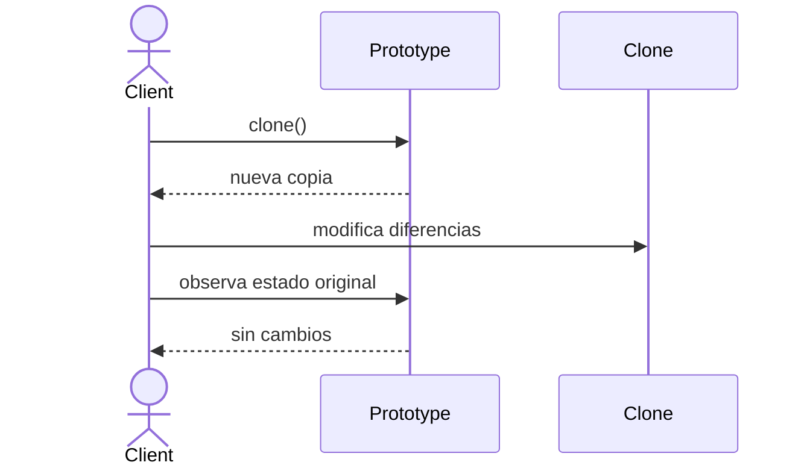

# Prototype

> **Familia:** Creational  
> **Intención:** crear nuevos objetos copiando una instancia prototipo existente cuando reutilizar su estado configurado resulta más claro o económico que reconstruirlo desde cero.  
> **Estado:** `in-progress`  
> **Implementaciones de lenguaje:** `22/48`  
> **Cobertura de pruebas:** N/A — no existe una métrica homogénea entre los ejemplos standalone; se usará la evidencia más fuerte razonablemente disponible por target.  
> **Mapa:** [Volver al catálogo y mapa de relaciones](README.md)

## En una frase

Prototype parte de un objeto ya configurado y crea una copia independiente que puede variar sin reconstruir toda su configuración ni acoplar al cliente a un constructor concreto.

## El problema

Algunas instancias son costosas o verbosas de configurar: contienen muchas opciones, una estructura interna preparada, defaults derivados o colecciones que deben comenzar con un estado coherente. Si cada cliente reconstruye esa configuración desde cero, duplica conocimiento y aumenta el riesgo de inconsistencias.

También puede ocurrir que el cliente conozca la abstracción que necesita pero no deba conocer la clase concreta ni todos los detalles necesarios para volver a construirla.

## Fuerzas que compiten

- Reutilizar una configuración existente evita repetir lógica de construcción.
- La copia debe conservar invariantes sin compartir accidentalmente estado mutable que debería ser independiente.
- El cliente debería pedir una copia al prototipo sin necesitar conocer su tipo concreto.
- Copiar grafos complejos puede ser más difícil de entender que construir explícitamente un objeto nuevo.

## La solución

Dar al objeto prototipo una operación de clonación —o usar el mecanismo idiomático equivalente del lenguaje— que produzca una nueva instancia con el mismo estado relevante. El cliente conserva una referencia al prototipo, solicita una copia y modifica sólo las diferencias necesarias.

El punto central no es llamar a una API llamada `clone`; es **usar una instancia existente como fuente de creación** y definir correctamente qué partes de su estado deben copiarse superficial o profundamente.

## Participantes y responsabilidades

| Participante | Responsabilidad |
|---|---|
| `Prototype` | Expone o representa la operación de clonación. |
| `ConcretePrototype` | Define qué estado se copia y cómo se preserva la independencia necesaria. |
| Cliente | Solicita una copia al prototipo y configura únicamente las diferencias. |
| Estado mutable anidado | Debe copiarse con la profundidad apropiada para evitar aliasing accidental. |

## Cómo funciona

1. Se prepara una instancia con una configuración útil y coherente.
2. El cliente solicita una copia mediante el contrato de Prototype o el mecanismo nativo equivalente.
3. La copia conserva el estado base, pero obtiene identidad independiente.
4. El cliente modifica la copia sin alterar el prototipo cuando ese estado debe ser independiente.

## Diagrama



El comportamiento importante del diagrama es la independencia: la copia parte del mismo estado configurado, pero una mutación posterior de la copia no debe contaminar al prototipo cuando el contrato promete separación.

## Ejemplo mínimo

```text
prototype = ServiceProfile("orders", ["metrics"])
canary = prototype.clone()
canary.name = "orders-canary"
canary.features.add("tracing")

prototype -> orders: metrics
canary    -> orders-canary: metrics,tracing
```

La colección `features` debe ser independiente. Una copia superficial que haga aparecer `tracing` también en `prototype` sería un defecto observable.

## Aplicación real

### Plantillas de configuración preparadas

Un generador puede conservar perfiles previamente configurados para diferentes tipos de servicio y clonarlos antes de aplicar personalizaciones específicas de una nueva instancia. Esto evita reconstruir defaults y opciones compartidas en cada creación.

Si el objeto se construye con dos parámetros triviales y no existe estado costoso o configuración que reutilizar, un constructor o factory simple es más claro.

## En Genkidama

La filosofía de Genkidama reconoce Prototype como patrón que puede colaborar con fábricas y generación configurable, pero esta entrega no declara todavía un uso productivo deliberado concreto sin evidencia directa. No se modificará arquitectura productiva para fabricar uno artificialmente.

## Cuándo usarlo

- Crear una instancia desde cero requiere repetir una configuración extensa o costosa.
- El cliente conoce el contrato del objeto pero no debería depender de su clase concreta para copiarlo.
- Existen plantillas o configuraciones base que luego reciben pequeñas variaciones.
- La semántica de copia puede definirse claramente, incluida la profundidad necesaria para estado mutable.

## Cuándo no usarlo

- Construir el objeto es simple, explícito y barato.
- La semántica de copia de un grafo complejo es ambigua o peligrosa.
- La identidad externa del objeto no puede duplicarse con seguridad —por ejemplo handles exclusivos, conexiones activas o recursos no clonables—.
- La presión real es ensamblar paso a paso un objeto complejo: considera [Builder](Builder.md).

## Consecuencias y trade-offs

| A favor | Costo / riesgo |
|---|---|
| Reutiliza configuraciones ya preparadas. | Obliga a definir con precisión shallow copy vs deep copy. |
| Reduce dependencia del cliente respecto de constructores concretos. | Clonar grafos con ciclos o recursos externos puede ser complejo. |
| Permite crear variantes modificando sólo diferencias. | Copias profundas pueden tener costo significativo. |
| Puede simplificar registros de plantillas configurables. | Una API de clonación mal definida puede ocultar aliasing y bugs de identidad. |

## Patrones relacionados

[Consulta también el mapa global de relaciones](README.md#relationship-map).

| Patrón | Relación | Por qué importa |
|---|---|---|
| [Abstract Factory](AbstractFactory.md) | often implemented with | Una fábrica puede producir variantes clonando prototipos registrados en vez de construir cada producto desde cero. |
| [Builder](Builder.md) | alternative to | Builder reconstruye progresivamente; Prototype reutiliza una instancia ya configurada. |
| [Factory Method](FactoryMethod.md) | alternative to | Factory Method delega creación mediante un hook; Prototype delega creación a la copia de una instancia. |
| [Singleton](Singleton.md) | often confused with | Singleton restringe cuántas instancias existen; Prototype facilita crear nuevas instancias a partir de otras. |

## Errores comunes y confusiones

### Confundir una copia superficial accidental con Prototype correcto

Que el lenguaje pueda duplicar una referencia o estructura no significa que la semántica sea correcta. Si el contrato necesita independencia, las colecciones u objetos mutables anidados deben copiarse con la profundidad necesaria.

### Usar clonación para evitar diseñar constructores claros

Prototype resuelve presión de reutilización de una instancia configurada. No es una excusa para ocultar invariantes o abandonar una API de construcción que sería más fácil de entender.

### Copiar identidad externa

Duplicar IDs únicos, sockets, handles, locks o conexiones puede producir dos objetos que aparentan ser independientes pero compiten por un recurso que no lo es. La operación de clonación debe definir explícitamente qué se copia y qué se reinicializa.

## Cómo comprobar una implementación

- El cliente puede obtener una nueva instancia a partir de un prototipo existente sin reconstruir toda su configuración.
- La copia conserva el estado base esperado.
- Modificar la copia no altera el prototipo cuando el contrato exige independencia.
- El ejemplo protege al menos un caso de estado mutable anidado para detectar shallow-copy accidental.
- El mecanismo usado es idiomático para el lenguaje; no se exige una jerarquía OO artificial.

## Implementaciones por lenguaje

La fuente de targets es [`learn/_meta/catalog.yml`](../learn/_meta/catalog.yml): 45 lenguajes v1 y 6 adicionales. La clasificación provisional mantiene 48 `Applicable` y 3 `N/A`. Hay **22 ejemplos materializados y verificados** en dos tranches ejecutables; los 26 Applicable restantes siguen pendientes.

| Lenguaje | Aplicabilidad | Ejemplo verificado | Validación | Nota |
|---|---|---|---|---|
| C# | Applicable | [`PrototypeExample.cs`](../src/Enterprise/C%23/PrototypeExample.cs) | ✅ .NET 10 compile/run | Contrato explícito + copia profunda de colección. |
| TypeScript | Applicable | [`prototype.ts`](../src/Web/TypeScriptTS/prototype.ts) | ✅ TypeScript 6 strict + Node | Contrato genérico + copia independiente del array. |
| Ada | Applicable | — | pendiente | Records y operaciones de copia pueden expresar el contrato. |
| Solidity | Applicable | — | pendiente | Structs/contratos pueden copiar estado significativo dentro de sus límites de storage/memory. |
| Fortran | Applicable | — | pendiente | Derived types y asignación controlada permiten copiar estado. |
| Pascal | Applicable | [`prototype.pas`](../src/Historical/Pascal/prototype.pas) | ✅ FPC strict compile/run | Record con copia explícita del array dinámico. |
| Python | Applicable | [`prototype.py`](../src/Scripting/PythonPY/prototype.py) | ✅ Python compile/run | `deepcopy` encapsulado por el prototipo. |
| Visual Basic .NET | Applicable | [`PrototypeExample.vb`](../src/Enterprise/VisualBasic/PrototypeExample.vb) | ✅ .NET 10 VB compile/run | Nueva instancia + nueva `List(Of String)`. |
| C++ | Applicable | [`prototype.cpp`](../src/Systems/C%2B%2B/prototype.cpp) | ✅ C++20 warnings-as-errors | `clone()` virtual + `unique_ptr`; vector copiado por valor. |
| Objective-C | Applicable | — | pendiente | `NSCopying`/copy idiomático. |
| Java | Applicable | [`PrototypeExample.java`](../src/Enterprise/Java/PrototypeExample.java) | ✅ Java 25 `-Werror` | Contrato `Prototype<T>` + nueva colección. |
| Rust | Applicable | [`prototype.rs`](../src/Systems/Rust/prototype.rs) | ✅ rustfmt + `rustc -D warnings` | `Clone` idiomático duplica `Vec<String>`. |
| Zig | Applicable | — | pendiente | Structs y copia explícita con ownership controlado. |
| Go | Applicable | [`prototype.go`](../src/Systems/Go/prototype.go) | ✅ gofmt + vet + run | Método `Clone` duplica el slice mutable. |
| PHP | Applicable | [`prototype.php`](../src/Scripting/PHP/prototype.php) | ✅ lint/run | `clone`; arrays usan copy-on-write y divergen al modificar la copia. |
| Nim | Applicable | — | pendiente | Objects/ref objects con copia explícita. |
| Dart | Applicable | — | pendiente | `copyWith`/copia explícita puede preservar intención. |
| Kotlin | Applicable | [`PrototypeExample.kt`](../src/Enterprise/Kotlin/PrototypeExample.kt) | ✅ kotlinc/JVM | `copy` + `toMutableList` evita compartir estado mutable. |
| Swift | Applicable | [`prototype.swift`](../src/Systems/Swift/prototype.swift) | ✅ swiftc compile/run | Value semantics + copy-on-write de `Array`. |
| F# | Applicable | [`prototype.fsx`](../src/Functional/F%23/prototype.fsx) | ✅ `dotnet fsi` | Record + lista inmutable para derivar la variante. |
| Crystal | Applicable | — | pendiente | Objetos/structs con duplicación controlada. |
| Lua | Applicable | [`prototype.lua`](../src/Scripting/Lua/prototype.lua) | ✅ Lua 5.4 run | Table clone con nuevo array de features. |
| Haskell | Applicable | [`Prototype.hs`](../src/Functional/Haskell/Prototype.hs) | ✅ GHC warnings-as-errors | Valor inmutable derivado desde la plantilla. |
| COBOL | Applicable | — | pendiente | Records y rutinas de copia pueden preservar el movimiento de diseño. |
| Scala | Applicable | [`Prototype.scala`](../src/Functional/Scala/Prototype.scala) | ✅ scalac/run | Case class + `copy` sobre `Vector` inmutable. |
| Groovy | Applicable | — | pendiente | Objetos/maps y copia explícita. |
| Ruby | Applicable | [`prototype.rb`](../src/Scripting/RubyRB/prototype.rb) | ✅ syntax/run | `dup` + `initialize_copy` para duplicar estado mutable. |
| C | Applicable | [`prototype.c`](../src/Systems/C/prototype.c) | ✅ C17 warnings-as-errors | Struct por valor con buffers propios. |
| OCaml | Applicable | — | pendiente | Records y actualización funcional desde una plantilla. |
| Julia | Applicable | — | pendiente | `copy`/`deepcopy` y structs configurados. |
| VBA | Applicable | — | pendiente | Class modules + operación de copia explícita. |
| GDScript | Applicable | — | pendiente | `duplicate`/Dictionary deep duplication según representación. |
| JavaScript | Applicable | [`prototype.js`](../src/Web/JavaScriptJS/prototype.js) | ✅ Node syntax/run | Prototipo nativo + copia independiente de array mutable. |
| MATLAB | Applicable | — | pendiente | Structs/handle/value classes permiten copia significativa. |
| Perl | Applicable | [`prototype.pl`](../src/Scripting/Perl/prototype.pl) | ✅ syntax/run | Hash + nuevo array para el clon. |
| R | Applicable | — | pendiente | Listas/objetos permiten derivar copias configuradas. |
| PowerShell | Applicable | [`prototype.ps1`](../src/Shell/PowerShell/prototype.ps1) | ✅ pwsh StrictMode/run | PSCustomObject + nueva lista genérica. |
| HTML | N/A | — | — | HTML describe markup; una rutina de clonación ejecutable pertenece al runtime que la implementa. |
| Assembly | Applicable | — | pendiente | Copia explícita de estructuras/buffers puede preservar el patrón. |
| Elixir | Applicable | — | pendiente | Datos inmutables permiten derivar variantes desde una plantilla. |
| Shell | Applicable | [`prototype.sh`](../src/Shell/Bash/prototype.sh) | ✅ bash syntax/run | Arrays copiados mediante referencias por nombre, sin compartir estado. |
| Erlang | Applicable | — | pendiente | Maps/records inmutables permiten derivar copias. |
| Clojure | Applicable | — | pendiente | Persistent data structures permiten partir de un prototipo inmutable. |
| Common Lisp | Applicable | — | pendiente | Estructuras/listas y copy-tree/copia explícita. |
| Prolog | Applicable | — | pendiente | Términos pueden duplicarse y especializarse declarativamente. |
| Delphi | Applicable | — | pendiente | Clases/records + copia explícita bajo DCC. |
| GNU Octave | Applicable | — | pendiente | Structs/classes permiten copia de plantilla. |
| SQL | N/A | — | — | SQL declarativo puede duplicar datos, pero no expresa por sí mismo un objeto runtime responsable de clonarse dentro de este catálogo. |
| CSS | N/A | — | — | CSS define reglas de presentación; no expresa una operación runtime de clonación de objetos. |
| MicroPython | Applicable | — | pendiente | Objetos/listas/dicts permiten copia explícita en el runtime real. |
| Rockstar | Applicable | — | pendiente | Arrays/objects del runtime pueden representar una plantilla copiable con una rutina dedicada. |

## Comprueba que lo entendiste

1. Si una copia comparte accidentalmente una lista mutable con el prototipo, ¿qué comportamiento observarías y qué decisión de copia falta?
2. ¿Cuándo elegirías Builder en lugar de Prototype para crear una variante?
3. ¿Qué tipos de recursos no deberían copiarse ciegamente aunque el resto del objeto sí pueda clonarse?

## Resumen

- La presión central es reutilizar una **instancia ya configurada** como fuente de creación.
- El movimiento de diseño es clonar el prototipo y modificar sólo las diferencias.
- El principal trade-off es definir correctamente identidad y profundidad de copia.
- Builder reconstruye paso a paso; Prototype reutiliza estado ya preparado.
- El patrón puede expresarse sin clases mediante records, structs, maps, funciones y valores inmutables.

## Referencias

- Gamma, Helm, Johnson y Vlissides, *Design Patterns: Elements of Reusable Object-Oriented Software* — Prototype.
- [Patterns as Living Examples](../docs/philosophy/001-patterns-as-living-examples.md).
- [Canonical Design Pattern Authoring Standard](../docs/kb/catalog/pattern-authoring-standard.md).