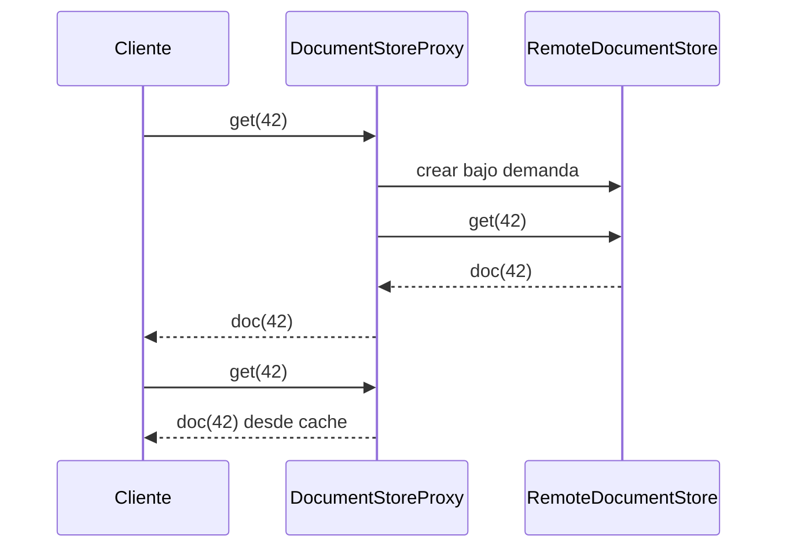

# Proxy

> **Familia:** Structural  
> **Intención:** proporcionar un sustituto con el mismo contrato que otro sujeto para controlar, diferir o mediar el acceso a éste.  
> **Estado:** `in-progress`  
> **Implementaciones de lenguaje:** `0/49`  
> **Cobertura de pruebas:** N/A — ejemplos standalone multi-ecosistema; se usa compilación, runtime, análisis o contrato por lenguaje en lugar de inventar un porcentaje agregado.  
> **Mapa:** [Volver al catálogo y mapa de relaciones](README.md)

## En una frase

Proxy deja que el cliente hable con un sustituto compatible mientras ese sustituto decide cuándo y cómo llegar al sujeto real.

## El problema

Un cliente necesita leer documentos desde un servicio remoto. Crear la conexión o cliente remoto puede ser costoso, y repetir la misma lectura puede volver a pagar latencia y consumo de red. El cliente no debería conocer esas decisiones ni cambiar su contrato cada vez que añadimos acceso diferido, cache, autorización, observabilidad o una frontera remota.

## Fuerzas que compiten

- El cliente debe conservar un contrato estable y no depender de detalles de transporte o ciclo de vida.
- Acceder al sujeto real puede ser costoso, remoto, sensible o requerir controles adicionales.
- La intermediación debe ser transparente respecto de la operación principal, sin ocultar errores o semántica importante.
- Añadir un objeto intermedio cuesta complejidad y sólo se justifica cuando existe una política real de acceso.

## La solución

Introducir un **Proxy** que expone el mismo contrato observable que el **Real Subject**. El cliente usa el Proxy como si fuera el sujeto; el Proxy puede crear el sujeto real sólo cuando haga falta, autorizar una operación, cachear una respuesta, registrar acceso o cruzar una frontera remota antes de delegar.

La intención no depende de clases. Una closure, función de orden superior, módulo, proceso, predicado, tabla, vista u otro mecanismo puede actuar como surrogate siempre que preserve el contrato relevante y controle el acceso al sujeto real.

## Participantes y responsabilidades

| Participante | Responsabilidad |
|---|---|
| `Subject` | Define el contrato que cliente, Proxy y sujeto real comparten. |
| `RealSubject` | Ejecuta la operación real o costosa. |
| `Proxy` | Implementa el mismo contrato y decide cuándo o bajo qué política delegar. |
| Cliente | Depende del contrato, no del detalle de acceso al sujeto real. |

## Cómo funciona

1. El cliente recibe o crea un Proxy en lugar del sujeto real.
2. El Proxy atiende la operación mediante el mismo contrato.
3. Si puede responder sin tocar el sujeto real —por ejemplo desde cache— lo hace.
4. Si necesita al sujeto real, lo crea, localiza o autoriza y delega la operación.
5. El resultado vuelve al cliente sin obligarlo a conocer la política de intermediación.

## Diagrama



El cliente conserva una sola operación. La primera llamada materializa y usa el sujeto remoto; la segunda puede resolverse en el Proxy sin un segundo acceso real.

## Ejemplo mínimo

```text
store = DocumentStoreProxy()
first = store.get(42)
second = store.get(42)

backend=1;fetches=1;first=doc(42);second=doc(42)
```

El observable demuestra que dos lecturas con el mismo contrato crean un solo backend y provocan un solo fetch real. El cache es una política del Proxy; no redefine el contrato del sujeto.

## Aplicación real

### Cliente remoto con acceso diferido

Un SDK puede exponer `DocumentStore.get(id)` aunque el sujeto real viva detrás de HTTP, gRPC o IPC. Un Proxy puede diferir la creación del cliente remoto hasta la primera operación y reutilizar resultados cuando la política de consistencia lo permita.

Si sólo se necesita transformar una interfaz incompatible, [Adapter](Adapter.md) es más preciso. Si el objetivo es añadir responsabilidades componibles a un objeto ya disponible, [Decorator](Decorator.md) suele comunicar mejor la intención.

### Protección declarativa en SQL

Una `VIEW` puede actuar como protection proxy de una tabla: ofrece una forma relacional compatible al consumidor y controla qué filas o columnas quedan accesibles. El ejemplo SQL usa una vista `document_proxy` sobre `document_backend` y una política de acceso, por lo que SQL declarativo es Applicable para Proxy aunque no tenga objetos o clases.

## En Genkidama

La filosofía del repositorio identifica clientes de APIs backend y servicios remotos como un lugar natural para Proxy, pero no existe actualmente un uso productivo deliberado y auditado del patrón que deba enlazarse desde esta página. No se introduce Proxy en la arquitectura productiva sólo para exhibirlo.

## Cuándo usarlo

- El sujeto real es remoto, caro de crear o conviene materializarlo sólo bajo demanda.
- Debes aplicar autorización, rate limiting, cache u otra política de acceso sin cambiar a los clientes.
- Necesitas una representación local de un sujeto remoto manteniendo un contrato equivalente.
- La política de intermediación tiene identidad y ciclo de vida propios que merecen encapsularse.

## Cuándo no usarlo

- Una llamada directa es suficientemente barata y clara.
- Sólo necesitas adaptar firmas o formatos incompatibles; usa Adapter.
- Sólo necesitas responsabilidades apilables alrededor de un objeto existente; considera Decorator.
- El cache no puede respetar la semántica de consistencia del sujeto real.
- La intermediación ocultaría latencia, fallos remotos o permisos que el cliente necesita conocer explícitamente.

## Consecuencias y trade-offs

| A favor | Costo / riesgo |
|---|---|
| Mantiene estable el contrato del cliente. | Añade una capa de indirección y otro ciclo de vida. |
| Permite lazy access, protección, cache o frontera remota. | Puede ocultar costo de red o fallos si el contrato no los modela bien. |
| Centraliza políticas de acceso al sujeto. | Un Proxy con demasiadas políticas puede convertirse en un objeto difícil de razonar. |
| Puede evitar trabajo remoto repetido. | Cache e invalidación introducen decisiones de consistencia. |

## Patrones relacionados

[Consulta también el mapa global de relaciones](README.md#relationship-map).

| Patrón | Relación | Por qué importa |
|---|---|---|
| [Lazy Initialization](LazyInitialization.md) | often implemented with | Un virtual proxy suele crear o localizar el sujeto real sólo en la primera necesidad. |
| [Decorator](Decorator.md) | often confused with | Ambos envuelven un contrato; Decorator agrega responsabilidades componibles, Proxy controla acceso a un sujeto. |
| [Adapter](Adapter.md) | often confused with | Adapter cambia una interfaz; Proxy procura conservar el contrato relevante. |
| [Facade](Facade.md) | often confused with | Facade simplifica varios subsistemas; Proxy representa o controla acceso a un sujeto. |
| [Distributed Proxy](ProxyDistribuido.md) | specializes / generalizes | Un distributed proxy especializa la intención para representar un sujeto que vive en otra frontera de proceso o red. |

## Errores comunes y confusiones

### Llamar Proxy a cualquier wrapper

Que un objeto envuelva a otro no basta. Proxy existe porque hay una política de **acceso o representación** del sujeto real; Decorator existe para añadir responsabilidades al componente.

### Ocultar una frontera remota por completo

Compartir contrato no significa fingir que red y memoria tienen exactamente las mismas failure modes. Timeouts, cancelación, autorización y errores remotos deben seguir siendo observables cuando importan al consumidor.

### Cache sin política de consistencia

Cachear es una posibilidad, no una obligación del patrón. Si los datos cambian y el Proxy no tiene una regla de expiración o invalidación compatible con el dominio, la indirección puede servir datos incorrectos.

## Cómo comprobar una implementación

- Cliente y Proxy usan el mismo contrato relevante que el sujeto real.
- El Proxy controla realmente el acceso: creación diferida, autorización, cache, frontera remota u otra política observable.
- El sujeto real no se toca cuando el Proxy puede responder correctamente sin él.
- Cambiar entre Proxy y sujeto real no obliga al cliente a aprender una interfaz distinta.
- Los gates comprueban comportamiento —por ejemplo un solo fetch para dos lecturas cacheables— y no sólo nombres de clases.

## Implementaciones por lenguaje

Universo actual: **51 targets**. Proxy clasifica **49 Applicable** y **2 N/A**. En particular, SQL declarativo es Applicable porque una vista puede actuar como surrogate/protection proxy con una interfaz relacional equivalente.

Actualmente hay **11 ejemplos materializados y 0 verificados** en este PR; la cifra superior sólo se promoverá cuando el gate correspondiente cierre verde.

| Lenguaje / target | Aplicabilidad | Ejemplo verificado | Validación | Nota |
|---|---|---|---|---|
| C# | Applicable | [`ProxyExample.cs`](../src/Enterprise/C%23/ProxyExample.cs) | Proxy Mainstream pendiente | interfaz + lazy/caching proxy |
| TypeScript | Applicable | [`proxy.ts`](../src/Web/TypeScriptTS/proxy.ts) | Proxy Mainstream pendiente | interface + Map |
| Python | Applicable | [`proxy.py`](../src/Scripting/PythonPY/proxy.py) | Proxy Mainstream pendiente | objeto + dict |
| C++ | Applicable | [`proxy.cpp`](../src/Systems/C%2B%2B/proxy.cpp) | Proxy Mainstream pendiente | interfaz + `unique_ptr` |
| Java | Applicable | [`ProxyExample.java`](../src/Enterprise/Java/ProxyExample.java) | Proxy Mainstream pendiente | interface + lazy subject |
| Rust | Applicable | [`proxy.rs`](../src/Systems/Rust/proxy.rs) | Proxy Mainstream pendiente | trait + `Option` + `HashMap` |
| Go | Applicable | [`proxy.go`](../src/Systems/Go/proxy.go) | Proxy Mainstream pendiente | interface + pointer receiver |
| PHP | Applicable | [`proxy.php`](../src/Scripting/PHP/proxy.php) | Proxy Mainstream pendiente | interface + array cache |
| F# | Applicable | [`proxy.fsx`](../src/Functional/F%23/proxy.fsx) | Proxy Mainstream pendiente | interface + option + Dictionary |
| JavaScript | Applicable | [`proxy.js`](../src/Web/JavaScriptJS/proxy.js) | Proxy Mainstream pendiente | objeto + Map |
| Kotlin | Applicable | — | Pendiente | contrato/intermediario idiomático requerido |
| Swift | Applicable | — | Pendiente | protocolo/intermediario idiomático requerido |
| Visual Basic .NET | Applicable | — | Pendiente | interfaz/intermediario idiomático requerido |
| C | Applicable | — | Pendiente | function pointers/structs pueden preservar la intención |
| Ruby | Applicable | — | Pendiente | duck typing/proxy object |
| Lua | Applicable | — | Pendiente | tablas/metatables o closures |
| Bash | Applicable | — | Pendiente | funciones y estado explícito pueden mediar acceso |
| PowerShell | Applicable | — | Pendiente | objetos/scriptblocks pueden mediar acceso |
| Haskell | Applicable | — | Pendiente | funciones/estado explícito pueden representar la intermediación |
| Perl | Applicable | — | Pendiente | referencias/paquetes pueden preservar el contrato |
| Pascal | Applicable | — | Pendiente | interfaces/records/procedimientos según dialecto |
| R | Applicable | — | Pendiente | closures/environments pueden mediar acceso |
| GNU Octave | Applicable | — | Pendiente | funciones/handles pueden mediar acceso |
| OCaml | Applicable | — | Pendiente | módulos/records/closures pueden preservar el contrato |
| Common Lisp | Applicable | — | Pendiente | CLOS o closures pueden representar el surrogate |
| Scala | Applicable | — | Pendiente | trait + proxy idiomático |
| Julia | Applicable | — | Pendiente | funciones/structs múltiples despachos |
| Clojure | Applicable | — | Pendiente | protocols/functions + estado explícito |
| Elixir | Applicable | — | Pendiente | módulos/procesos pueden mediar acceso |
| Erlang | Applicable | — | Pendiente | procesos/módulos pueden representar el sujeto remoto |
| Prolog | Applicable | — | Pendiente | predicados pueden interponer política de acceso |
| Groovy | Applicable | — | Pendiente | duck typing/clases |
| Ada | Applicable | — | Pendiente | tagged types o paquetes |
| Solidity | Applicable | — | Pendiente | contrato surrogate frente a otro contrato |
| Fortran | Applicable | — | Pendiente | módulos/procedimientos y estado explícito |
| Objective-C | Applicable | — | Pendiente | protocol + objeto proxy |
| Zig | Applicable | — | Pendiente | structs/function pointers |
| Nim | Applicable | — | Pendiente | concepts/ref objects/procs |
| Dart | Applicable | — | Pendiente | interface implícita/clases |
| Crystal | Applicable | — | Pendiente | módulos/clases |
| COBOL | Applicable | — | Pendiente | programas/paragraphs pueden mediar una operación externa |
| VBA | Applicable | — | Pendiente | class modules o funciones wrapper con política de acceso |
| GDScript | Applicable | — | Pendiente | objetos/scripts con contrato convencional |
| Assembly | Applicable | — | Pendiente | tabla de saltos/wrapper routine puede interponer acceso |
| Delphi | Applicable | — | Pendiente | interfaces/clases |
| MicroPython | Applicable | — | Pendiente | objetos/closures |
| Rockstar | Applicable | — | Pendiente | funciones y estado explícito pueden expresar la intermediación mínima |
| MATLAB | Applicable | — | Pendiente | handles/functions pueden interponer acceso |
| SQL declarativo | Applicable | [`proxy.sql`](../src/Data/SQL/proxy.sql) | Proxy Mainstream pendiente | `VIEW` como protection proxy de una tabla |
| HTML | N/A | — | — | markup declarativo sin una operación ejecutable que pueda implementar el contrato y controlar acceso a un sujeto |
| CSS | N/A | — | — | reglas de estilo declarativas sin sujeto/intermediario ejecutable ni política de acceso al mismo contrato |

## Comprueba que lo entendiste

1. Si dos objetos tienen la misma interfaz pero uno sólo transforma datos para otra interfaz incompatible, ¿es Proxy o Adapter y por qué?
2. ¿Qué señal te haría elegir Decorator en lugar de Proxy para un wrapper?
3. ¿Qué riesgo introduce un caching proxy cuando el sujeto real cambia con frecuencia?
4. ¿Por qué una SQL `VIEW` puede ser un Proxy significativo aunque SQL declarativo no tenga clases?

## Resumen

- Proxy aparece cuando el acceso a un sujeto necesita una política o representación intermedia sin cambiar el contrato del cliente.
- El Proxy y el sujeto real comparten el contrato relevante; el Proxy decide cuándo y cómo delegar.
- Lazy access, protección, cache y representación remota son variantes comunes, no requisitos simultáneos.
- Adapter cambia interfaces; Decorator añade responsabilidades; Facade simplifica subsistemas.
- La intención es portable a mecanismos no OO, incluido un protection proxy declarativo mediante SQL `VIEW`.

## Referencias

- Gamma, Helm, Johnson y Vlissides, *Design Patterns: Elements of Reusable Object-Oriented Software* — Proxy.
- [Patterns as Living Examples](../docs/philosophy/001-patterns-as-living-examples.md).
- [Canonical Design Pattern Authoring Standard](../docs/kb/catalog/pattern-authoring-standard.md).
