# Genkidama Design Patterns Catalog

Design patterns are a vocabulary for recurring design forces, not isolated recipes. Real systems usually combine several patterns: one may create objects, another structure them, another coordinate behavior, and an architectural pattern may define the boundary in which all of them live.

This index is the stable entry point for the pattern pages under `wiki/`. Some individual pages are still placeholders; keeping the navigation stable lets those explanations mature without forcing readers to rediscover the catalog each time.

## How to use this catalog

1. Start with the **relationship map** to identify patterns that commonly collaborate or solve adjacent parts of the same problem.
2. Use the **catalog by family** to open a specific pattern page.
3. Treat every connection as a prompt to compare intent and trade-offs, not as a rule that the patterns must be used together.
4. Prefer the smallest combination that makes the design clearer. A pattern is useful only when it resolves a real design force.

## Relationship map

The map is deliberately selective in its edges so it stays readable. Every current pattern is represented, but only common or especially instructive relationships are drawn.

- A solid arrow means **commonly collaborates with / can be implemented with**.
- A dotted arrow means **often compared as an alternative or different expression of a similar force**.
- No arrow does **not** mean two patterns are incompatible.

```mermaid
flowchart TB
  subgraph CREATIONAL["Creational"]
    AF["Abstract Factory"]
    BLD["Builder"]
    FM["Factory Method"]
    PROTO["Prototype"]
    SINGLE["Singleton"]
  end

  subgraph STRUCTURAL["Structural"]
    ADAPTER["Adapter"]
    BRIDGE["Bridge"]
    COMPOSITE["Composite"]
    DECORATOR["Decorator"]
    FACADE["Facade"]
    FLYWEIGHT["Flyweight"]
    PROXY["Proxy"]
  end

  subgraph BEHAVIORAL["Behavioral"]
    CHAIN["Chain of Responsibility"]
    COMMAND["Command"]
    INTERPRETER["Interpreter"]
    ITERATOR["Iterator"]
    MEDIATOR["Mediator"]
    MEMENTO["Memento"]
    OBSERVER["Observer"]
    STATE["State"]
    STRATEGY["Strategy"]
    TEMPLATE["Template Method"]
    VISITOR["Visitor"]
  end

  subgraph ARCHITECTURAL["Architectural"]
    MVC["MVC"]
    MVVM["MVVM"]
    MICROKERNEL["Microkernel"]
    MICROSERVICES["Microservices"]
  end

  subgraph INTEGRATION["Integration"]
    ADAPTEREI["Enterprise Adapter"]
    BRIDGEEI["Enterprise Bridge"]
    FACADEEI["Enterprise Facade"]
    BROKER["Broker"]
    MESSAGEBUS["Message Bus"]
    SERVICELOCATOR["Service Locator"]
  end

  subgraph CONCURRENCY["Concurrency"]
    ACTIVEOBJECT["Active Object"]
    MONITOROBJECT["Monitor Object"]
    HALFSYNC["Half-Sync / Half-Async"]
    LEADERFOLLOWERS["Leader / Followers"]
  end

  subgraph DISTRIBUTION["Distribution"]
    CLIENTSERVER["Client-Server"]
    PEERTOPEER["Peer-to-Peer"]
    PUBSUB["Publish-Subscribe"]
    DISTRIBUTEDPROXY["Distributed Proxy"]
  end

  subgraph PRESENTATION["Presentation"]
    PAC["Presentation-Abstraction-Control"]
    MVP["Model-View-Presenter"]
    DOCUMENTVIEW["Document-View"]
  end

  subgraph PERSISTENCE["Persistence"]
    ACTIVERECORD["Active Record"]
    DATAMAPPER["Data Mapper"]
    UNITOFWORK["Unit of Work"]
    REPOSITORY["Repository"]
  end

  subgraph ADDITIONAL["Additional building blocks"]
    DI["Dependency Injection"]
    LAZY["Lazy Initialization"]
    OBJECTPOOL["Object Pool"]
    NULLOBJECT["Null Object"]
  end

  AF --> FM
  AF --> BLD
  AF --> PROTO
  DI --> AF
  DI --> STRATEGY
  OBJECTPOOL --> FM
  SINGLE -. "lifetime choice" .-> DI

  BRIDGE --> AF
  COMPOSITE --> ITERATOR
  COMPOSITE --> VISITOR
  DECORATOR --> COMPOSITE
  FLYWEIGHT --> FM
  PROXY --> LAZY
  ADAPTER --> FACADE

  CHAIN --> COMMAND
  COMMAND --> MEMENTO
  MEDIATOR --> OBSERVER
  STATE -. "similar structure, different intent" .-> STRATEGY
  TEMPLATE --> FM
  INTERPRETER --> COMPOSITE
  INTERPRETER --> VISITOR
  NULLOBJECT --> STRATEGY

  MVC --> OBSERVER
  MVC --> STRATEGY
  MVVM --> OBSERVER
  MICROKERNEL --> DI
  MICROSERVICES --> BROKER
  MICROSERVICES --> MESSAGEBUS

  ADAPTEREI --> ADAPTER
  BRIDGEEI --> BRIDGE
  FACADEEI --> FACADE
  BROKER --> MESSAGEBUS
  MESSAGEBUS --> PUBSUB
  SERVICELOCATOR -. "alternative dependency lookup" .-> DI

  ACTIVEOBJECT --> MONITOROBJECT
  HALFSYNC --> ACTIVEOBJECT
  CLIENTSERVER --> LEADERFOLLOWERS

  CLIENTSERVER --> DISTRIBUTEDPROXY
  DISTRIBUTEDPROXY --> PROXY
  PEERTOPEER --> PUBSUB
  PUBSUB --> OBSERVER

  MVP --> OBSERVER
  PAC --> MEDIATOR
  DOCUMENTVIEW --> COMMAND
  DOCUMENTVIEW --> MEMENTO

  REPOSITORY --> DATAMAPPER
  REPOSITORY --> UNITOFWORK
  ACTIVERECORD -. "alternative persistence model" .-> DATAMAPPER
  ACTIVERECORD -. "alternative aggregate boundary" .-> REPOSITORY
```

## Common pattern constellations

These are useful starting points when reading the map:

- **Configurable object families:** Dependency Injection + Abstract Factory + Factory Method, sometimes Builder or Prototype.
- **Rich object trees:** Composite + Iterator + Visitor; Decorator may add responsibilities without changing the component contract.
- **Undoable workflows:** Command + Memento; Chain of Responsibility can route commands through independent handlers.
- **Stateful behavior:** State and Strategy look structurally similar but answer different questions; Template Method can hold a stable workflow around variable steps.
- **Decoupled collaboration:** Mediator + Observer locally; Message Bus + Publish-Subscribe when the collaboration crosses process or service boundaries.
- **Persistence boundary:** Repository + Data Mapper + Unit of Work; Active Record is a different persistence style and should be compared rather than blindly combined.
- **Distributed services:** Microservices + Broker or Message Bus, commonly alongside Client-Server, adapters, facades, and distributed proxies at boundaries.
- **Interactive presentation:** MVC, MVP, MVVM, PAC, or Document-View often employ Observer, Command, Strategy, or Mediator internally.

## Catalog by family

### Creational patterns

- [Abstract Factory](AbstractFactory.md)
- [Builder](Builder.md)
- [Factory Method](FactoryMethod.md)
- [Prototype](Prototype.md)
- [Singleton](Singleton.md)

### Structural patterns

- [Adapter](Adapter.md)
- [Bridge](Bridge.md)
- [Composite](Composite.md)
- [Decorator](Decorator.md)
- [Facade](Facade.md)
- [Flyweight](Flyweight.md)
- [Proxy](Proxy.md)

### Behavioral patterns

- [Chain of Responsibility](ChainOfResponsibility.md)
- [Command](Command.md)
- [Interpreter](Interpreter.md)
- [Iterator](Iterator.md)
- [Mediator](Mediator.md)
- [Memento](Memento.md)
- [Observer](Observer.md)
- [State](State.md)
- [Strategy](Strategy.md)
- [Template Method](TemplateMethod.md)
- [Visitor](Visitor.md)

### Architectural patterns

- [MVC](MVC.md)
- [MVVM](MVVM.md)
- [Microkernel](Microkernel.md)
- [Microservices](Microservices.md)

### Integration patterns

- [Adapter for enterprise integration](AdapterEnterpriseIntegration.md)
- [Bridge for enterprise integration](BridgeEnterpriseIntegration.md)
- [Facade for enterprise integration](FacadeEnterpriseIntegration.md)
- [Broker](Broker.md)
- [Message Bus](MessageBus.md)
- [Service Locator](ServiceLocator.md)

### Concurrency patterns

- [Active Object](ActiveObject.md)
- [Monitor Object](MonitorObject.md)
- [Half-Sync/Half-Async](HalfSyncHalfAsync.md)
- [Leader/Followers](LeaderFollowers.md)

### Distribution patterns

- [Client-Server](ClientServer.md)
- [Peer-to-Peer](PeerToPeer.md)
- [Publish-Subscribe](PublishSubscribe.md)
- [Distributed Proxy](ProxyDistribuido.md)

### Presentation patterns

- [Presentation-Abstraction-Control](PresentationAbstractionControl.md)
- [Model-View-Presenter](ModelViewPresenter.md)
- [Document-View](DocumentView.md)

### Persistence patterns

- [Active Record](ActiveRecord.md)
- [Data Mapper](DataMapper.md)
- [Unit of Work](UnitOfWork.md)
- [Repository](Repository.md)

### Additional patterns

- [Dependency Injection](DependencyInjection.md)
- [Lazy Initialization](LazyInitialization.md)
- [Object Pool](ObjectPool.md)
- [Null Object](NullObject.md)

## Maintenance rule

When a pattern page is added, removed, renamed, or materially repositioned, update both the category list and the relationship map in this file. Keep relationships focused on intent: the goal is to teach readers **why patterns collaborate**, not to maximize the number of arrows.
