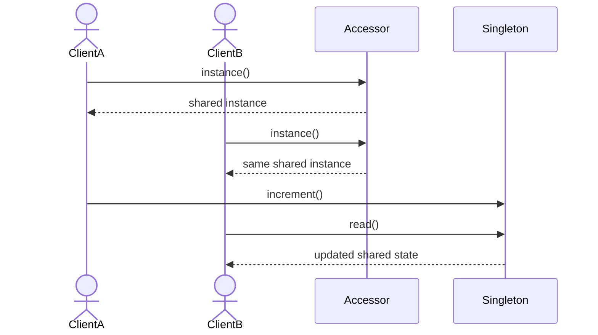

# Singleton

> **Familia:** Creational  
> **Intención:** asegurar una única instancia lógica dentro de un alcance definido y ofrecer un punto de acceso controlado cuando esa unicidad resuelve una presión real.  
> **Estado:** `in-progress`  
> **Implementaciones de lenguaje:** `0/48`  
> **Cobertura de pruebas:** N/A — catálogo multilenguaje heterogéneo; se usará evidencia proporcional por target.  
> **Mapa:** [Volver al catálogo y mapa de relaciones](README.md)

## En una frase

Singleton concentra una responsabilidad que debe tener **una sola instancia lógica por alcance** y controla cómo se obtiene esa instancia.

## El problema

Algunos recursos coordinadores —por ejemplo un registro de configuración de proceso, un reloj de aplicación o un catálogo de metadatos inmutable— necesitan una única autoridad lógica. Si cada consumidor crea su propia copia, el estado puede divergir; si se usa una variable global sin disciplina, cualquier código puede reemplazarla o mutarla sin contrato.

La presión real no es “quiero acceso global”, sino “necesito exactamente una autoridad compartida y debo controlar su ciclo de vida”.

## Fuerzas que compiten

- Debe existir una sola instancia lógica dentro de un alcance definido.
- Los consumidores necesitan acceso consistente sin conocer cómo se crea la instancia.
- La inicialización debe ser segura y determinista, incluso bajo concurrencia cuando aplique.
- El acceso global aumenta acoplamiento oculto y dificulta aislamiento de pruebas.
- En sistemas distribuidos, “único en el proceso” no significa “único en todo el sistema”.

## La solución

Encapsular la creación y exponer un único valor compartido mediante el mecanismo idiomático del lenguaje: inicialización estática, módulo, objeto global inmutable, lazy cell, función con caché, proceso registrado, símbolo o equivalente. El constructor o mecanismo de creación queda fuera del acceso normal cuando el lenguaje lo permite.

La unicidad siempre debe declarar su **alcance**: proceso, módulo, runtime, actor system, request scope u otro límite concreto.

## Participantes y responsabilidades

| Participante | Responsabilidad |
|---|---|
| `Singleton` | Mantiene o representa la única instancia lógica. |
| Accesor | Devuelve siempre esa instancia dentro del alcance definido. |
| Cliente | Consume la instancia sin crear copias arbitrarias. |

## Cómo funciona

1. El runtime o el primer acceso inicializa la instancia compartida.
2. El accesor devuelve la misma instancia en accesos posteriores.
3. Los clientes observan el mismo estado/identidad dentro del alcance declarado.
4. El ciclo de vida termina con el alcance; no se infiere unicidad distribuida.

## Diagrama



El diagrama enfatiza dos propiedades: ambos clientes reciben la misma autoridad lógica y los cambios observables pertenecen a esa única instancia.

## Ejemplo mínimo

```text
first = Registry.instance()
second = Registry.instance()
first.increment()
assert same(first, second)
assert second.count == 1
```

## Aplicación real

### Registro de configuración de proceso

Un proceso necesita una única fuente en memoria para configuración ya validada. Singleton puede ser razonable si el alcance es realmente el proceso y la instancia no necesita variar por tenant, request o prueba.

Si la dependencia debe poder sustituirse, configurarse por alcance o aislarse en tests, Dependency Injection suele ser una opción mejor.

## En Genkidama

Genkidama no declara actualmente un uso deliberado de Singleton que deba promocionarse como referencia canónica. El catálogo no modificará arquitectura productiva para fabricar uno.

## Cuándo usarlo

- Existe una restricción real de una única autoridad lógica por alcance.
- El ciclo de vida está claramente definido y coincide con el alcance de la aplicación.
- La creación repetida produciría divergencia o conflicto observable.

## Cuándo no usarlo

- Sólo quieres evitar pasar una dependencia explícitamente: usa Dependency Injection.
- Necesitas variantes por request, tenant o prueba.
- Pretendes unicidad entre procesos o máquinas: usa coordinación distribuida, no Singleton de proceso.
- El objeto no tiene una restricción real de unicidad.

## Consecuencias y trade-offs

| A favor | Costo / riesgo |
|---|---|
| Hace explícita una autoridad única. | Introduce dependencia global implícita si se abusa. |
| Centraliza inicialización y ciclo de vida. | Puede dificultar pruebas aisladas y sustitución. |
| Evita copias divergentes dentro del alcance. | No resuelve unicidad distribuida. |
| Puede aprovechar primitivas seguras del runtime. | Estado mutable global puede convertirse en cuello de botella. |

## Patrones relacionados

[Consulta también el mapa global de relaciones](README.md#relationship-map).

| Patrón | Relación | Por qué importa |
|---|---|---|
| [Dependency Injection](DependencyInjection.md) | alternative to | DI hace explícito el ciclo de vida y suele facilitar sustitución/pruebas cuando la unicidad no exige acceso global. |
| [Factory Method](FactoryMethod.md) | collaborates with | Un factory method puede controlar creación, pero no implica una única instancia. |
| [Abstract Factory](AbstractFactory.md) | often confused with | Abstract Factory selecciona familias; Singleton restringe cantidad/ciclo de vida. |
| [Object Pool](ObjectPool.md) | alternative to | Pool mantiene varias instancias reutilizables; Singleton mantiene una sola. |

## Errores comunes y confusiones

### Confundir Singleton con una variable global

Una variable global puede reasignarse o carecer de control de creación. Singleton expresa una restricción de instancia y un acceso controlado.

### Confundir “una por proceso” con “una en todo el sistema”

Dos procesos pueden tener cada uno su Singleton. La unicidad distribuida requiere mecanismos externos de coordinación.

### Usarlo como Service Locator

Acumular muchas dependencias detrás de un Singleton convierte el acceso global en un contenedor opaco y aumenta acoplamiento.

## Cómo comprobar una implementación

- Dos accesos dentro del mismo alcance obtienen la misma instancia lógica o el mismo valor compartido canónico.
- Una mutación observable realizada por un cliente es visible al otro cuando el ejemplo usa estado mutable.
- La inicialización no produce dos instancias bajo el mecanismo normal del runtime.
- La documentación declara el alcance de la unicidad.
- La prueba no se limita a nombres como `Singleton` o `Instance`.

## Matriz de implementaciones

El universo canónico mantiene **51 targets**. Esta primera clasificación considera **48 Applicable** y **3 N/A provisionales**.

| Estado | Cantidad | Criterio |
|---|---:|---|
| Applicable | 48 | El target puede expresar una única autoridad lógica por módulo/proceso/runtime mediante mecanismos idiomáticos. |
| N/A | 3 | HTML, CSS y SQL declarativo no definen por sí mismos un ciclo de vida de instancia runtime. |
| Verified | 0 | Ninguna fila se promueve sin ejemplo real y evidencia proporcional. |

### N/A provisionales

- **HTML:** markup declarativo; cualquier singleton ejecutable pertenece al runtime que lo consume.
- **CSS:** reglas declarativas de estilo; no define una instancia runtime compartida.
- **SQL declarativo:** puede imponer unicidad de datos, pero eso no equivale al patrón Singleton de instancia/ciclo de vida; no se usará un dialecto procedural para forzarlo.

La ausencia de clases nunca se usa como razón de N/A. Módulos, bindings, closures, actors, cells, records y otros mecanismos nativos son válidos si preservan la intención.

## Comprueba que lo entendiste

1. ¿Qué diferencia hay entre “una instancia por proceso” y “una instancia en todo el sistema distribuido”?  
2. ¿Por qué Dependency Injection puede ser preferible aunque la aplicación use una sola instancia?  
3. ¿Qué evidencia demostraría realmente que dos consumidores comparten la misma autoridad lógica?

## Resumen

- **Presión:** evitar autoridades duplicadas dentro de un alcance concreto.
- **Movimiento:** controlar creación y exponer una única instancia lógica.
- **Trade-off:** simplicidad de acceso frente a acoplamiento global y menor sustituibilidad.
- **Clave:** declarar siempre el alcance de la unicidad.

## Referencias

- Gamma, Helm, Johnson y Vlissides, *Design Patterns: Elements of Reusable Object-Oriented Software*.
- [Patterns as Living Examples](../docs/philosophy/001-patterns-as-living-examples.md).
- [Canonical Design Pattern Authoring Standard](../docs/kb/catalog/pattern-authoring-standard.md).
