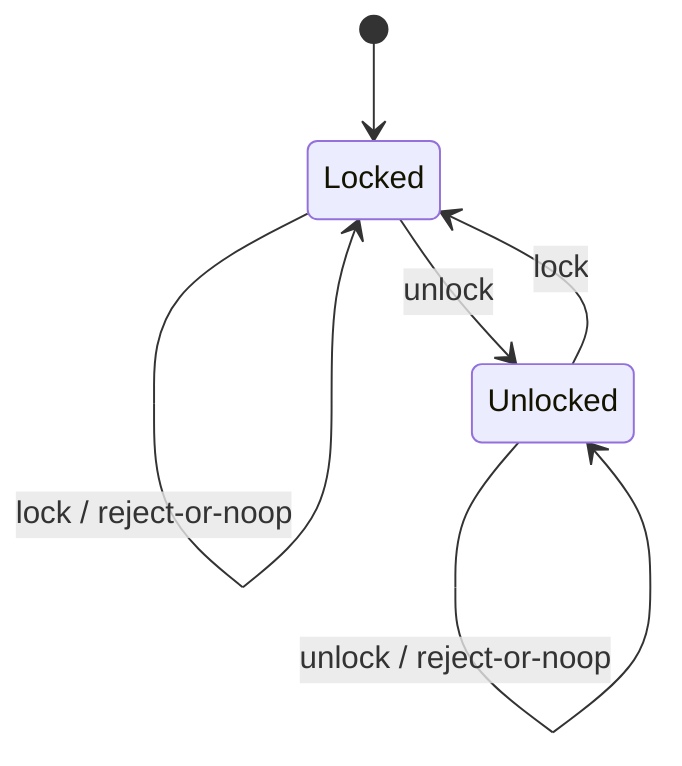

# State

> **Familia:** Behavioral  
> **Intención:** Permitir que un objeto cambie su comportamiento cuando cambia su estado interno, haciendo explícitas las transiciones y evitando condicionales dispersos dependientes del estado.  
> **Estado:** `in-progress`  
> **Implementaciones de lenguaje:** `36/49` canónicos direccionables materializados; `35/49` verificados en el head previo acreditado. Dart está materializado y cableado al gate en el head actual, pendiente de VERIFY.  
> **Cobertura de pruebas:** `N/A` agregada — la matriz polyglot usa la validación más fuerte razonablemente disponible por ecosistema; no se inventa un porcentaje transversal.  
> **Mapa:** [Volver al catálogo y mapa de relaciones](README.md)

## En una frase

State mueve el comportamiento que depende del estado actual a representaciones explícitas de estado o transiciones, de modo que cambiar de estado cambie también qué comportamiento es válido sin repartir `if/switch` por todo el consumidor.

## El problema

Un objeto con ciclo de vida —una puerta, pedido, conexión, documento o workflow— responde de forma distinta al mismo evento según su estado actual. Cuando esa lógica crece como condicionales repetidos, cada nuevo estado obliga a editar varios lugares, aparecen transiciones imposibles y resulta difícil comprobar qué acciones son válidas desde cada estado.

La presión real no es simplemente «tener un enum». Es que **el comportamiento permitido y las transiciones dependen del estado actual** y necesitamos mantener esa política coherente.

## Fuerzas que compiten

- Las transiciones deben ser explícitas y comprobables.
- El comportamiento de un estado no debe filtrarse por muchos consumidores.
- Agregar un estado debería afectar un conjunto acotado de reglas.
- Estados simples no justifican una jerarquía ceremonial.
- El modelo debe impedir o manejar de forma deliberada transiciones inválidas.
- En lenguajes funcionales, declarativos o de bajo nivel la intención debe conservarse con ADTs, tablas, predicados, mapas de transición, function pointers u otros mecanismos idiomáticos.

## La solución

Representar el estado actual como un valor o componente responsable de decidir qué comportamiento y transición corresponden a una acción. El contexto delega esa decisión al estado —o a una función/tabla de transición equivalente— y sustituye el estado cuando ocurre una transición válida.

State no exige clases. Una suma discriminada con pattern matching, una tabla `estado × evento -> estado`, un conjunto de predicados Prolog, un `CASE` SQL, una tabla de saltos en Assembly o closures intercambiables pueden expresar el mismo patrón cuando preservan la intención.

## Participantes y responsabilidades

| Participante | Responsabilidad |
|---|---|
| `Context` | Conserva el estado actual y expone las operaciones del dominio. |
| `State` / representación de estado | Define o selecciona comportamiento válido para ese estado. |
| `Transition` | Decide el siguiente estado para un evento válido y conserva/rechaza el actual para uno inválido. |
| Cliente | Envía eventos al contexto sin duplicar reglas internas de transición. |

## Cómo funciona

1. El contexto comienza en un estado válido.
2. Llega un evento o acción.
3. La representación del estado actual decide qué comportamiento ejecutar y si existe transición.
4. Una transición válida reemplaza el estado actual.
5. El mismo evento puede producir un resultado diferente desde otro estado.
6. Una transición inválida se rechaza o conserva el estado según el contrato explícito del dominio.

## Diagrama



La esencia del patrón es que **el comportamiento y la transición dependen del estado actual**; la forma concreta puede ser OO, funcional, declarativa o de bajo nivel.

## Ejemplo mínimo

```csharp
public enum GateState { Locked, Unlocked }

public static GateState Transition(GateState state, string action) =>
    (state, action) switch
    {
        (GateState.Locked, "unlock") => GateState.Unlocked,
        (GateState.Unlocked, "lock") => GateState.Locked,
        _ => state
    };
```

El repositorio contiene un canónico C# direccionable en [`src/Enterprise/C#/patterns/State.cs`](../src/Enterprise/C%23/patterns/State.cs).

## En Genkidama

No se ha verificado todavía un uso productivo deliberado de State que deba acreditarse como arquitectura de Genkidama. Existen estados de aplicación y workflows, pero esta ficha no los etiqueta como el patrón sólo por compartir vocabulario.

No se modifica arquitectura productiva para aumentar artificialmente el número de patrones «usados».

## Cuándo usarlo

- El mismo evento debe comportarse distinto según el estado actual.
- Existen transiciones válidas e inválidas que conviene modelar explícitamente.
- Los condicionales dependientes del estado aparecen repetidos en varios métodos o consumidores.
- El ciclo de vida seguirá creciendo y necesita una frontera clara de reglas.

## Cuándo no usarlo

- Hay uno o dos flags simples sin comportamiento dependiente complejo.
- Un `if` local expresa toda la regla con más claridad que una abstracción adicional.
- La variación principal es elegir un algoritmo independiente del historial/estado; eso suele ser Strategy.
- Lo que se necesita es persistir/restaurar snapshots; eso corresponde a Memento.

## Consecuencias y trade-offs

| A favor | Costo / riesgo |
|---|---|
| Hace explícitas las transiciones y reglas por estado. | Puede multiplicar tipos/funciones si el dominio es trivial. |
| Reduce condicionales de estado dispersos. | Una tabla de transición grande puede seguir siendo difícil de leer si no se estructura. |
| Facilita probar cada estado y transición inválida. | Estados y eventos mal definidos pueden convertir el patrón en una máquina de estados accidentalmente compleja. |
| Permite agregar estados con impacto localizado. | No elimina la necesidad de diseñar invariantes y ownership del contexto. |

## Patrones relacionados

[Consulta también el mapa global de relaciones](README.md#relationship-map).

| Patrón | Relación | Por qué importa |
|---|---|---|
| [Strategy](Strategy.md) | similar structure, different intent | Strategy intercambia algoritmos elegidos por composición; State cambia comportamiento como consecuencia del estado/ciclo de vida. |
| [Memento](Memento.md) | collaborates with | Memento puede capturar/restaurar el estado de un contexto sin asumir la responsabilidad de decidir transiciones. |
| [Observer](Observer.md) | collaborates with | Un contexto puede notificar a observers después de una transición, sin convertir notificación en lógica de estado. |
| [Command](Command.md) | collaborates with | Un evento/acción puede representarse como Command mientras State decide si es válido y cómo cambia el contexto. |

## Errores comunes y confusiones

### Confundir un enum con el patrón

Tener `status = ACTIVE` no basta. Debe existir comportamiento o política de transición que dependa de ese estado y estar modelada de forma deliberada.

### Confundir State con Strategy

Ambos pueden delegar comportamiento. Strategy responde «¿qué algoritmo quiero usar?»; State responde «¿qué comportamiento corresponde ahora dado el ciclo de vida actual?».

### Traducir mecánicamente una jerarquía OO

En un lenguaje con ADTs, pattern matching, tablas, closures, mensajes, predicados o relaciones, simular clases sólo para copiar UML puede ser menos idiomático que expresar directamente la transición.

### Ocultar transiciones inválidas

Una implementación que sólo demuestra el happy path enseña menos que el dominio real. La reconciliación final debe proteger al menos una transición válida en ambos sentidos y una operación inválida/no-op cuando el ecosistema lo permita razonablemente.

## Cómo comprobar una implementación

- Existe un estado inicial observable.
- Una acción válida cambia el estado y/o comportamiento esperado.
- El comportamiento posterior refleja el nuevo estado.
- Existe evidencia de la transición de regreso o de otra transición válida relevante.
- Una acción inválida se rechaza o conserva el estado según contrato.
- La lógica dependiente del estado no está duplicada innecesariamente en el consumidor.

## Validación automatizada

La reconciliación horizontal parte de evidencia producida por los barridos language-major, pero un `pattern_sweep.*` no sustituye una fuente individual. Python, Go y Objective-C ya tienen canónicos individuales añadidos y verificados en este PR. Objective-C quedó acreditado cuando el head `448cead78c6b8a8f304bb8dbf0251f9738192cac` completó Quality, Product CI y Polyglot CI en verde.

Java ya tenía el canónico individual [`src/Enterprise/Java/patterns/state.java`](../src/Enterprise/Java/patterns/state.java), y `eng/ci/adapters/jvm_patterns.py` compila con `javac -Xlint:all -Werror` y ejecuta individualmente los 39 canónicos Java. El contrato reforzado quedó acreditado cuando `cda32b09d22265ab87d867167f8020f1592f5332` completó Quality, Product CI y Polyglot CI en verde.

Zig tiene el canónico individual [`src/Systems/Zig/state.zig`](../src/Systems/Zig/state.zig); `eng/ci/adapters/zig_state.py` aplica `zig fmt --check`, lo ejecuta con `zig run` y exige `zig-state: passed`. El head `c3495cacbaf2cb5551826b769f913abfe736dd97` completó Quality, Product CI y Polyglot CI en verde, por lo que Zig queda acreditado como verificado.

Dart tiene ahora el canónico individual [`src/Web/Dart/state.dart`](../src/Web/Dart/state.dart). `eng/ci/adapters/dart_contracts.py` aplica format, analyze con fatal infos/warnings, ejecuta el sweep histórico y además ejecuta el canónico exigiendo `dart-state: passed`. Esta celda permanece materializada pero no verificada hasta que el head actual cierre CI verde.

## Implementaciones por lenguaje

La fuente de targets es [`learn/_meta/catalog.yml`](../learn/_meta/catalog.yml): 45 lenguajes v1 y 6 adicionales planeados. La clasificación es **49 Applicable + 2 N/A**.

| Lenguaje | Aplicabilidad | Canónico / estado | Nota |
|---|---|---|---|
| C# | Applicable | [`State.cs`](../src/Enterprise/C%23/patterns/State.cs) | Canónico direccionable confirmado. |
| TypeScript | Applicable | [`state.ts`](../src/Web/TypeScriptTS/patterns/state.ts) | Canónico direccionable confirmado. |
| Ada | Applicable | [`state_pattern.adb`](../src/Systems/Ada/state_pattern.adb) | Canónico direccionable confirmado. |
| Solidity | Applicable | [`State.sol`](../src/Niche/Solidity/patterns/State.sol) | Canónico direccionable confirmado. |
| Fortran | Applicable | [`state.f90`](../src/Systems/Fortran/patterns/state.f90) | Canónico direccionable confirmado. |
| Pascal | Applicable | [`state_pattern.pas`](../src/Systems/Pascal/state_pattern.pas) | Canónico direccionable confirmado. |
| Python | Applicable | [`state.py`](../src/Scripting/PythonPY/patterns/state.py) | `py_compile` + ejecución; verificado. |
| Visual Basic .NET | Applicable | [`State.vb`](../src/Enterprise/VB.NET/patterns/State.vb) | Canónico direccionable confirmado. |
| C++ | Applicable | [`state.cpp`](../src/Systems/C%2B%2B/patterns/state.cpp) | Canónico direccionable confirmado. |
| Objective-C | Applicable | [`state.m`](../src/Systems/Objective-C/state.m) | Clang/GNUstep con `-Wall -Wextra -Werror` + runtime; verificado. |
| Java | Applicable | [`state.java`](../src/Enterprise/Java/patterns/state.java) | `javac -Xlint:all -Werror` + runtime; contrato reforzado y verificado. |
| Rust | Applicable | [`state.rs`](../src/Systems/Rust/patterns/state.rs) | Canónico direccionable confirmado. |
| Zig | Applicable | [`state.zig`](../src/Systems/Zig/state.zig) | `zig fmt --check` + `zig run`; verificado. |
| Go | Applicable | [`state.go`](../src/Systems/Go/state.go) | `gofmt` + `go vet` + ejecución; verificado. |
| PHP | Applicable | [`state.php`](../src/Scripting/PHP/patterns/state.php) | Canónico direccionable confirmado. |
| Nim | Applicable | [`state_example.nim`](../src/Niche/Nim/patterns/state_example.nim) | Canónico direccionable confirmado. |
| Dart | Applicable | [`state.dart`](../src/Web/Dart/state.dart) | `dart format` + `dart analyze --fatal-*` + runtime; pendiente de VERIFY del head actual. |
| Kotlin | Applicable | [`State.kt`](../src/Enterprise/Kotlin/patterns/State.kt) | Canónico direccionable confirmado. |
| Swift | Applicable | [`State.swift`](../src/Systems/Swift/patterns/State.swift) | Canónico direccionable confirmado. |
| F# | Applicable | [`State.fsx`](../src/Functional/F%23/patterns/State.fsx) | Canónico direccionable confirmado. |
| Crystal | Applicable | pendiente de reconciliación | State es expresable con enums/unions/objetos y transición explícita. |
| Lua | Applicable | [`state.lua`](../src/Scripting/Lua/patterns/state.lua) | Canónico direccionable confirmado. |
| Haskell | Applicable | pendiente de reconciliación | ADT + función de transición es una expresión idiomática del patrón. |
| COBOL | Applicable | [`state_pattern.cpy`](../src/Historical/Cobol/patterns/state_pattern.cpy) | Canónico direccionable confirmado. |
| Scala | Applicable | [`State.scala`](../src/Functional/Scala/patterns/State.scala) | Canónico direccionable confirmado. |
| Groovy | Applicable | pendiente de reconciliación | State es expresable con closures/objetos/mapas. |
| Ruby | Applicable | [`state.rb`](../src/Scripting/Ruby/patterns/state.rb) | Canónico direccionable confirmado. |
| C | Applicable | [`state.c`](../src/Systems/C/patterns/state.c) | Canónico direccionable confirmado. |
| OCaml | Applicable | [`state.ml`](../src/Functional/OCaml/patterns/state.ml) | Canónico direccionable confirmado. |
| Julia | Applicable | pendiente de reconciliación | State es expresable con multiple dispatch/valores de estado. |
| VBA | Applicable | pendiente de reconciliación | Source contract proporcional si no hay host Office disponible. |
| GDScript | Applicable | pendiente de reconciliación | State es natural en gameplay; requiere canónico y Godot headless. |
| JavaScript | Applicable | [`state.js`](../src/Web/JavaScriptJS/patterns/state.js) | Canónico direccionable confirmado. |
| MATLAB | Applicable | [`state.m`](../src/DataScience/MATLAB/state.m) | Canónico direccionable confirmado. |
| Perl | Applicable | pendiente de reconciliación | State es expresable con hashes/closures/subrutinas. |
| R | Applicable | [`state.R`](../src/DataScience/R/patterns/state.R) | Canónico direccionable confirmado. |
| PowerShell | Applicable | [`state.ps1`](../src/Scripting/PowerShell/patterns/state.ps1) | Canónico direccionable confirmado. |
| HTML | N/A | — | HTML estático describe estructura; por sí solo no posee ejecución/transiciones de comportamiento. JavaScript es target separado. |
| Assembly | Applicable | pendiente de reconciliación | Variable de estado + dispatch/jump table expresa el patrón. |
| Elixir | Applicable | [`state.exs`](../src/Functional/Elixir/patterns/state.exs) | Canónico direccionable confirmado. |
| Shell | Applicable | pendiente de reconciliación | `case` + variable de estado puede modelar transiciones ejecutables. |
| Erlang | Applicable | [`state.erl`](../src/Functional/Erlang/patterns/state.erl) | Canónico direccionable confirmado. |
| Clojure | Applicable | [`state.clj`](../src/Functional/Clojure/patterns/state.clj) | Canónico direccionable confirmado. |
| Common Lisp | Applicable | [`state.lisp`](../src/Functional/CommonLisp/patterns/state.lisp) | Canónico direccionable confirmado. |
| Prolog | Applicable | pendiente de reconciliación | Relaciones/predicados pueden expresar `transition(State, Event, Next)`. |
| Delphi | Applicable | pendiente de reconciliación | Interfaces/classes/enums permiten State; usar source contract si DCC no está disponible. |
| GNU Octave | Applicable | [`state.m`](../src/DataScience/Octave/patterns/state.m) | Canónico direccionable confirmado. |
| SQL | Applicable | pendiente de reconciliación | Relaciones/CTEs/`CASE` pueden representar una función de transición y validar estados válidos. |
| CSS | N/A | — | CSS selecciona estilos en función de estado externo/pseudoestado, pero no posee por sí solo un ciclo ejecutable que decida y conserve transiciones arbitrarias. |
| MicroPython | Applicable | pendiente de reconciliación | Funciones/objetos/tablas de transición son suficientes; ejecutar con runtime MicroPython certificado. |
| Rockstar | Applicable | pendiente de reconciliación | Variables, condicionales y funciones permiten expresar transición y comportamiento dependiente del estado. |

## Deuda de cierre conocida

- Confirmar/reconciliar los 13 Applicable todavía sin canónico individual acreditado en esta página.
- Reutilizar las celdas de `pattern_sweep.*` donde sean correctas, extrayéndolas a fuentes direccionables en lugar de mantener implementaciones paralelas ocultas.
- Acreditar Dart sólo después del VERIFY del head actual; Zig y Java ya están acreditados por sus respectivos heads verdes.
- Revisar si alguna ruta histórica confirmada requiere adaptación para enseñar también failure mode/transición inválida, sin perseguir tests de poco valor.
- Cambiar el estado a `validated` sólo cuando `implemented == applicable` y toda la evidencia KB-006 esté reconciliada.

## Preguntas de comprensión

1. ¿Qué diferencia a State de un simple enum o bandera?
2. ¿Por qué State y Strategy pueden parecer estructuralmente similares pero tener distinta intención?
3. ¿Cómo expresarías State en un lenguaje funcional sin crear clases artificiales?
4. ¿Qué debería ocurrir cuando llega un evento inválido para el estado actual?
5. ¿Por qué una función escondida dentro de un sweep multi-patrón no basta como canónico KB-006?

## Referencias

- Gamma, Helm, Johnson, Vlissides — *Design Patterns: Elements of Reusable Object-Oriented Software*.
- [`docs/kb/catalog/pattern-authoring-standard.md`](../docs/kb/catalog/pattern-authoring-standard.md) — KB-006 aprobado.
- [`docs/philosophy/001-patterns-as-living-examples.md`](../docs/philosophy/001-patterns-as-living-examples.md) — ejemplos vivos, arquitectura primero.
- [`docs/roadmap.md`](../docs/roadmap.md) — roadmap autoritativo y excepción language-major activa.
