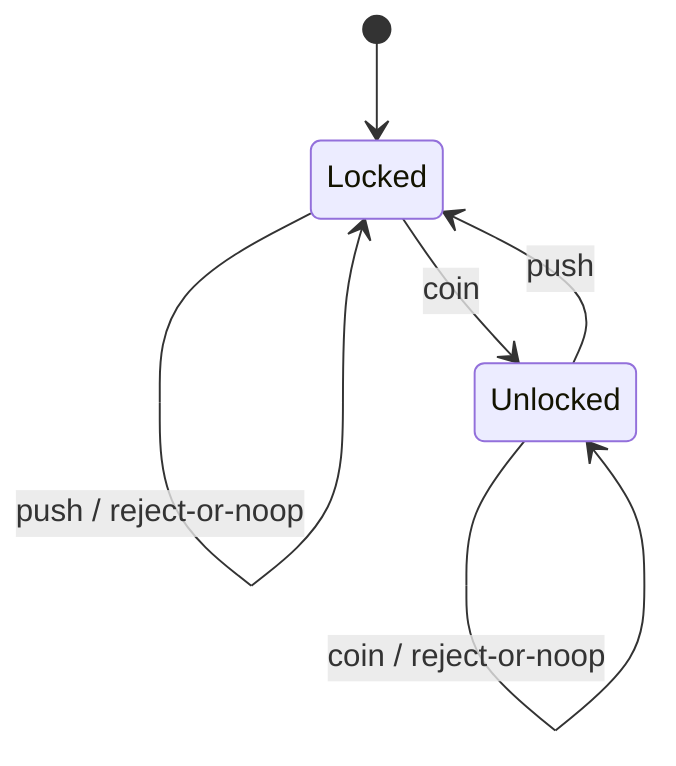

# State

> **Familia:** Behavioral  
> **Intención:** Permitir que un objeto cambie su comportamiento cuando cambia su estado interno, haciendo explícitas las transiciones y evitando condicionales dispersos dependientes del estado.  
> **Estado:** `validated`  
> **Implementaciones de lenguaje:** `49/49` Applicable con canónico individual direccionable y verificado.  
> **Cobertura de pruebas:** `N/A` agregada — la matriz polyglot usa la validación más fuerte razonablemente disponible por ecosistema; no se inventa un porcentaje transversal.  
> **Mapa:** [Volver al catálogo y mapa de relaciones](README.md)

## En una frase

State mueve el comportamiento que depende del estado actual a representaciones explícitas de estado o transiciones, de modo que cambiar de estado cambie también qué comportamiento es válido sin repartir `if/switch` por todo el consumidor.

## El problema

Un objeto con ciclo de vida —una puerta, pedido, conexión, documento o workflow— responde de forma distinta al mismo evento según su estado actual. Cuando esa lógica crece como condicionales repetidos, cada nuevo estado obliga a editar varios lugares, aparecen transiciones imposibles y resulta difícil comprobar qué acciones son válidas desde cada estado.

La presión real no es simplemente «tener un enum». Es que **el comportamiento permitido y las transiciones dependen del estado actual** y necesitamos mantener esa política coherente.

## Fuerzas que compiten

- Las transiciones deben ser explícitas y comprobables.
- El comportamiento de un estado no debe filtrarse por muchos consumidores.
- Agregar un estado debería afectar un conjunto acotado de reglas.
- Estados simples no justifican una jerarquía ceremonial.
- El modelo debe impedir o manejar de forma deliberada transiciones inválidas.
- En lenguajes funcionales, declarativos o de bajo nivel la intención debe conservarse con ADTs, tablas, predicados, mapas de transición, function pointers u otros mecanismos idiomáticos.

## La solución

Representar el estado actual como un valor o componente responsable de decidir qué comportamiento y transición corresponden a una acción. El contexto delega esa decisión al estado —o a una función/tabla de transición equivalente— y sustituye el estado cuando ocurre una transición válida.

State no exige clases. Una suma discriminada con pattern matching, una tabla `estado × evento -> estado`, un conjunto de predicados Prolog, una relación SQL, una tabla de saltos en Assembly o closures intercambiables pueden expresar el mismo patrón cuando preservan la intención.

## Participantes y responsabilidades

| Participante | Responsabilidad |
|---|---|
| `Context` | Conserva el estado actual y expone las operaciones del dominio. |
| `State` / representación de estado | Define o selecciona comportamiento válido para ese estado. |
| `Transition` | Decide el siguiente estado para un evento válido y conserva/rechaza el actual para uno inválido. |
| Cliente | Envía eventos al contexto sin duplicar reglas internas de transición. |

## Cómo funciona

1. El contexto comienza en un estado válido.
2. Llega un evento o acción.
3. La representación del estado actual decide qué comportamiento ejecutar y si existe transición.
4. Una transición válida reemplaza el estado actual.
5. El mismo evento puede producir un resultado diferente desde otro estado.
6. Una transición inválida se rechaza o conserva el estado según el contrato explícito del dominio.

## Diagrama



La esencia es que **el comportamiento y la transición dependen del estado actual**; la forma concreta puede ser OO, funcional, declarativa o de bajo nivel.

## Ejemplo mínimo

```csharp
public enum GateState { Locked, Unlocked }

public static GateState Transition(GateState state, string action) =>
    (state, action) switch
    {
        (GateState.Locked, "coin") => GateState.Unlocked,
        (GateState.Unlocked, "push") => GateState.Locked,
        _ => state
    };
```

El repositorio contiene un canónico C# direccionable en [`src/Enterprise/C#/patterns/State.cs`](../src/Enterprise/C%23/patterns/State.cs).

## Aplicación real

### Torniquete de acceso

Un torniquete puede estar bloqueado o desbloqueado. Insertar una moneda en estado bloqueado desbloquea; empujar en estado desbloqueado permite el paso y vuelve a bloquear. Repetir el mismo evento en el estado equivocado es un no-op o error de dominio. State encaja porque el mismo evento tiene significado distinto según el estado actual y las transiciones deben ser explícitas.

Si sólo existiera un booleano con una única condición local, un `if` sencillo sería preferible.

## En Genkidama

No se ha verificado un uso productivo deliberado de State que deba acreditarse como arquitectura de Genkidama. Existen estados de aplicación y workflows, pero esta ficha no los etiqueta como el patrón sólo por compartir vocabulario.

No se modifica arquitectura productiva para aumentar artificialmente el número de patrones «usados».

## Cuándo usarlo

- El mismo evento debe comportarse distinto según el estado actual.
- Existen transiciones válidas e inválidas que conviene modelar explícitamente.
- Los condicionales dependientes del estado aparecen repetidos en varios métodos o consumidores.
- El ciclo de vida seguirá creciendo y necesita una frontera clara de reglas.

## Cuándo no usarlo

- Hay uno o dos flags simples sin comportamiento dependiente complejo.
- Un `if` local expresa toda la regla con más claridad que una abstracción adicional.
- La variación principal es elegir un algoritmo independiente del historial/estado; eso suele ser Strategy.
- Lo que se necesita es persistir/restaurar snapshots; eso corresponde a Memento.

## Consecuencias y trade-offs

| A favor | Costo / riesgo |
|---|---|
| Hace explícitas las transiciones y reglas por estado. | Puede multiplicar tipos/funciones si el dominio es trivial. |
| Reduce condicionales de estado dispersos. | Una tabla de transición grande puede seguir siendo difícil de leer si no se estructura. |
| Facilita probar cada estado y transición inválida. | Estados y eventos mal definidos pueden convertir el patrón en una máquina de estados accidentalmente compleja. |
| Permite agregar estados con impacto localizado. | No elimina la necesidad de diseñar invariantes y ownership del contexto. |

## Patrones relacionados

[Consulta también el mapa global de relaciones](README.md#relationship-map).

| Patrón | Relación | Por qué importa |
|---|---|---|
| [Strategy](Strategy.md) | often confused with | Strategy intercambia algoritmos elegidos por composición; State cambia comportamiento como consecuencia del estado/ciclo de vida. |
| [Memento](Memento.md) | collaborates with | Memento puede capturar/restaurar el estado de un contexto sin asumir la responsabilidad de decidir transiciones. |
| [Observer](Observer.md) | collaborates with | Un contexto puede notificar a observers después de una transición, sin convertir notificación en lógica de estado. |
| [Command](Command.md) | collaborates with | Un evento/acción puede representarse como Command mientras State decide si es válido y cómo cambia el contexto. |

## Errores comunes y confusiones

### Confundir un enum con el patrón

Tener `status = ACTIVE` no basta. Debe existir comportamiento o política de transición que dependa de ese estado y estar modelada de forma deliberada.

### Confundir State con Strategy

Ambos pueden delegar comportamiento. Strategy responde «¿qué algoritmo quiero usar?»; State responde «¿qué comportamiento corresponde ahora dado el ciclo de vida actual?».

### Traducir mecánicamente una jerarquía OO

En un lenguaje con ADTs, pattern matching, tablas, closures, mensajes, predicados o relaciones, simular clases sólo para copiar UML puede ser menos idiomático que expresar directamente la transición.

### Ocultar transiciones inválidas

Una implementación que sólo demuestra el happy path enseña menos que el dominio real. Los canónicos de cierre protegen transiciones válidas y failure modes/no-op cuando el ecosistema lo permite razonablemente.

## Cómo comprobar una implementación

- Existe un estado inicial observable.
- Una acción válida cambia el estado y/o comportamiento esperado.
- El comportamiento posterior refleja el nuevo estado.
- Existe evidencia de la transición de regreso o de otra transición válida relevante.
- Una acción inválida se rechaza o conserva el estado según contrato.
- La lógica dependiente del estado no está duplicada innecesariamente en el consumidor.

## Validación automatizada

La reconciliación horizontal reutiliza evidencia de los barridos language-major, pero ningún `pattern_sweep.*` sustituye una fuente individual. Cada uno de los 49 targets Applicable tiene ahora un canónico direccionable. El head `ac5cd42fb0191602d7da5e35c2017a03cbdea6d8` cerró Quality, Product CI y Polyglot CI en verde, acreditando las dos últimas celdas, Delphi y SQL, además de preservar las 47 previamente verificadas.

La evidencia es proporcional al ecosistema: compilación/análisis/runtime cuando el runner dispone del toolchain; source contracts estrictos para VBA y Delphi donde el CI Linux actual no dispone de host Office ni DCC. SQL se ejecuta realmente con SQLite; Assembly se compila con NASM, enlaza con LD y ejecuta; GDScript usa Godot headless; MicroPython y Rockstar usan sus runtimes certificados. No se inventan porcentajes de coverage para una matriz heterogénea.

## Implementaciones por lenguaje

La fuente de targets es [`learn/_meta/catalog.yml`](../learn/_meta/catalog.yml): 45 lenguajes v1 y 6 adicionales planeados. La clasificación final es **49 Applicable + 2 N/A**.

| Lenguaje | Aplicabilidad | Ejemplo verificado | Validación | Nota |
|---|---|---|---|---|
| C# | Applicable | [`State.cs`](../src/Enterprise/C%23/patterns/State.cs) | build/test del cohort | Tipo/estado explícito. |
| TypeScript | Applicable | [`state.ts`](../src/Web/TypeScriptTS/patterns/state.ts) | typecheck/runtime del cohort | Unión/estado explícito. |
| Ada | Applicable | [`state_pattern.adb`](../src/Systems/Ada/state_pattern.adb) | compile/runtime del cohort | Enum + transición. |
| Solidity | Applicable | [`State.sol`](../src/Niche/Solidity/patterns/State.sol) | compile/validator del cohort | Estado de contrato. |
| Fortran | Applicable | [`state.f90`](../src/Systems/Fortran/patterns/state.f90) | compile/runtime del cohort | Enum-equivalent + transición. |
| Pascal | Applicable | [`state_pattern.pas`](../src/Systems/Pascal/state_pattern.pas) | compile/runtime del cohort | Enum + procedimiento. |
| Python | Applicable | [`state.py`](../src/Scripting/PythonPY/patterns/state.py) | `py_compile` + runtime | Función de transición. |
| Visual Basic .NET | Applicable | [`State.vb`](../src/Enterprise/VB.NET/patterns/State.vb) | build/runtime del cohort | Enum + función. |
| C++ | Applicable | [`state.cpp`](../src/Systems/C%2B%2B/patterns/state.cpp) | compile/runtime del cohort | Estado tipado. |
| Objective-C | Applicable | [`state.m`](../src/Systems/Objective-C/state.m) | Clang/GNUstep `-Wall -Wextra -Werror` + runtime | Mensajes/estado explícito. |
| Java | Applicable | [`state.java`](../src/Enterprise/Java/patterns/state.java) | `javac -Xlint:all -Werror` + runtime | Enum/objeto de estado. |
| Rust | Applicable | [`state.rs`](../src/Systems/Rust/patterns/state.rs) | compile/runtime del cohort | Enum + `match`. |
| Zig | Applicable | [`state.zig`](../src/Systems/Zig/state.zig) | `zig fmt --check` + runtime | Enum + `switch`. |
| Go | Applicable | [`state.go`](../src/Systems/Go/state.go) | `gofmt` + `go vet` + runtime | Tipo + función. |
| PHP | Applicable | [`state.php`](../src/Scripting/PHP/patterns/state.php) | parse/runtime del cohort | Estado + función. |
| Nim | Applicable | [`state_example.nim`](../src/Niche/Nim/patterns/state_example.nim) | compile/runtime del cohort | Enum + `case`. |
| Dart | Applicable | [`state.dart`](../src/Web/Dart/state.dart) | format + `dart analyze --fatal-*` + runtime | Enum/clase. |
| Kotlin | Applicable | [`State.kt`](../src/Enterprise/Kotlin/patterns/State.kt) | compile/runtime JVM | Sealed/enum state. |
| Swift | Applicable | [`State.swift`](../src/Systems/Swift/patterns/State.swift) | compile/runtime del cohort | Enum + switch. |
| F# | Applicable | [`State.fsx`](../src/Functional/F%23/patterns/State.fsx) | FSI/runtime | DU + pattern matching. |
| Crystal | Applicable | [`state.cr`](../src/Niche/Crystal/state.cr) | format + warnings-as-errors build + runtime | Enum + case. |
| Lua | Applicable | [`state.lua`](../src/Scripting/Lua/patterns/state.lua) | parse/runtime del cohort | Tabla/función. |
| Haskell | Applicable | [`State.hs`](../src/Functional/Haskell/State.hs) | `ghc -Wall -Werror -O0` + runtime | ADT + función pura. |
| COBOL | Applicable | [`state_pattern.cpy`](../src/Historical/Cobol/patterns/state_pattern.cpy) | compile/runtime del cohort | Estado + dispatch procedural. |
| Scala | Applicable | [`State.scala`](../src/Functional/Scala/patterns/State.scala) | compile/runtime JVM | ADT/enum + match. |
| Groovy | Applicable | [`state.groovy`](../src/Functional/Groovy/patterns/state.groovy) | runtime individual JVM | Estado + transición. |
| Ruby | Applicable | [`state.rb`](../src/Scripting/Ruby/patterns/state.rb) | syntax/runtime del cohort | Símbolos + función. |
| C | Applicable | [`state.c`](../src/Systems/C/patterns/state.c) | compile/runtime del cohort | Enum + switch. |
| OCaml | Applicable | [`state.ml`](../src/Functional/OCaml/patterns/state.ml) | compile/runtime del cohort | Variant + match. |
| Julia | Applicable | [`state.jl`](../src/DataScience/Julia/state.jl) | runtime con bounds checks | `@enum` + función. |
| VBA | Applicable | [`state.bas`](../src/Shell/VBA/state.bas) | source contract estricto | CI sin host Office; `Enum` + función. |
| GDScript | Applicable | [`state.gd`](../src/Niche/GDScript/state.gd) | Godot headless + runtime | `enum` + `match`. |
| JavaScript | Applicable | [`state.js`](../src/Web/JavaScriptJS/patterns/state.js) | syntax/runtime del cohort | Valor + función. |
| MATLAB | Applicable | [`state.m`](../src/DataScience/MATLAB/state.m) | MATLAB sweep/runtime | Estado + función. |
| Perl | Applicable | [`state.pl`](../src/Scripting/Perl/state.pl) | `perl -c` + runtime | Escalar + subrutina. |
| R | Applicable | [`state.R`](../src/DataScience/R/patterns/state.R) | parse/runtime del cohort | Valor + función. |
| PowerShell | Applicable | [`state.ps1`](../src/Scripting/PowerShell/patterns/state.ps1) | parse/runtime del cohort | Estado + función. |
| HTML | N/A | — | — | HTML estático describe estructura; por sí solo no posee ejecución/transiciones de comportamiento. JavaScript es target separado. |
| Assembly | Applicable | [`state.asm`](../src/LowLevel/Assembly/state.asm) | NASM + LD + runtime | Registro/memoria de estado + dispatch. |
| Elixir | Applicable | [`state.exs`](../src/Functional/Elixir/patterns/state.exs) | compile/runtime del cohort | Átomos + pattern matching. |
| Shell | Applicable | [`state.sh`](../src/Scripting/Bash/patterns/state.sh) | `bash -n` + runtime | Variable + `case`. |
| Erlang | Applicable | [`state.erl`](../src/Functional/Erlang/patterns/state.erl) | compile/runtime del cohort | Átomos + pattern matching. |
| Clojure | Applicable | [`state.clj`](../src/Functional/Clojure/patterns/state.clj) | runtime JVM | Datos + función. |
| Common Lisp | Applicable | [`state.lisp`](../src/Functional/CommonLisp/patterns/state.lisp) | compile/runtime del cohort | Símbolos + función. |
| Prolog | Applicable | [`state.pl`](../src/Functional/Prolog/patterns/state.pl) | SWI-Prolog runtime individual | Predicado `transition/3`. |
| Delphi | Applicable | [`State.pas`](../src/Enterprise/Delphi/State.pas) | source contract estricto | CI Linux sin DCC; `TGateState` + `Transition`. |
| GNU Octave | Applicable | [`state.m`](../src/DataScience/Octave/patterns/state.m) | Octave runtime | Estado + función. |
| SQL | Applicable | [`state.sql`](../src/Data/SQL/state.sql) | SQLite runtime | Relación de transición + CTE recursivo. |
| CSS | N/A | — | — | CSS selecciona estilos desde estado externo/pseudoestado, pero no posee por sí solo un ciclo ejecutable que decida y conserve transiciones arbitrarias. |
| MicroPython | Applicable | [`state.py`](../src/Other/MicroPython/state.py) | MicroPython runtime | Constantes + función. |
| Rockstar | Applicable | [`state.rock`](../src/Other/Rockstar/state.rock) | Rockstar runtime | Variables + función. |

## Comprueba que lo entendiste

1. ¿Qué diferencia a State de un simple enum o bandera cuando ambos almacenan un valor de estado?
2. ¿Por qué State y Strategy pueden parecer estructuralmente similares pero tener distinta intención?
3. ¿Cuándo una tabla, relación o ADT con función de transición es más idiomática que una jerarquía de clases State?

## Resumen

- State aparece cuando comportamiento y transiciones dependen del estado actual.
- La decisión central es hacer explícita esa política y evitar condicionales dispersos.
- El costo es abstracción adicional y riesgo de sobre-modelar dominios triviales.
- Strategy puede parecerse estructuralmente, pero responde a selección de algoritmo y no al ciclo de vida.
- El patrón es portable a OO, ADTs, funciones, tablas, predicados, relaciones y mecanismos de bajo nivel; la sintaxis de clases no define su aplicabilidad.

## Referencias

- Gamma, Helm, Johnson, Vlissides — *Design Patterns: Elements of Reusable Object-Oriented Software*.
- [`docs/kb/catalog/pattern-authoring-standard.md`](../docs/kb/catalog/pattern-authoring-standard.md) — KB-006 aprobado.
- [`docs/philosophy/001-patterns-as-living-examples.md`](../docs/philosophy/001-patterns-as-living-examples.md) — ejemplos vivos, arquitectura primero.
- [`docs/roadmap.md`](../docs/roadmap.md) — roadmap autoritativo y excepción language-major activa.
