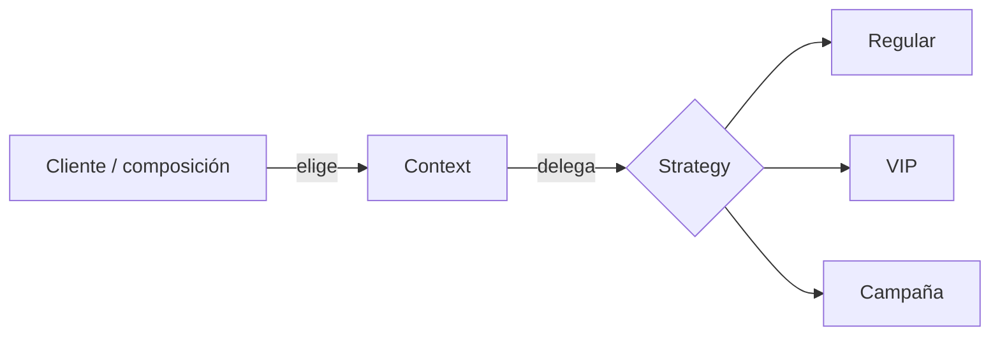

# Strategy

> **Familia:** Behavioral  
> **Intención:** Encapsular algoritmos o políticas intercambiables detrás de un mismo contrato para poder elegirlos sin cambiar al consumidor.  
> **Estado:** `validated`  
> **Implementaciones de lenguaje:** `49/49` Applicable con canónico individual direccionable y verificado.  
> **Cobertura de pruebas:** `N/A` agregada — la matriz polyglot usa compile/analyze/runtime/source-contract según ecosistema; el piso de 44% aplica donde exista coverage significativo.  
> **Mapa:** [Volver al catálogo y mapa de relaciones](README.md)

## En una frase

Strategy separa **qué algoritmo o política usar** de **quién necesita el resultado**, de modo que el consumidor pueda cambiar de comportamiento por composición en lugar de crecer como una cadena de condicionales.

## El problema

Un consumidor necesita realizar la misma operación conceptual —calcular un precio, elegir una ruta, autenticar, ordenar, comprimir o notificar— pero existen varias políticas válidas. Cuando la selección se codifica con `if/switch` dentro del consumidor, cada algoritmo nuevo obliga a editarlo, mezcla selección con ejecución y vuelve más difícil probar cada variante de forma aislada.

La presión de diseño no es simplemente «tener dos funciones». Es que **varias políticas representan la misma responsabilidad, deben ser intercambiables y el contexto no debería conocer sus detalles internos**.

## Fuerzas que compiten

- Las variantes deben compartir un contrato suficientemente estable para ser sustituibles.
- El consumidor debe permanecer pequeño y ajeno a detalles de cada algoritmo.
- Agregar una estrategia no debería exigir reescribir el contexto.
- La selección puede ocurrir en configuración, composición, runtime o por datos de entrada.
- En dominios simples una función pasada como parámetro puede ser mejor que una jerarquía de clases.
- La abstracción no debe ocultar diferencias semánticas que en realidad requieren contratos distintos.

## La solución

Definir un contrato de estrategia y hacer que cada algoritmo lo implemente —mediante interfaces, funciones de orden superior, closures, traits, módulos, punteros a función, mensajes, predicados u otro mecanismo idiomático—. El contexto recibe la estrategia y delega en ella la parte variable.

Strategy no exige clases. En muchos targets de Genkidama, una función pasada como valor es la representación más directa y pedagógica del patrón.

## Participantes y responsabilidades

| Participante | Responsabilidad |
|---|---|
| `Context` | Usa una política sin conocer su algoritmo interno. |
| `Strategy` | Define el contrato común de la variación. |
| `ConcreteStrategy` | Implementa una política concreta respetando el contrato. |
| Composición / cliente | Elige qué estrategia entregar al contexto. |

## Cómo funciona

1. El contexto recibe una estrategia compatible.
2. Cuando necesita la operación variable, delega en ella.
3. Una estrategia concreta ejecuta su algoritmo y devuelve el resultado según el contrato.
4. El cliente puede sustituirla por otra estrategia sin cambiar la lógica central del contexto.
5. Las estrategias se prueban por comportamiento observable y sustituibilidad, no por su forma sintáctica.

## Diagrama



La relación importante es que el contexto **elige o recibe una política intercambiable**; no cambia su ciclo de vida interno como ocurre en State.

## Ejemplo mínimo

```csharp
public static decimal Price(decimal amount, Func<decimal, decimal> strategy) =>
    strategy(amount);

var regular = Price(100m, value => value);
var vip = Price(100m, value => value * 0.8m);
```

El contrato es pequeño: el contexto sabe invocar una política de precio, no cómo está implementada.

## Aplicación real

### Motor de precios

Un checkout puede calcular precio regular, precio VIP o una campaña especial. Todas las variantes reciben el mismo monto base y producen un precio. Strategy permite probar y sustituir esas políticas sin convertir el checkout en el dueño de sus reglas internas.

Si sólo existe una fórmula estable o una única bifurcación trivial que no crecerá, una función local o un `if` puede ser más claro.

## En Genkidama

La filosofía del repositorio menciona Strategy como una opción natural para canales de notificación y modos de autenticación, pero esta reconciliación no acredita un uso productivo deliberado específico sin enlazar una implementación real. La ficha no fuerza arquitectura productiva ni convierte similitudes accidentales en evidencia del patrón.

## Cuándo usarlo

- Existen varias políticas intercambiables para una misma responsabilidad.
- El consumidor crece con condicionales que seleccionan algoritmos.
- Se necesita sustituir comportamiento por configuración, composición o runtime.
- Cada variante merece pruebas aisladas con el mismo contrato de entrada/salida.

## Cuándo no usarlo

- Sólo hay una implementación y no existe una presión real de variación.
- Una expresión o función local comunica mejor una bifurcación pequeña.
- El comportamiento cambia debido al ciclo de vida interno del objeto; eso suele ser State.
- Las variantes no son realmente sustituibles porque requieren contratos o invariantes distintos.

## Consecuencias y trade-offs

| A favor | Costo / riesgo |
|---|---|
| Reduce condicionales de selección dentro del contexto. | Introduce una frontera adicional de composición. |
| Hace sustituibles y comprobables las políticas. | Una estrategia por caso trivial puede convertirse en ceremonial. |
| Permite agregar variantes con impacto localizado. | Un contrato demasiado genérico puede esconder diferencias importantes. |
| Funciona bien con interfaces, funciones, closures y otros mecanismos nativos. | La selección de estrategia sigue necesitando un owner claro. |

## Patrones relacionados

[Consulta también el mapa global de relaciones](README.md#relationship-map).

| Patrón | Relación | Por qué importa |
|---|---|---|
| [State](State.md) | often confused with | Ambos delegan comportamiento; Strategy cambia una política elegida, State cambia comportamiento por el estado/ciclo de vida actual. |
| [Dependency Injection](DependencyInjection.md) | collaborates with | DI suele ser el mecanismo que compone o selecciona una estrategia concreta. |
| [Factory Method](FactoryMethod.md) | collaborates with | Una factory puede resolver qué estrategia construir cuando la selección requiere lógica de creación. |
| [Template Method](TemplateMethod.md) | alternative to | Template Method varía pasos por herencia/override; Strategy varía comportamiento por composición. |
| [Null Object](NullObject.md) | collaborates with | Un Null Object puede ser una estrategia válida que evita checks especiales cuando el comportamiento neutro es legítimo. |

## Errores comunes y confusiones

### Confundir Strategy con State

La estructura puede parecer idéntica. La diferencia está en la causa de la variación: Strategy responde «¿qué política quiero usar?»; State responde «¿qué comportamiento corresponde ahora dado mi estado actual?».

### Crear una clase por cada lambda trivial

Si el lenguaje soporta funciones de primera clase, closures o módulos, una jerarquía OO puede añadir ruido sin mejorar el contrato.

### Estrategias que no son sustituibles

Si una variante necesita entradas distintas, muta invariantes diferentes o devuelve conceptos incompatibles, probablemente no comparte realmente el mismo Strategy contract.

### Ocultar la selección

Extraer algoritmos pero mantener un `switch` distribuido por todo el sistema sólo mueve el problema. La composición/selección debe tener un owner claro.

## Cómo comprobar una implementación

- Al menos dos estrategias distintas satisfacen el mismo contrato.
- El contexto obtiene resultados diferentes al sustituir únicamente la estrategia.
- El contexto no contiene detalles internos de las estrategias concretas.
- Cada estrategia protege su comportamiento relevante, incluyendo failure modes cuando existan.
- Agregar una nueva estrategia no exige modificar el algoritmo interno de las anteriores.

## Validación automatizada

El head `ff8aa6d0182cdb054b28df219cf5ab83f839b12b` completó Quality, Product CI y Polyglot CI en verde. Polyglot certificó todos los cohorts aplicables del catálogo, incluido `Platform / portable + source contracts` con Assembly, Godot, MicroPython y Rockstar reales; Functional con OCaml/Common Lisp/Prolog; JVM; GNU-family; scripting; MATLAB; long-tail; Data/Shell; BEAM; Go; Rust; Swift; Web y .NET.

Con ese exact-head VERIFY, las 49 celdas Applicable tienen canónico individual direccionable y evidencia proporcional. Los sweeps conservan únicamente responsabilidad de orquestación; la deuda de implementaciones Strategy duplicadas en runners está pagada. Ningún `pattern_sweep.*` se acredita como sustituto de un canónico direccionable.

## Implementaciones por lenguaje

La fuente de targets es [`learn/_meta/catalog.yml`](../learn/_meta/catalog.yml): 45 lenguajes v1 y 6 adicionales. Clasificación: **49 Applicable + 2 N/A**.

| Lenguaje | Aplicabilidad | Ejemplo verificado | Validación | Nota |
|---|---|---|---|---|
| C# | Applicable | [`Strategy.cs`](../src/Enterprise/C%23/patterns/Strategy.cs) | .NET Pattern contracts; Polyglot verde | Delegado/función intercambiable. |
| TypeScript | Applicable | [`strategy.ts`](../src/Web/TypeScriptTS/patterns/strategy.ts) | Web Pattern contracts; Polyglot verde | Función de orden superior. |
| Ada | Applicable | [`strategy_pattern.adb`](../src/Systems/Ada/strategy_pattern.adb) | GNU-family compile/runtime; Polyglot verde | Access-to-function. |
| Solidity | Applicable | [`Strategy.sol`](../src/Niche/Solidity/patterns/Strategy.sol) | Web Pattern contracts; Polyglot verde | Política seleccionable. |
| Fortran | Applicable | [`strategy.f90`](../src/Systems/Fortran/patterns/strategy.f90) | GNU-family compile/runtime; Polyglot verde | Procedimiento intercambiable. |
| Pascal | Applicable | [`strategy_pattern.pas`](../src/Systems/Pascal/strategy_pattern.pas) | GNU-family compile/runtime; Polyglot verde | Procedural type/callback. |
| Python | Applicable | [`strategy.py`](../src/Scripting/PythonPY/strategy.py) | `py_compile` + runtime; Polyglot verde | Función de orden superior; sweep delegado al canónico. |
| Visual Basic .NET | Applicable | [`Strategy.vb`](../src/Enterprise/VB.NET/patterns/Strategy.vb) | .NET Pattern contracts; Polyglot verde | Delegate/interfaz. |
| C++ | Applicable | [`strategy.cpp`](../src/Systems/C%2B%2B/patterns/strategy.cpp) | compile + runtime; Polyglot verde | `std::function` intercambiable. |
| Objective-C | Applicable | [`strategy.m`](../src/Systems/Objective-C/patterns/strategy.m) | runtime/sweep; Long-tail y Polyglot verdes | Block + `verifyStrategy()`; sweep delegado al canónico. |
| Java | Applicable | [`strategy.java`](../src/Enterprise/Java/patterns/strategy.java) | JVM compile/runtime; Polyglot verde | `IntUnaryOperator` pasado al mismo contexto. |
| Rust | Applicable | [`strategy.rs`](../src/Systems/Rust/patterns/strategy.rs) | compile + runtime; Polyglot verde | Closure genérica `Fn`. |
| Zig | Applicable | [`strategy.zig`](../src/Systems/Zig/patterns/strategy.zig) | runtime/sweep; Long-tail y Polyglot verdes | Function pointer; sweep delegado a `verifyStrategy()`. |
| Go | Applicable | [`strategy.go`](../src/Systems/Go/strategy.go) | `gofmt` + `go vet` + runtime; Polyglot verde | Function value pasado al contexto; sweep delegado al canónico. |
| PHP | Applicable | [`strategy.php`](../src/Scripting/PHP/patterns/strategy.php) | Scripting Pattern contracts; Polyglot verde | Callable/closure. |
| Nim | Applicable | [`strategy_example.nim`](../src/Niche/Nim/patterns/strategy_example.nim) | Long-tail Pattern contracts; Polyglot verde | Proc value. |
| Dart | Applicable | [`strategy.dart`](../src/Web/Dart/patterns/strategy.dart) | analyzer + runtime/sweep; Polyglot verde | Function value; sweep delegado a `verifyStrategy()`. |
| Kotlin | Applicable | [`Strategy.kt`](../src/Enterprise/Kotlin/patterns/Strategy.kt) | JVM Pattern contracts; Polyglot verde | Lambda/interface. |
| Swift | Applicable | [`Strategy.swift`](../src/Systems/Swift/patterns/Strategy.swift) | Swift Pattern contracts; Polyglot verde | Closure/protocol. |
| F# | Applicable | [`Strategy.fsx`](../src/Functional/F%23/patterns/Strategy.fsx) | .NET Pattern contracts; Polyglot verde | Función de orden superior. |
| Crystal | Applicable | [`strategy.cr`](../src/Niche/Crystal/patterns/strategy.cr) | runtime/sweep; Long-tail y Polyglot verdes | Proc/objeto intercambiable; sweep delegado al canónico. |
| Lua | Applicable | [`strategy.lua`](../src/Scripting/Lua/patterns/strategy.lua) | Scripting Pattern contracts; Polyglot verde | Funciones en tabla. |
| Haskell | Applicable | [`Strategy.hs`](../src/Functional/Haskell/patterns/Strategy.hs) | canónico ejecutado por sweep; Long-tail y Polyglot verdes | Función como estrategia; runner deduplicado. |
| COBOL | Applicable | [`strategy_pattern.cpy`](../src/Historical/Cobol/patterns/strategy_pattern.cpy) | GNU-family compile/runtime; Polyglot verde | Dispatch procedural. |
| Scala | Applicable | [`Strategy.scala`](../src/Functional/Scala/patterns/Strategy.scala) | JVM Pattern contracts; Polyglot verde | Function value/trait. |
| Groovy | Applicable | [`strategy.groovy`](../src/Functional/Groovy/patterns/strategy.groovy) | runtime individual en JVM cohort; Polyglot verde | Closure pasada al contexto `choose`. |
| Ruby | Applicable | [`strategy.rb`](../src/Scripting/Ruby/patterns/strategy.rb) | Scripting Pattern contracts; Polyglot verde | Proc/module function. |
| C | Applicable | [`strategy.c`](../src/Systems/C/patterns/strategy.c) | compile + runtime; Polyglot verde | Function pointer pasado al contexto. |
| OCaml | Applicable | [`strategy.ml`](../src/Functional/OCaml/patterns/strategy.ml) | Functional Pattern contracts; Polyglot verde | Función de orden superior. |
| Julia | Applicable | [`strategy.jl`](../src/DataScience/Julia/patterns/strategy.jl) | runtime/sweep; Long-tail y Polyglot verdes | Function value; sweep delegado a `verify_strategy()`. |
| VBA | Applicable | [`strategy.bas`](../src/Shell/VBA/strategy.bas) | executable source contract; Polyglot verde | Contrato `IStrategyPricing`; host Office no está disponible razonablemente en Linux CI. |
| GDScript | Applicable | [`strategy.gd`](../src/Niche/GDScript/strategy.gd) | Godot headless runtime; Polyglot verde | `Callable` intercambiable con regular, VIP y campaña. |
| JavaScript | Applicable | [`strategy.js`](../src/Web/JavaScriptJS/patterns/strategy.js) | Web Pattern contracts; Polyglot verde | Función de primera clase. |
| MATLAB | Applicable | [`strategy.m`](../src/DataScience/MATLAB/strategy.m) | MATLAB Pattern contract; Polyglot verde | Function handle. |
| Perl | Applicable | [`strategy.pl`](../src/Scripting/Perl/strategy.pl) | `perl -c` + runtime; Polyglot verde | Coderef/subrutina pasada al mismo contexto; rechaza estrategias no-callable. |
| R | Applicable | [`strategy.R`](../src/DataScience/R/patterns/strategy.R) | Data/Shell Pattern contracts; Polyglot verde | Función como argumento. |
| PowerShell | Applicable | [`strategy.ps1`](../src/Scripting/PowerShell/patterns/strategy.ps1) | Data/Shell/Scripting contracts; Polyglot verde | ScriptBlock. |
| HTML | N/A | — | — | Markup estático no posee un mecanismo ejecutable para seleccionar/invocar algoritmos; JavaScript es target separado. |
| Assembly | Applicable | [`strategy.asm`](../src/LowLevel/Assembly/strategy.asm) | NASM compile + link + runtime; Polyglot verde | Puntero a rutina/dispatch de función. |
| Elixir | Applicable | [`strategy.exs`](../src/Functional/Elixir/patterns/strategy.exs) | BEAM Pattern contracts; Polyglot verde | Función/MFA intercambiable. |
| Shell | Applicable | [`strategy.sh`](../src/Scripting/Bash/patterns/strategy.sh) | Scripting Pattern contracts; Polyglot verde | Nombre de función/comando como estrategia. |
| Erlang | Applicable | [`strategy.erl`](../src/Functional/Erlang/patterns/strategy.erl) | BEAM Pattern contracts; Polyglot verde | Fun/MFA. |
| Clojure | Applicable | [`strategy.clj`](../src/Functional/Clojure/patterns/strategy.clj) | JVM Pattern contracts; Polyglot verde | Función como valor. |
| Common Lisp | Applicable | [`strategy.lisp`](../src/Functional/CommonLisp/patterns/strategy.lisp) | Functional Pattern contracts; Polyglot verde | Function designator. |
| Prolog | Applicable | [`strategy.pl`](../src/Functional/Prolog/strategy.pl) | SWI-Prolog runtime; Polyglot verde | Predicado/política seleccionable. |
| Delphi | Applicable | [`Strategy.pas`](../src/Enterprise/Delphi/Strategy.pas) | executable source contract; Polyglot verde | Contrato abstracto y estrategias sustituibles; DCC no disponible razonablemente en Linux CI. |
| GNU Octave | Applicable | [`strategy.m`](../src/DataScience/Octave/patterns/strategy.m) | Data/Shell Pattern contracts; Polyglot verde | Function handle. |
| SQL | Applicable | [`strategy.sql`](../src/Data/SQL/strategy.sql) | SQLite runtime contract; Polyglot verde | Política expresada como relación seleccionable y contexto estable. |
| CSS | N/A | — | — | CSS selecciona reglas de estilo, no invoca algoritmos intercambiables como responsabilidad ejecutable autónoma. |
| MicroPython | Applicable | [`strategy.py`](../src/Other/MicroPython/strategy.py) | MicroPython runtime; Polyglot verde | Callable/función intercambiable. |
| Rockstar | Applicable | [`strategy.rock`](../src/Other/Rockstar/strategy.rock) | Rockstar runtime; Polyglot verde | Referencia de función intercambiable pasada al mismo contexto. |

## Comprueba que lo entendiste

1. ¿Por qué dos algoritmos detrás del mismo `switch` no son todavía una buena aplicación de Strategy si el consumidor sigue conociendo todos sus detalles?
2. Si dos implementaciones tienen la misma forma de clases pero una cambia por configuración y otra por ciclo de vida interno, ¿cuál es Strategy y cuál State?
3. ¿Cuándo una lambda pasada como parámetro comunica Strategy mejor que crear una interfaz y varias clases?

## Resumen

- Strategy separa una política intercambiable del contexto que la usa.
- La sustituibilidad del contrato importa más que la forma OO.
- Funciones, closures, traits, punteros, módulos y predicados pueden ser implementaciones idiomáticas.
- State es el vecino más fácil de confundir: cambia por estado interno, no por elección de política.
- La matriz está completa: 49/49 Applicable tienen canónico individual direccionable y verificado; HTML y CSS son los únicos N/A con justificación técnica.

## Referencias

- Gamma, Helm, Johnson, Vlissides — *Design Patterns: Elements of Reusable Object-Oriented Software*.
- [`docs/philosophy/001-patterns-as-living-examples.md`](../docs/philosophy/001-patterns-as-living-examples.md)
- [`docs/kb/catalog/pattern-authoring-standard.md`](../docs/kb/catalog/pattern-authoring-standard.md)
